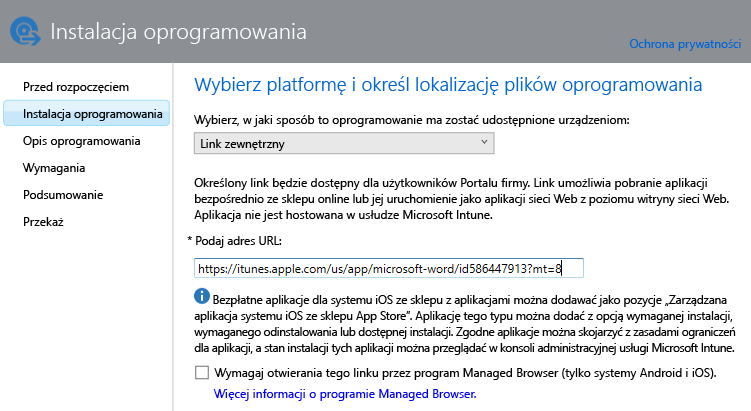
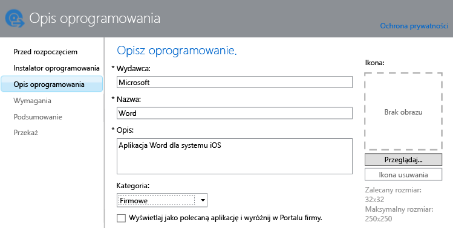

---
# required metadata

title: Dodawanie aplikacji dla urządzeń przenośnych | Usługa Microsoft Intune
description:
keywords:
author: robstackmsft
manager: jeffgilb
ms.date: 04/28/2016
ms.topic: article
ms.prod:
ms.service: microsoft-intune
ms.technology:
ms.assetid: f5b1f1ae-f177-450a-9af9-936a02d052e3

# optional metadata

#ROBOTS:
#audience:
#ms.devlang:
ms.reviewer: jeffgilb
ms.suite: ems
#ms.tgt_pltfrm:
#ms.custom:

---

# Dodawanie aplikacji dla urządzeń przenośnych w usłudze Microsoft Intune

W tym temacie przedstawiono informacje na temat sposobu dodawania aplikacji do usługi Intune przed ich wdrożeniem.

> [!IMPORTANT]
> Informacje zawarte w tym temacie ułatwiają dodawania aplikacji, które mają zostać wdrożone na zarejestrowanych urządzeniach i zarejestrowanych komputerach z systemem Windows. Aby dodać aplikacje dla komputerów z systemem Windows zarządzanych za pomocą oprogramowania klienckiego usługi Intune, zobacz [Dodawanie aplikacji dla komputerów z systemem Windows w usłudze Microsoft Intune](add-apps-for-windows-pcs-in-microsoft-intune.md)..

## Dodawanie aplikacji
Wydawca oprogramowania usługi Intune służy do skonfigurowania właściwości aplikacji i, jeśli to możliwe, przekazania jej do magazynu w chmurze za pomocą następującej procedury:

1.  W [konsoli administratora usługi Microsoft Intune](https://manage.microsoft.com) kliknij pozycję **Aplikacje** &gt; **Dodaj aplikacje**, aby uruchomić Wydawcę oprogramowania usługi Intune.

    > [!TIP]
    > Przed uruchomieniem narzędzia może być konieczne wprowadzenie nazwy użytkownika i hasła usługi Intune.

2.  Na stronie **Instalator oprogramowania** Wydawcy oprogramowania wybierz jedną z następujących opcji dla pozycji **Wybierz, w jaki sposób to oprogramowanie ma zostać udostępnione urządzeniom**:
    - **Instalator oprogramowania** — dla aplikacji z rozszerzeniem **msi** lub **exe** określ:
        - **Wybierz typ pliku Instalatora oprogramowania** — określa typ oprogramowania, które chcesz wdrożyć. Jeśli na przykład chcesz zainstalować aplikację systemu iOS, wybierz pozycję **Pakiet aplikacji dla systemu iOS (plik &#42;.ipa)**..
        - **Określ lokalizację plików instalacyjnych oprogramowania** — wprowadź lokalizację plików instalacyjnych lub kliknij przycisk **Przeglądaj**, aby wybrać lokalizację z listy.
        - **Dołącz dodatkowe pliki i podfoldery z tego samego folderu** — tylko dla typu plików **Instalator Windows**. Niektóre programy korzystające z Instalatora Windows wymagają plików pomocniczych, które zwykle znajdują się w folderze plików instalacyjnych. Wybierz tę opcję, jeśli chcesz również wdrożyć te pliki. W przypadku tego typu instalacji jest używana część miejsca do magazynowania w chmurze.

  -   **Link zewnętrzny** — dla aplikacji, które mają zostać utworzone za pośrednictwem linku do sklepu z aplikacjami, określ:

        - **Podaj adres URL** — podaj adres URL prowadzący do jednego z następujących elementów:
            - Adres URL sklepu z aplikacjami dla aplikacji, którą chcesz wdrożyć. Jeśli na przykład chcesz wdrożyć aplikację Pulpit zdalny firmy Microsoft dla systemu Android, podaj adres **https://play.google.com/store/apps/details?id=com.microsoft.rdc.android**. Aby znaleźć adres URL aplikacji, znajdź stronę sklepu zawierającą aplikację przy użyciu wyszukiwarki. Aby na przykład znaleźć aplikację Pulpit zdalny, wyszukaj frazę **Pulpit zdalny firmy Microsoft dla systemu Android**..
            - Witryna sieci Web. Usługa Intune wdroży na urządzeniu ikonę skrótu prowadzącą do witryny (zwaną klipem sieci Web).
            - Aplikacja sieci Web. Usługa Intune wdroży na urządzeniu ikonę skrótu prowadzącą do aplikacji.
        - **Wymagaj przeglądarki Managed Browser do otwarcia tego linku (tylko systemy Android i iOS)** — jeśli wdrażasz link do witryny lub aplikacji sieci Web dla użytkowników, będą oni mogli otworzyć je tylko w programie Intune Managed Browser, który musi być zainstalowany na urządzeniu. Aby uzyskać więcej informacji o aplikacji Managed Browser, zobacz [Zarządzanie dostępem do Internetu za pomocą zasad programu Managed Browser w usłudze Microsoft Intune](manage-internet-access-using-managed-browser-policies.md).. W przypadku tego typu instalacji nie jest używane miejsce do magazynowania w chmurze.

  -   **Zarządzana aplikacja systemu iOS ze sklepu App Store** — w przypadku bezpłatnych aplikacji ze sklepu iTunes, którymi chcesz zarządzać za pomocą zasad MAM, określ:

        - **Podaj adres URL** — wprowadź adres URL sklepu z aplikacjami dla aplikacji, którą chcesz wdrożyć. Jeśli na przykład chcesz wdrożyć aplikację Foldery robocze firmy Microsoft dla systemu iOS, podaj adres **https://itunes.apple.com/us/app/work-folders/id950878067?mt=8**.. W przypadku tego typu instalacji nie jest używane miejsce do magazynowania w chmurze.

        Jeśli na przykład chcesz wdrożyć aplikację Microsoft Word ze sklepu iTunes na urządzeniach, strona będzie wyglądała następująco:
        
        

3.  Na stronie **Opis oprogramowania** skonfiguruj następujące ustawienia:

    > [!TIP]
    > W zależności od używanego typu instalatora niektóre z tych wartości mogły zostać wprowadzone automatycznie lub mogą nie być wyświetlane.

    - **Wydawca** — wprowadź nazwę wydawcy aplikacji.
    - **Nazwa** — wprowadź nazwę aplikacji wyświetlaną w portalu firmy. Upewnij się, że wszystkie używane nazwy aplikacji są unikatowe. Jeśli dana nazwa aplikacji występuje dwa razy, użytkownicy Portalu firmy będą widzieć tylko jedną z aplikacji o tej nazwie.
    - **Opis** — wprowadź opis aplikacji. Ta informacja będzie widoczna dla użytkowników w Portalu firmy.
    - **Adres URL informacji o oprogramowaniu** — to ustawienie jest dostępne tylko w przypadku wybrania pozycji **Instalator oprogramowania**. Opcjonalnie wprowadź adres URL witryny sieci Web zawierającej informacje o tej aplikacji. Adres będzie widoczny dla użytkowników w Portalu firmy.
    - **Adres URL zasad ochrony prywatności** — to ustawienie jest dostępne tylko w przypadku wybrania pozycji **Instalator oprogramowania**. Opcjonalnie wprowadź adres URL witryny sieci Web zawierającej informacje dotyczące zasad ochrony prywatności w tej aplikacji. Adres będzie widoczny dla użytkowników w Portalu firmy.
    - **Kategoria** — opcjonalnie wybierz jedną z wbudowanych kategorii aplikacji. Ułatwi to użytkownikom znajdowanie aplikacji podczas przeglądania Portalu firmy.
    - **Wyświetlaj jako polecaną aplikację i wyróżnij w Portalu firmy** — wyróżnij aplikację na stronie głównej portalu firmy dla użytkowników przeglądających aplikacje.
    - **Ikona** — opcjonalnie przekaż ikonę, która zostanie skojarzona z aplikacją. Będzie ona wyświetlana jako ikona aplikacji podczas przeglądania Portalu firmy.

        W tym przykładzie skonfigurowano opis aplikacji Microsoft Word dla systemu iOS:

        

4.  Na stronie **Wymagania** wybierz wymagania, które muszą zostać spełnione, aby można było zainstalować aplikację na urządzeniu. Na przykład w przypadku pakietu aplikacji dla systemu iOS można wybrać minimalną wymaganą wersję systemu iOS oraz wymagany typ urządzenia, na przykład telefon iPhone lub tablet iPad.

    > [!TIP]
    > Strona **Wymagania** jest wyświetlana tylko dla niektórych typów aplikacji.

5.  Kolejne strony kreatora są wyświetlane po wybraniu typu pliku **Instalator Windows**. Ten typ pliku jest używany podczas wdrażania oprogramowania dla komputerów z systemem Windows 10 lub nowszym zarejestrowanych w usłudze Intune.

6.  Na stronie **Podsumowanie** przejrzyj podane informacje. Po zakończeniu kliknij pozycję **Przekaż**..

7.  Kliknij pozycję **Zamknij**, aby zakończyć.

Aplikacja zostanie wyświetlona w węźle **Aplikacje** w obszarze roboczym **Aplikacje**.

## Następne kroki

Po utworzeniu aplikacji następnym krokiem jest jej wdrożenie. Aby uzyskać więcej informacji, zobacz [Wdrażanie aplikacji w usłudze Microsoft Intune](deploy-apps.md)

<!--HONumber=May16_HO1-->

