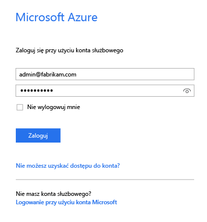
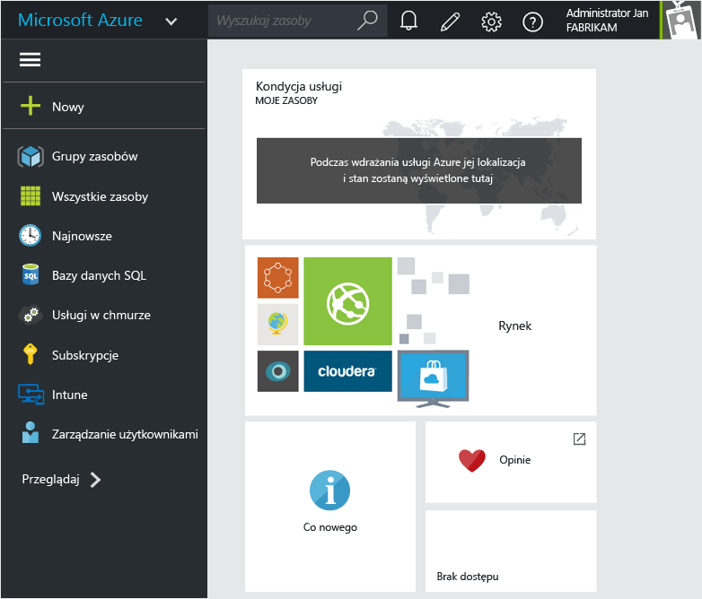
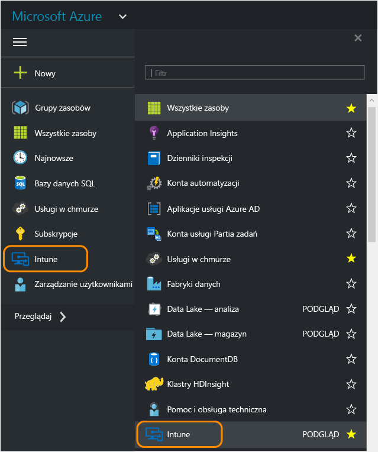
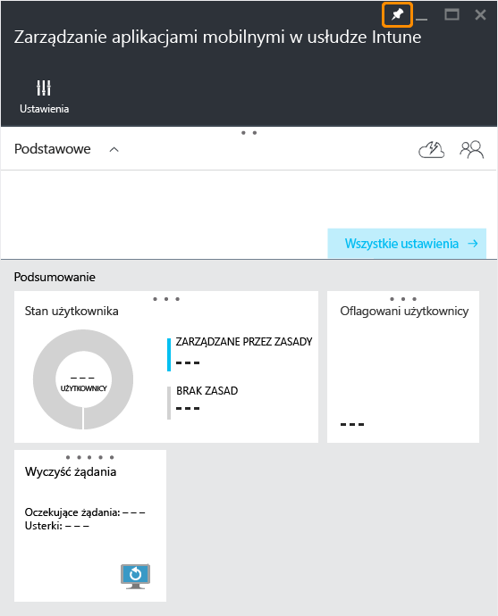
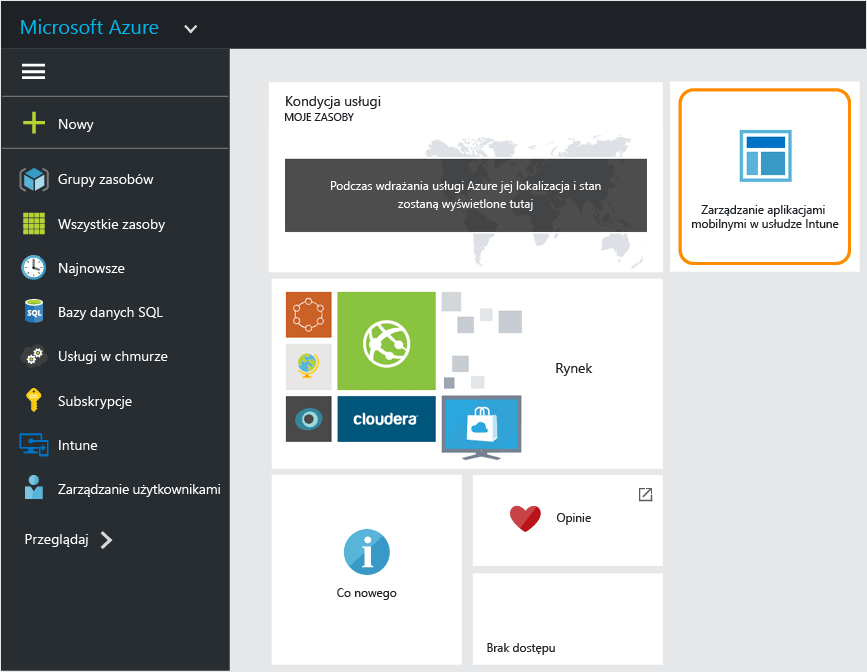

# Portal Azure — zasady zarządzania aplikacjami mobilnymi
## Dostęp do portalu Azure
**Portal Azure** pozwala tworzyć zasady zarządzania aplikacjami mobilnymi oraz zarządzać tymi zasadami.

Portal Azure obsługuje tworzenie zasad zarządzania aplikacjami mobilnymi dla następujących składników:
- Aplikacje działające na urządzeniach **zarejestrowanych w usłudze Intune i zarządzanych przez nią**.
- Aplikacje działające na urządzeniach, które **nie są zarejestrowane** w żadnym rozwiązaniu do zarządzania aplikacjami mobilnymi
- Aplikacje działające na urządzeniach, które **są zarejestrowane w rozwiązaniu do zarządzania aplikacjami mobilnymi innej firmy**.

>[!IMPORTANT]

> Jeśli obecnie korzystasz z konsoli administracyjnej usługi Intune do zarządzania urządzeniami, możesz utworzyć zasady zarządzania aplikacjami mobilnym obsługujące aplikacje dla urządzeń zarejestrowanych w usłudze Intune przy użyciu [konsoli administracyjnej usługi Intune](configure-and-deploy-mobile-application-management-policies-in-the-microsoft-intune-console.md).

> W konsoli administracyjnej usługi Intune mogą nie być wyświetlane wszystkie ustawienia zasad zarządzania aplikacjami mobilnymi. Portal Azure to nowa konsola administracyjna do tworzenia zasad zarządzania aplikacjami mobilnymi. Jeśli utworzysz zasady zarządzania aplikacjami mobilnymi zarówno za pomocą konsoli administracyjnej usługi Intune, jak i portalu Azure, zasady utworzone w portalu Azure zostaną zastosowane dla aplikacji i wdrożone dla użytkowników.

## Zaloguj się do portalu Azure i dostosuj swoją stronę początkową

1.  Przejdź do [portalu Azure](https://portal.azure.com) i zaloguj się przy użyciu swoich poświadczeń usługi [!INCLUDE[wit_nextref](../includes/wit_nextref_md.md)].

    

2.  Po pomyślnym zalogowaniu pojawi się strona **Pulpit nawigacyjny**. Stronę **Pulpit nawigacyjny** można dostosować.

    

3.  W menu **Przeglądaj** znajdź pozycję **Intune**.

4.  Wybierz opcję **Intune > Zarządzanie aplikacjami mobilnymi w usłudze Intune > Ustawienia**.

    

    > [!TIP]
    > Aby przypiąć blok do strony **Start** , możesz użyć opcji **przypinania** w bloku.  Kliknij ikonę przypinania w **bloku zarządzania aplikacjami mobilnymi usługi Intune**, aby przypiąć go do strony **Start** .

    

    
## Następne kroki
[Przygotowywanie się do konfigurowania zasad zarządzania aplikacjami mobilnymi](get-ready-to-configure-mobile-app-management-policies-with-microsoft-intune.md)

<!--HONumber=Jul16_HO5-->

