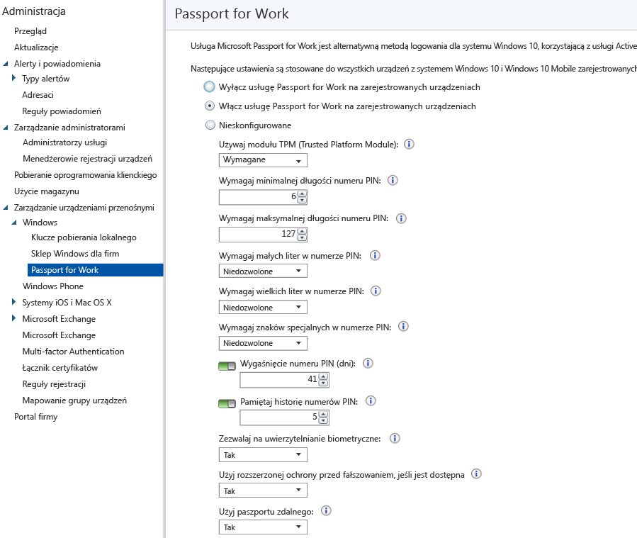

# Sterowanie ustawieniami usługi Microsoft Passport na urządzeniach z usługą Microsoft Intune
Usługa Microsoft Intune umożliwia integrację z usługą **Microsoft Passport for Work**, czyli alternatywną metodą logowania korzystającą z usługi Active Directory lub konta usługi Azure Active Directory w celu zastąpienia hasła, karty inteligentnej lub wirtualnej karty inteligentnej.

Usługa Passport pozwala logować się za pomocą **gestu użytkownika** zamiast hasła. Gestem użytkownika może być prosty numer PIN, uwierzytelnianie biometryczne, takie jak Windows Hello, lub urządzenie zewnętrzne, np. czytnik linii papilarnych.

>[!TIP]
>Usługa Microsoft Passport for Work ma teraz nazwę Windows Hello for Business. Konsola usługi Intune zostanie zaktualizowana w ramach przyszłej aktualizacji w celu odzwierciedlenia tej zmiany.

Usługa Intune integruje się z usługą Passport for Work na dwa sposoby:

-   Za pomocą zasad usługi Intune można określać gesty, przy użyciu których użytkownicy mogą się logować.

-   W dostawcy magazynu kluczy usługi Passport for Work można przechowywać certyfikaty uwierzytelniania. Aby uzyskać więcej informacji, zobacz [Bezpieczny dostęp do zasobów przy użyciu profilów certyfikatów w usłudze Microsoft Intune](secure-resource-access-with-certificate-profiles.md).

## Aby utworzyć zasady usługi Passport for Work

1.  W [konsoli administracyjnej usługi Microsoft Intune](https://manage.microsoft.com) kliknij pozycję **Administracja** &gt; **Zarządzanie urządzeniami przenośnymi** &gt; **Windows** &gt; **Passport for Work**, aby otworzyć stronę usługi Passport for Work przedstawioną poniżej.

    

2.  Wybierz jedno z następujących ustawień:
    - **Wyłącz usługę Passport for Work na zarejestrowanych urządzeniach** — jeśli nie chcesz korzystać z usługi Passport for Work na urządzeniach z systemem Windows 10, wybierz to ustawienie. Wszystkie inne ustawienia na ekranie są wyłączone.
    - **Włącz usługę Passport for Work na zarejestrowanych urządzeniach** — wybierz to ustawienie, jeśli chcesz skonfigurować ustawienia usługi Passport for Work na wszystkich urządzeniach z systemem Windows 10.
    - **Nieskonfigurowane** — wybierz to ustawienie, jeśli nie chcesz używać usługi Intune do kontrolowania ustawień usługi Passport for Work. Wszelkie istniejące ustawienia usługi Passport for Work na urządzeniach z systemem Windows 10 nie zostaną zmienione. Wszystkie inne ustawienia na ekranie są wyłączone.
3.  W przypadku wybrania opcji **Włącz usługę Passport for Work na zarejestrowanych urządzeniach** skonfiguruj wymagane ustawienia, które będą stosowane do wszystkich zarejestrowanych urządzeń z systemami Windows 10 i Windows 10 Mobile.
3.  Po zakończeniu kliknij pozycję **Zapisz**.

## Usługa Passport for Work: ustawienia numeru PIN

  
- **Wymagaj minimalnej długości numeru PIN**/**Wymagaj maksymalnej długości numeru PIN** — konfiguruje urządzenia do używania określonych minimalnych i maksymalnych długości numeru PIN, co pomaga zapewnić bezpieczne logowanie. Domyślna długość numeru PIN to 6 znaków, ale można wymusić stosowanie numerów o długości minimalnej 4 znaków. Maksymalna długość numeru PIN to 127 znaków.
- **Wymagaj małych liter w numerze PIN**/**Wymagaj wielkich liter w numerze PIN**/**Wymagaj znaków specjalnych w numerze PIN** — ponadto można wymusić stosowanie silniejszych numerów PIN poprzez wymaganie użycia wielkich liter, małych liter i znaków specjalnych w numerze PIN. Wybierz spośród opcji:
    - **Dozwolone** — użytkownicy mogą używać typu znaków w numerze PIN, ale nie jest to konieczne.
    - **Wymagane** — użytkownicy muszą zawrzeć co najmniej jeden z typów znaków w numerze PIN. Przykładowo często wymaga się zastosowania co najmniej jednej wielkiej litery i jednego znaku specjalnego.
    - **Niedozwolone** (domyślnie) — użytkownicy nie mogą używać tych typów znaków w numerach PIN (ta wartość jest stosowana także w przypadku, gdy parametr nie zostanie skonfigurowany).
    > [!TIP]
    > Znaki specjalne obejmują: **! " # $ % &amp; ' ( ) &#42; + , - . / : ; &lt; = &gt; ? @ [ \ ] ^ _ &#96; { &#124; } ~**.
- **Wygaśnięcie numeru PIN (dni)** — dobrze jest ustalić okres ważności dla numeru PIN, po którym użytkownicy końcowi muszą go zmienić. Wartość domyślna to 41 dni. 
- **Pamiętaj historię numerów PIN** — użyj tego ustawienia, aby ograniczyć ponowne używanie stosowanych wcześniej numerów PIN. Domyślnie nie jest dozwolone ponowne użycie żadnego z 5 ostatnich numerów PIN.

## Usługa Passport for Work: inne ustawienia

- **Używaj modułu TPM (Trusted Platform Module)** — moduł TPM (Trusted Platform Module) zapewnia dodatkową warstwę zabezpieczeń danych. Wybierz jedną z następujących opcji:
    - **Wymagane** (domyślnie) — tylko urządzenia z dostępnym modułem TPM mogą aprowizować usługę Passport for Work.
    - **Preferowane** — urządzenia najpierw próbują użyć modułu TPM. Jeśli nie jest on dostępny, mogą używać szyfrowania programowego.
- **Zezwalaj na uwierzytelnianie biometryczne** — umożliwia użycie na potrzeby usługi Passport for Work uwierzytelniania biometrycznego, takiego jak rozpoznawanie twarzy lub linii papilarnych, zamiast numeru PIN. Użytkownicy nadal muszą skonfigurować służbowy numer PIN na wypadek niepowodzenia uwierzytelniania biometrycznego. Wybierz spośród opcji:
    - **Tak** — usługa Passport for Work umożliwia użycie uwierzytelniania biometrycznego.
    - **Nie** — usługa Passport for Work nie pozwala na użycie uwierzytelniania biometrycznego (dotyczy wszystkich typów kont).
- **Użyj rozszerzonej ochrony przed fałszowaniem, jeśli jest dostępna** — określa, czy funkcje ochrony przed fałszowaniem usługi Windows Hello są używane na obsługujących je urządzeniach (np. wykrywanie fotografii twarzy zamiast prawdziwej twarzy). W przypadku wybrania opcji **Tak** system Windows wymaga od wszystkich użytkowników używania ochrony przed fałszowaniem na potrzeby rozpoznawania twarzy, jeśli jest obsługiwana.
- **Użyj paszportu zdalnego** — w przypadku wybrania opcji **Tak** użytkownicy mogą używać paszportu zdalnego jako przenośnego urządzenia towarzyszącego w celu uwierzytelniania komputerów stacjonarnych. Komputer stacjonarny musi być przyłączony do usługi Azure Active Directory, a urządzenie towarzyszące musi posiadać skonfigurowany numer PIN usługi Passport for Work.

## Dodatkowe informacje
Aby uzyskać więcej informacji na temat usługi Microsoft Passport, zobacz [przewodnik](https://technet.microsoft.com/library/mt589441.aspx) w dokumentacji systemu Windows 10.

<!--HONumber=Jul16_HO3-->

