---
# required metadata

title: Tworzenie i wdrażanie zasad MAM | Microsoft Intune
description:
keywords:
author: karthikaraman
manager: jeffgilb
ms.date: 04/28/2016
ms.topic: article
ms.prod:
ms.service: microsoft-intune
ms.technology:
ms.assetid: c1b9a343-1737-4a65-a9c6-aca48acad11c

# optional metadata

#ROBOTS:
#audience:
#ms.devlang:
ms.reviewer: joglocke
ms.suite: ems
#ms.tgt_pltfrm:
#ms.custom:

---

# Tworzenie i wdrażanie zasad zarządzania aplikacjami mobilnymi przy użyciu usługi Microsoft Intune
Zasady zarządzania aplikacjami mobilnymi (MAM) można stosować do aplikacji działających na urządzeniach, które mogą być zarządzane przez usługę Intune lub nie. Aby uzyskać bardziej szczegółowy opis sposobu działania zasad MAM oraz scenariuszy obsługiwanych przez zasady MAM usługi Intune, przeczytaj temat [Ochrona danych aplikacji przy użyciu zasad zarządzania aplikacjami mobilnymi](protect-app-data-using-mobile-app-management-policies-with-microsoft-intune.md).

W tym temacie opisano proces tworzenia zasad MAM w **portalu Azure**. Portal Azure to nowa konsola administracyjna do tworzenia zasad zarządzania aplikacjami mobilnymi i do ich tworzenia zalecane jest użycie tego portalu. Portal Azure obsługuje następujące scenariusze zarządzania aplikacjami mobilnymi:
- Urządzenia zarejestrowane w usłudze Intune
- Urządzenia zarządzane przez rozwiązanie MDM innej firmy
- Urządzenia niezarządzane przez żadne rozwiązanie MDM (BYOD).

Jeśli obecnie korzystasz z **konsoli administracyjnej usługi Intune** do zarządzania urządzeniami, możesz utworzyć zasady zarządzania aplikacjami mobilnym obsługujące aplikacje dla urządzeń zarejestrowanych w usłudze Intune przy użyciu [konsoli administracyjnej usługi Intune](configure-and-deploy-mobile-application-management-policies-in-the-microsoft-intune-console.md).
>[!IMPORTANT]
> W konsoli administracyjnej usługi Intune mogą nie być wyświetlane wszystkie ustawienia zasad zarządzania aplikacjami mobilnymi. Portal Azure to nowa konsola administracyjna do tworzenia zasad zarządzania aplikacjami mobilnymi. Jeśli utworzysz zasady zarządzania aplikacjami mobilnymi zarówno za pomocą konsoli administracyjnej usługi Intune, jak i portalu Azure, zasady utworzone w portalu Azure zostaną zastosowane dla aplikacji i wdrożone dla użytkowników.

Aby wyświetlić listę zasad obsługiwanych na platformach Android i iOS, wybierz jeden z następujących elementów:

> [!div class="op_single_selector"]
- [Zasady systemu iOS](ios-mam-policy-settings.md)
- [Zasady systemu Android](android-mam-policy-settings.md)

##  Tworzenie zasad MAM
Zanim utworzysz zasady MAM, przejrzyj informacje w sekcji [wymagania wstępne i pomoc techniczna](get-ready-to-configure-mobile-app-management-policies-with-microsoft-intune.md).
1.  Wybierz pozycje **Zarządzanie aplikacjami mobilnymi usługi Intune&gt; Ustawienia **, aby otworzyć blok **Ustawienia**.

    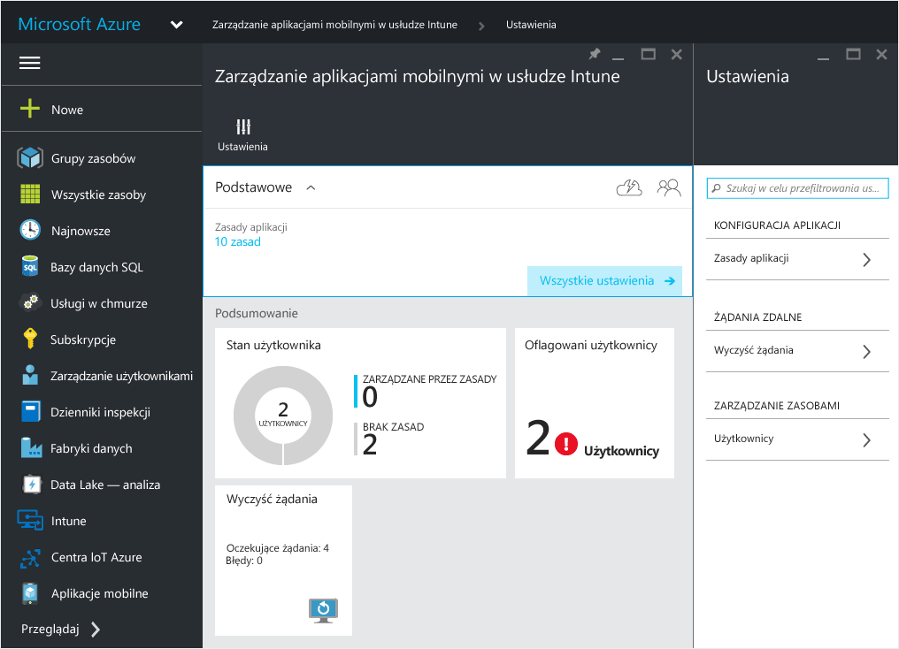

    > [!TIP] Jeśli używasz portalu Azure po raz pierwszy, przeczytaj najpierw artykuł [Portal Azure — zasady zarządzania aplikacjami mobilnymi](azure-portal-for-microsoft-intune-mam-policies.md), aby zapoznać się z portalem.

2.  W bloku **Ustawienia** wybierz pozycję **Zasady aplikacji**.  Spowoduje to otwarcie bloku **Zasady aplikacji** , w którym można tworzyć nowe zasady i edytować istniejące.

    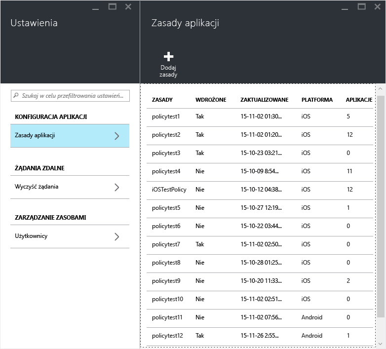

3.  Wybierz pozycję **Dodaj zasady**.

    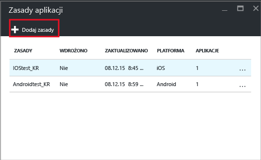

4.  Wpisz nazwę zasad, dodaj ich krótki opis i wybierz typ platformy do utworzenia zasad dla systemu iOS lub Android.  Dla każdej platformy można utworzyć większą liczbę zasad.

    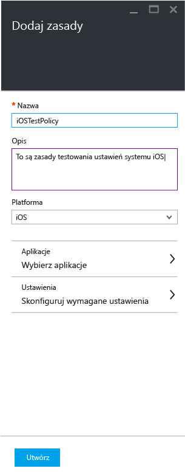

5.  Wybierz pozycję **Aplikacje**, aby otworzyć **blok Aplikacje**, w którym jest wyświetlana lista dostępnych aplikacji. Z listy możesz wybrać jedną lub więcej aplikacji do powiązania z tworzonymi zasadami. Po wybraniu aplikacji wybierz przycisk **Wybierz** w dolnej części bloku **Aplikacje**, aby zapisać wybrane opcje.

    > [!IMPORTANT] W celu utworzenia zasad należy wybrać co najmniej jedną aplikację.

6.  W bloku **Dodawanie zasad** wybierz pozycję **Skonfiguruj wymagane ustawienia**, aby otworzyć blok ustawień zasad.

    Istnieją dwie kategorie ustawień zasad, **Przeniesienie danych** i **Dostęp**.  Zasady przeniesienia danych stosują się do przenoszenia danych do i z aplikacji, podczas gdy zasady dostępu określają metodę dostępu użytkownika końcowego do aplikacji w kontekście pracy.
    Ustawienia zasad mają wartości domyślne, co ułatwia rozpoczęcie pracy.  Jeśli wartości domyślne spełniają Twoje wymagania, nie musisz wprowadzać żadnych zmian.

    > [!TIP]
    > Te ustawienia zasad obowiązują tylko w przypadku stosowania aplikacji w kontekście pracy.  W przypadku gdy użytkownik końcowy używa aplikacji do wykonywania zadań osobistych, zasady te nie obowiązują.

    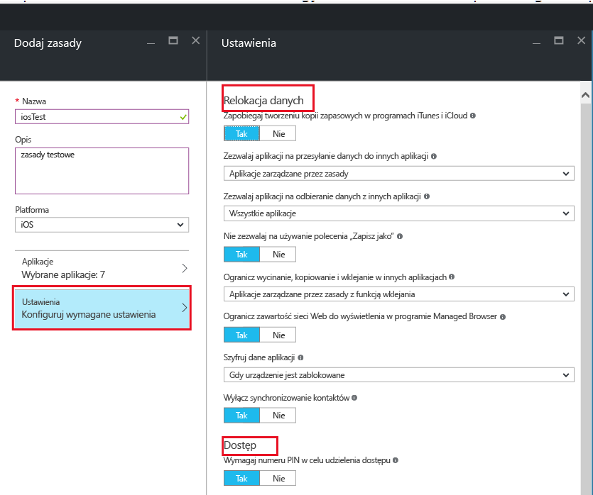

7.  Wybierz pozycję **OK**, aby zapisać tę konfigurację.  Znajdziesz się ponownie w bloku **Dodawanie zasad** . Wybierz pozycję **Utwórz**, aby utworzyć zasady i zapisać ustawienia.

    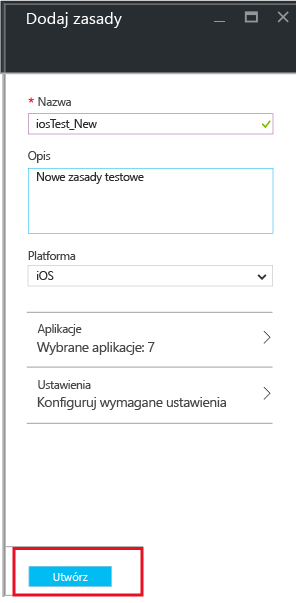

    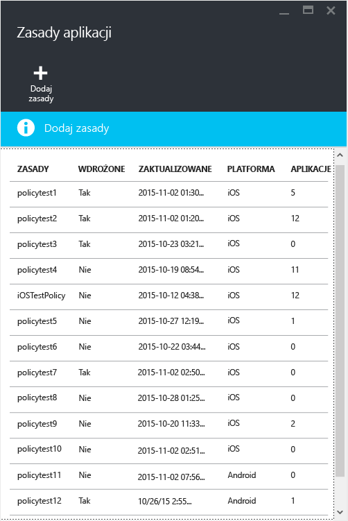

Po zakończeniu tworzenia zasad zgodnie z opisem w poprzedniej procedurze nie są one wdrażane dla żadnych użytkowników.  Wykonaj kroki opisane poniżej, aby wdrożyć zasady.

> [!IMPORTANT]
> Jeśli utworzysz zasady zarządzania aplikacjami mobilnymi dla aplikacji przy pomocy konsoli administracyjnej usługi Intune oraz zasady zarządzania aplikacjami mobilnymi przy pomocy portalu Azure, pierwszeństwo będą mieć zasady utworzone w portalu Azure. Jednak raportowanie w konsoli usługi Intune lub programu Configuration Manager będzie zgłaszać ustawienia zasad utworzonych w portalu Azure. Na przykład:
>
> -   W konsoli administracyjnej usługi Intune utworzono zasady zarządzania aplikacjami mobilnymi, które blokują kopiowanie danych z aplikacji.
> -   W konsoli platformy Azure utworzono zasady zarządzania aplikacjami mobilnymi, które zezwalają na kopiowanie danych z aplikacji
> -   Obie zasady zostały skojarzone z jedną aplikacją.
> -   W takiej sytuacji priorytet ma zasada utworzona w konsoli platformy Azure, która umożliwia kopiowanie.
> -   Jednak stan i raporty w konsoli usługi Intune będą niepoprawnie wskazywać blokowanie kopiowania.

## Wdrażanie zasad dla użytkowników

1.  W bloku **Zasady** wybierz pozycję **Grupy użytkowników**, co spowoduje otwarcie bloku **Grupy użytkowników**. Wybierz pozycję **Dodaj grupę użytkowników** w bloku **Grupy użytkowników**, aby otworzyć blok **Dodawanie grupy użytkowników**.

    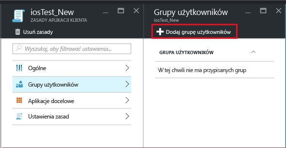

2.  W bloku **Dodawanie grupy użytkowników** zostanie wyświetlona lista grup użytkowników. Jest to lista wszystkich grup zabezpieczeń w usłudze **Azure Active Directory**.  Możesz wybrać grupy użytkowników, których mają dotyczyć te zasady, a następnie wybrać pozycję **Wybierz**. Wybranie pozycji **Wybierz** wdraża zasady dla użytkowników.

    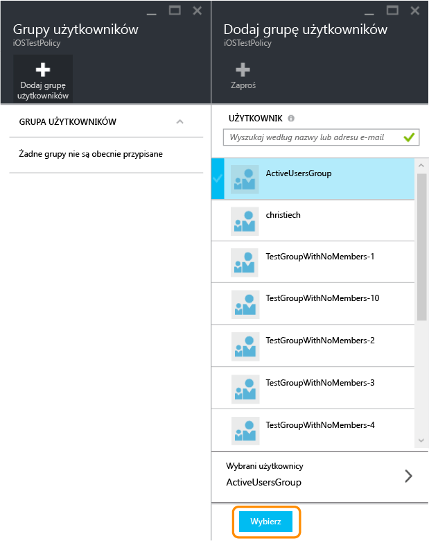

    Zasady zostały utworzone i wdrożone dla użytkowników.

Zasady wpływają tylko na użytkowników, którym przypisano licencje usługi [!INCLUDE[wit_nextref](../includes/wit_nextref_md.md)].  Zasady nie wpływają na użytkowników należących do wybranej grupy zabezpieczeń, którym nie przypisano licencji usługi [!INCLUDE[wit_nextref](../includes/wit_nextref_md.md)].

Jeśli używasz usługi Intune z programem Configuration Manager do zarządzania urządzeniami z systemami Android i iOS, zasady są stosowane tylko do użytkowników należących bezpośrednio do wybranej grupy.  Nie mają one wpływu na członków grup podrzędnych zagnieżdżonych w wybranej grupie.

Użytkownicy końcowi mogą pobrać aplikacje ze sklepu App Store lub Google Play. Szczegółowy przewodnik dotyczący sposobu ochrony danych firmowych na urządzeniach przez zasady zarządzania aplikacjami mobilnymi znajduje się w temacie [Środowisko użytkownika końcowego dla aplikacji objętych zarządzaniem aplikacjami mobilnymi](end-user-experience-for-mam-enabled-apps-with-microsoft-intune.md).

##  Zmiana istniejących zasad
Możesz edytować istniejące zasady i zastosować je do użytkowników docelowych. Jednak w przypadku zmiany istniejących zasad użytkownicy zalogowani do aplikacji zobaczą zmiany dopiero po 8 godzinach.

Aby zobaczyć efekt zmian natychmiast, użytkownik końcowy musi wylogować się z aplikacji i ponownie do niej zalogować.

### Aby zmienić listę aplikacji powiązanych z zasadami

1.  W bloku **Zasady aplikacji** wybierz zasady, które chcesz zmienić. Spowoduje to otwarcie bloku specyficznego dla właśnie wybranych zasad.

    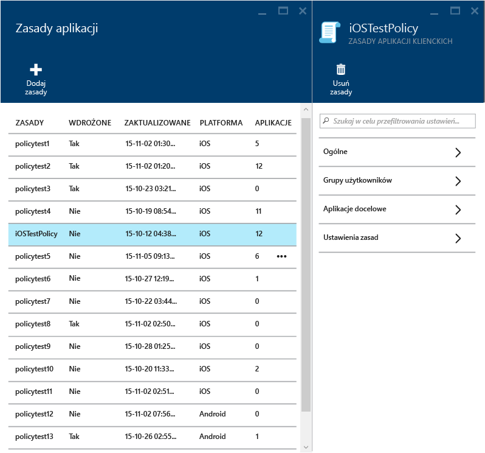

2.  W bloku zasad wybierz pozycję **Aplikacje docelowe**, aby otworzyć listę aplikacji.

3.  Usuń lub dodaj aplikacje do listy i wybierz pozycję **Zapisz**, aby zapisać zmiany.

### Aby zmienić listę grup użytkowników

1.  W bloku **Zasady aplikacji** wybierz zasady, które chcesz zmienić. Spowoduje to otwarcie bloku specyficznego dla wybranych zasad.

2.  W bloku zasad wybierz pozycję **Grupy użytkowników**, aby otworzyć blok **Grupa użytkowników** z listą bieżących grup użytkowników, których dotyczą dane zasady.

3.  Aby **dodać nową grupę użytkowników** do zasad, wybierz pozycję **Dodaj grupę użytkowników** i wybierz grupę użytkowników. Wybierz pozycję **Wybierz**, aby wdrożyć zasady dla wybranej grupy.

    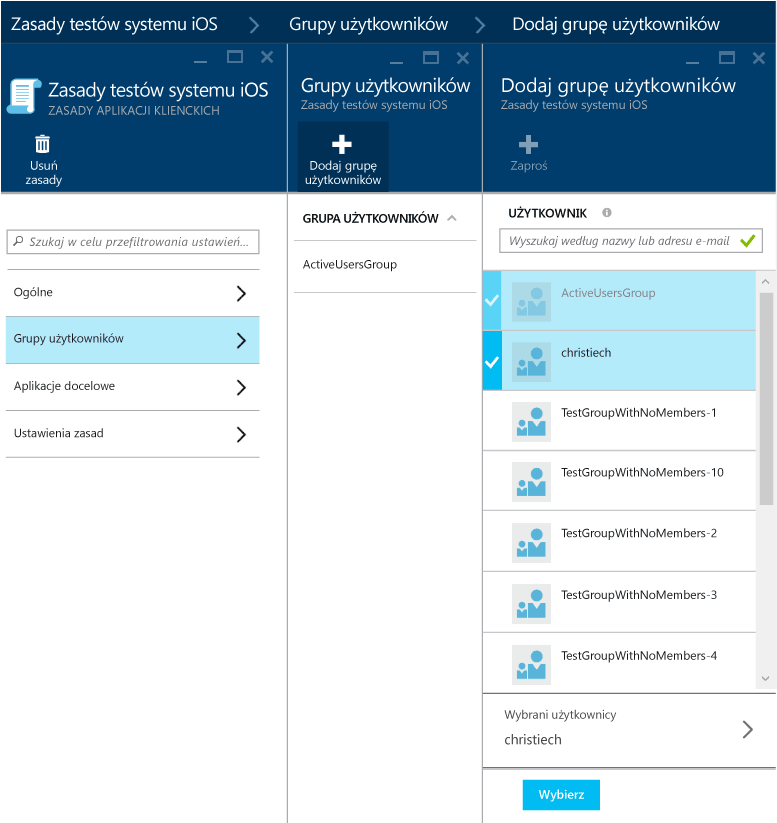

4.  Aby **usunąć grupę użytkowników**, wyróżnij grupę użytkowników do usunięcia, wybierz wielokropek (...), a następnie wybierz pozycję **Usuń**, aby usunąć grupę użytkowników.

    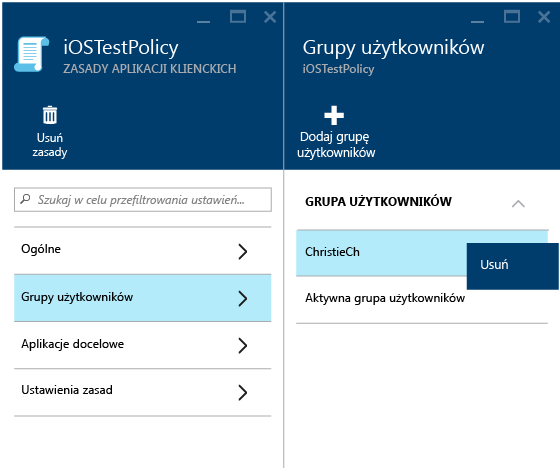

### Aby zmienić ustawienia zasad

1.  W bloku **Zasady aplikacji** wybierz zasady, które chcesz zmienić. Spowoduje to otwarcie bloku specyficznego dla właśnie wybranych zasad.

    

2.  Wybierz pozycję **Ustawienia zasad**, aby otworzyć blok **Ustawienia zasad**.

3.  Zmień ustawienia i wybierz **ikonę Zapisz**, aby zapisać zmiany.

    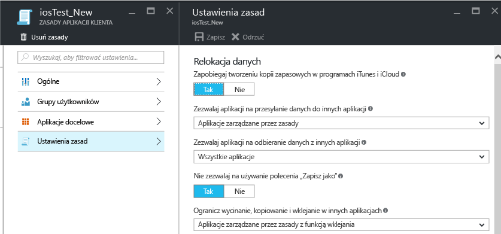

## Ustawienia zasad
Aby wyświetlić pełną listę ustawień zasad dla systemów iOS i Android, wybierz jeden z następujących elementów:

> [!div class="op_single_selector"]
  - [Zasady systemu iOS](ios-mam-policy-settings.md)
  - [Zasady systemu Android](android-mam-policy-settings.md)

## Następne kroki
[Monitorowanie zgodności i stanu użytkownika](monitor-mobile-app-management-policies-with-microsoft-intune.md)

### Zobacz także
[Środowisko użytkownika końcowego dla aplikacji objętej zarządzaniem aplikacjami mobilnymi](end-user-experience-for-mam-enabled-apps-with-microsoft-intune.md)

<!--HONumber=Jun16_HO2-->

