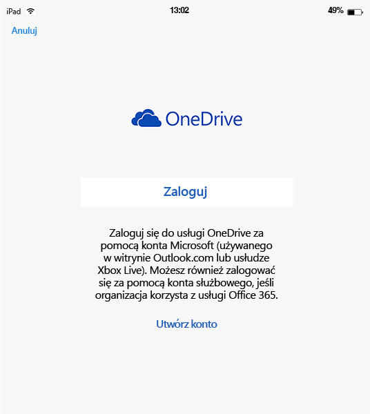
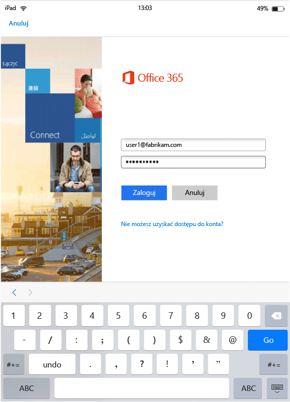
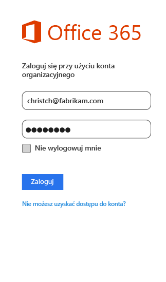

# Środowisko użytkownika końcowego dla aplikacji objętych zarządzaniem aplikacjami mobilnymi
Zasady zarządzania aplikacjami mobilnymi (mobile application management, MAM) są stosowane wyłącznie podczas korzystania z aplikacji w kontekście służbowym.  Zapoznaj się z następującymi scenariuszami, aby zrozumieć sposób działania aplikacji zarządzanych.
##  Uzyskiwanie dostępu do usługi OneDrive na urządzeniu z systemem iOS

1.  Uruchom aplikację  **OneDrive** , aby otworzyć stronę logowania.

    

    > [!NOTE]
    > Na urządzeniu prywatnym aplikacja jest zazwyczaj pobierana przez użytkownika końcowego.  Jeśli urządzenie jest zarządzane przez rozwiązanie MDM, możesz wdrożyć tę aplikację na urządzeniu.

2.  Wpisz nazwę użytkownika konta służbowego. Nastąpi przekierowanie do strony **uwierzytelniania usługi O365** , gdzie wprowadzisz swoje poświadczenia służbowe.

    

3.  Po pomyślnym uwierzytelnieniu poświadczeń przez usługę Azure AD zostaną zastosowane zasady MAM i pojawi się prośba o ponowne uruchomienie aplikacji **OneDrive** .
  >[UWAGA!] Okno dialogowe Wymagane ponowne uruchomienie jest wyświetlane tylko na urządzeniach, które nie są zarejestrowane w usłudze Intune.

    

4.  Po ponownym uruchomieniu aplikacji **OneDrive** zasady MAM będą już włączone. Następnie zostanie wyświetlony monit o ustawienie numeru **PIN** dla tej aplikacji. (Jeśli skonfigurowano odpowiednie zasady).

    

5.  Po ustawieniu i potwierdzeniu numeru PIN uzyskasz dostęp do plików w usłudze **OneDrive dla firm**.

    

    > [!NOTE]
    > Jeśli zmienisz wdrożone zasady, zmiany te zostaną zastosowane przy następnym otwarciu aplikacji.

##  Uzyskiwanie dostępu do usługi OneDrive na urządzeniu z systemem Android

1.  Uruchom aplikację OneDrive, aby otworzyć stronę logowania.

    > [!NOTE]
    > Na urządzeniu prywatnym aplikacja jest zazwyczaj pobierana przez użytkownika końcowego.  Jeśli urządzenie jest zarządzane przez rozwiązanie MDM, możesz wdrożyć tę aplikację na urządzeniu.

2.  Wpisz nazwę użytkownika konta służbowego. Nastąpi przekierowanie do strony **uwierzytelniania usługi O365** , gdzie wprowadzisz swoje poświadczenia służbowe.

    

3.  Po pomyślnym uwierzytelnieniu poświadczeń przez usługę **Azure AD**powinien zostać wyświetlony komunikat zawierający instrukcje instalacji aplikacji portalu firmy, jeśli nie została ona wcześniej zainstalowana na urządzeniu.  Naciśnij polecenie **Pobierz aplikację** , aby przejść dalej.

>[!NOTE]
>Aplikacja Portal firmy jest wymagana dla wszystkich aplikacji skojarzonych z zasadami MAM na urządzeniach z systemem Android. W przypadku urządzeń, które nie zostały zarejestrowane w usłudze Intune, ta aplikacja musi zostać zainstalowana na urządzeniu, ale nie jest wymagane uruchamianie aplikacji ani logowanie się do niej.  

  

4.  Nastąpi przekierowanie do sklepu **Google Play** , w którym możesz pobrać i zainstalować aplikację **Portal firmy** .

    Aplikacja Portal firmy pomaga w zabezpieczeniu i ochronie danych.

    

5.  Po zakończeniu instalacji wybierz pozycję **Akceptuj**, aby zaakceptować warunki.

6.  Aplikacja **OneDrive** zostanie uruchomiona automatycznie.

7.  Przy następnym otwarciu aplikacji OneDrive zostanie wyświetlony monit o ustawienie numeru **PIN**, o ile w ustawieniach zasad włączono zabezpieczenie dostępu do aplikacji **OneDrive** numerem PIN.

    

8.  Po ustawieniu i potwierdzeniu numeru PIN możesz kontynuować używanie aplikacji **OneDrive**, która będzie teraz zarządzana przez zasady aplikacji.

##  Korzystanie z aplikacji z obsługą wielu tożsamości
Jako przykład w tym scenariuszu użyto programu Microsoft Word.

1.  Otwórz aplikację **Word** na urządzeniu. Kroki do wykonania zostaną przedstawione na przykładzie urządzenia z systemem iOS.

2.  Naciśnij pozycję **Nowy** , aby utworzyć nowy dokument programu Word.

    

3.  Wpisz dowolne zdanie.  Podczas próby zapisania utworzonego dokumentu zostaną wyświetlone zarówno prywatne, jak i służbowe lokalizacje zapisu.  Na tym etapie zasady aplikacji nie są jeszcze stosowane, ponieważ nie ustalono jeszcze kontekstu służbowego i prywatnego.

4.  Zapisz dokument w lokalizacji aplikacji OneDrive dla firm. Dokument zostanie oznaczony jako część danych firmowych i zostaną do niego zastosowane ograniczenia określone przez zasady.

    

5.  Otwórz dokument zapisany w lokalizacji służbowej.  Skopiuj tekst, otwórz swoje prywatne konto w serwisie **Facebook**, a następnie spróbuj wkleić skopiowany tekst.  Powinno okazać się, że nie możesz wkleić zawartości do nowego wpisu w serwisie Facebook. Opcja wklejania nie jest nieaktywna, ale po naciśnięciu polecenia **Wklej**nic się nie dzieje.

    

    

6.  Powtórz teraz kroki 2 i 3, aby utworzyć nowy dokument, wpisz dowolne zdanie, ale zamiast zapisywać dokument w lokalizacji służbowej, zapisz go w lokalizacji prywatnej, na przykład **OneDrive — osobiste**.

    

7.  Otwórz zapisany dokument prywatny.  Skopiuj tekst, otwórz aplikację **Facebook** , a następnie spróbuj wkleić skopiowany tekst. Zobaczysz, że możesz wkleić tę zawartość do wpisu w portalu Facebook.

    

##  Zarządzenie kontami użytkowników

Usługa Intune obsługuje wdrażanie zasad MAM na koncie tylko jednego użytkownika dla każdego urządzenia. Jeśli urządzenie ma więcej niż jedno konto służbowe, tylko jedno konto służbowe jest zarządzane przez zasady MAM.

W zależności od używanej aplikacji drugi użytkownik może być blokowany na urządzeniu. Jednak we wszystkich przypadkach zasady dotyczą tylko pierwszego użytkownika, który pobierze zasady MAM.

Jeśli urządzenie ma wiele istniejących kont użytkowników przed wdrożeniem zasad MAM, pierwsze konto, na którym wdrożono zasady MAM, jest zarządzane przez zasady MAM usługi Intune.

Programy **Microsoft Word**, **Excel** i **PowerPoint** nie blokują drugiego konta użytkownika, ale zasady MAM nie są stosowane do tego konta.  

W przypadku **aplikacji OneDrive i Outlook** możesz używać tylko jednego konta służbowego.  Dodawanie większej liczby kont służbowych w tych aplikacjach jest zablokowane.  Możesz natomiast usunąć użytkownika na urządzeniu i dodać innego użytkownika.

Zapoznaj się z przykładowym scenariuszem poniżej, aby lepiej zrozumieć zasady traktowania wielu kont użytkowników.

Użytkownik A pracuje dla dwóch firm — **Firmy X** i **Firmy Y**. Użytkownik A ma konto służbowe dla każdej firmy, a obaj użytkownicy wdrażają zasady MAM za pomocą usługi Intune. **Firma X** wdraża zasady zarządzania aplikacjami mobilnymi **przed** **Firmą Y**. Zasady MAM zostaną zastosowane na koncie skojarzonym z **Firmą X**, ale nie na koncie skojarzonym z Firmą Y. Jeśli chcesz, aby konto użytkownika skojarzone z Firmą Y było zarządzane przez zasady MAM, musisz usunąć konto użytkownika skojarzone z Firmą X.
### Dodawanie drugiego konta
#### System iOS
Jeśli korzystasz z urządzenia z systemem iOS, podczas próby dodania drugiego konta służbowego na tym samym urządzeniu może zostać wyświetlony komunikat o blokadzie.  Zostanie również wyświetlona opcja usunięcia istniejącego konta i dodania nowego. Możesz to zrobić, wybierając pozycję **Tak**.

####  Android
Jeśli korzystasz z urządzenia z systemem Android, może zostać wyświetlony komunikat o blokadzie z instrukcjami usunięcia istniejącego konta i dodania nowego.  Aby usunąć istniejące konto na urządzeniu z systemem Android, przejdź do pozycji **Ustawienia &gt; Ogólne &gt; Menedżer aplikacji &gt; Portal firmy, a następnie wybierz pozycję „Wyczyść dane”**.

##  Wyświetlanie plików multimedialnych przy użyciu aplikacji do udostępniania usługi Rights Management
Aby wyświetlać pliki audio i wideo, pliki PDF i pliki obrazów na urządzeniach z systemem Android, użyj [aplikacji do udostępniania usługi Microsoft Rights Management (RMS)](https://play.google.com/store/apps/details?id=com.microsoft.ipviewer).

Pobierz tę aplikację ze sklepu Google Play.  Po zainstalowaniu aplikacji na urządzeniu uruchom ją i uwierzytelnij się przy użyciu poświadczeń firmowych. Wyświetlanie niechronionych i chronionych plików z innych aplikacji zarządzanych przy użyciu zasad powinno być teraz możliwe.

Obsługiwane są następujące typy plików:

* **Audio:** AAC LC, HE-AACv1 (AAC+), HE-AACv2 (rozszerzone AAC+), AAC ELD (enhanced low delay AAC), AMR-NB, AMR-WB, FLAC, MP3, MIDI, Vorbis, PCM/WAVE.
* **Wideo:** H.263, H.264 AVC, MPEG-4 SP, VP8.
* **Obraz:** jpg, pjpg, png, ppng, bmp, pbmp, gif, pgif, jpeg, pjpeg.
* PDF, PPDF

------------
|**pfile**|**text**|
|----|----|
|Pfile jest ogólnym formatem „otoki” dla plików chronionych, który hermetyzuje zaszyfrowaną zawartość i licencje usługi RMS i może służyć do ochrony dowolnego typu pliku.|Pliki tekstowe, w tym XML, CSV itp., można otworzyć w celu wyświetlania w aplikacji nawet wtedy, gdy są chronione. Typy plików: txt, ptxt, csv, pcsv, log, plog, xml, pxml.|
---------------
**Urządzenia z systemem Android, które nie zostały zarejestrowane w usłudze Intune**

Przed skorzystaniem z aplikacji do udostępniania usługi RMS do wyświetlania plików z innych aplikacji zarządzanych przez usługę Intune, uruchom aplikację RMS i uwierzytelnij się za pomocą swojego konta służbowego.  Po zalogowaniu się zostanie wyświetlony następujący komunikat **tylko, jeśli nie masz licencji usługi RMS**:

**Pomyślnie ukończono uwierzytelnianie — możesz teraz wyświetlać pliki firmowe, ale Twoja organizacja nie została skonfigurowana, aby umożliwić ochronę plików. Aby uzyskać więcej szczegółów, skontaktuj się z administratorem IT.**

Taka sytuacja nie uniemożliwia korzystania z aplikacji do udostępniania usługi RMS do wyświetlania plików firmowych. Nadal możesz otwierać i wyświetlać pliki firmowe z innych aplikacji zarządzanych przez usługę Intune, a zasady zarządzania aplikacjami mobilnymi nadal będą obowiązywać.  Ten komunikat świadczy tylko o tym, że nie będzie możliwe dodawanie dodatkowych funkcji ochrony zapewnianych przez aplikację do udostępniania usługi RMS.  Musisz mieć licencję aplikacji RMS, aby chronić swoje pliki. Aby uzyskać więcej informacji na temat funkcji ochrony plików aplikacji RMS, zobacz [Ochrona pliku na urządzeniu](https://docs.microsoft.com/en-us/rights-management/rms-client/sharing-app-protect-in-place) i [Ochrona pliku udostępnionego pocztą e-mail](https://docs.microsoft.com/en-us/rights-management/rms-client/sharing-app-protect-by-email).

### Zobacz też
[Tworzenie i wdrażanie zasad zarządzania aplikacjami mobilnymi przy użyciu usługi Microsoft Intune](create-and-deploy-mobile-app-management-policies-with-microsoft-intune.md)

<!--HONumber=Jul16_HO3-->

