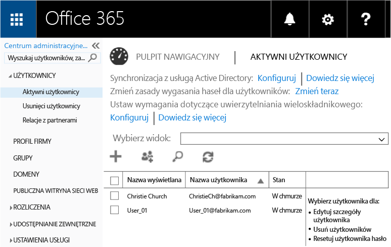
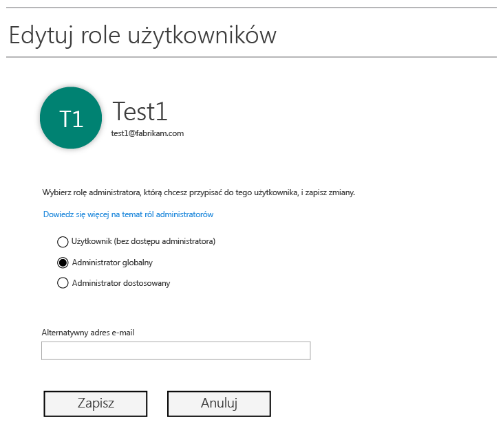
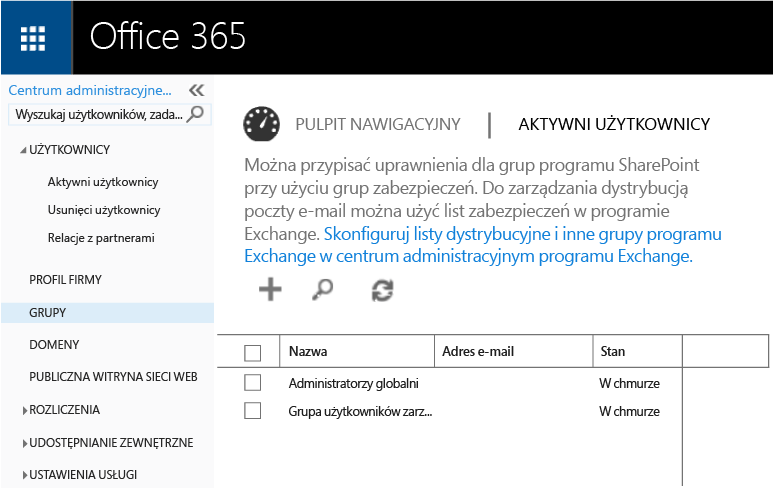
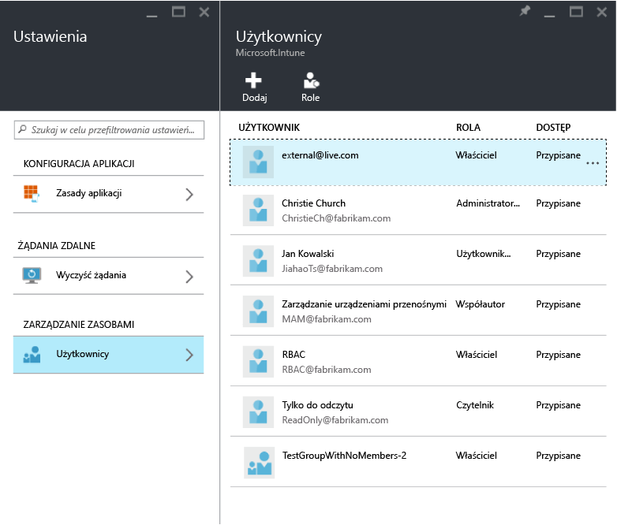
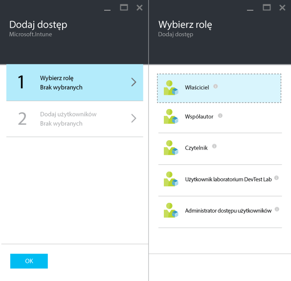
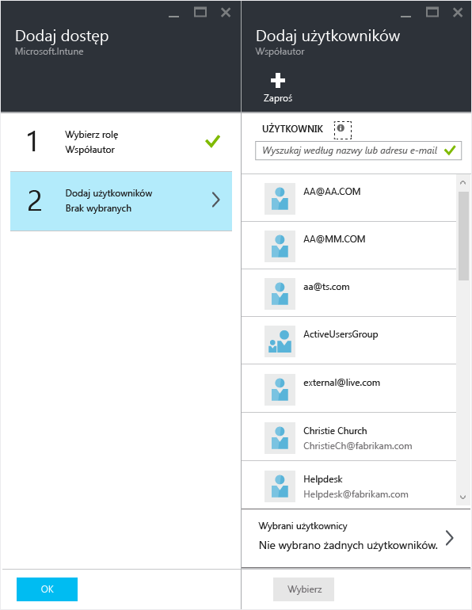

---
# required metadata

title: Przygotowywanie się do skonfigurowania zasad zarządzania aplikacjami mobilnymi | Microsoft Intune
description:
keywords:
author: karthikaraman
manager: jeffgilb
ms.date: 04/28/2016
ms.topic: article
ms.prod:
ms.service: microsoft-intune
ms.technology:
ms.assetid: 7e6a85e7-e007-41b6-9034-64d77f547b87

# optional metadata

#ROBOTS:
#audience:
#ms.devlang:
ms.reviewer: joglocke
ms.suite: ems
#ms.tgt_pltfrm:
#ms.custom:

---

# Przygotowywanie się do skonfigurowania zasad zarządzania aplikacjami mobilnymi przy użyciu usługi Microsoft Intune
W tym temacie opisano, co należy zrobić przed rozpoczęciem tworzenia zasad zarządzania aplikacjami mobilnymi w portalu Azure.

Portal Azure to nowa konsola administracyjna do tworzenia zasad zarządzania aplikacjami mobilnymi i do ich tworzenia zalecane jest użycie tego portalu. Portal Azure obsługuje następujące scenariusze zarządzania aplikacjami mobilnymi:
- Urządzenia zarejestrowane w usłudze Intune
- Urządzenia zarządzane przez rozwiązanie MDM innej firmy
- Urządzenia niezarządzane przez żadne rozwiązanie MDM (BYOD).

Jeśli używasz portalu Azure po raz pierwszy, przeczytaj temat [Portal Azure — zasady zarządzania aplikacjami mobilnymi](azure-portal-for-microsoft-intune-mam-policies.md), aby szybko zapoznać się z portalem.

Jeśli obecnie korzystasz z **konsoli administracyjnej usługi Intune** do zarządzania urządzeniami, możesz utworzyć zasady zarządzania aplikacjami mobilnym obsługujące aplikacje dla urządzeń zarejestrowanych w usłudze Intune przy użyciu **konsoli administracyjnej usługi Intune**, ale zalecane jest używanie portalu Azure nawet w przypadku urządzeń zarejestrowanych w usłudze Intune. Instrukcje dotyczące sposobu tworzenia zasad zarządzania aplikacjami mobilnymi za pomocą konsoli administracyjnej usługi Intune możesz znaleźć [tutaj](configure-and-deploy-mobile-application-management-policies-in-the-microsoft-intune-console.md).

>[!IMPORTANT]
> W konsoli administracyjnej usługi Intune mogą nie być wyświetlane wszystkie ustawienia zasad zarządzania aplikacjami mobilnymi. Jeśli utworzysz zasady zarządzania aplikacjami mobilnymi zarówno za pomocą konsoli administracyjnej usługi Intune, jak i portalu Azure, zasady utworzone w portalu Azure zostaną zastosowane dla aplikacji i wdrożone dla użytkowników.

##  Obsługiwane platformy
- System iOS 8.1 lub nowszy

- System Android 4 lub nowszy

Urządzenia z systemem Windows nie są obecne obsługiwane.
##  Obsługiwane aplikacje
* **Aplikacje firmy Microsoft:** te aplikacje mają wbudowany zestaw SDK aplikacji usługi Intune i nie wymagają dalszego przetwarzania przed zastosowaniem zasad zarządzania aplikacjami mobilnymi.
Pełna lista obsługiwanych aplikacji firmy Microsoft jest dostępna w [galerii aplikacji mobilnych usługi Microsoft Intune](https://www.microsoft.com/en-us/server-cloud/products/microsoft-intune/partners.aspx) na stronie partnerów aplikacji usługi Microsoft Intune. Kliknij aplikację, aby wyświetlić obsługiwane scenariusze i platformy, a także sprawdzić, czy aplikacja obsługuje wiele tożsamości.
* Utworzone we własnym zakresie **aplikacje biznesowe:** wymagają przygotowania aplikacji do dołączenia do nich zestawu SDK aplikacji usługi Intune, zanim możliwe będzie zastosowanie zasad zarządzania aplikacjami mobilnymi.

  * W przypadku urządzeń zarządzanych przez usługę Intune zobacz [Decide how to prepare apps for MAM](decide-how-to-prepare-apps-for-mobile-application-management-with-microsoft-intune.md) (Wybieranie sposobu przygotowania aplikacji do zarządzania aplikacjami mobilnymi).
  * W przypadku urządzeń niezarządzanych, takich jak urządzenia należące do pracowników, lub urządzeń zarządzanych przez rozwiązanie do zarządzania urządzeniami przenośnymi oferowane przez inną firmę, zobacz [Protect line of business apps and data on devices not enrolled in Intune](protect-line-of-business-apps-and-data-on-devices-not-enrolled-in-microsoft-intune.md) (Chronienie aplikacji biznesowych i danych na niezarejestrowanych urządzeniach w usłudze Intune).

**Przed** rozpoczęciem konfigurowania zasad zarządzania aplikacjami mobilnymi potrzebne będą:

-   **Subskrypcja usługi Microsoft Intune**.    Użytkownicy końcowi potrzebują licencji usługi [!INCLUDE[wit_nextref](../includes/wit_nextref_md.md)] w celu pobierania aplikacji z zasadami zarządzania aplikacjami mobilnymi.

-   Subskrypcja **usługi Office 365 (O365)** jest wymagana do:
  - Stosowania zasad zarządzania aplikacjami mobilnymi do aplikacji z obsługą wielu tożsamości.
  - Tworzenia kont służbowych usług SharePoint Online i Exchange Online. Lokalna instalacja programu Exchange i lokalna instalacja programu SharePoint nie są obsługiwane.
-    **Włączenie nowoczesnego uwierzytelniania** dla usługi **Skype dla firm Online**. Zaloguj się do witryny Microsoft Connect i wypełnij [ten formularz](https://connect.microsoft.com/office/Survey/NominationSurvey.aspx?SurveyID=17299&ProgramID=8715), aby zostać zarejestrowanym w programie nowoczesnego uwierzytelniania.

- **Usługa Azure Active Directory (Azure AD)** do tworzenia użytkowników. Usługa Azure AD uwierzytelnia użytkownika końcowego w momencie uruchomienia przez niego aplikacji i wprowadzenia poświadczeń służbowych.

    > [!NOTE] Jeśli konfigurujesz użytkowników przy użyciu konsoli usługi [!INCLUDE[wit_nextref](../includes/wit_nextref_md.md)], pamiętaj, że konfiguracja zasad zarządzania aplikacjami mobilnymi będzie prowadzona od teraz w portalu Azure. Korzystanie z tego portalu wymaga skonfigurowania grup użytkowników usługi Azure AD przy użyciu portalu usługi Office 365.

## Tworzenie użytkowników i przypisywanie licencji usługi Microsoft Intune

1. Potrzebna jest subskrypcja usługi Intune: jeśli aktualnie używasz usługi [!INCLUDE[wit_nextref](../includes/wit_nextref_md.md)] do zarządzania urządzeniami, masz już subskrypcję usługi [!INCLUDE[wit_nextref](../includes/wit_nextref_md.md)] .  Masz również subskrypcję usługi [!INCLUDE[wit_nextref](../includes/wit_nextref_md.md)], jeśli masz kupioną licencję pakietu EMS. Jeśli wypróbowujesz usługę [!INCLUDE[wit_nextref](../includes/wit_nextref_md.md)] w celu zapoznania się z możliwościami w zakresie zarządzania aplikacjami mobilnymi, konto próbne możesz uzyskać [tutaj](http://www.microsoft.com/en-us/server-cloud/products/microsoft-intune/).

    Aby sprawdzić, czy masz subskrypcję usługi [!INCLUDE[wit_nextref](../includes/wit_nextref_md.md)], przejdź do strony rozliczeń w portalu usługi Office.  Usługa [!INCLUDE[wit_nextref](../includes/wit_nextref_md.md)] powinna być widoczna jako **Aktywna** w obszarze subskrypcji.

2.  Zaloguj się do   [portalu usługi Office](http://portal.office.com) przy użyciu poświadczeń administratora.

3.  Przejdź do strony **Aktywni użytkownicy**, aby dodać użytkowników i przypisać licencje usługi [!INCLUDE[wit_nextref](../includes/wit_nextref_md.md)].

    

4.  Aby dać użytkownikowi możliwość dostępu do portalu usługi Office, portalu usługi Azure AD i portalu Azure, przypisz użytkownikowi **rolę administratora globalnego**.

    

5.  Zasady zarządzania aplikacjami mobilnymi są wdrażane dla grup użytkowników w usłudze Azure Active Directory. Aby utworzyć grupy użytkowników, które będą stosowane dla zasad zarządzania aplikacjami mobilnymi, przejdź do strony **Grupy** w **portalu usługi Office** i kliknij ikonę **+**, aby utworzyć nową grupę zabezpieczeń.  Wpisz nazwę i opis, a następnie kliknij pozycję **Utwórz**. Po utworzeniu grupy możesz dodać do niej użytkownika, klikając pozycję **Edytuj członków** dla nowo utworzonej grupy zabezpieczeń. W usłudze Azure Active Directory zostanie utworzona grupa zabezpieczeń.

    

W poniższej tabeli zamieszczono role i uprawnienia, które można przypisać administratorom.

|||
|--|----|
|**Rola**|**Uprawnienia**|
|Administrator globalny (portal usługi O365)|Dostęp do portalu usługi O365 i portalu usługi Azure AD  Dostęp do portalu Azure (możliwość zarządzania rolami i aplikacjami mobilnymi).|
|Rola właściciela (portal Azure)|Dostęp do portalu Azure (możliwość zarządzania rolami i aplikacjami mobilnymi).|
|Rola współautora (portal Azure)|Dostęp do portalu Azure (tylko możliwość zarządzania aplikacjami mobilnymi).|

## Przypisywanie użytkownikowi roli współautora

**Administratorzy globalni** mają dostęp do [portalu Azure](https://portal.azure.com).  Jeśli chcesz, aby inni administratorzy mogli konfigurować zasady oraz wykonywać inne zadania związane z zarządzaniem aplikacjami mobilnymi, możesz przypisać użytkownikom **rolę współautora** zgodnie z poniższym opisem:

1.  W bloku **Ustawienia** w sekcji **Zarządzanie zasobami** kliknij pozycję **Użytkownicy**.

    

2.  Kliknij pozycję **Dodaj** , aby otworzyć blok **Dodawanie dostępu** .

3.  Kliknij pozycję **Wybierz rolę**, a następnie pozycję **Rola współautora**.

    

4.  Po wybraniu roli kliknij pozycję **Dodaj użytkownika**i wyszukaj użytkownika według jego nazwy lub adresu e-mail. Użytkownicy widoczni na tej liście to pierwszych 1000 użytkowników utworzonych wcześniej w usłudze Azure AD za pomocą portalu usługi Office. Kliknij pozycję **OK** w bloku **Dodawanie dostępu** , aby zapisać i przypisać rolę użytkownikowi.

    

    > [!IMPORTANT] Jeśli zostanie wybrany użytkownik bez przypisanej licencji usługi [!INCLUDE[wit_nextref](../includes/wit_nextref_md.md)], nie będzie on w stanie uzyskiwać dostępu do portalu.

## Następne kroki
[Tworzenie i wdrażanie zasad zarządzania aplikacjami mobilnymi przy użyciu usługi Microsoft Intune](create-and-deploy-mobile-app-management-policies-with-microsoft-intune.md)

<!--HONumber=Jun16_HO2-->

