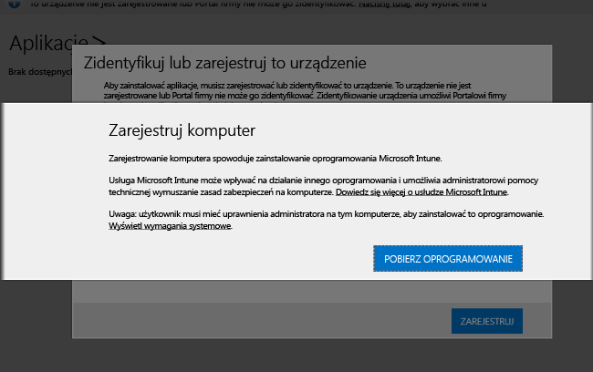

# Instalowanie klienta oprogramowania usługi Intune na komputerach z systemem Windows
Komputery z systemem Windows można zarejestrować, instalując oprogramowanie klienckie usługi Intune. Oprogramowanie klienckie usługi Intune można zainstalować na następujące sposoby:

- Instalacja ręczna
- Instalacja przy użyciu zasad grupy
- Dołączenie na obrazie dysku
- Instalacja przez użytkowników

## Pobranie oprogramowania klienckiego usługi Intune

Wszystkie metody, z wyjątkiem sytuacji, gdy użytkownicy instalują oprogramowanie klienckie usługi Intune, wymagają pobrania oprogramowania, aby można je było wdrożyć.

1.  W [konsoli administracyjnej usługi Microsoft Intune](https://manage.microsoft.com/) kliknij pozycję **Administracja** &gt; ** Pobierz oprogramowanie klienckie**.

  

2.  Na stronie **Pobieranie oprogramowania klienckiego** kliknij pozycję **Pobierz oprogramowanie klienckie** i zapisz pakiet z oprogramowaniem **Microsoft_Intune_Setup.zip** w bezpiecznej lokalizacji w sieci.

    > [!NOTE]
    > Pakiet instalacji oprogramowania klienckiego usługi Intune zawiera informacje o Twoim koncie. Jeśli nieautoryzowani użytkownicy uzyskają dostęp do pakietu instalacyjnego, mogą zarejestrować komputery na koncie reprezentowanym przez osadzony certyfikat tego pakietu.

3.  Wyodrębnij zawartość pakietu instalacyjnego w bezpiecznej lokalizacji w sieci.

    > [!IMPORTANT]
    > Nie zmieniaj nazwy wyodrębnionego pliku **ACCOUNTCERT** ani nie usuwaj go, ponieważ spowoduje to niepowodzenie instalacji oprogramowania klienckiego.

## Ręczne wdrażanie

1.  Na komputerze przejdź do folderu zawierającego pliki instalacji oprogramowania klienckiego, a następnie uruchom plik **Microsoft_Intune_Setup.exe**, aby zainstalować oprogramowanie klienckie.

    > [!NOTE]
    > Stan instalacji można wyświetlić, zatrzymując wskaźnik myszy na ikonie na pasku zadań komputera klienckiego.

## Wdrażanie przy użyciu zasad grupy

1.  W folderze zawierającym pliki **Microsoft_Intune_Setup.exe** i **MicrosoftIntune.accountcert** uruchom następujące polecenie, aby wyodrębnić programy instalacyjne oparte na Instalatorze Windows dla komputerów 32-bitowych i 64-bitowych:

    ```
    Microsoft_Intune_Setup.exe/Extract <destination folder>
    ```

2.  Skopiuj pliki **Microsoft_Intune_x86.msi**, **Microsoft_Intune_x64.msi** i **MicrosoftIntune.accountcert** do lokalizacji sieciowej dostępnej dla wszystkich komputerów, na których ma zostać zainstalowane oprogramowanie klienckie.

    > [!IMPORTANT]
    > Nie należy rozdzielać plików ani zmieniać ich nazw, ponieważ spowoduje to niepowodzenie instalacji oprogramowania klienckiego.

3.  Wdróż oprogramowanie na komputerach w sieci za pomocą zasad grupy.

    Aby uzyskać więcej informacji o automatycznym wdrażaniu oprogramowania za pomocą zasad grupy, zapoznaj się z dokumentacją systemu Windows Server.

## Instalowanie jako części obrazu
Oprogramowanie klienckie usługi Intune można wdrożyć na komputerach jako część obrazu systemu operacyjnego, bazując na poniższej przykładowej procedurze:

1.  Skopiuj pliki instalacyjne klienta (**Microsoft_Intune_Setup.exe** i **MicrosoftIntune.accountcert**) do folderu **%Systemdrive%\Temp\Microsoft_Intune_Setup** na komputerze odniesienia.

2.  Utwórz wpis rejestru **WindowsIntuneEnrollPending** , dodając następujące polecenie do skryptu **SetupComplete.cmd** :

    ```
    %windir%\system32\reg.exe add HKEY_LOCAL_MACHINE\Software\Microsoft\Onlinemanagement\Deployment /v
    WindowsIntuneEnrollPending /t REG_DWORD /d 1
    ```

3.  Dodaj następujące polecenie do pliku **SetupComplete.cmd**, aby uruchomić pakiet rejestracyjny z argumentem wiersza polecenia /PrepareEnroll:

    ```
    %systemdrive%\temp\Microsoft_Intune_Setup\Microsoft_Intune_Setup.exe /PrepareEnroll
    ```
    > [!TIP]
    > Skrypt **SetupComplete.cmd** umożliwia Instalatorowi systemu Windows wprowadzenie modyfikacji systemu przed zalogowaniem się użytkownika. Argument wiersza polecenia **/PrepareEnroll** powoduje przygotowanie komputera docelowego do automatycznej rejestracji w usłudze Intune po zakończeniu działania Instalatora systemu Windows.

4.  Umieść skrypt **SetupComplete.cmd** w folderze **%Windir%\Setup\Scripts** na komputerze odniesienia.

5.  Przechwyć obraz komputera odniesienia, a następnie wdróż go na komputerach docelowych.

Gdy komputer docelowy zostanie uruchomiony ponownie po ukończeniu działania Instalatora systemu Windows, nastąpi utworzenie klucza rejestru **WindowsIntuneEnrollPending** . Pakiet rejestracyjny sprawdza, czy komputer jest zarejestrowany. Jeśli komputer jest zarejestrowany, nie są wykonywane żadne dalsze działania. Jeśli komputer nie jest zarejestrowany, pakiet rejestracyjny tworzy zadanie automatycznej rejestracji w usłudze Microsoft Intune.

Gdy zadanie automatycznej rejestracji jest uruchamiane w następnym zaplanowanym terminie, sprawdza istnienie wartości rejestru **WindowsIntuneEnrollPending** i próbuje zarejestrować komputer docelowy w usłudze Intune. Jeśli rejestracja nie powiedzie się z jakiegokolwiek powodu, próba rejestracji zostanie ponowiona przy następnym uruchomieniu zadania. Ponowne próby będą kontynuowane przez miesiąc.

Zadanie automatycznej rejestracji w usłudze Intune, wartość rejestru **WindowsIntuneEnrollPending** i certyfikat konta zostaną usunięte z komputera docelowego po pomyślnej rejestracji lub po upływie miesiąca.

## Instruowanie użytkowników odnośnie samodzielnej rejestracji

Użytkownicy mogą instalować oprogramowanie klienckie usługi Intune, przechodząc do witryny [http://portal.manage.microsoft.com](http://portal..manage.microsoft.com). Jeśli portal sieci Web może wykryć, że urządzenie jest komputerem z systemem Windows, użytkownik będzie monitowany o pobranie klienta oprogramowania usługi Intune w celu zarejestrowania urządzenia. Po pobraniu go użytkownicy mogą zainstalować oprogramowanie w celu umożliwienia zarządzania ich komputerami.



## Monitorowanie i weryfikowanie pomyślnego wdrożenia klienta
Użyj jednej z poniższych procedur ułatwiających monitorowanie i weryfikowanie pomyślnego wdrożenia klienta.

### Aby zweryfikować instalację oprogramowania klienckiego z poziomu konsoli administratora usługi Microsoft Intune

1.  W [konsoli administracyjnej usługi Microsoft Intune](https://manage.microsoft.com/) kliknij pozycję **Grupy** &gt; **Wszystkie urządzenia** &gt; **Wszystkie komputery**.

2.  Przewiń w dół listę komputerów, aby znaleźć zarządzane komputery komunikujące się z usługą Intune, albo wyszukaj określony zarządzany komputer, wpisując nazwę komputera lub dowolną część nazwy w polu **Wyszukaj urządzenia** .

3.  Sprawdź stan komputera w dolnym okienku konsoli i usuń wszelkie błędy.

### Aby utworzyć raport ze spisu komputerów w celu wyświetlenia wszystkich zarejestrowanych komputerów

1.  W [konsoli administracyjnej usługi Microsoft Intune](https://manage.microsoft.com/) kliknij pozycje **Raporty** &gt; **Raporty ze spisu komputerów**.

2.  Na stronie **Tworzenie nowego raportu** pozostaw wartości domyślne we wszystkich polach (chyba że chcesz zastosować filtry), a następnie kliknij pozycję **Wyświetl raport**.

3.  W nowym oknie zostanie otwarta strona **Raport o spisie komputerów** zawierająca wszystkie komputery, które zostały pomyślnie zarejestrowane w usłudze Intune.

    > [!TIP]
    > Kliknij nagłówek dowolnej kolumny w raporcie, aby posortować listę według zawartości tej kolumny.


### Zobacz też
[Zarządzanie komputerami z systemem Windows przy użyciu usługi Microsoft Intune](manage-windows-pcs-with-microsoft-intune.md)
[Rozwiązywanie problemów z instalacją klienta](../troubleshoot/troubleshoot-client-setup-in-microsoft-intune.md)


<!--HONumber=Sep16_HO4-->


