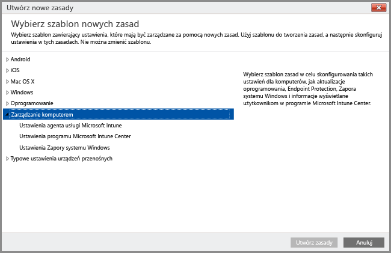

# Zarządzanie komputerami z systemem Windows przy użyciu komputerowego oprogramowania klienckiego usługi Intune
Zamiast [rejestrować komputery z systemem Windows jako urządzenia przenośne](set-up-windows-device-management-with-microsoft-intune.md) możesz je rejestrować i zarządzać nimi poprzez zainstalowanie oprogramowania klienckiego usługi Intune.

Usługa Intune zarządza komputerami z systemem Windows za pomocą zasad podobnie jak robią to obiekty zasad grupy Usług domenowych Active Directory (AD DS) systemu Windows Server. Jeśli planujesz zarządzać komputerami przyłączonymi do domeny usługi Active Directory przy użyciu usługi Intune, [upewnij się, że zasady usługi Intune nie powodują konfliktów z obiektami zasad grupy](resolve-gpo-and-microsoft-intune-policy-conflicts.md) stosowanymi w organizacji.

Klient oprogramowania usługi Intune obsługuje [możliwości z zakresu zarządzania sprzyjające ochronie komputerów](policies-to-protect-windows-pcs-in-microsoft-intune.md), umożliwiając zarządzanie aktualizacjami oprogramowania, zaporą systemu Windows i programem Endpoint Protection. Komputery zarządzane przy użyciu klienta usługi Intune nie mogą być jednak celem innych zasad usługi Intune, w tym ustawień zasady systemu **Windows** powiązanych z zarządzaniem urządzeniami przenośnymi.

> [!NOTE]
> Urządzenia z systemem Windows 8.1 lub nowszym mogą być zarządzane przy użyciu klienta usługi Intune lub można je zarejestrować jako urządzenia przenośne. Poniższe informacje dotyczą komputerów z klientem usługi Intune. Jednoczesne instalowanie komputerowego klienta usługi Intune oraz rejestrowanie urządzeń z systemem Windows w usłudze zarządzania urządzeniami przenośnymi nie jest obsługiwane.

## Wymagania dotyczące funkcji zarządzania komputerami przy użyciu klienta usługi Intune

**Sprzęt**: Poniżej podano minimalne wymagania dotyczące sprzętu w przypadku instalowania klienta usługi Intune:

|Wymaganie|Więcej informacji|
|---------------|--------------------|
|Sieć|Klient wymaga komputera z połączeniem z Internetem.|
|Procesor i pamięć|Należy zapoznać się z wymaganiami dotyczącymi procesora i pamięci RAM dla systemu operacyjnego komputera.|
|Miejsce na dysku|200 MB dostępnego miejsca na dysku przed zainstalowaniem oprogramowania klienckiego.|

**Oprogramowanie**: Poniżej podano wymagania dotyczące oprogramowania w przypadku instalowania klienta:

|Wymaganie|Więcej informacji|
|---------------|--------------------|
|System operacyjny | Urządzenie z systemem Windows 7 lub nowszym. |
|Uprawnienia administracyjne|Konto używane do instalacji oprogramowania klienckiego musi mieć uprawnienia administratora lokalnego na danym urządzeniu.|
|Instalator Windows w wersji 3.1|Na komputerze musi być dostępny Instalator Windows w wersji 3.1 lub nowszej.  Aby wyświetlić wersję Instalatora Windows na komputerze:  -   Na komputerze kliknij prawym przyciskiem myszy pozycję **%windir%\System32\msiexec.exe**, a następnie kliknij polecenie **Właściwości**.  Najnowszą wersję Instalatora Windows można pobrać ze strony [pakietów redystrybucyjnych Instalatora Windows](http://go.microsoft.com/fwlink/?LinkID=234258) w witrynie Microsoft Developer Network w sieci Web.|
|Usunięcie niezgodnego oprogramowania klienckiego|Przed zainstalowaniem oprogramowania klienckiego usługi Intune należy odinstalować wszelkie oprogramowanie klienckie programu Configuration Manager lub System Management Server z tego komputera.|

## Instalowanie klienta komputera z usługą Intune
Oprogramowanie klienckie usługi Intune można zainstalować na następujące sposoby:

-  [Ręcznie wdrożyć oprogramowanie klienckie usługi Microsoft Intune](install-the-windows-pc-client-with-microsoft-intune.md#to-manually-deploy-the-client-software). W tym typie wdrożenia administrator pobiera oprogramowanie klienckie usługi Intune i instaluje je ręcznie na każdym komputerze.

  Aby pobrać oprogramowanie klienckie usługi Intune, otwórz [konsolę administracyjną usługi Intune](https://manage.microsoft.com) i wybierz opcję **Administracja** > **Pobierz oprogramowanie klienckie**, a następnie kliknij opcję **Pobierz oprogramowanie klienckie**.

-  Pobranych plików możesz również użyć do ręcznego zainstalowania oprogramowania klienckiego usługi Intune w celu [wdrożenia klienta na komputerach przyłączonych do domeny za pomocą obiektów zasad grupy usługi Active Directory](install-the-windows-pc-client-with-microsoft-intune.md#to-automatically-deploy-the-client-software-by-using-group-policy).

-  Oprogramowanie klienckie usługi Intune można wdrożyć na komputerach w ramach [wdrożenia systemu operacyjnego](install-the-windows-pc-client-with-microsoft-intune.md#install-the-microsoft-intune-client-software-as-part-of-an-image).

-  Wyślij użytkownikom instrukcje z adresem URL witryny sieci Web Portal firmy usługi Intune, [https://portal.manage.microsoft.com](http://go.microsoft.com/fwlink/?LinkId=825632). Po otwarciu witryny sieci Web Portal firmy użytkownicy zobaczą monit o zarejestrowanie swoich komputerów poprzez pobranie i uruchomienie oprogramowania klienckiego usługi Intune.

## Zarządzanie komputerami przy użyciu usługi klienta komputera z usługą Intune
Po zainstalowaniu oprogramowanie klienckie usługi Intune oferuje kilka możliwości zarządzania komputerami, w tym: [zarządzanie aplikacjami](deploy-apps-in-microsoft-intune.md), program Endpoint Protection, spis sprzętu i oprogramowania, zdalne sterowanie (za pośrednictwem żądań pomocy zdalnej), aktualizacje oprogramowania i raportowanie ustawień zgodności.

Niektóre zadania zarządzania komputerami włączone przy użyciu klienta komputera są zarządzane przy użyciu zasad usługi Intune, takich jak:

-   Konfigurowanie [ustawień Zapory systemu Windows](help-protect-windows-pcs-using-windows-firewall-policies-in-microsoft-intune.md) na zarządzanych komputerach.

-   Konfigurowanie [ustawień aktualizacji oprogramowania](keep-windows-pcs-up-to-date-with-software-updates-in-microsoft-intune.md) na zarządzanych komputerach w celu wyszukania i pobrania wymaganych aktualizacji oprogramowania.

-   Pomoc w zapewnianiu bezpieczeństwa zarządzanych komputerów przed potencjalnymi zagrożeniami i złośliwym oprogramowaniem za pośrednictwem zarządzania [monitorowaniem w czasie rzeczywistym i programem Endpoint Protection](help-secure-windows-pcs-with-endpoint-protection-for-microsoft-intune.md) .

Oprócz akcji agenta klienta usługi Intune wykonywanych lokalnie na poszczególnych komputerach, można użyć konsoli administratora usługi Intune do wykonywania innych [typowych zadań zarządzania komputerami](common-windows-pc-management-tasks-with-the-microsoft-intune-computer-client.md) na komputerach z systemem Windows z zainstalowanym klientem. Te zadania obejmują:

-   Wyświetlanie informacji ze spisu sprzętu i oprogramowania na potrzeby zarządzanych komputerów

-   Zdalne ponowne uruchamianie komputera

-   Wycofywanie komputera w celu odinstalowania oprogramowania klienckiego oraz usuwanie go z zarządzania przy użyciu usługi Intune

-   Łączenie użytkowników z określonymi komputerami zarządzanymi

-   Odpowiadanie na żądania pomocy zdalnej

Agent klienta usługi Intune zwykle działa w tle bez konieczności interakcji z użytkownikami ani rozwiązywania problemów. Jeśli jednak potrzebujesz pomocy w rozwiązywaniu problemów z zarządzaniem komputerami, możesz skorzystać z kilku [dostępnych zasobów umożliwiających ich rozwiązanie](/intune/troubleshoot/troubleshoot-client-setup-in-microsoft-intune).

<!--HONumber=Aug16_HO4-->

