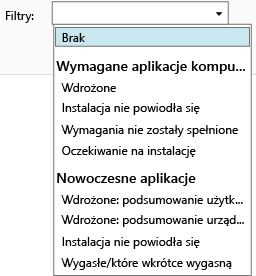

# Monitorowanie wdrożeń aplikacji w usłudze Microsoft Intune

## Monitorowanie wdrożenia aplikacji
W konsoli administracyjnej usługi Intune widoczne są aplikacje, którymi zarządzasz, a także stan wszystkich wdrożeń.

### Aby wyświetlić zarządzane aplikacje i ich stan
W obszarze roboczym **Aplikacje** wybierz węzeł **Aplikacje** węzeł, a następnie wybierz pozycję **Aplikacje**.

Zostanie wyświetlona lista aplikacji, którymi zarządzasz. Możesz wybrać dowolną aplikację, aby wyświetlić stan instalacji w dolnym okienku w oknie konsoli. Kliknij ten stan, aby zobaczyć więcej informacji. Jeśli na przykład jest wyświetlany stan **1 użytkownik ma dostępne to oprogramowanie**, możesz kliknąć komunikat, aby zobaczyć nazwę tego użytkownika.

> [!TIP]
> Lista rozwijana **Filtry** umożliwia wyświetlanie tylko aplikacji spełniających określone kryteria, takich jak aplikacje, których nie udało się zainstalować, lub pomyślnie wdrożone aplikacje.
>
> 

Ponadto w obszarze roboczym **Pulpit nawigacyjny** jest wyświetlany przegląd stanu aplikacji. Kliknięcie w dowolnym miejscu przeglądu spowoduje przekierowanie do listy aplikacji.

## Aby wyświetlić bardziej szczegółowe informacje o aplikacji
Na liście aplikacji zaznacz dowolną aplikację, a następnie wybierz pozycję **Wyświetl właściwości**.

Na stronie aplikacji **Właściwości oprogramowania** wybierz jedną z tych kart: **Ogólne** — przedstawia ogólne informacje na temat aplikacji oraz na temat stanu jej instalacji; **Urządzenia** — przedstawia urządzenia, na których pomyślnie zainstalowano docelowe wdrożenie aplikacji; **Użytkownicy** — przedstawia użytkowników, na których urządzeniach pomyślnie zainstalowano docelowe wdrożenie aplikacji.

Tak jak wcześniej można użyć listy rozwijanej **Filtry**, aby skonfigurować wartości wyświetlane na poszczególnych kartach.

<!--HONumber=Aug16_HO2-->

