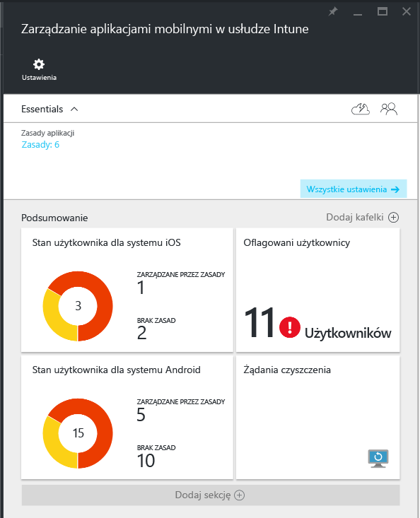
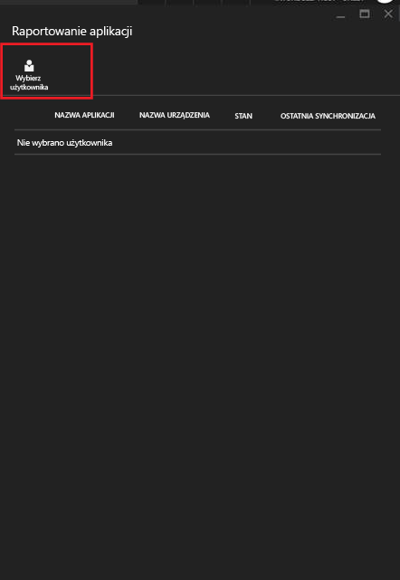
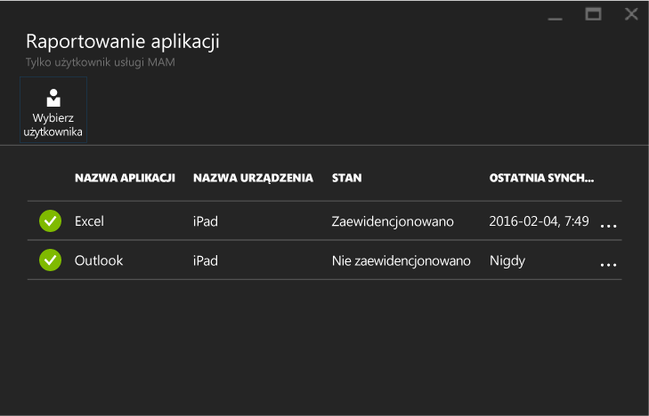

# Monitorowanie zasad zarządzania aplikacjami mobilnymi przy użyciu usługi Microsoft Intune
Po skonfigurowaniu zasad zarządzania aplikacjami mobilnymi i zastosowaniu ich względem użytkowników można monitorować stan zgodności w [portalu Azure](https://portal.azure.com). Portal Azure zawiera informacje o użytkownikach, których dotyczą zasady, o stanie zgodności, a także o wszelkich problemach, które mogą napotykać użytkownicy końcowi.
## Widok podsumowania
W bloku **Zarządzanie aplikacjami mobilnymi w usłudze Intune** widoczne jest podsumowanie stanu zgodności podobne do przedstawionego poniżej:

-   **UŻYTKOWNICY:** całkowita liczba użytkowników w firmie, którzy korzystają z aplikacji skojarzonych z zasadami.

-   **ZARZĄDZANE PRZEZ ZASADY:** liczba użytkowników, którzy użyli co najmniej jednej z tych aplikacji w kontekście pracy.

-   **BRAK ZASAD:** liczba użytkowników, którzy używają aplikacji powiązanych z zasadami, ale których nie dotyczą konkretne sprawdzane zasady.  Można rozważyć dodanie tych użytkowników do sprawdzanych zasad.

- **Oflagowani użytkownicy:** liczba użytkowników, u których występują problemy. Obecnie tylko użytkownicy z urządzeniami ze zdjętymi zabezpieczeniami systemu są zgłaszani w sekcji **Oflagowani użytkownicy**.

## Widok szczegółowy
Aby uzyskać szczegółowy widok podsumowania, kliknij kafelek **Stan użytkownika** i kafelek **Użytkownicy oflagowani**.

### Stan użytkownika
Możesz wyszukać pojedynczego użytkownika i sprawdzić jego stan zgodności. Blok **Raportowanie aplikacji** zawiera następujące informacje dotyczące wybranego użytkownika:
- Urządzenia, które są skojarzone z kontem tego użytkownika
- Aplikacje z zasadami zarządzania aplikacjami mobilnymi na urządzeniu
- Stan:

  **Zaewidencjonowane:** to oznacza, że zasady zostały wdrożone dla użytkownika i aplikacji użyto co najmniej raz w kontekście pracy.

  **Nie zaewidencjonowano:** wskazuje, że zasady zostały wdrożone dla użytkownika, ale od tego momentu aplikacja nie była używana w kontekście pracy.

Aby wyświetlić raportowanie dla użytkownika, wykonaj następujące kroki:

**Krok 1.** Aby wybrać użytkownika, kliknij kafelek Podsumowanie lub wybierz opcję **RAPORTOWANIE APLIKACJI WG UŻYTKOWNIKA** w bloku **Ustawienia**, jak pokazano poniżej:

**Krok 2.** Spowoduje to otwarcie bloku **Raportowanie aplikacji**. Wybierz opcję **Wybierz użytkownika**, aby wyszukać użytkownika w usłudze Azure Active Directory.

**Krok 3.** Po wybraniu użytkownika z listy pojawią się szczegóły dotyczące stanu zgodności tego użytkownika.

### Oflagowani użytkownicy
W widoku szczegółowym wyświetlane są: komunikat o błędzie, aplikacja używana w momencie wystąpienia błędu, platforma urządzenia i sygnatura czasowa.  

### Zobacz także
[Zarządzanie przesyłaniem danych między aplikacjami systemu iOS](manage-data-transfer-between-ios-apps-with-microsoft-intune.md)

[Środowisko użytkownika końcowego dla aplikacji objętej zarządzaniem aplikacjami mobilnymi](end-user-experience-for-mam-enabled-apps-with-microsoft-intune.md)

<!--HONumber=Jun16_HO4-->

