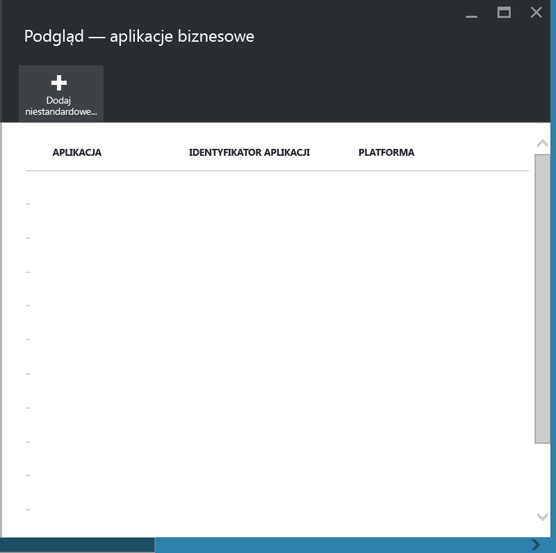
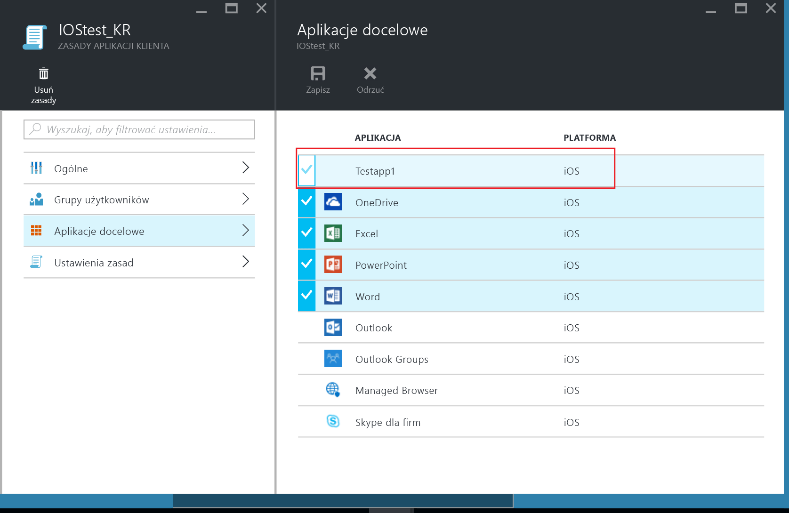

# Chronienie aplikacji biznesowych i danych na niezarejestrowanych urządzeniach w usłudze Microsoft Intune

Zasady zarządzania aplikacjami mobilnymi pomagają chronić dane firmy, ograniczając możliwość wykonywania akcji, które mogą spowodować przeciek tych danych, i narzucając wymagania w zakresie dostępu do danych (np. kod PIN). Aby zastosować zasady zarządzania aplikacjami mobilnymi do aplikacji biznesowych systemu iOS lub Android, należy najpierw opakować aplikację przy użyciu narzędzia opakowującego aplikacje dostępnego w usłudze Microsoft Intune.  Opakowywanie aplikacji jest procesem stosowania warstwy zarządzania do aplikacji mobilnej bez konieczności wprowadzania zmian w aplikacji.  Po opakowaniu aplikacji można stosować do niej zasady zarządzania aplikacjami mobilnymi i rozpowszechniać ją wśród użytkowników końcowych.  

W tym temacie objaśniono czynności wymagane do stosowania zasad zarządzania aplikacjami mobilnymi dla aplikacji używanych na **niezarządzanych urządzeniach należących do pracowników** i urządzeniach zarządzanych przez **rozwiązanie do zarządzania urządzeniami przenośnymi (MDM) oferowane przez inną firmę**.  Aby przygotować aplikacje biznesowe uruchamiane na **urządzeniach zarejestrowanych w ramach zarządzania urządzeniami przenośnymi w usłudze Intune**, zobacz [Wybieranie sposobu przygotowania aplikacji do zarządzania aplikacjami mobilnymi w usłudze Microsoft Intune](decide-how-to-prepare-apps-for-mobile-application-management-with-microsoft-intune.md).

##  Krok 1. Przygotowywanie aplikacji
Aby można było zastosować zasady zarządzania aplikacjami mobilnymi do aplikacji, należy najpierw opakować aplikację przy użyciu narzędzia opakowującego aplikacje dostępnego w usłudze Microsoft Intune.  Instrukcje dotyczące pobierania i używania narzędzia opakowującego aplikacje można znaleźć na następujących stronach:

- [Przygotowanie aplikacji systemu iOS do zarządzania aplikacjami mobilnymi za pomocą narzędzia opakowującego aplikacje w usłudze Intune](prepare-ios-apps-for-mobile-application-management-with-the-microsoft-intune-app-wrapping-tool.md) 
- [Przygotowanie aplikacji systemu Android do zarządzania aplikacjami mobilnymi za pomocą narzędzia opakowującego aplikacje w usłudze Intune](prepare-android-apps-for-mobile-application-management-with-the-microsoft-intune-app-wrapping-tool)

>[!IMPORTANT]  
>Ta wersja narzędzia opakowującego aplikacje, które obsługuje urządzenia niezarejestrowane w usłudze Intune, jest dostępna dla systemu iOS i w publicznej wersji zapoznawczej dla systemu Android. To narzędzie można pobrać z [tego repozytorium w usłudze Github](https://github.com/msintuneappsdk/intune-app-wrapping-tool-ios) dla systemu iOS oraz [tego repozytorium w usłudze Github](https://github.com/msintuneappsdk/intune-app-wrapper-android-preview) dla systemu Android.

## Krok 2. Dodawanie aplikacji

Aby skojarzyć aplikację biznesową z zasadami zarządzania aplikacjami mobilnymi, należy dodać szczegóły aplikacji do subskrypcji/dzierżawy usługi Intune, wykonując poniższe czynności:

1. W [portalu Azure](https://portal.azure.com/) przejdź do pozycji **Zarządzanie aplikacjami mobilnymi usługi Intune > Ustawienia** i wybierz pozycję **Aplikacje biznesowe**.

  

2. W bloku **Aplikacje biznesowe** wybierz pozycję **Dodaj aplikację niestandardową**.

  
3.  Określ nazwę aplikacji, identyfikator pakietu w polu identyfikatora aplikacji oraz platformę (iOS lub Android).

   Ten krok ułatwia utworzenie unikatowego wpisu dotyczącego aplikacji.  Aplikacja będzie również wyświetlana na liście aplikacji docelowych dla zasad zarządzania aplikacjami mobilnymi dla dzierżawy zgodnie z opisem w następnym kroku.

## Krok 3. Stosowanie zasad zarządzania aplikacjami mobilnymi
Po przekazaniu metadanych aplikacji do usługi aplikacja będzie wyświetlana na liście aplikacji.  Możesz teraz [utworzyć nowe zasady lub użyć istniejących zasad](create-and-deploy-mobile-app-management-policies-with-microsoft-intune.md) i zastosować je do aplikacji biznesowej dodanej w kroku 2.

>[!IMPORTANT]
>Należy wskazać zasady zarządzania aplikacjami mobilnymi dla użytkowników, którzy będą używać opakowanej aplikacji.  Użytkownicy, dla których ta zasada nie zostanie wdrożona, nie będą mogli korzystać z aplikacji.

  
## Krok 4. Rozpowszechnianie aplikacji
Aplikacje można wdrażać na urządzeniach użytkowników końcowych, stosując następujące metody:
* W przypadku urządzeń zarejestrowanych w rozwiązaniu MDM innej firmy można rozpowszechniać aplikacje za pośrednictwem tego rozwiązania MDM.
* W przypadku urządzeń, które nie są zarządzane przez rozwiązanie MDM, wymagane jest rozwiązanie niestandardowe. Użytkownicy końcowi muszą pobrać i zainstalować aplikację na swoich urządzeniach.

## Zmienianie metadanych
Aby zmienić szczegóły aplikacji, takie jak nazwa aplikacji lub identyfikator pakietu, należy [usunąć aplikację](#remove-apps) i [dodać ją](#step-2-add-the-app) z nowymi metadanymi.

##  Usuwanie aplikacji
Aplikację biznesową można usunąć z listy aplikacji.  Spowoduje to usunięcie aplikacji z listy i usunięcie skojarzenia z zasadami zarządzania aplikacjami mobilnymi, ale aplikacja nie zostanie usunięta ani odinstalowana z urządzenia użytkownika końcowego.  

1.  W [portalu Azure](https://portal.azure.com/) przejdź do pozycji **Zarządzanie aplikacjami mobilnymi usługi Intune > Ustawienia**.  W bloku **Ustawienia** wybierz pozycję **Biznesowe**, aby otworzyć listę istniejących aplikacji.  
2.  Wybierz aplikację, którą chcesz usunąć, i wybierz menu kontekstowe **(…)**.

  
3.  Wybierz pozycję **Usuń aplikację**, aby usunąć aplikację.

  

  Spowoduje to usunięcie aplikacji z listy aplikacji biznesowych i listy aplikacji docelowych w zasadach zarządzania aplikacjami mobilnymi.

<!--HONumber=Sep16_HO4-->

