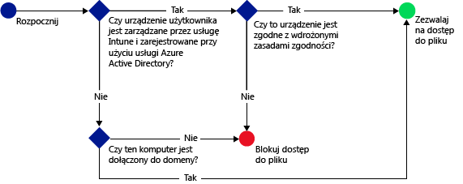

# Ograniczanie dostępu do usługi SharePoint Online przy użyciu usługi Microsoft Intune
Za pomocą dostępu warunkowego usługi [!INCLUDE[wit_firstref](../includes/wit_firstref_md.md)] możliwe jest kontrolowanie dostępu do plików znajdujących się w usłudze SharePoint Online.
Dostęp warunkowy ma dwa składniki:
- Zasady zgodności urządzenia, które urządzenie musi spełniać, aby można je było uważać za zgodne.
- Zasady dostępu warunkowego, w ramach których określane są warunki, które urządzenie musi spełniać w celu uzyskania dostępu do usługi.
Aby dowiedzieć się więcej o sposobie działania dostępu warunkowego, przeczytaj temat [Ograniczanie dostępu do poczty e-mail, usługi O365 i innych usług](restrict-access-to-email-and-o365-services-with-microsoft-intune.md).

Zasady zgodności i dostępu warunkowego są wdrażane dla użytkownika. Wszystkie urządzenia, których użytkownik używa do uzyskiwania dostępu do usług, są sprawdzane pod kątem zgodności z zasadami.

Gdy użytkownik próbuje połączyć się z plikiem za pomocą obsługiwanej aplikacji na swoim urządzeniu, takiej jak usługa OneDrive, sprawdzane są następujące kwestie:

**Przed** skonfigurowaniem zasad dostępu warunkowego dla usługi SharePoint Online konieczne jest:
- Posiadanie **subskrypcji usługi SharePoint Online**; ponadto użytkownicy muszą mieć licencję na usługę SharePoint Online.
- Posiadanie **subskrypcji pakietu Enterprise Mobility + Security lub usługi Azure Active Directory — wersja Premium** przy jednoczesnym posiadaniu przez użytkowników licencji na usługi EMS lub Azure AD. Aby uzyskać więcej szczegółowych informacji, zobacz [Cennik pakietu Enterprise Mobility](https://www.microsoft.com/en-us/cloud-platform/enterprise-mobility-pricing) lub [Cennik usługi Azure Active Directory](https://azure.microsoft.com/en-us/pricing/details/active-directory/).

  Aby nawiązać połączenie z wymaganymi plikami, urządzenie musi:
-   Zostać **zarejestrowane** w usłudze [!INCLUDE[wit_nextref](../includes/wit_nextref_md.md)] lub na komputerze przyłączonym do domeny.

-   Zostać **zarejestrowane** w usłudze Azure Active Directory (dzieje się to automatycznie podczas rejestrowania urządzenia w usłudze [!INCLUDE[wit_nextref](../includes/wit_nextref_md.md)]).

-   Być zgodne z wdrożonymi zasadami zgodności usługi [!INCLUDE[wit_nextref](../includes/wit_nextref_md.md)].

Stan urządzenia jest przechowywany w usłudze Azure Active Directory, która na podstawie wybranych warunków blokuje dostęp do plików lub go przydziela.

Jeśli warunek nie jest spełniony, użytkownik zobaczy podczas logowania jeden z następujących komunikatów:

-   Jeśli urządzenie nie zostało zarejestrowane w usłudze [!INCLUDE[wit_nextref](../includes/wit_nextref_md.md)] lub Azure Active Directory, zostanie wyświetlony komunikat z instrukcjami dotyczącymi sposobu instalowania aplikacji Portal firmy i rejestrowania.

-   Jeśli urządzenie nie jest zgodne, zostanie wyświetlony komunikat kierujący użytkownika do witryny internetowej Portal firmy usługi [!INCLUDE[wit_nextref](../includes/wit_nextref_md.md)], gdzie można znaleźć informacje o problemie i sposobie jego rozwiązania.

**Dostęp warunkowy jest wymuszany dla wszystkich witryn programu SharePoint, a udostępnianie zewnętrzne jest zablokowane**

>[!NOTE]
>Po włączeniu dostępu warunkowego dla usługi SharePoint Online zaleca się wyłączenie domeny na liście zgodnie z opisem w temacie [Remove-SPOTenantSyncClientRestriction](https://technet.microsoft.com/en-us/library/dn917451.aspx).  

## Obsługa urządzeń przenośnych
- System iOS 8.0 i nowsze
- System Android 4.0 lub nowszy, system Samsung Knox Standard 4.0 lub nowszy
- System Windows Phone 8.1 lub nowszy

Można ograniczyć dostęp do usługi SharePoint Online w przypadku uzyskiwania dostępu za pomocą przeglądarki na urządzeniach z systemem **iOS** i **Android**.  Dostęp może być dozwolony tylko za pomocą obsługiwanych przeglądarek na zgodnych urządzeniach:
* Safari (iOS)
* Chrome (Android)
* Managed Browser (iOS i Android)

**Nieobsługiwane przeglądarki będą blokowane**.

## Obsługa komputerów
- System Windows 8.1 lub nowszy (jeśli jest zarejestrowany w usłudze Intune)
- System Windows 7.0, Windows 8.1 lub Windows 10 (jeśli jest przyłączony do domeny)
> [!NOTE]
>Aby korzystać z dostępu warunkowego na komputerach z systemem Windows 10, trzeba na nich zainstalować Rocznicową aktualizację systemu Windows 10.

  - Komputery przyłączone do domeny muszą zostać skonfigurowane do [automatycznego rejestrowania](https://azure.microsoft.com/en-us/documentation/articles/active-directory-conditional-access-automatic-device-registration/) w usłudze Azure Active Directory.
Usługa AAD DRS zostanie automatycznie uaktywniona dla klientów usług Intune i Office 365. Klienci, którzy już wdrożyli usługę rejestrowania urządzeń usług AD FS, nie będą widzieć zarejestrowanych urządzeń w lokalnej usłudze Active Directory.

  - Jeśli zasady zostały ustawione tak, aby przyłączenie do domeny było wymagane, a komputer nie został przyłączony do domeny, zostanie wyświetlony komunikat o konieczności skontaktowania się z administratorem IT.

  - Jeśli zasady zostały ustawione tak, aby wymagane było przyłączenie do domeny lub zgodność, a komputer nie spełnia żadnego z tych wymagań, zostanie wyświetlony komunikat z instrukcjami dotyczącymi sposobu instalowania aplikacji Portal firmy i rejestrowania.
  >[!NOTE]
  >Dostęp warunkowy nie jest obsługiwany na komputerach z oprogramowaniem klienckim usługi Intune.

-    [Należy włączyć nowoczesne uwierzytelnianie usługi Office 365](https://support.office.com/en-US/article/Using-Office-365-modern-authentication-with-Office-clients-776c0036-66fd-41cb-8928-5495c0f9168a) i zainstalować wszystkie najnowsze aktualizacje pakietu Office.

    Nowoczesne uwierzytelniane umożliwia logowanie do klientów systemu Windows z pakietem Office 2013 oparte na bibliotece Active Directory Authentication Library (ADAL), a także udostępnia lepsze zabezpieczenia, takie jak **uwierzytelnianie wieloskładnikowe** i **uwierzytelnianie oparte na certyfikatach**.

## Konfigurowanie warunkowego dostępu do usługi SharePoint Online

### Krok 1. Konfigurowanie grup zabezpieczeń usługi Active Directory
Przed rozpoczęciem skonfiguruj grupy zabezpieczeń usługi Azure Active Directory dla zasad dostępu warunkowego. Możesz skonfigurować te grupy w **centrum administracyjnym usługi Office 365**lub w **portalu konta usługi Intune**. Grupy te zostaną użyte do objęcia użytkowników zasadami lub wykluczenia użytkowników z zasad. Jeśli zasady obejmują użytkownika, każde używane przez niego urządzenie musi być zgodne, aby mógł uzyskać dostęp do zasobów.

Możesz określić dwa typy grup dla zasad usługi SharePoint Online:

-   **Grupy docelowe** — grupy użytkowników, do których zasady będą stosowane.

-   **Wykluczone grupy** — grupy użytkowników, którzy są wykluczeni z zasad.

Jeśli użytkownik należy do obu grup, będzie wykluczony z zasad.

### Krok 2. Konfigurowanie i wdrażanie zasad zgodności
Jeśli nie zostało zrobione to wcześniej, utwórz i wdróż zasady zgodności dla użytkowników, którzy będą objęci zasadami dostępu usługi SharePoint Online.

> [!NOTE]
> Jeśli zasady zgodności są wdrażane w grupach usługi [!INCLUDE[wit_nextref](../includes/wit_nextref_md.md)], zasady dostępu warunkowego są stosowane dla grup zabezpieczeń usługi Azure Active Directory.

Aby uzyskać szczegółowe informacje o sposobie konfigurowania zasad zgodności, zobacz [Tworzenie zasad zgodności](create-a-device-compliance-policy-in-microsoft-intune.md).

> [!IMPORTANT]
> Jeśli zasady zgodności nie zostały wdrożone, urządzenia będą traktowane jako zgodne.

Gdy wszystko będzie gotowe, przejdź do **kroku 3**.

### Krok 3. Konfigurowanie zasad usługi SharePoint Online
Skonfiguruj zasady wymagające, aby tylko urządzenia zarządzane i zgodne miały dostęp do usługi SharePoint Online. Te zasady będą przechowywane w usłudze Azure Active Directory.

#### 

>[!NOTE]
> Zasady dostępu warunkowego można też utworzyć za pomocą konsoli zarządzania usługi Azure AD. Konsola zarządzania usługi Azure AD umożliwia tworzenie zasad dostępu warunkowego urządzeń w usłudze Intune (nazywanych w usłudze Azure AD **zasadami dostępu warunkowego opartymi na urządzeniach**) oraz innych zasad dostępu warunkowego, takich jak uwierzytelnianie wieloskładnikowe.  Można także ustawić zasady dostępu warunkowego dla aplikacji korporacyjnych innych firm, takich jak Salesforce i Box obsługiwanych przez usługę Azure AD. Aby uzyskać więcej informacji, zobacz [Jak ustawić oparte na urządzeniach zasady dostępu warunkowego usługi Azure Active Directory w celu kontrolowania dostępu do aplikacji połączonych z usługą Azure Active Directory](https://azure.microsoft.com/en-us/documentation/articles/active-directory-conditional-access-policy-connected-applications/).

1.  W [konsoli administracyjnej usługi Microsoft Intune](https://manage.microsoft.com) wybierz pozycję **Zasady** > **Dostęp warunkowy** > **Zasady usługi SharePoint Online**.

2.  Wybierz pozycję **Włącz zasady dostępu warunkowego dla usługi SharePoint Online**.

3.  W obszarze **Dostęp do aplikacji** możesz wybrać platformy, do których zostaną zastosowane zasady dostępu warunkowego:

    -   **Wszystkie platformy**

        W przypadku wybrania tego ustawienia wszystkie urządzenia próbujące uzyskać dostęp do usługi **SharePoint Online** będą musiały być zarejestrowane w usłudze Intune i zgodne z zasadami.  Każda aplikacja kliencka korzystająca z **nowoczesnego uwierzytelniania** będzie podlegała zasadom dostępu warunkowego. Jeśli dana platforma nie jest aktualnie obsługiwana w usłudze Intune, dostęp do usługi **SharePoint Online** zostanie zablokowany.

        Wybranie opcji **Wszystkie platformy** oznacza, że usługa Azure Active Directory będzie stosować te zasady do wszystkich żądań uwierzytelniania zgłoszonych przez aplikację klienta, niezależnie od platformy.  W przypadku wszystkich platform będzie wymagana rejestracja w usłudze Intune i zgodność, z następującymi wyjątkami:
        *   Urządzenia z systemem Windows będą musiały zostać zarejestrowane i być zgodne, przyłączone do domeny w lokalnej usłudze Active Directory, lub spełniać oba te wymogi
        * Nieobsługiwane platformy takie jak Mac.  Jednak aplikacje korzystające z nowoczesnego uwierzytelniania pochodzące z tych platform nadal będą zablokowane.

    -   **Określone platformy**

         Zasady dostępu warunkowego są stosowane do wszystkich aplikacji klienckich korzystających z nowoczesnego uwierzytelniania na określonych platformach.

     Komputery z systemem Windows muszą zostać przyłączone do domeny lub zarejestrowane w usłudze [!INCLUDE[wit_nextref](../includes/wit_nextref_md.md)] i być zgodne. Można ustawić następujące wymagania:

     -   **Urządzenia muszą zostać przyłączone do domeny lub być zgodne.** Wybierz tę opcję, jeśli komputery mają być przyłączone do domeny lub zgodne z zasadami ustawionymi w usłudze [!INCLUDE[wit_nextref](../includes/wit_nextref_md.md)]. Jeśli komputer nie spełnia żadnego z tych wymagań, użytkownik zobaczy monit o zarejestrowanie urządzenia w usłudze [!INCLUDE[wit_nextref](../includes/wit_nextref_md.md)].

     -   **Urządzenia muszą zostać przyłączone do domeny.** Wybierz tę opcję, jeśli komputery muszą być przyłączone do domeny, aby mogły uzyskiwać dostęp do usługi Exchange Online. Jeśli komputer nie został przyłączony do domeny, dostęp do poczty e-mail będzie zablokowany, a użytkownik zostanie poproszony o skontaktowanie się z administratorem IT.

     -   **Urządzenia muszą być zgodne.** Wybierz tę opcję, jeśli komputery muszą być zarejestrowane w usłudze [!INCLUDE[wit_nextref](../includes/wit_nextref_md.md)] i zgodne. Jeśli komputer nie został zarejestrowany, zostanie wyświetlony komunikat z instrukcjami dotyczącymi rejestrowania.

4.   W obszarze **dostęp za pomocą przeglądarki** do usługi SharePoint Online i OneDrive dla firm można zezwolić na dostęp do usługi Exchange Online tylko za pośrednictwem obsługiwanych przeglądarek: Safari (iOS) i Chrome (Android). Dostęp z innych przeglądarek będzie zablokowany.  Ograniczenia platformy wybrane dla dostępu aplikacji do usługi OneDrive mają zastosowanie również w tym miejscu.

  Na urządzeniach z systemem **Android** użytkownicy muszą włączyć dostęp za pomocą przeglądarki.  W tym celu użytkownik końcowy musi włączyć opcję „Włącz dostęp za pomocą przeglądarki” na zarejestrowanym urządzeniu w następujący sposób:
  1.    Uruchomić **aplikację Portal firmy**.
  2.    Przejść do strony **Ustawienia** za pomocą przycisku wielokropka (...) lub przycisku menu sprzętu.
  3.    Nacisnąć przycisk **Włącz dostęp za pomocą przeglądarki**.
  4.  W przeglądarce Chrome wylogować się z usługi Office 365 i ponownie uruchomić przeglądarkę Chrome.

  Na platformach **iOS i Android** w celu zidentyfikowania urządzenia używanego do uzyskania dostępu do usługi usługa Azure Active Directory wystawi certyfikat TLS (Transport Layer Security) dla urządzenia.  Urządzenie wyświetla użytkownikowi końcowemu certyfikat wraz z monitem o wybranie certyfikatu, tak jak pokazano na zrzutach ekranu poniżej. Użytkownik końcowy musi wybrać ten certyfikat, aby kontynuować korzystanie z przeglądarki.

  **iOS**

  

  **Android**

  
5.  W obszarze **Grupy docelowe** wybierz pozycję **Modyfikuj**, aby wybrać grupy zabezpieczeń usługi Azure Active Directory, do których zasady zostaną zastosowane. Możesz objąć zasadami wszystkich użytkowników lub wybrane grupy.

6.  W obszarze **Wykluczone grupy** możesz wybrać pozycję **Modyfikuj**, jeśli chcesz, aby zasady nie były stosowane dla wskazanych grup zabezpieczeń usługi Azure Active Directory.

6.  Gdy wszystko będzie gotowe, wybierz pozycję **Zapisz**.

Nie musisz wdrażać zasad dostępu warunkowego; są one aktywne natychmiast.

### Krok 4. Monitorowanie zgodności i zasad dostępu warunkowego
W obszarze roboczym **Grupy** można przeglądać informacje o stanie urządzeń.

Wybierz dowolną grupę urządzeń przenośnych, a następnie na karcie **Urządzenia** wybierz jeden z następujących **filtrów**:

-   **Urządzenia, które nie zostały zarejestrowane przy użyciu usługi AAD** — dostęp tych urządzeń do usługi SharePoint Online jest zablokowany.

-   **Urządzenia, które nie są zgodne** — dostęp tych urządzeń do usługi SharePoint Online jest zablokowany.

-   **Urządzenia, które zostały zarejestrowane przy użyciu usługi AAD i są zgodne** — te urządzenia mogą uzyskiwać dostęp do usługi SharePoint Online.

### Zobacz także
[Ograniczanie dostępu do poczty e-mail i usług O365 przy użyciu usługi Microsoft Intune](restrict-access-to-email-and-o365-services-with-microsoft-intune.md)

<!--HONumber=Oct16_HO1-->

