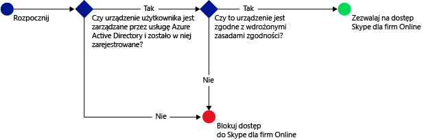
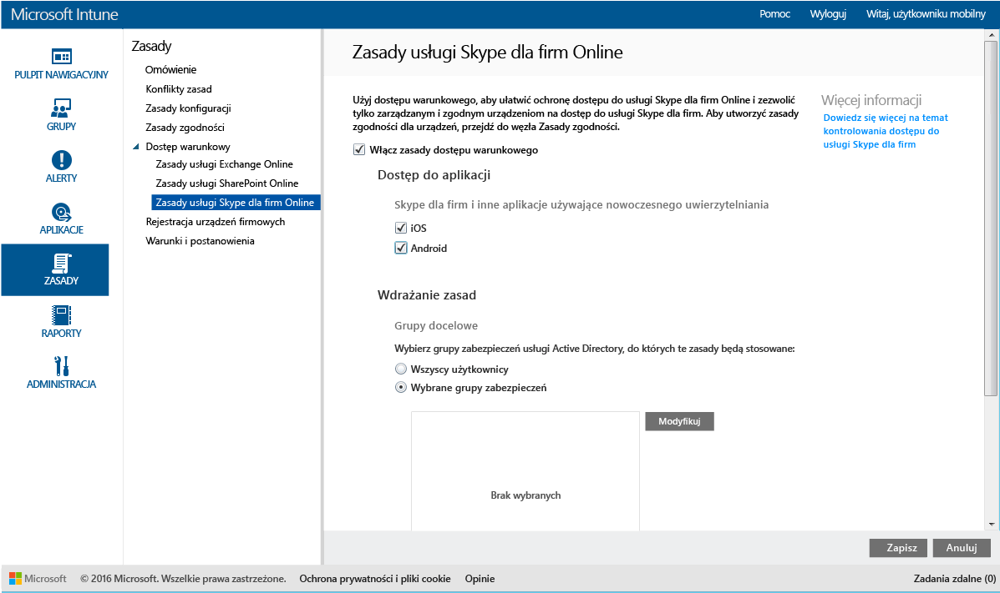

---
# required metadata

title: Ograniczanie dostępu do usługi Skype dla firm Online | Microsoft Intune
description:
keywords:
author: karthikaraman
manager: jeffgilb
ms.date: 04/28/2016
ms.topic: article
ms.prod:
ms.service: microsoft-intune
ms.technology:
ms.assetid: 1b2d7125-f63f-43cf-ac1e-94fbedf2a7e8

# optional metadata

#ROBOTS:
#audience:
#ms.devlang:
ms.reviewer: chrisgre
ms.suite: ems
#ms.tgt_pltfrm:
#ms.custom:

---

# Ograniczanie dostępu do usługi Skype dla firm Online przy użyciu usługi Microsoft Intune
Użyj zasad dostępu warunkowego dla usługi **Skype dla firm Online** w celu kontroli dostępu do usługi Skype dla firm Online.
Dostęp warunkowy ma dwa składniki:
- Zasady zgodności urządzenia, które urządzenie musi spełniać, aby można je było uważać za zgodne.
- Zasady dostępu warunkowego, w ramach których określane są warunki, które urządzenie musi spełniać w celu uzyskania dostępu do usługi.
Aby dowiedzieć się więcej o sposobie działania dostępu warunkowego, przeczytaj artykuł [Ograniczanie dostępu do poczty e-mail i usług O365](restrict-access-to-email-and-o365-services-with-microsoft-intune.md).

Jeśli wybrany użytkownik próbuje użyć usługi Skype dla firm Online na swoim urządzeniu, sprawdzane są następujące kwestie:

**Przed** skonfigurowaniem zasad dostępu warunkowego dla usługi Skype fla firm Online, konieczne jest:
- Posiadanie **subskrypcji usługi Skype dla firm Online** i przypisanie licencji usługi Skype dla firm Online użytkownikom.
- Posiadanie subskrypcji pakietu **Enterprise Mobility Suite** lub usługi **Azure Active Directory w wersji Premium**.
-   **Włączenie nowoczesnego uwierzytelniania** dla usługi Skype dla firm Online. Zaloguj się do witryny Microsoft Connect i wypełnij [ten formularz](https://connect.microsoft.com/office/Survey/NominationSurvey.aspx?SurveyID=17299&ProgramID=8715), aby zostać zarejestrowanym w programie nowoczesnego uwierzytelniania.
-  Wszyscy użytkownicy końcowi muszą używać usługi **Skype dla firm Online**. Jeśli wdrożenie obejmuje zarówno usługę Skype dla firm Online, jak i lokalną aplikację Skype dla firm, zasady dostępu warunkowego nie będą stosowane do użytkowników końcowych.

    Urządzenie, dla którego wymagany jest dostęp do usługi Skype dla firm Online, powinno:

-   Być urządzeniem z system **Android** lub **iOS**.

-   Być **zarejestrowane** w usłudze [!INCLUDE[wit_nextref](../includes/wit_nextref_md.md)].

-   Być **zgodne** ze wszystkimi wdrożonymi zasadami zgodności usługi [!INCLUDE[wit_nextref](../includes/wit_nextref_md.md)].

Stan urządzenia jest przechowywany w usłudze Azure Active Directory, która na podstawie wybranych warunków blokuje dostęp lub go przydziela.

Jeśli warunek nie jest spełniony, użytkownik zobaczy podczas logowania jeden z następujących komunikatów:

-   Jeśli urządzenie nie zostało zarejestrowane w usłudze [!INCLUDE[wit_nextref](../includes/wit_nextref_md.md)] lub Azure Active Directory, zostanie wyświetlony komunikat z instrukcjami dotyczącymi sposobu instalowania aplikacji Portal firmy i rejestrowania.

-   Jeśli urządzenie nie jest zgodne, zostanie wyświetlony komunikat kierujący użytkownika do witryny sieci Web Portal firmy usługi [!INCLUDE[wit_nextref](../includes/wit_nextref_md.md)] lub aplikacji Portal firmy, gdzie można znaleźć informacje o problemie i sposobie jego rozwiązania.

## Konfigurowanie dostępu warunkowego dla usługi Skype dla firm Online

### Krok 1. Konfigurowanie grup zabezpieczeń usługi Active Directory
Przed rozpoczęciem skonfiguruj grupy zabezpieczeń usługi Azure Active Directory dla zasad dostępu warunkowego. Możesz skonfigurować te grupy w **centrum administracyjnym usługi Office 365**. Grupy te zostaną użyte do objęcia użytkowników zasadami lub wykluczenia użytkowników z zasad. Jeśli zasady obejmują użytkownika, każde używane przez niego urządzenie musi być zgodne, aby mógł uzyskać dostęp do zasobów.

Można określić dwa typy grup dla zasad programu Skype dla firm:

-   **Grupy docelowe** — grupy użytkowników, do których zasady będą stosowane.

-   **Wykluczone grupy** — grupy użytkowników, którzy są wykluczeni z zasad.

Jeśli użytkownik należy do obu grup, będzie wykluczony z zasad.

### Krok 2. Konfigurowanie i wdrażanie zasad zgodności
[Utwórz](create-a-device-compliance-policy-in-microsoft-intune.md) i [wdróż](deploy-and-monitor-a-device-compliance-policy-in-microsoft-intune.md) zasady zgodności na wszystkich urządzeniach, które będą objęte zasadami. Będą to wszystkie urządzenia, które są używane przez użytkowników z **grup docelowych**.

> [!NOTE] Jeśli zasady zgodności są wdrażane w grupach usługi [!INCLUDE[wit_nextref](../includes/wit_nextref_md.md)], zasady dostępu warunkowego są stosowane dla grup zabezpieczeń usługi Azure Active Directory.

> [!IMPORTANT] Jeśli zasady zgodności nie zostały wdrożone, urządzenia będą traktowane jako zgodne.

Gdy wszystko będzie gotowe, przejdź do **kroku 3**.

### Krok 3. Konfigurowanie zasad usługi Skype dla firm Online
Skonfiguruj zasady wymagające, aby tylko urządzenia zarządzane i zgodne miały dostęp do usługi Skype dla firm Online. Te zasady będą przechowywane w usłudze Azure Active Directory.

####
1.  W [konsoli administracyjnej usługi Microsoft Intune](https://manage.microsoft.com) kliknij pozycję **Zasady** > **Dostęp warunkowy** > **Skype dla firm Online — zasady**.

2.  Wybierz pozycję **Włącz zasady dostępu warunkowego**.

3.  W obszarze **Dostęp do aplikacji** możesz wybrać platformy, do których zostaną zastosowane zasady dostępu warunkowego:

    -   **iOS**

    -   **Android**

4.  W obszarze **Grupy docelowe**kliknij pozycję **Modyfikuj** , aby wybrać grupy zabezpieczeń usługi Azure Active Directory, do których zasady zostaną zastosowane. Możesz objąć zasadami wszystkich użytkowników lub ich wybrane grupy.

5.  W obszarze **Wykluczone grupy**możesz kliknąć pozycję **Modyfikuj** , jeśli chcesz, aby zasady nie były stosowane dla wskazanych grup zabezpieczeń usługi Azure Active Directory.

6.  Gdy wszystko będzie gotowe, kliknij pozycję **Zapisz**.

Dostęp warunkowy dla usługi Skype dla firm Online został skonfigurowany. Nie musisz wdrażać zasad dostępu warunkowego; są one aktywne natychmiast.

## Monitorowanie zgodności i zasad dostępu warunkowego
W obszarze roboczym **Grupy** można przeglądać informacje o stanie warunkowego dostępu do urządzeń.

Wybierz dowolną grupę urządzeń przenośnych, a następnie na karcie **Urządzenia** wybierz jeden z następujących **filtrów**:

* **Urządzenia, które nie zostały zarejestrowane przy użyciu usługi AAD** — dostęp tych urządzeń do usługi Skype dla firm Online jest zablokowany.

* **Urządzenia, które nie są zgodne** — dostęp tych urządzeń do usługi Skype dla firm Online jest zablokowany.

* **Urządzenia, które zostały zarejestrowane przy użyciu usługi AAD i są zgodne** — te urządzenia mogą uzyskiwać dostęp do usługi Skype dla firm Online.

<!--HONumber=Jun16_HO2-->

