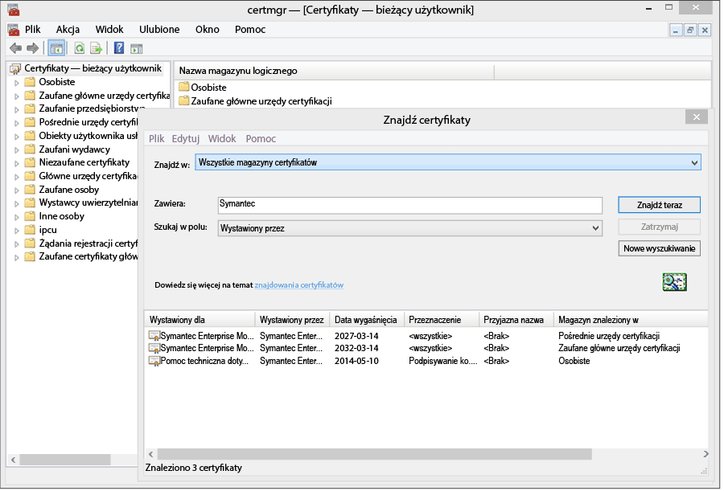
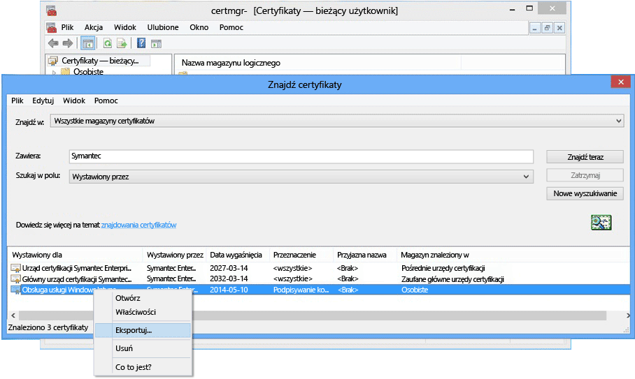

# Konfigurowanie zarządzania urządzeniami dla systemu Windows Phone 8.0

System Windows Phone 8.0 wymaga certyfikatu firmy Symantec do zainstalowania aplikacji Portal firmy usługi Intune i umożliwienia zarządzania urządzeniami. Certyfikat jest również wymagany do podpisywania aplikacji biznesowych. Poniższy temat dotyczy tylko systemu Windows Phone 8.0. Aby zarządzać systemem Windows Phone 8.1 lub nowszym, w tym Windows 10 Mobile, zobacz [Set up Windows Phone enrollment](set-up-windows-phone-management-with-microsoft-intune.md) (Konfigurowanie rejestracji w systemie Windows Phone).

> [!IMPORTANT]
> Od września 2016 r. aplikacja Portal firmy dla systemu Windows 8.0 i Windows Phone 8.0 nie będzie dostępna do pobrania.

-   **Windows Phone 8** — wymagany certyfikat
-   Systemy **Windows Phone 8.1 i Windows 10 Mobile** wymagają certyfikatu tylko, jeśli:

    -   Aplikacja Portal firmy będzie wdrażana za pomocą usługi Intune.

    -   Będą wdrażane aplikacje biznesowe (zwane również „ładowanymi bezpośrednio”).


  > [!IMPORTANT]
  > Certyfikat firmy Symantec służący do zarządzania określonymi urządzeniami przenośnymi z systemem Windows i Windows Phone [należy okresowo odnawiać](renew-a-symantec-code-signing-certificate.md).

Wymagania dotyczące konfiguracji zarządzania urządzeniami przenośnymi z systemem Windows Phone zależą od sposobu zarządzania urządzeniami.  Aby ułatwić użytkownikom rejestrację, można ustawić dwa rekordy CNAME dla funkcji rejestrowania w systemie DNS. Jeśli użytkownicy będą pobierać aplikację Portal firmy ze Sklepu, po skonfigurowaniu ustawień systemu DNS wystarczy skonfigurować tę aplikację i poinformować użytkowników o sposobie rejestrowania.  W przypadku wdrażania aplikacji Portal firmy w systemie Windows Phone 8.0 lub Windows Phone 8.1 do podpisania kodu aplikacji wymagany będzie certyfikat firmy Symantec.

## Konfigurowanie wymagań dotyczących konfiguracji, aby włączyć zarządzanie w systemie Windows Phone
1.  **Skonfiguruj usługę Intune** Jeśli usługa ta nie została jeszcze skonfigurowana, przygotuj się do zarządzania urządzeniami przenośnymi, [ustawiając jako urząd zarządzania urządzeniami przenośnymi](prerequisites-for-enrollment.md#set-mobile-device-management-authority) usługę **Microsoft Intune** i konfigurując zarządzanie urządzeniami przenośnymi.

2.  **Ustaw alias systemu DNS dla adresu serwera rejestracji** (opcjonalnie)

    Alias systemu DNS (typ rekordu CNAME) ułatwia użytkownikom rejestrowanie urządzeń dzięki automatycznemu wprowadzaniu nazwy serwera podczas rejestracji.

    1.  W [konsoli administracyjnej usługi Intune](http://manage.microsoft.com) kliknij pozycję **Administracja** &gt; **Zarządzanie urządzeniami przenośnymi** &gt; **Windows Phone**.

    2.  W polu **Podaj nazwę zweryfikowanej domeny** wpisz adres URL zweryfikowanej domeny witryny sieci Web firmy, a następnie kliknij przycisk **Przetestuj automatyczne wykrywanie**.

    3.  Utworzyć rekordy zasobów **CNAME** systemu DNS dla domeny Twojej firmy. Rekordy zasobów CNAME muszą zawierać następujące informacje:

        |Nazwa hosta|Przekierowanie na|TTL|
        |-------------|-------------|-------|
        |enterpriseenrollment.domena_firmowa.com|enterpriseenrollment-s.manage.microsoft.com |1 godzina|
        |enterpriseregistration.domena_firmowa.com|enterpriseregistration.windows.net|1 godzina|
        Jeśli na przykład witryna internetowa firmy to contoso.com, w systemie DNS należy utworzyć rekord CNAME, który przekierowuje domenę EnterpriseEnrollment.contoso.com do domeny manage.microsoft.com. Jeśli zweryfikowano więcej niż jedną domenę, należy utworzyć rekord CNAME dla każdej z nich.

        -   `enterpriseenrollment-s.manage.microsoft.com` — obsługuje przekierowanie do usługi Intune z rozpoznawaniem domeny na podstawie nazwy domeny adresu e-mail.

        -   `enterpriseregistration.windows.net` — obsługuje dołączanie urządzeń przenośnych w miejscu pracy, a także dostęp warunkowy w systemie Windows 8.1.

    

3.  **Zarządzanie certyfikatami do obsługi podpisywania aplikacji** [wymagane w przypadku systemów Windows Phone 8.0 i systemów Windows Phone 8.1, które nie będą mieć dostępu do Sklepu Windows Phone i/lub aplikacji biznesowych].

    W celu zapewnienia obsługi aplikacji Portal firmy w systemie Windows Phone 8.0 i możliwości wdrażania aplikacji firmowych w systemie Windows Phone 8.1 należy uzyskać **certyfikat podpisywania kodu firmy Symantec dla firmowych urządzeń przenośnych**. Nie można użyć certyfikatu wydanego przez własny urząd certyfikacji, ponieważ tylko certyfikat firmy Symantec jest zaufany dla urządzeń z systemem Windows Phone. Ten certyfikat jest wymagany do:

    -   podpisywania aplikacji Portal firmy na potrzeby wdrożenia jej w systemie [!INCLUDE[winphone8_client_1](../includes/winphone8_client_1_md.md)] w celu zarejestrowania i zarządzania telefonami,

    -   podpisywania aplikacji biznesowych firmy w celu umożliwienia usłudze [!INCLUDE[wit_nextref](../includes/wit_nextref_md.md)] wdrożenia ich na telefonach z systemem Windows Phone.

    Poniższe instrukcje ułatwią uzyskanie wymaganych certyfikatów i podpisanie aplikacji Portalu firmy. Musisz mieć konto Centrum deweloperów systemu Windows Phone oraz kupić certyfikat firmy Symantec.

    1.  **Dołącz do Centrum deweloperów systemu Windows Phone** Dołącz do [Centrum deweloperów systemu Windows Phone](http://go.microsoft.com/fwlink/?LinkId=268442), podając dane konta firmowego podczas logowania się w celu zakupienia konta firmy. Ta prośba musi zostać autoryzowana przez specjalistę firmy, zanim otrzymasz certyfikat podpisywania kodu.

    2.  **Uzyskaj firmowy certyfikat firmy Symantec** Posługując się swoim identyfikatorem firmy Symantec, kup certyfikat w [witrynie firmy Symantec w sieci Web](http://go.microsoft.com/fwlink/?LinkId=268441). Po zakupie certyfikatu osoba zatwierdzająca w firmie wyznaczona w danych konta Centrum deweloperów systemu Windows Phone otrzyma wiadomość e-mail z prośbą o zatwierdzenie żądania certyfikatu. Więcej informacji o wymaganiu certyfikatu firmy Symantec znajduje się w sekcji [Dlaczego w systemie Windows Phone jest wymagany certyfikat firmy Symantec?](https://technet.microsoft.com/en-us/library/dn764959.aspx#BKMK_Symantec) często zadawanych pytań dotyczących rejestrowania urządzeń z systemem Windows.

    3.  **Zaimportuj certyfikaty** Po zatwierdzeniu żądania otrzymasz wiadomość e-mail z instrukcjami dotyczącymi importowania certyfikatów. Postępuj zgodnie z instrukcjami w wiadomości e-mail, aby zaimportować certyfikaty.

    4.  **Zweryfikuj zaimportowane certyfikaty** Aby zweryfikować, że certyfikaty zostały prawidłowo zaimportowane, przejdź do przystawki **Certyfikaty**, kliknij prawym przyciskiem myszy pozycję **Certyfikaty**, a następnie wybierz polecenie **Znajdź certyfikaty**. W polu **Zawiera** wprowadź „Symantec” i kliknij przycisk **Znajdź teraz**. Zaimportowane certyfikaty powinny być wyświetlane w wynikach.

        

    5.  **Wyeksportuj certyfikat podpisywania** Po zweryfikowaniu, że certyfikaty znajdują się na liście, możesz wyeksportować plik PFX w celu podpisania portalu firmy. Wybierz certyfikat firmy Symantec, dla którego w kolumnie **Zamierzony cel** znajduje się wartość „podpisywanie kodu”. Kliknij certyfikat podpisywania kodu prawym przyciskiem myszy i wybierz polecenie **Eksportuj**.

        

        W **Kreatorze eksportu certyfikatów**wybierz opcję **Tak, eksportuj klucz prywatny** , a następnie kliknij przycisk **Dalej**. Wybierz pozycję **Wymiana informacji osobistych — PKCS #12 (PFX)** i zaznacz opcję **Jeśli jest to możliwe, dołącz wszystkie certyfikaty do ścieżki certyfikacji**. Ukończ pracę kreatora. Więcej informacji znajduje się w temacie [Eksportowanie certyfikatu z kluczem prywatnym](http://go.microsoft.com/fwlink/?LinkID=203031).

    6.  **Pobieranie i podpisywanie aplikacji Portal firmy**

        Obsługa rejestracji urządzeń z systemem Windows Phone wymaga podpisania aplikacji Portal firmy w systemie Windows Phone 8.0 i przekazania jej do usługi Intune.

        1.  **Pobierz aplikację Portal firmy** Pobierz aplikację [Portal firmy w usłudze Intune dla systemu Windows Phone](http://go.microsoft.com/fwlink/?LinkId=268440) z Centrum pobierania. Domyślna lokalizacja instalacji to `C:\Program Files (x86)\Microsoft Corporation\Windows Intune Company Portal for Windows Phone`.

        2.  **Pobierz zestaw Windows Phone 8.0 SDK** Pobierz [zestaw Windows Phone SDK](http://go.microsoft.com/fwlink/?LinkId=615570).

        3.  **Podpisz kod aplikacji Portal firmy** Użyj aplikacji XAPSignTool pobranej z zestawem SDK, aby podpisać portal firmy przy użyciu pliku PFX utworzonego na podstawie certyfikatu firmy Symantec. Więcej informacji znajduje się w temacie [Jak podpisać aplikację firmową za pomocą aplikacji XapSignTool](http://go.microsoft.com/fwlink/?LinkID=280195).

    7.  **Przekaż aplikację Portal firmy do usługi Intune** Aby udostępnić aplikację użytkownikom końcowym, przekaż podpisany plik aplikacji Portal firmy oraz certyfikat podpisywania kodu.

        1.  W [konsoli administracyjnej usługi Intune](http://manage.microsoft.com) kliknij pozycję **Administracja** &gt; **Windows Phone**.

        2.  Kliknij pozycję **Przekaż podpisany plik aplikacji** i zaloguj się przy użyciu swojego identyfikatora administratora usługi Intune.

        3.  Na stronie **Instalator oprogramowania** w obszarze **Określ lokalizację plików instalacyjnych oprogramowania** przejdź do lokalizacji aplikacji Portal firmy z podpisanym kodem (z rozszerzeniem XAP dla systemu Windows Phone 8.0 lub APPX dla systemu Windows Phone 8.1).

            Jeśli dokonujesz oceny usługi Intune i przekazujesz plik aplikacji z podpisanym kodem w ramach próbnego konta usługi Intune, usuń zaznaczenie pola wyboru **Użyj pliku aplikacji Portal firmy podpisanego przykładowym certyfikatem podpisywania kodu firmy Symantec**.

        4.  Dodaj wyeksportowany plik certyfikatu (PFX) w polu **Certyfikat podpisywania kodu** i utwórz hasło dla certyfikatu.

        5.  Uzupełnij pola na stronie **Opis oprogramowania** . Pamiętaj o tym, że użytkownicy będą widzieć te informacje na swoich urządzeniach podczas wyświetlania szczegółowych informacji o aplikacji w portalu firmy.

        6.  Ukończ pracę kreatora. Użytkownicy korzystający z systemu Windows Phone 8.0 uzyskają aplikację Portal firmy podczas rejestrowania swoich urządzeń. Użytkownicy korzystający z systemu Windows Phone 8.1 mogą zainstalować wersję aplikacji Portal firmy pobraną ze Sklepu.  Jeśli urządzenia z systemem Windows Phone 8.1 mają zablokowany dostęp do Sklepu Windows Phone lub jeśli chcesz wdrożyć aplikację Portal firmy za pomocą usługi Intune, musisz pobrać i podpisać aplikację Portal firmy dla systemu Windows Phone 8.1 (SSP.appx).

4.  **Poinformuj użytkowników, jak uzyskać dostęp do zasobów firmy przy użyciu portalu firmy** Użytkownicy muszą dowiedzieć się, jak zarejestrować swoje urządzenia i czego oczekiwać po rozpoczęciu zarządzania nimi. [Co mówić użytkownikom końcowym na temat korzystania z usługi Microsoft Intune](what-to-tell-your-end-users-about-using-microsoft-intune.md)

## Wdrażanie aplikacji Portal firmy w systemie Windows Phone 8.1
Aplikację Portal firmy można wdrożyć na urządzeniach z systemem Windows Phone 8.1 przy użyciu usługi Intune (zamiast instalować ją z poziomu Sklepu Windows Phone). Mimo to należy włączyć rejestrowanie urządzeń z systemem Windows Phone, wykonując powyższe kroki z użyciem certyfikatu firmy Symantec. Następnie należy pobrać aplikację Portal firmy dla systemu Windows Phone 8.1 i podpisać ją przy użyciu certyfikatu firmy Symantec.  Jest to konieczne tylko wtedy, gdy użytkownicy nie będą korzystać ze sklepu firmowego, a aplikacja Portal firmy ma zostać wdrożona na urządzeniach z systemem Windows Phone 8.1.


1.  **Pobierz aplikację Portal firmy**

    Pobierz [aplikację Portal firmy w usłudze Microsoft Intune dla systemu Windows Phone 8.1](http://go.microsoft.com/fwlink/?LinkId=615799) z Centrum pobierania i uruchom plik samowyodrębniający (EXE). Ten plik zawiera dwa pliki:

    -   CompanyPortal.appx — aplikacja instalacyjna Portal firmy dla systemu Windows Phone 8.1

    -   WinPhoneCompanyPortal.ps1 — skrypt programu PowerShell służący do podpisywania pliku aplikacji Portal firmy na potrzeby wdrożenia go na urządzeniach z systemem Windows Phone 8.1

2.  **Pobierz zestaw Windows Phone SDK** Pobierz [zestaw Windows Phone SDK 8.0](http://go.microsoft.com/fwlink/?LinkId=615570) (http://go.microsoft.com/fwlink/?LinkId=268439) i zainstaluj go na komputerze. Zestaw SDK jest potrzebny do generowania tokenu rejestracji aplikacji.

3.  **Wygeneruj plik AETX** Wygeneruj plik tokenu rejestracji aplikacji (AETX) z pliku PFX firmy Symantec za pomocą narzędzia AETGenerator.exe wchodzącego w skład zestawu Windows Phone SDK 8.0. Aby uzyskać instrukcje dotyczące sposobu tworzenia pliku AETX, zobacz [Jak wygenerować token rejestracji aplikacji dla systemu Windows Phone](https://msdn.microsoft.com/library/windows/apps/jj735576.aspx)

4.  **Pobierz zestaw Windows SDK dla systemu Windows 8.1** Pobierz i zainstaluj zestaw [Windows Phone SDK](http://go.microsoft.com/fwlink/?LinkId=613525) (http://go.microsoft.com/fwlink/?LinkId=613525). Zwróć uwagę, że skrypt programu PowerShell dołączony do aplikacji Portal firmy używa domyślnej lokalizacji instalacji: `${env:ProgramFiles(x86)}\Windows Kits\8.1`. W przypadku instalacji w innym miejscu należy dołączyć lokalizację w parametrze polecenia cmdlet.

5.  **Podpisz kod aplikacji przy użyciu programu PowerShell** Jako administrator otwórz program **Windows PowerShell** na komputerze hosta z zainstalowanym pakietem Windows SDK i certyfikatem podpisywania kodu przedsiębiorstwa firmy Symantec, przejdź do pliku Sign-WinPhoneCompanyPortal.ps1, a następnie uruchom skrypt.

    **Przykład 1**

    ```
    .\Sign-WinPhoneCompanyPortal.ps1 -InputAppx 'C:\temp\CompanyPortal.appx' -OutputAppx 'C:\temp\CompanyPortalEnterpriseSigned.appx' -PfxFilePath 'C:\signing\cert.pfx' -PfxPassword '1234' -AetxPath 'C:\signing\cert.aetx'
    ```
    W tym przykładzie skrypt podpisuje plik CompanyPortal.appx w lokalizacji C:\temp\ i tworzy plik CompanyPortalEnterpriseSigned.appx. Używa hasła 1234 do pliku PFX i odczytuje identyfikator wydawcy z pliku PFX. Odczytuje również identyfikator przedsiębiorstwa z pliku cert.aetx.

    **Przykład 2**

    ```
    .\Sign-WinPhoneCompanyPortal.ps1 -InputAppx 'C:\temp\CompanyPortal.appx' -OutputAppx 'C:\temp\CompanyPortalEnterpriseSigned.appx' -PfxFilePath 'C:\signing\cert.pfx' -PfxPassword '1234' -PublisherId 'OID.0.9.2342.19200300.100.1.1=1000000001, CN="Test, Inc.", OU=Test 1' -EnterpriseId 1000000001
    ```
    W tym przykładzie skrypt podpisuje plik CompanyPortal.appx w lokalizacji C:\temp\ i tworzy plik CompanyPortalEnterpriseSigned.appx. Używa hasła 1234 do pliku PFX i określonego identyfikatora wydawcy.

    **Parametry:**

    -   `-InputAppx` — ścieżka lokalna do pliku CompanyPortal.appx ujęta w apostrofy. Na przykład 'C:\temp\CompanyPortal.appx'

    -   `-OutputAppx` — ścieżka lokalna i nazwa pliku podpisanej aplikacji Portal firmy ujęta w apostrofy. Na przykład 'C:\temp\CompanyPortalEnterpriseSigned.appx'

    -   `-PfxFilePath` — ścieżka lokalna i nazwa pliku dla wyeksportowanego pliku PFX certyfikatu firmy Symantec. Na przykład 'C:\signing\cert.pfx'

    -   `-PfxPassword` — hasło używane do podpisywania pliku PFX ujęte w apostrofy. Na przykład '1234'

    -   `-AetxPath` — ścieżka lokalna do pliku AETX, który służy do odczytywania identyfikatora przedsiębiorstwa, jeśli argument EnterpriseId nie został zdefiniowany. Należy podać ten argument albo argument EnterpriseId. Na przykład 'C:\signing\cert.aetx'

    -   `-PublisherId` — identyfikator wydawcy przedsiębiorstwa. Jeśli go nie ma, używane jest pole Podmiot certyfikatu podpisywania kodu firmy Symantec dla firmowych urządzeń przenośnych. Na przykład 'OID.0.9.2342.19200300.100.1.1=1000000001, CN="Test, Inc.", OU=Tst 1'

    -   `-SdkPath` — ścieżka do głównego folderu zestawu Windows SDK dla systemu Windows 8.1. Ten argument jest opcjonalny i domyślnie ustawiany na wartość ${env:ProgramFiles(x86)}\Windows Kits\8.1.

    -   `-EnterpriseId` — identyfikator przedsiębiorstwa. Należy podać ten argument lub argument AetxPath. Jeśli ten argument nie zostanie podany, identyfikator przedsiębiorstwa zostanie odczytany z pliku AETX. Na przykład 1000000001

6.  Wdróż aplikację Portal firmy dla systemu Windows Phone 8.1 (SSP.appx).

    > [!IMPORTANT]
    > Aplikacje ssp.xap i Portal firmy ze Sklepu mogą być zainstalowane jednocześnie, co może być mylące. Aby wymusić na użytkownikach używanie pliku ssp.xap, utwórz zablokowaną aplikację dla wersji aplikacji Portal firmy ze Sklepu. Dostępne są trzy możliwości wymuszenia używania wersji aplikacji Portal firmy ze Sklepu przez wszystkie urządzenia z systemem Windows Phone 8.1:
    >
    > -   Jeśli nie będziesz ładować bezpośrednio aplikacji i nie musisz zapewniać obsługi systemu Windows Phone 8.0, nie przekazuj podpisanego pliku ssp.xap.
    > -   Jeśli aplikacje ładowane bezpośrednio są potrzebne i nie będą rejestrowane urządzenia z systemem Windows Phone 8, zmień opcję automatycznie utworzonego wdrożenia pliku ssp.xap z „dostępne” na „odinstaluj”.
    > -   Jeśli aplikacje ładowane bezpośrednio muszą być zainstalowane, a urządzenia z systemem Windows Phone 8.0 muszą być rejestrowane i korzystać z pliku ssp.xap, utwórz nowe wdrożenie oprogramowania dla pliku ssp.xap i zastosuj je z akcją **odinstaluj** . Urządzenia z systemem Windows Phone 8.0 nie obsługują wymuszonej instalacji lub odinstalowania aplikacji, więc wdrożenie zostanie przez nie zignorowane. Urządzenia z systemem Windows Phone 8.1 obsługują akcję odinstalowania i usuną plik ssp.xap.


<!--HONumber=Sep16_HO4-->


