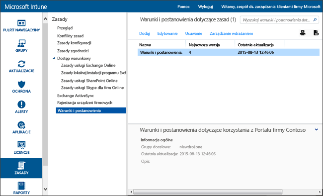

# Ustawienia zasad dotyczących warunków i postanowień w usłudze Microsoft Intune
Wdrożenie warunków i postanowień usługi Intune w grupach użytkowników pozwala wyjaśnić wpływ rejestracji, dostępu do zasobów roboczych i korzystania z aplikacji Portal firmy na urządzenia i użytkowników. Aby móc rejestrować się i uzyskiwać dostęp do zasobów służbowych w Portalu firmy, użytkownicy muszą zaakceptować warunki i postanowienia.

Możesz utworzyć i wdrożyć wiele zasad obejmujących różne warunki i postanowienia. Możesz również utworzyć różne wersje tych samych warunków i postanowień w różnych językach, a następnie wdrożyć je w odpowiednich grupach.

## Tworzenie zasad dotyczących warunków i postanowień

1.  W [konsoli administracyjnej usługi Microsoft Intune](http://manage.microsoft.com) kliknij pozycje **Zasady** &gt; **Warunki i postanowienia**.

    

2.  Kliknij pozycję **Dodaj**, aby utworzyć nowe zasady dotyczące warunków i postanowień.

    Możesz również **edytować** i **usuwać** istniejące zasady.

3.  Na stronie **Tworzenie warunków i postanowień** podaj następujące informacje:

    -   **Nazwa** &mdash; unikatowa nazwa zasad wyświetlana w konsoli usługi Intune.

    -   **Opis** &mdash; szczegółowe informacje ułatwiające znalezienie zasad w konsoli usługi Intune.

    -   **Tytuł** &mdash; tytuł widoczny dla użytkowników w Portalu firmy.

    -   **Tekst objaśniający znaczenie decyzji użytkownika o akceptacji** &mdash; etykieta dotycząca akceptacji widoczna dla użytkowników. Przykład: „Akceptuję warunki i postanowienia”.

4.  Po zakończeniu kliknij pozycję **Zapisz**. Nowe zasady zostaną wyświetlone w węźle **Warunki i postanowienia** w obszarze roboczym **Zasady**.

## Wdrażanie zasad dotyczących warunków i postanowień

1.  W [konsoli administracyjnej usługi Microsoft Intune](http://manage.microsoft.com) kliknij pozycje **Zasady** &gt; **Warunki i postanowienia**.

2.  Z listy **Zasady dotyczące warunków i postanowień** wybierz zasady, które chcesz wdrożyć, a następnie kliknij pozycję **Zarządzaj wdrożeniem**.

3.  W oknie dialogowym **Zarządzanie wdrażaniem** wybierz grupy użytkowników, dla których chcesz wdrożyć zasady, a następnie kliknij przycisk **OK**.

    Gdy użytkownik spróbuje uzyskać dostęp do Portalu firmy, w usłudze Intune zostaną wyświetlone wdrożone warunki i postanowienia. Użytkownik musi je zaakceptować, aby uzyskać dostęp do zasobów firmy.

## Monitorowanie zasad dotyczących warunków i postanowień

1.  W [konsoli administracyjnej usługi Microsoft Intune](http://manage.microsoft.com) kliknij pozycje **Zasady** &gt; **Warunki i postanowienia**.

2.  W oknie **Tworzenie nowego raportu** kliknij pozycję **Wyświetl raport**. Zostanie otwarty raport ze szczegółowymi informacjami o tym, którzy użytkownicy zaakceptowali wdrożone warunki i postanowienia.

### Warunki i postanowienia — aktualizacje i kontrola wersji
Podczas edytowania istniejących zasad dotyczących warunków i postanowień można wybrać zachowanie towarzyszące wdrożeniu zasad. Poniższa procedura pomaga zaktualizować istniejące zasady dotyczące warunków i postanowień.

## Praca z wieloma wersjami warunków i postanowień

1.  W [konsoli administracyjnej usługi Microsoft Intune](http://manage.microsoft.com) kliknij pozycje **Zasady** &gt; **Warunki i postanowienia**.

2.  Wybierz zasady dotyczące warunków i postanowień, które chcesz edytować, a następnie kliknij pozycję **Edytuj**.

3.  Na stronie **Edytowanie warunków i postanowień** wprowadź wymagane zmiany, a następnie określ, czy nowa wersja wymaga zaakceptowania warunków i postanowień przez wszystkich użytkowników, czy też będzie ona widoczna tylko dla nowych użytkowników.

    Zalecamy zwiększenie numeru wersji i wymaganie akceptacji po każdym wprowadzeniu znaczących zmian zasad dotyczących warunków i postanowień. Jeśli zmiany obejmują na przykład poprawki błędów pisowni lub zmiany formatowania, zachowaj bieżący numer wersji.

### Zobacz także
[Zarządzanie ustawieniami i funkcjami na urządzeniach przy użyciu zasad usługi Microsoft Intune](manage-settings-and-features-on-your-devices-with-microsoft-intune-policies.md)

<!--HONumber=Oct16_HO3-->

