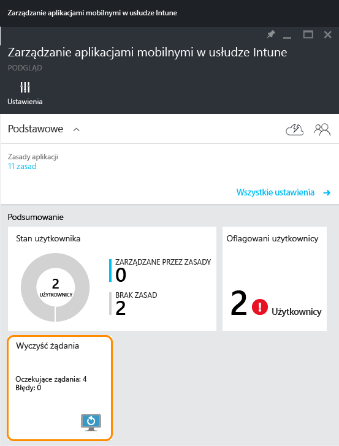
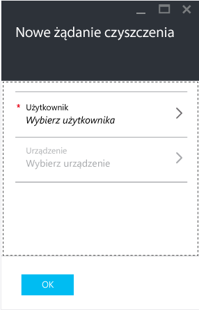
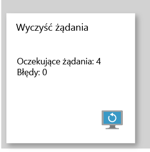

# Czyszczenie danych zarządzanych aplikacji firmowych za pomocą usługi Microsoft Intune
W przypadku utraty lub kradzieży urządzenia lub jeśli pracownik odchodzi z firmy dane aplikacji firmowych powinny zostać usunięte z urządzenia. Jednak możesz nie chcieć usuwać osobistych danych znajdujących się na urządzeniu, zwłaszcza jeśli jest to urządzenie należące do pracownika.

Aby wybiórczo usunąć dane aplikacji firmowych, utwórz żądanie czyszczenia, korzystając z procedury opisanej w sekcji **Tworzenie żądania czyszczenia** w tym temacie.  Po wysłaniu żądania czyszczenia dane firmowe zostaną usunięte z aplikacji przy następnym uruchomieniu aplikacji na urządzeniu.
>[!NOTE]
> Kontakty synchronizowane bezpośrednio z aplikacji do natywnej książki adresowej są usuwane. Nie można wyczyścić wszystkich kontaktów zsynchronizowanych z natywnej książki adresowej do innego źródła zewnętrznego. Obecnie ta opcja ma zastosowanie tylko do aplikacji Microsoft Outlook.

## Tworzenie żądania czyszczenia

1.  W bloku **Zarządzanie aplikacjami mobilnymi w usłudze Intune** wybierz kafelek **Żądania czyszczenia** .

    

2.  Wybierz pozycję **Nowe żądania czyszczenia**.

    

3.  W bloku **Nowe żądanie czyszczenia** wybierz pozycję **Użytkownik**, aby otworzyć blok **Użytkownik** i wybrać użytkownika, którego dane aplikacji chcesz wyczyścić.

4.  Wybierz pozycję **Urządzenie**.  Spowoduje to otwarcie bloku **Urządzenie** , który zawiera listę wszystkich urządzeń skojarzonych z wybranym użytkownikiem.  Wybierz urządzenie, którego dane chcesz wyczyścić.

5.  Jesteś teraz z powrotem w bloku **Nowe żądanie czyszczenia**. Wybierz pozycję **OK**, aby wykonać żądanie czyszczenia. Usługa tworzy i śledzi każde żądanie czyszczenia dla każdej chronionej aplikacji na urządzeniu.

## Monitorowanie żądań czyszczenia
Blok **Zarządzanie aplikacjami mobilnymi w usłudze Intune** zawiera raport z podsumowaniem na kafelku **Żądanie czyszczenia** .  Są w nim wyświetlane ogólny stan oraz liczba oczekujących żądań i błędów. Więcej informacji można uzyskać przez wykonanie kroków opisanych poniżej:

1.  W bloku **Zarządzanie aplikacjami mobilnymi w usłudze Intune** wybierz kafelek **Żądanie czyszczenia**, aby otworzyć blok **Żądanie czyszczenia** .

2.  W bloku **Żądanie czyszczenia** jest wyświetlana lista żądań pogrupowanych według użytkowników.  System tworzy żądanie czyszczenia dla każdej chronionej aplikacji uruchomionej na urządzeniu, dlatego może być wyświetlanych wiele żądań dla danego użytkownika.  Stan wskazuje, czy żądanie czyszczenia jest nadal **oczekujące**, **zakończone niepowodzeniem**czy **zakończone pomyślnie**.

### Zobacz też
[Ochrona danych aplikacji przy użyciu zasad zarządzania aplikacjami mobilnymi ](protect-app-data-using-mobile-app-management-policies-with-microsoft-intune.md)

[Korzystanie z portalu Azure](azure-portal-for-microsoft-intune-mam-policies.md)

<!--HONumber=Oct16_HO4-->

