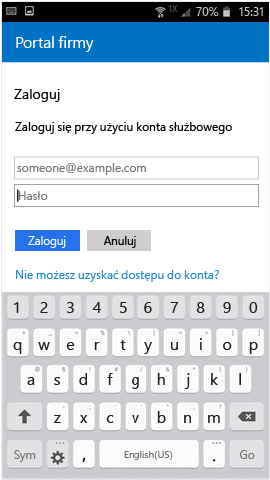

# Rejestrowanie urządzenia z systemem Android w usłudze Intune

Jeśli firma lub szkoła używa usługi Microsoft Intune, możesz zarejestrować urządzenie z systemem Android, aby uzyskać dostęp do poczty e-mail, plików i innych zasobów firmy. Po zarejestrowaniu urządzeń dział IT może zarządzać zasobami służbowymi i zabezpieczać je, a użytkownicy mogą korzystać z preferowanych urządzeń podczas wykonywania pracy. Aby uzyskać więcej informacji o rejestracji, zobacz [Co się stanie, jeśli zainstaluję aplikację Portal firmy i zarejestruję swoje urządzenie?](what-happens-if-you-install-the-Company-Portal-app-and-enroll-your-device-in-intune-android.md).

Te instrukcje dotyczące rejestracji są przeznaczone dla urządzeń z systemem Android Samsung Knox i „natywnych” urządzeń z systemem Android (innych niż Samsung Knox). Aby sprawdzić, czy masz urządzenie Samsung Knox, przejdź do pozycji **Ustawienia** &gt; **Informacje o urządzeniu**. Jeśli na tej liście nie widzisz pozycji „KNOX version” (Wersja systemu KNOX), oznacza to, że masz urządzenie z natywnym systemem Android.

Przed zarejestrowaniem lub po nim może pojawić się monit o wybranie kategorii, która najlepiej opisuje Twój sposób korzystania z urządzenia. Administrator IT używa tej kategorii, aby pomóc sprawdzić aplikacje, do których masz dostęp.

Jeśli podczas próby zarejestrowania urządzenia w usłudze Intune wystąpi błąd, możesz [wysłać błędy rejestracji do administratora IT](send-enrollment-errors-to-your-it-administrator-android.md).

**Aby zarejestrować urządzenie z systemem Android:**

1.  Zainstaluj bezpłatną aplikację Portal firmy usługi Intune ze sklepu [Google Play](http://play.google.com/store/apps/details?id=com.microsoft.windowsintune.companyportal).

2.  Otwórz aplikację Portal firmy usługi Microsoft Intune.

3.  Na **ekranie powitalnym** Portalu firmy naciśnij przycisk **Zaloguj**, a następnie zaloguj się przy użyciu swojego konta służbowego.

       

4.  Jeśli administrator IT skonfigurował firmowe warunki i postanowienia, naciśnij przycisk **AKCEPTUJ**, aby zaakceptować postanowienia.

    

5.  Zaloguj się w aplikacji Portal firmy, podając służbowe konto i hasło, a następnie naciśnij pozycję **Zaloguj**.

    

6.  Na ekranie **Konfiguracja dostępu do zasobów firmy** naciśnij przycisk **ROZPOCZNIJ**.

    

7.  Na ekranie **Dlaczego warto zarejestrować urządzenie?** przeczytaj, co możesz zrobić po zarejestrowaniu urządzenia, a następnie naciśnij pozycję **KONTYNUUJ**.

    

8.  Przejrzyj listę rzeczy, które administrator IT może zobaczyć na Twoim urządzeniu i których nie może zobaczyć, a następnie naciśnij pozycję **KONTYNUUJ**.

    

9.  Na ekranie **Co teraz** przeczytaj, co będzie się działo podczas rejestrowania, a następnie naciśnij przycisk **ZAREJESTRUJ**.

    

10.  Wykonaj ten krok, jeśli używasz systemu Android w wersji 6.0 lub nowszej. W przeciwnym razie przejdź do następnego kroku.

    Jeśli administrator IT skonfigurował pewne zasady, mogą pojawić się następujące komunikaty:
    -   **Zezwolić aplikacji Portal firmy na połączenia telefoniczne i zarządzanie nimi?**

        

    Jeśli ten komunikat zostanie wyświetlony, naciśnij opcję **ZEZWALAJ**. Naciśnięcie pozycji ZEZWALAJ jest bezpieczne, ponieważ **firma Microsoft nigdy nie nawiązuje za Ciebie połączeń telefonicznych ani nie zarządza nimi**! Tekst komunikatu pochodzi od firmy Google, a firma Microsoft nie może go zmienić. Zezwolenie na dostęp oznacza, że umożliwisz tylko urządzeniu wysłanie międzynarodowego numeru identyfikacyjnego urządzenia przenośnego (IMEI) do usługi Intune. Numer IMEI to numer podobny do numeru seryjnego, który jednoznacznie identyfikuje urządzenie przenośne.

    Jeśli odmówisz dostępu, komunikat pojawi się ponownie przy kolejnym logowaniu do Portalu firmy, ale możesz wyłączyć wyświetlanie komunikatów w przyszłości, naciskając pole **Nigdy nie pytaj ponownie**. Jeśli później zdecydujesz zezwolić na dostęp, przejdź do pozycji **Ustawienia** &gt; **Aplikacje** &gt; **Portal firmy** &gt; **Uprawnienia** &gt; **Telefon** i włącz uprawnienie.

    -   **Zezwolić aplikacji Portal firmy na dostęp do Twoich kontaktów?**

        

    Jeśli ten komunikat zostanie wyświetlony, naciśnij opcję **ZEZWALAJ**. Naciśnięcie pozycji ZEZWALAJ jest bezpieczne, ponieważ **firma Microsoft nigdy nie uzyskuje dostępu do Twoich kontaktów!** Tekst komunikatu pochodzi od firmy Google, a firma Microsoft nie może go zmienić. Jeśli zezwolisz na dostęp, aplikacja Portal firmy będzie mogła tylko utworzyć konto służbowe, korzystać z niego i zarządzać nim.

    Jeśli odmówisz dostępu, komunikat pojawi się ponownie przy kolejnym logowaniu do Portalu firmy, ale możesz wyłączyć wyświetlanie komunikatów w przyszłości, naciskając pole **Nigdy nie pytaj ponownie**. Jeśli później zdecydujesz zezwolić na dostęp, przejdź do pozycji **Ustawienia** &gt; **Aplikacje** &gt; **Portal firmy** &gt; **Uprawnienia** &gt; **Telefon** i włącz uprawnienie.

11.  Na ekranie **Aktywowanie administratora urządzenia** naciśnij przycisk **Aktywuj**.

    

12.  Postępuj zgodnie z monitami o wprowadzenie numeru PIN lub hasła. Jeśli skonfigurowano już numer PIN lub hasło na tym urządzeniu, ten ekran nie będzie widoczny lub wymagane będzie wprowadzenie nowego numeru PIN lub hasła.

    

13.  Jeśli korzystasz z urządzenia z systemem Samsung KNOX, naciśnij pozycję **Potwierdź**. Zostanie wyświetlony komunikat potwierdzający zarejestrowanie urządzenia. Jeśli korzystasz z urządzenia z natywnym systemem Android, zobaczysz poniższy ekran pokazujący, że urządzenie jest rejestrowane.

    

    Ten ekran pokazuje, że urządzenie jest rejestrowane.

    

14. Po wyświetleniu ekranu **Konfiguracja dostępu do zasobów firmy** naciśnij przycisk **KONTYNUUJ**. Jeśli komunikat informuje o niezgodności urządzenia, wykonaj instrukcje rozwiązania problemu, a następnie naciśnij pozycję **KONTYNUUJ**.

      

11. Na ekranie **Zakończono konfigurowanie dostępu do zasobów firmy** naciśnij przycisk **GOTOWE**. Urządzenie jest teraz zarejestrowane.

    

Zanim spróbujesz zainstalować aplikacje firmowe, przejdź kolejno do pozycji **Ustawienia** &gt; **Zabezpieczenia** i włącz opcję **Nieznane źródła**. Jeśli nie włączysz tej opcji przed próbą zainstalowania aplikacji, zostanie wyświetlony następujący komunikat: „Zablokowano instalację. Ze względów bezpieczeństwa Twoje urządzenie zostało ustawione w celu blokowania instalacji aplikacji uzyskanych z nieznanych źródeł”. W oknie dialogowym komunikatu o błędzie możesz nacisnąć pozycję **Ustawienia**, aby przejść do opcji **Nieznane źródła**.

Nadal potrzebujesz pomocy? Skontaktuj się z administratorem IT (sprawdź [witrynę sieci Web Portal firmy](http://portal.manage.microsoft.com), aby uzyskać informacje kontaktowe) lub napisz do zespołu ds. systemu Android firmy Microsoft: wintunedroidfbk@microsoft.com.

<!--HONumber=Oct16_HO2-->

