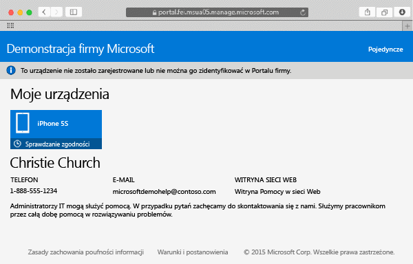

# Rejestrowanie urządzenia z systemem Mac OS X w usłudze Intune

Zarejestrowanie urządzenia z systemem Mac OS X w usłudze Intune pozwala na uzyskanie dostępu do sieci firmowej, służbowej poczty e-mail i plików oraz pozwala pobierać aplikacje firmowe. Aby uzyskać więcej informacji na temat efektów zarejestrowania urządzenia, zobacz [Co się dzieje w przypadku zainstalowania aplikacji Portal firmy i zarejestrowania urządzenia w usłudze Intune?](what-happens-if-you-install-the-company-portal-app-and-enroll-your-device-in-intune-ios.md).

Jeśli próbujesz zarejestrować urządzenie z systemem iOS, zobacz [Rejestrowanie urządzenia z systemem iOS w usłudze Intune](enroll-your-device-in-intune-ios.md).

Aby zarejestrować urządzenie z systemem Mac OS X:

1.  W przeglądarce Safari otwórz [witrynę Portalu firmy](https://portal.manage.microsoft.com) i naciśnij pasek powiadomień.

2.  Naciśnij pozycję **To urządzenie nie zostało zarejestrowane lub nie można go zidentyfikować w Portalu firmy**.

     

3.  Naciśnij pozycję **Zainstaluj**, aby rozpocząć rejestrację urządzenia.

     

4.  W oknie dialogowym **Instalowanie profilu zarządzania** naciśnij pozycję **Zainstaluj**. Jeśli zostanie wyświetlone okno dialogowe z monitem o podanie poświadczeń, wprowadź nazwę użytkownika i hasło, a następnie naciśnij kolejno pozycje **Kontynuuj** &gt; **Zainstaluj**.

     

    Po zakończeniu rejestracji pojawi się strona Profil zarządzania z informacją o zweryfikowaniu profilu.

     

Nadal potrzebujesz pomocy? Skontaktuj się z administratorem IT. Informacje kontaktowe są dostępne w [witrynie sieci Web Portal firmy](http://portal.manage.microsoft.com).

### Zobacz także
[Using your iOS or Mac OS X device with Intune](using-your-ios-or-mac-os-x-device-with-intune.md)

<!--HONumber=Jul16_HO3-->

