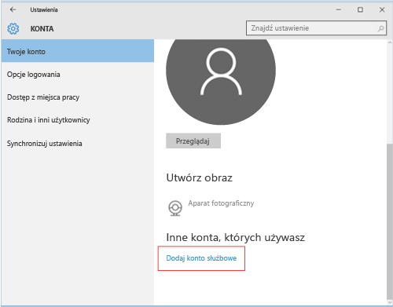

---
# required metadata

title: Rejestrowanie urządzenia z systemem Windows 10 Mobile lub Windows 10 Desktop w usłudze Intune | Microsoft Intune
description:
keywords:
author: Staciebarker
manager: jeffgilb
ms.date: 05/11/2016
ms.topic: article
ms.prod:
ms.service: microsoft-intune
ms.technology:
ms.assetid: 36250832-c6fd-4e8d-b681-de735023ebc3

# optional metadata

#ROBOTS:
#audience:
#ms.devlang:
ms.reviewer: priyar
ms.suite: ems
#ms.tgt_pltfrm:
#ms.custom:

---

# Rejestrowanie urządzenia z systemem Windows 10 Mobile lub Windows 10 Desktop w usłudze Intune

Jeśli firma lub szkoła używa usługi Microsoft Intune, możesz zarejestrować urządzenia, aby uzyskać dostęp do poczty e-mail, plików i innych zasobów firmy. Rejestracja urządzenia umożliwia organizacji ochronę danych firmowych. Aby uzyskać więcej informacji o rejestracji, zobacz [Co się dzieje w przypadku zainstalowania aplikacji Portal firmy i zarejestrowania urządzenia w usłudze Intune?](what-happens-if-you-install-the-company-portal-app-and-enroll-your-device-in-intune-windows.md) i [Lista rzeczy, jakie administrator IT może zobaczyć na Twoim urządzeniu i jakich nie może](what-can-your-it-administrator-see-when-you-enroll-your-device-in-intune-windows.md).

Aby zarejestrować urządzenie z systemem Windows 10 Mobile lub Windows 10 Desktop:

1.  Przejdź do pozycji **Ustawienia** systemu Windows i naciśnij pozycję **Konta**.

    

2.  Naciśnij pozycję **Twoje konto**.

    

3.  Naciśnij pozycję **Dodaj konto służbowe**.

    

4.  Zaloguj się przy użyciu poświadczeń konta służbowego.

    

Jeśli powyższe kroki zostały wykonane, ale nadal nie można uzyskać dostępu do służbowej poczty e-mail, plików i innych danych, wróć do pozycji **Konta**, a następnie naciśnij pozycję **Dostęp z miejsca pracy**.

-   Jeśli widzisz konto służbowe, gratulujemy. Połączenie zostało nawiązane.

-   Jeśli nie widzisz konta służbowego, naciśnij pozycję **Połącz**, a następnie zaloguj się przy użyciu poświadczeń konta służbowego.

Zalecane jest również zainstalowanie aplikacji Portal firmy, dzięki której możesz łatwo znaleźć i uzyskać aplikacje firmowe związane z Tobą i Twoim stanowiskiem. W zależności od tego, jak usługa Intune została skonfigurowana w firmie, aplikacja Portal firmy może zostać zainstalowana w ramach procesu rejestracji. Aby sprawdzić, czy masz tę aplikację, poszukaj nazwy **Portal firmy** na liście aplikacji. Jeśli lista nie zawiera aplikacji Portal firmy, wykonaj następujące kroki, aby ją zainstalować.

1.  Naciśnij kolejno pozycje **Start** &gt; **Sklep**.

2.  Naciśnij pozycję **Wyszukaj** i wpisz **portal firmy**.

3.  Na liście wyników naciśnij kolejno pozycje **Portal firmy** &gt; **Zainstaluj**.

4.  Naciśnij pozycję **Zainstaluj** lub **Bezpłatne**. Wyświetlana opcja zależy od konfiguracji aplikacji w firmie.

Nadal potrzebujesz pomocy? Skontaktuj się z administratorem IT. Informacje kontaktowe są dostępne w [witrynie sieci Web Portal firmy](http://portal.manage.microsoft.com).

### Zobacz także
[Rejestrowanie urządzenia z systemem Windows w usłudze Intune](enroll-your-device-in-intune-windows.md) 
[Korzystanie z urządzenia z systemem Windows i usługi Intune](using-your-windows-device-with-intune.md)

<!--HONumber=Jun16_HO2-->

