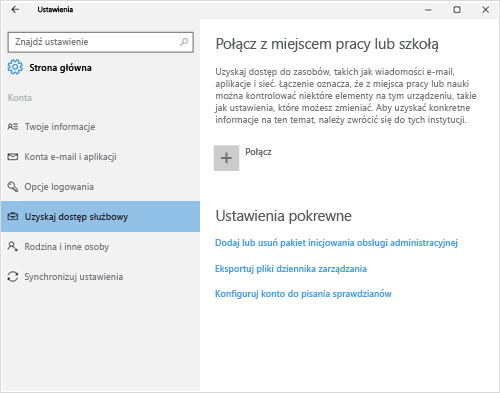
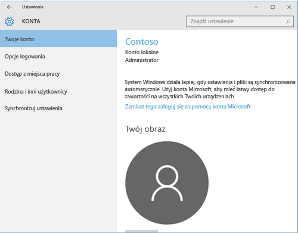

# Rejestrowanie urządzenia z systemem Windows 10 Mobile lub Windows 10 Desktop w usłudze Intune

Jeśli firma lub szkoła używa usługi Microsoft Intune, możesz zarejestrować urządzenia, aby uzyskać dostęp do poczty e-mail, plików i innych zasobów firmy. Rejestracja urządzenia umożliwia organizacji ochronę danych firmowych. Aby uzyskać więcej informacji o rejestracji, zobacz [Co się dzieje w przypadku zainstalowania aplikacji Portal firmy i zarejestrowania urządzenia w usłudze Intune?](what-happens-if-you-install-the-company-portal-app-and-enroll-your-device-in-intune-windows.md) i [Lista rzeczy, jakie administrator IT może zobaczyć na Twoim urządzeniu i jakich nie może](what-can-your-it-administrator-see-when-you-enroll-your-device-in-intune-windows.md).

Aby zarejestrować urządzenie z systemem Windows 10 Mobile lub Windows 10 Desktop:

1.  Przejdź do pozycji **Ustawienia** systemu Windows i naciśnij pozycję **Konta**.

    

2.  Przyjrzyj się obu ekranom i zastanów się, który z nich przypomina zawartość ekranu urządzenia. Wykonaj kroki odnoszące się do ekranu przypominającego ekran urządzenia.

    Jeśli widzisz ten ekran, postępuj zgodnie z instrukcjami opisanymi w artykule [Czynności w przypadku wyświetlenia ekranu Dostęp do zasobów służbowych](#steps-to-follow-if-you-see-access-work-or-school).

    

    Jeśli widzisz ten ekran, postępuj zgodnie z instrukcjami opisanymi w artykule [Czynności w przypadku wyświetlenia ekranu Konto użytkownika](#steps-to-follow-if-you-see-your-account).

    

## Czynności w przypadku wyświetlenia ekranu Dostęp do zasobów służbowych

1.  Naciśnij opcję **Uzyskaj dostęp do miejsca pracy lub nauki**, a następnie naciśnij opcję **Połącz**.

    

2.  Wprowadź służbowy adres e-mail, a następnie naciśnij przycisk **Dalej**.

    

3. Zaloguj się do usługi Intune przy użyciu konta służbowego.

    

    Pojawi się komunikat informujący o tym, że firma lub szkoła rejestruje urządzenie.

4. Po wyświetleniu strony **Wszystko jest gotowe!** wybierz opcję **Zamknij**. To wszystko.

  

5. Jeśli chcesz się upewnić, że połączenie jest prawidłowo skonfigurowane, wróć do obszaru **Ustawienia** i sprawdź, czy konto służbowe znajduje się na liście.

    

Jeśli powyższe kroki zostały wykonane, ale nadal nie można uzyskać dostępu do służbowego konta e-mail i plików, wykonaj czynności opisane w części [Rozwiązywanie problemów w przypadku wyświetlenia ekranu Dostęp do zasobów służbowych](troubleshoot-your-windows-10-device-windows.md#troubleshooting-steps-to-follow-if-you-see-access-work-or-school).

## Czynności w przypadku wyświetlenia ekranu Konto użytkownika

1.  Przejdź do pozycji **Ustawienia** systemu Windows, a następnie naciśnij pozycję **Konta**.

    

2.  Naciśnij pozycję **Twoje konto**.

    

3.  Naciśnij pozycję **Dodaj konto służbowe**.

    

4.  Zaloguj się przy użyciu poświadczeń konta służbowego.

    

Jeśli poprzednie kroki zostały wykonane, ale nadal nie można uzyskać dostępu do służbowego adresu e-mail, plików lub innych danych, wykonaj instrukcje opisane w części [Rozwiązywanie problemów w przypadku wyświetlenia ekranu Konto użytkownika](troubleshoot-your-windows-10-device-windows.md#troubleshooting-steps-to-follow-if-you-see-your-account).

Zalecane jest również zainstalowanie aplikacji Portal firmy, dzięki której możesz łatwo znaleźć i uzyskać aplikacje firmowe związane z Tobą i Twoim stanowiskiem. W zależności od tego, jak usługa Intune została skonfigurowana w firmie, aplikacja Portal firmy może zostać zainstalowana w ramach procesu rejestracji.

Aby sprawdzić, czy masz tę aplikację, poszukaj nazwy **Portal firmy** na liście aplikacji. Jeśli lista nie zawiera aplikacji Portal firmy, wykonaj następujące kroki, aby ją zainstalować.

1.  Naciśnij kolejno pozycje **Start** &gt; **Sklep**.

2.  Naciśnij pozycję **Wyszukaj** i wpisz **portal firmy**.

3.  Na liście wyników naciśnij kolejno pozycje **Portal firmy** &gt; **Zainstaluj**.

4.  Naciśnij pozycję **Zainstaluj** lub **Bezpłatne**. Wyświetlana opcja zależy od konfiguracji aplikacji w firmie.

Nadal potrzebujesz pomocy? Skontaktuj się z administratorem IT. Informacje kontaktowe są dostępne w [witrynie sieci Web Portal firmy](http://portal.manage.microsoft.com).

<!--HONumber=Oct16_HO1-->

