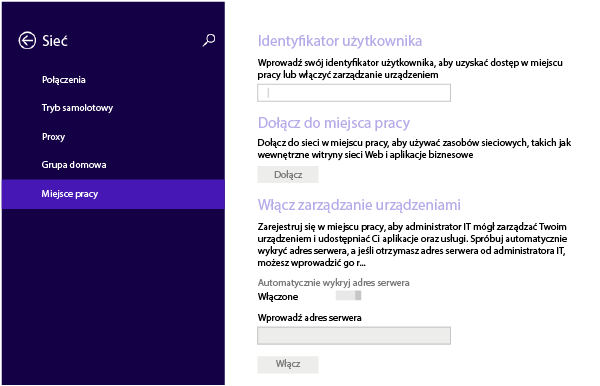
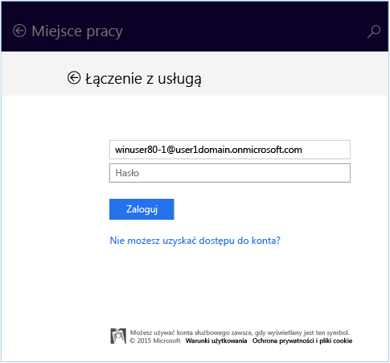
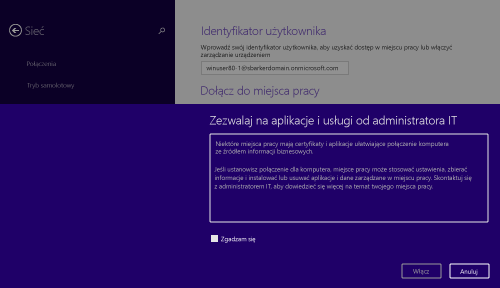

---
# required metadata

title: Rejestrowanie urządzenia z systemem Windows 8.1 lub Windows RT 8.1 w usłudze Intune | Microsoft Intune
description:
keywords:
author: Staciebarker
manager: jeffgilb
ms.date: 04/28/2016
ms.topic: article
ms.prod:
ms.service: microsoft-intune
ms.technology:
ms.assetid: 28984f26-1070-4f7a-877c-669a59375c0c

# optional metadata

#ROBOTS:
#audience:
#ms.devlang:
ms.reviewer: jeffgilb
ms.suite: ems
#ms.tgt_pltfrm:
#ms.custom:

---

# Rejestrowanie urządzenia z systemem Windows 8.1 lub Windows RT 8.1 w usłudze Intune

Jeśli firma lub szkoła używa usługi Microsoft Intune, możesz zarejestrować urządzenia, aby uzyskać dostęp do poczty e-mail, plików i innych zasobów firmy. Rejestracja urządzenia umożliwia organizacji ochronę danych firmowych. Aby uzyskać więcej informacji o rejestracji, zobacz [Co się dzieje w przypadku zainstalowania aplikacji Portal firmy i zarejestrowania urządzenia w usłudze Intune?](what-happens-if-you-install-the-company-portal-app-and-enroll-your-device-in-intune-windows.md) oraz [Lista rzeczy, jakie administrator IT może zobaczyć na Twoim urządzeniu i jakich nie może](what-can-your-it-administrator-see-when-you-enroll-your-device-in-intune-windows.md).

Aby zarejestrować urządzenie z systemem Windows 8.1 lub Windows RT 8.1:

1.  Na urządzeniu naciśnij kolejno pozycje **Ustawienia** &gt; **Ustawienia komputera** &gt; **Sieć** &gt; **Miejsce pracy**.

    

2.  Wprowadź służbowy adres e-mail jako identyfikator użytkownika, jeśli jest wymagany, a następnie naciśnij pozycję **Dołącz**.

    Jeśli identyfikator użytkownika nie jest wymagany, używany jest adres e-mail wprowadzony podczas logowania na tym urządzeniu.

3.  Wpisz hasło dla służbowego adresu e-mail.

    

4.  W obszarze **Włączanie zarządzania urządzeniami** naciśnij pozycję **Włącz**.

    

5.  W oknie dialogowym **Zezwalanie na aplikacje i usługi od administratora IT** zaznacz pole wyboru **Zgadzam się**, a następnie naciśnij pozycję **Włącz**.

    

    Po pomyślnym zarejestrowaniu zobaczysz następujący ekran.

    

Zalecane jest również zainstalowanie aplikacji Portal firmy, dzięki której możesz łatwo znaleźć i uzyskać aplikacje firmowe związane z Tobą i Twoim stanowiskiem. W zależności od tego, jak usługa Intune została skonfigurowana w firmie, aplikacja Portal firmy może zostać zainstalowana w ramach procesu rejestracji. Aby sprawdzić, czy masz tę aplikację, poszukaj nazwy **Portal firmy** na liście aplikacji. Jeśli lista nie zawiera aplikacji Portal firmy, wykonaj następujące kroki, aby ją zainstalować.

1.  Naciśnij kolejno pozycje **Start** &gt; **Sklep**.

2.  Naciśnij pozycję **Wyszukaj** i wpisz **portal firmy**.

3.  Na liście wyników naciśnij pozycję **Portal firmy**.

4.  Naciśnij pozycję **Zainstaluj** lub **Bezpłatne**. Wyświetlana opcja zależy od konfiguracji aplikacji w firmie.

### Zobacz także
[Rejestrowanie urządzenia z systemem Windows w usłudze Intune](enroll-your-device-in-intune-windows.md) 
[Korzystanie z urządzenia z systemem Windows i usługi Intune](using-your-windows-device-with-intune.md)

<!--HONumber=May16_HO1-->

