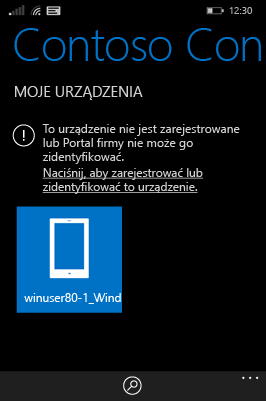
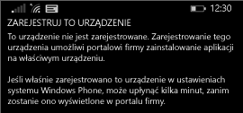

# Rejestrowanie urządzenia z systemem Windows Phone 8.1 w usłudze Intune

Jeśli firma lub szkoła używa usługi Microsoft Intune, możesz zarejestrować urządzenia, aby uzyskać dostęp do poczty e-mail, plików i innych zasobów firmy. Po zarejestrowaniu urządzeń organizacja może zapewnić bezpieczeństwo danych firmowych. Aby uzyskać więcej informacji o rejestracji, zobacz [Co się dzieje w przypadku zainstalowania aplikacji Portal firmy i zarejestrowania urządzenia w usłudze Intune?](what-happens-if-you-install-the-company-portal-app-and-enroll-your-device-in-intune-windows.md) i [Lista rzeczy, jakie administrator IT może zobaczyć na Twoim urządzeniu i jakich nie może](what-can-your-it-administrator-see-when-you-enroll-your-device-in-intune-windows.md).

Aby zarejestrować urządzenie z systemem Windows Phone 8.1 w usłudze Intune, postępuj zgodnie z instrukcjami dotyczącymi Twojej firmy lub szkoły:

-   [Jeśli firma pozwala korzystać z aplikacji Portal firmy ze Sklepu Windows](#if-your-company-lets-you-use-the-company-portal-from-the-windows-store)

-   [Jeśli nie możesz uzyskać dostępu do Sklepu Windows w systemie Windows Phone lub nie masz konta Microsoft](#if-you-are-not-allowed-to-access-the-windows-store-from-your-windows-phone-or-if-you-do-not-have-a-microsoft-account)

## Jeśli firma pozwala korzystać z aplikacji Portal firmy ze Sklepu Windows
Instalowanie aplikacji Portal firmy na urządzeniu:

1.  Naciśnij kolejno pozycje **Start** &gt; **Sklep**.

2.  Naciśnij pozycję **Wyszukaj** i wpisz **portal firmy**.

3.  Na liście wyników naciśnij pozycję **Portal firmy**.

    

4.  Naciśnij kolejno pozycje **Portal firmy** &gt; **Zainstaluj**.

    

Rejestrowanie urządzenia:

1.  Na urządzeniu otwórz aplikację **Portal firmy Microsoft Intune**.

2.  Wprowadź swoje poświadczenia. Może pojawić się monit o zaakceptowanie firmowych warunków użytkowania (jeśli mają one zastosowanie).

3.  Szybko przesuń palcem po ekranie, aby przejść do elementu **Moje urządzenia**.

4.  Naciśnij pozycję **Naciśnij, aby zarejestrować lub zidentyfikować to urządzenie**.

    

5.  Naciśnij pozycję **Zarejestruj to urządzenie**.

    

6.  Naciśnij pozycję **Dodaj konto**.

    

7.  Wprowadź żądane dodatkowe informacje, a następnie naciśnij pozycję **Zaloguj**, aby zakończyć rejestrację. Konto w miejscu pracy powinno być teraz wyświetlane na stronie otwieranej po wybraniu pozycji **Ustawienia** &gt; **Miejsce pracy**.

    

## Jeśli nie możesz uzyskać dostępu do Sklepu Windows w systemie Windows Phone lub nie masz konta Microsoft

1.  Naciśnij kolejno pozycje **Ustawienia** &gt; **Miejsce pracy**.

2.  Naciśnij pozycję **Dodaj konto**, a następnie zaloguj się przy użyciu swojego konta służbowego.

3.  Wprowadź żądane dodatkowe informacje, a następnie naciśnij pozycję **Zaloguj**, aby zakończyć rejestrację.

4.  Jeśli zostanie wyświetlony monit o zainstalowanie aplikacji lub centrum firmy, upewnij się, że odpowiednie pole wyboru zostało zaznaczone, a następnie naciśnij pozycję **Gotowe**.

Jeśli administrator IT skonfigurował Portal firmy tak, aby został zainstalowany podczas rejestracji, Portal firmy pojawi się na liście aplikacji.

Nadal potrzebujesz pomocy? Skontaktuj się z administratorem IT. Informacje kontaktowe są dostępne w [witrynie sieci Web Portal firmy](http://portal.manage.microsoft.com).

<!--HONumber=Jan17_HO1-->

