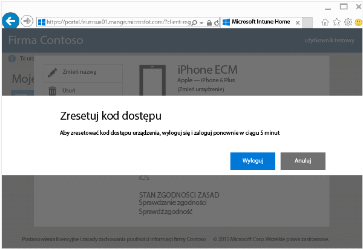
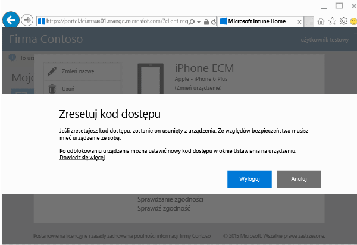

---
# required metadata

title: Resetowanie kodu dostępu urządzenia z poziomu witryny sieci Web Portal firmy | Microsoft Intune
description:
keywords:
author: Staciebarker
manager: jeffgilb
ms.date: 04/28/2016
ms.topic: article
ms.prod:
ms.service: microsoft-intune
ms.technology:
ms.assetid: 4fa3255b-9d1e-42d5-bd8b-70963dcf2d86

# optional metadata

#ROBOTS:
#audience:
#ms.devlang:
ms.reviewer: mamoriss
ms.suite: ems
#ms.tgt_pltfrm:
#ms.custom:

---

# Resetowanie kodu dostępu urządzenia z poziomu witryny sieci Web Portal firmy

Jeśli utracisz numer PIN lub kod dostępu urządzenia zarejestrowanego w usłudze Intune, możesz zresetować go przy użyciu [witryny sieci Web Portal firmy](http://portal.manage.microsoft.com). Witryna sieci Web Portal firmy to strona sieci Web umożliwiająca zarządzanie komputerami i urządzeniami zarejestrowanymi w usłudze Intune oraz wykonywanie większości zadań, które można wykonać przy użyciu aplikacji Portal firmy.

> [!NOTE] Przycisk resetowania kodu dostępu w witrynie sieci Web Portal firmy jest wyświetlany zależnie od tego, jak administrator IT skonfigurował usługę Intune. Resetowanie kodu dostępu nie jest obsługiwane na urządzeniach z systemami Windows 8.1 i Windows RT.

Aby zresetować kod dostępu:

1.  Otwórz [witrynę sieci Web Portal firmy](http://portal.manage.microsoft.com) i naciśnij urządzenie, którego kod dostępu chcesz zresetować.

2.  Naciśnij pozycję **Zresetuj kod dostępu**.

    

3.  Naciśnij pozycję **Wyloguj**, a następnie zaloguj się ponownie przy użyciu poświadczeń służbowych. Musisz zalogować się ponownie w ciągu pięciu minut.

    

4.  Naciśnij pozycję **Zresetuj kod dostępu**.

    

    Sprawdź w tabeli, jak funkcja resetowania kodu dostępu działa na Twoim urządzeniu.

    |Platforma|Support|
    |------------|-----------|
    |Android|Utworzenie nowego, tymczasowego, alfanumerycznego kodu dostępu.|
    |iOS|Usunięcie kodu dostępu z urządzenia bez utworzenia nowego, tymczasowego kodu dostępu. Jeśli używasz funkcji Touch ID, musisz skonfigurować ją ponownie dla urządzenia, ponieważ jest ona usuwana podczas resetowania kodu dostępu.|
    |Windows 10 (tylko urządzenia przenośne)|Utworzenie nowego, tymczasowego, alfanumerycznego kodu dostępu. Funkcja Windows Hello jest obsługiwana.|
    |Windows Phone 8.1|Utworzenie nowego, tymczasowego, numerycznego kodu dostępu.|
    Po odblokowaniu urządzenia można ustawić nowy kod dostępu, przechodząc do pozycji **Ustawienia** na urządzeniu.

5.  Odblokuj urządzenie, a następnie ustaw nowy kod dostępu lub zmień tymczasowy kod dostępu, przechodząc do pozycji **Ustawienia** na urządzeniu.

    Aby wyświetlić powiadomienie potwierdzające pomyślne zresetowanie hasła, kliknij flagę powiadomienia u góry po prawej stronie w witrynie sieci Web Portal firmy.

Nadal potrzebujesz pomocy? Skontaktuj się z administratorem IT. Informacje kontaktowe są dostępne w [witrynie sieci Web Portal firmy](http://portal.manage.microsoft.com).

### Zobacz także
[Korzystanie z witryny Portal firmy usługi Intune](using-the-intune-company-portal-website.md)

<!--HONumber=Jun16_HO2-->

