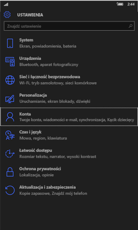
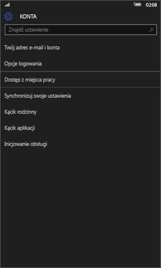
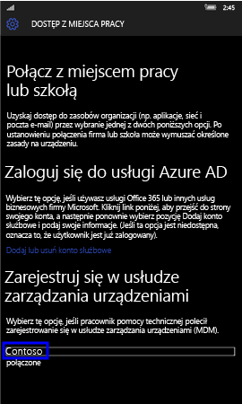
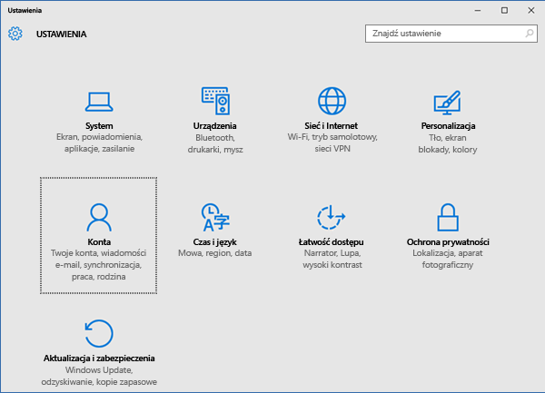
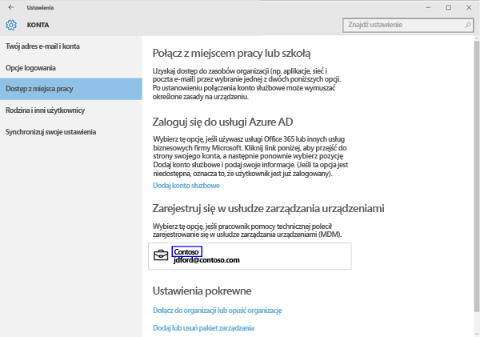
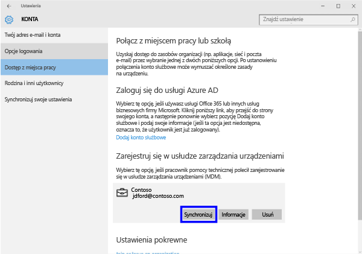

# Ręczne synchronizowanie urządzenia
Jeśli instalacja aplikacji trwa zbyt długo, skorzystaj z poniższych instrukcji, aby ręcznie zsynchronizować urządzenie z systemem Windows, co może przyczynić się do przyspieszenia instalacji. Obsługiwane są tylko wymienione wersje. Użyj linku znajdującego się powyżej w sekcji „W tym artykule” odpowiedniego dla typu używanego urządzenia:

* [Windows 10 Mobile](#windows-10-mobile)
* [Windows 10 Desktop](#windows-10-desktop)
* [Windows Phone 8.1](#windows-phone-8-1)

## Windows 10 Mobile
Aby ręcznie zsynchronizować urządzenie z systemem Windows 10 Mobile w celu przyspieszenia powolnej instalacji aplikacji:

1. Wybierz pozycje **Wszystkie aplikacje** > **Ustawienia** > **Konta**.

    
    
2. Wybierz pozycję **Dostęp z miejsca pracy**.

    
    
3. W obszarze **Rejestrowanie w celu zarządzania urządzeniami** wybierz nazwę swojej firmy, jak pokazano poniżej.

    
    
4. Wybierz ikonę **Synchronizacja**.

    
    
    W górnej części ekranu pojawi się komunikat „Synchronizujemy Twoje konto”. Przycisk synchronizacji będzie szary, dopóki synchronizacja urządzenia nie zakończy się.

## Windows 10 Desktop
Aby ręcznie zsynchronizować urządzenie z systemem Windows 10 Desktop w celu przyspieszenia powolnej instalacji aplikacji:

1. Wybierz przycisk **Start**, jak pokazano poniżej, a następnie wybierz pozycję **Ustawienia**.

    
    
2. Na stronie **Ustawienia** wybierz pozycję **Konta**.
 
    
    
3. Na stronie **Konta** wybierz pozycję **Dostęp z miejsca pracy**.
    
    
    
4. W sekcji **Rejestrowanie w celu zarządzania urządzeniami** kliknij nazwę swojej firmy (zobacz niebieskie wyróżnienie poniżej).
    
    
   
5. Wybierz przycisk **Synchronizacja**.
    
    
   
   Przycisk będzie szary aż do zakończenia synchronizacji.

## Windows Phone 8.1
Aby ręcznie zsynchronizować urządzenie z systemem Windows Phone 8.1 w celu przyspieszenia powolnej instalacji aplikacji:

1. Wybierz pozycje **Wszystkie aplikacje** > **Ustawienia** > **Miejsce pracy**.

    
    
2. Wybierz nazwę firmy (zobacz niebieskie wyróżnienie poniżej).

    
   
3. Wybierz ikonę **Synchronizacja**.

    
    
   W górnej części ekranu pojawi się komunikat „Synchronizujemy Twoje konto”, który będzie widoczny aż do zakończenia synchronizowania urządzenia.

Nadal potrzebujesz pomocy? Skontaktuj się z administratorem IT. Informacje kontaktowe są dostępne w [witrynie sieci Web Portal firmy](http://portal.manage.microsoft.com).

### Zobacz także
[Korzystanie z urządzenia z systemem Windows i usługi Intune](using-your-windows-device-with-intune.md)

<!--HONumber=Jun16_HO4-->

