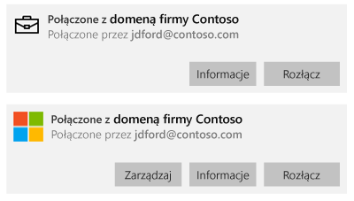

# Ręczne synchronizowanie urządzenia z systemem Windows
Jeśli instalowanie aplikacji trwa zbyt długo, możesz spróbować ręcznie zsynchronizować urządzenie z systemem Windows. Ręczna synchronizacja może przyspieszyć instalację.

Obsługiwane są wyłącznie następujące wersje. Jeśli urządzenia nie ma na liście, synchronizacja nie jest obsługiwana. Skorzystaj z instrukcji odpowiednich dla typu używanego urządzenia.

* [Windows 10 Mobile](#windows-10-mobile)
* [Windows 10 Desktop](#windows-10-desktop)
* [Windows Phone 8.1](#windows-phone-8-1)

## Windows 10 Mobile
Aby ręcznie zsynchronizować urządzenie z systemem Windows 10 Mobile w celu przyspieszenia powolnej instalacji aplikacji:

1. Wybierz pozycje **Wszystkie aplikacje** > **Ustawienia** > **Konta**.

    

2. Wybierz pozycję **Dostęp z miejsca pracy**.

    

3. W obszarze **Rejestrowanie w celu zarządzania urządzeniami** wybierz nazwę firmy.

    

4. Wybierz ikonę **Synchronizuj**.

    

    W górnej części ekranu pojawi się komunikat „Synchronizujemy Twoje konto”. Przycisk **Synchronizuj** będzie szary, dopóki synchronizacja urządzenia nie zakończy się.

## Windows 10 Desktop
Istnieje więcej niż jedna wersja systemu Windows 10, więc przygotowano dwie procedury. Aby wybrać odpowiednią procedurę, spójrz na zrzuty ekranu, a następnie wykonaj kroki, które odpowiadają temu, co widzisz na swoim urządzeniu. 

1. Wybierz przycisk **Start**, a następnie wybierz pozycję **Ustawienia**.

    

2. Na stronie **Ustawienia** wybierz pozycję **Konta**.

    

3. Przyjrzyj się obu ekranom i zastanów się, który z nich przypomina zawartość ekranu urządzenia. Wykonaj kroki odnoszące się do ekranu przypominającego ekran urządzenia.

    Jeśli widzisz ten ekran („Uzyskaj dostęp do miejsca pracy lub nauki”), postępuj zgodnie z instrukcjami opisanymi w sekcji [Procedura w przypadku wyświetlenia ekranu Uzyskaj dostęp do miejsca pracy lub nauki](#steps-to-follow-if-you-see-access-work-or-school).

    

    Jeśli widzisz ten ekran („Dostęp z miejsca pracy”), postępuj zgodnie z instrukcjami opisanymi w sekcji [Procedura w przypadku wyświetlenia ekranu Dostęp z miejsca pracy](#steps-to-follow-if-you-see-your-account).

     

### Czynności w przypadku wyświetlenia ekranu Dostęp do zasobów służbowych

1. Na stronie **Konta** wybierz pozycję **Uzyskaj dostęp do miejsca pracy lub nauki**.

    

2. Wybierz swoje konto służbowe. W zależności od tego, jak administrator IT skonfigurował środowisko, mogą zostać wyświetlone dwa konta wyglądające podobnie jak na poniższym przykładzie. Obok jednego konta jest wyświetlona ikona aktówki, a obok drugiego — logo firmy Microsoft. 

    - Jeśli widzisz konto z aktówką, wybierz je i poszukaj pod nim przycisku **Informacje**. 
    - Jeśli widzisz tylko konto z logo firmy Microsoft, wybierz je i poszukaj pod nim przycisku **Informacje**.

    

3. Wybierz przycisk **Informacje**. Zostanie otwarte okno dialogowe przypominające poniższe.

    

4. Wybierz przycisk **Synchronizuj**. Urządzenie zostanie zsynchronizowane z usługą Intune.

### Procedura w przypadku wyświetlenia ekranu Dostęp z miejsca pracy
    
1. Na stronie **Konta** wybierz pozycję **Dostęp z miejsca pracy**.

    

2. W sekcji **Rejestrowanie w celu zarządzania urządzeniami** wybierz nazwę swojej firmy.

    

3. Wybierz przycisk **Synchronizuj**.

    

   Przycisk będzie szary aż do zakończenia synchronizacji.

## Windows Phone 8.1
Aby ręcznie zsynchronizować urządzenie z systemem Windows Phone 8.1 w celu przyspieszenia powolnej instalacji aplikacji:

1. Wybierz pozycje **Wszystkie aplikacje** > **Ustawienia** > **Miejsce pracy**.

    

2. Wybierz nazwę firmy.

    

3. Wybierz ikonę **Synchronizuj**.

    

   W górnej części ekranu pojawi się komunikat „Synchronizujemy Twoje konto”, który będzie widoczny aż do zakończenia synchronizowania urządzenia.

Nadal potrzebujesz pomocy? Skontaktuj się z administratorem IT. Informacje kontaktowe są dostępne w [witrynie sieci Web Portal firmy](http://portal.manage.microsoft.com).

<!--HONumber=Nov16_HO1-->

