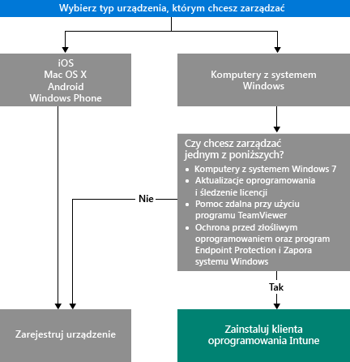

# Wybieranie metody zarządzania urządzeniami

Aby móc korzystać z wielu funkcji oferowanych przez usługę Intune, takich jak wdrażanie aplikacji, i kontrolować ustawienia urządzeń, urządzenia muszą być *zarządzane*. Sposób zarządzania urządzeniami zależy od możliwości usługi Intune, których chcesz używać.
Ten temat pomoże Ci wybrać metodę, która odpowiada Twoim potrzebom.

Aby zarządzać urządzeniami z systemem iOS, Mac OS X, Android lub Windows Phone, musisz je *zarejestrować*.

Na potrzeby zarządzania komputerami z systemem Windows masz do wyboru dwie opcje:

1. zarejestrowanie urządzenia **lub**
2. zainstalowanie *oprogramowania klienckiego usługi Intune*.

## Decydowanie o wyborze metody do użycia
Ten przepływ decyzyjny umożliwia podjęcie decyzji o sposobie zarządzania urządzeniami.

Rejestracja komputerów z systemem Windows pozwala uzyskać większość funkcji. Jednak użycie oprogramowania klienckiego usługi Intune może być bardziej odpowiednie, jeśli:

- Na komputerze jest uruchomiony system Windows 7
- Chcesz zarządzać aktualizacjami oprogramowania systemu Windows i użyciem licencji
- Chcesz zarządzać złośliwym oprogramowaniem za pomocą programu Endpoint Protection i Zapory systemu Windows
- Chcesz zapewniać pomoc zdalną użytkownikom za pomocą oprogramowania TeamViewer

Aby uzyskać szczegółową listę możliwości zarządzania oferowanych przez każdą metodę, zobacz [Możliwości zarządzania urządzeniami przenośnymi](mobile-device-management-capabilities-in-microsoft-intune.md) i [Możliwości komputerowego klienta oprogramowania usługi Intune](windows-pc-management-capabilities-in-microsoft-intune.md).
Aby uzyskać informacje o urządzeniach i komputerach obsługiwanych przez usługę Intune, zobacz [Obsługiwane urządzenia przenośne i komputery](/intune/get-started/supported-mobile-devices-and-computers).

## Zarządzanie przy użyciu programu Exchange ActiveSync
Oprócz rejestrowania urządzenia lub instalowania oprogramowania klienckiego usługi Intune możesz również zarządzać urządzeniami [za pomocą programu Exchange ActiveSync](/intune/deploy-use/mobile-device-management-with-exchange-activesync-and-microsoft-intune). Ta metoda wymaga zainstalowania łącznika On-Premises Connector albo użycia wbudowanego łącznika Service to Service Connector w celu nawiązania połączenia z programem Exchange Server.
Mimo że jest to trzecia opcja zarządzania urządzeniami, zapewnia ona ograniczony zestaw możliwości zarządzania w porównaniu do innych metod.

## Następne kroki

- [Wybieranie metody rejestrowania urządzeń przenośnych](/intune/get-started/choose-how-to-enroll-devices1)
- [Zarządzanie komputerami z systemem Windows przy użyciu komputerowego oprogramowania klienckiego usługi Intune](/intune/deploy-use/manage-windows-pcs-with-microsoft-intune)

- [Zarządzanie urządzeniami przenośnymi za pomocą programu Exchange ActiveSync i usługi Microsoft Intune](/intune/deploy-use/mobile-device-management-with-exchange-activesync-and-microsoft-intune).

<!--HONumber=Aug16_HO5-->

