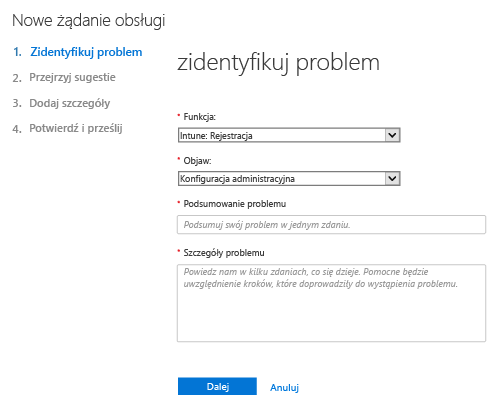
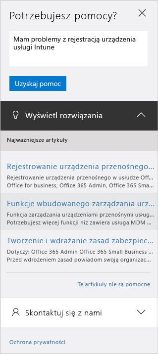

# Jak uzyskać administracyjną pomoc techniczną dotyczącą usługi Microsoft Intune

Firma Microsoft zapewnia globalne wsparcie dotyczące kwestii technicznych, przedsprzedaży, rozliczeń i subskrypcji dla usługi Microsoft Intune. Pomoc techniczna jest dostępna online i telefonicznie w przypadku subskrypcji wersji próbnych i płatnych. Pomoc techniczna online jest dostępna w języku angielskim i japońskim. Telefoniczna pomoc techniczna i pomoc online związana z rozliczeniami są dostępne w dodatkowych językach.

Pomoc techniczna dla usługi Intune oraz dla usługi Intune, gdy jest używana z programem Configuration Manager, jest bezpłatna. Klienci korzystający z pomocy technicznej Premier zostaną obciążeni opłatą za pytania dotyczące procedur (na przykład sposobu konfigurowania funkcji usługi Intune).

## Tworzenie biletu usługi online

1.  Zaloguj się do [Centrum administracyjnego usługi Office 365](https://portal.office.com) przy użyciu poświadczeń usługi Intune.
    >[!NOTE]
    >
    >Klienci korzystający z pomocy technicznej Premium mogą otworzyć bilet pomocy technicznej usługi Intune na [stronie pomocy technicznej dla umów Premium](https://support.microsoft.com/en-us/premier/contacts).

2.  Wybierz kafelek **Administrator**.
3.  Po lewej stronie w obszarze **Pomoc techniczna** wybierz pozycję **Pomoc techniczna**, aby otworzyć bilet.

    

    >[!NOTE]
    >  Ten komunikat zostanie wyświetlony klientom, którzy mają lub mieli konta usługi O365 z licencjami na 100 lub mniejszą liczbę użytkowników. Jeśli zostanie wyświetlony, zajrzyj do pozycji [Utwórz bilet pomocy technicznej za pomocą alternatywnych metod](#create-a-support-ticket-with-alternate-methods).

    > 

    -   W przypadku problemów z rozliczeniami, licencjonowaniem i kontami wybierz pozycję **Informacje o rozliczeniach i produktach**.

    -   W przypadku pozostałych problemów z usługą Intune wybierz pozycję **Zarządzanie urządzeniami przenośnymi**.

    > [!NOTE]
    > Może być konieczne wybranie pozycji **Więcej** u dołu listy w celu wyświetlenia wszystkich kategorii.

3.  Postępuj zgodnie z instrukcjami, aby otworzyć żądanie.

### Tworzenie biletu pomocy technicznej za pomocą alternatywnych metod

Wykonaj poniższą procedurę, jeśli w Twoim przypadku strona pomocy technicznej wygląda następująco:

1. Wybierz pozycję **Potrzebujesz pomocy**.
2. W polu tekstowym wprowadź opis problemu, a następnie wybierz pozycję **Uzyskaj pomoc**.

    

3. Przejrzyj sugerowane zasoby online lub wybierz pozycję **Pozwól, że zadzwonimy do Ciebie**, aby odebrać połączenie z działu pomocy technicznej firmy Microsoft.

## Uzyskiwanie pomocy telefonicznej
Listę numerów telefonów pomocy technicznej uporządkowaną według krajów i regionów, godzin pracy działu pomocy technicznej oraz obsługiwanych języków w poszczególnych regionach zawiera temat [Kontakt z telefoniczną asystowaną pomocą techniczną dla usługi Microsoft Intune](contact-assisted-phone-support-for-microsoft-intune.md).

## Śledzenie żądań obsługi
1.  Zaloguj się do [Centrum administracyjnego usługi Office 365](https://portal.office.com) przy użyciu poświadczeń usługi Intune.
2.  Wybierz kafelek **Administrator**.
3.  Po lewej stronie w obszarze **Pomoc techniczna** wybierz pozycję **Żądania usługi**. Teraz możesz przejrzeć swoje żądania.

Początkowa odpowiedź z naszej strony na żądania usługi zależy od wagi problemu. W przypadku najpoważniejszych problemów zgłaszanych przez klientów profesjonalnych pierwsza odpowiedź z naszej strony nadejdzie w ciągu dwóch godzin. W przypadku klientów korzystających z pomocy technicznej Premier odpowiedź zależy od umowy dotyczącej pomocy technicznej. Przypadki mogą być następujące:

- Co najmniej jedna usługa jest niedostępna lub niezdatna do użycia.
- Poważny wpływ na terminy produkcyjne, operacyjne lub wdrożeniowe bądź poważny wpływ na środowisko produkcyjne lub rentowność.
- Problem dotyczy wielu użytkowników lub usług.

W przypadku średnio poważnych problemów zgłaszanych przez klientów profesjonalnych pierwsza odpowiedź z naszej strony nadejdzie w ciągu czterech godzin. W przypadku klientów korzystających z pomocy technicznej Premier odpowiedź zależy od umowy dotyczącej pomocy technicznej.  Przypadki mogą być następujące:

- Z usługi można korzystać, ale nie działa ona tak dobrze, jak zwykle.
- Sytuacja ma średni wpływ na prowadzoną działalność i problem może zostać rozwiązany w godzinach pracy.
- Problem ma ograniczony wpływ na jednego użytkownika, klienta lub usługę.

W przypadku pozostałych problemów zgłaszanych przez klientów profesjonalnych pierwsza odpowiedź z naszej strony nadejdzie w ciągu ośmiu godzin. W przypadku klientów korzystających z pomocy technicznej Premier odpowiedź zależy od umowy dotyczącej pomocy technicznej.  Przypadki mogą być następujące:

- Sytuacja ma minimalny wpływ na prowadzoną działalność.
- Problem jest istotny, ale nie ma natychmiastowego znaczącego wpływu na usługi lub wydajność pracy klienta.
- Występuje częściowe zakłócenie pracy pojedynczego użytkownika, ale istnieje dopuszczalne obejście.

> [!NOTE]
> **W przypadku korzystania z programu Microsoft System Center Configuration Manager** lub **Microsoft System Center Endpoint Protection:** w celu uzyskania pomocy technicznej dotyczącej programu Configuration Manager lub Endpoint Protection skontaktuj się z partnerem albo odwiedź [centrum rozwiązań Microsoft System Center Configuration Manager i System Center Endpoint Protection](http://www.microsoft.com/en-us/server-cloud/products/system-center-2012-r2/resources.aspx), w którym można znaleźć szczegółowe materiały dotyczące samodzielnej pomocy. Oferuje ono również możliwość otwarcia żądania pomocy technicznej online lub przez telefon.
>
> Pomoc techniczna dla programu System Center Configuration Manager lub programu System Center Endpoint Protection wymaga płatności lub opłata jest odejmowana od kwoty wynikającej z istniejącej licencji lub umów pomocy technicznej Premium.

## Rozwiązywanie problemów bez konieczności otwierania biletu pomocy technicznej

Czasami można rozwiązać problem bez otwierania biletu pomocy technicznej.

Aby samodzielnie rozwiązywać problemy z usługą Intune, zobacz temat [Ogólne porady dotyczące rozwiązywania problemów w usłudze Microsoft Intune](general-troubleshooting-tips-for-microsoft-intune.md) lub dowolny temat związany z rozwiązywaniem konkretnych problemów. Rozwiązanie można również wyszukać na [forum usługi Intune](https://social.technet.microsoft.com/Forums/en-US/home?forum=microsoftintuneprod). Można tam też zgłosić pytanie.

## Znajdowanie pomocy technicznej dla programu licencjonowania zbiorowego
Jeśli już zakupiono licencje od firmy Microsoft w ramach programu licencjonowania zbiorowego, w celu uzyskania pomocy technicznej należy skorzystać z następujących zasobów:

-   Aby uzyskać pomoc dotyczącą licencji i lokalizowania kluczy, zobacz temat [Centrum obsługi licencjonowania zbiorowego](http://go.microsoft.com/fwlink/p/?LinkID=282016).

-   W przypadku pytań związanych z rozliczeniami zobacz temat [Pomoc techniczna w zakresie zarządzania rozliczeniami i subskrypcjami](http://support.microsoft.com/oas/default.aspx?prid=15371).

-   Aby uzyskać ogólne informacje na temat licencjonowania zbiorowego, zobacz temat [Licencjonowanie zbiorowe](http://go.microsoft.com/fwlink/p/?LinkID=282015).

<!--HONumber=Dec16_HO1-->

