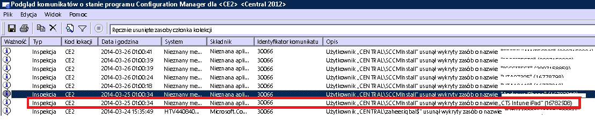

# Rozwiązywanie problemów dotyczących rejestrowania urządzeń w usłudze Intune

Ten temat zawiera sugestie dotyczące rozwiązywania problemów z rejestracją urządzenia. Jeśli te informacje nie pomogą rozwiązać problemu, zobacz [How to get support for Microsoft Intune](how-to-get-support-for-microsoft-intune.md) (Jak uzyskać pomoc techniczną dotyczącą usługi Microsoft Intune), aby znaleźć więcej sposobów uzyskania pomocy.

## Początkowe kroki rozwiązywania problemów

Przed rozpoczęciem rozwiązywania problemów sprawdź, czy usługa Intune została prawidłowo skonfigurowana w celu umożliwienia rejestracji. O tych wymaganiach dotyczących konfiguracji można przeczytać w następujących tematach:

-   [Przygotowanie do rejestracji urządzeń w usłudze Microsoft Intune](/intune/deploy-use/get-ready-to-enroll-devices-in-microsoft-intune)
-   [Konfigurowanie zarządzania systemem iOS i komputerami Mac](/intune/deploy-use/set-up-ios-and-mac-management-with-microsoft-intune)
-   [Konfigurowanie zarządzania systemem Windows 10 Mobile i Windows Phone przy użyciu usługi Microsoft Intune](/intune/deploy-use/set-up-windows-phone-management-with-microsoft-intune)
-   [Konfigurowanie zarządzania urządzeniami z systemem Windows](/intune/deploy-use/set-up-windows-device-management-with-microsoft-intune)

Użytkownicy urządzenia zarządzanego mogą zbierać dzienniki rejestracji i dzienniki diagnostyczne, z którymi możesz się zapoznać. Instrukcje użytkownika dotyczące zbierania tych dzienników przedstawiono w następujących tematach:

- [Wysyłanie dzienników danych diagnostycznych systemu Android do administratora IT za pomocą kabla USB](/intune/enduser/send-diagnostic-data-logs-to-your-it-administrator-using-a-usb-cable-android)
- [Wysyłanie dzienników danych diagnostycznych systemu Android do administratora IT za pomocą poczty e-mail](/intune/enduser/send-diagnostic-data-logs-to-your-it-administrator-using-email-android)
- [Wysyłanie błędów rejestracji systemu Android do administratora IT](/intune/enduser/send-enrollment-errors-to-your-it-administrator-android)
- [Wysyłanie błędów rejestracji systemu iOS do administratora IT](/intune/enduser/send-errors-to-your-it-admin-ios)

## Ogólne problemy dotyczące rejestrowania
Te problemy mogą wystąpić na wszystkich platformach urządzeń.

### Osiągnięto limit urządzeń
**Problem: **podczas rejestracji urządzenia występuje błąd, na przykład **Portal firmy jest tymczasowo niedostępny** na urządzeniu z systemem iOS, a dziennik DMPdownloader.log programu Configuration Manager zawiera błąd **DeviceCapReached**.

**Rozwiązanie:** liczbę urządzeń, które mogą zostać zarejestrowane przez użytkowników, nie może być większa niż 5. Jest to ograniczenie wprowadzone celowo.

#### Sprawdzanie liczby zarejestrowanych i dozwolonych urządzeń

1.  W portalu administracyjnym usługi Intune sprawdź, że użytkownikowi nie przypisano więcej niż 5 urządzeń.

2.  W portalu administracyjnym usługi Intune w obszarze Administracja\Zarządzanie urządzeniami przenośnymi\Reguły rejestracji sprawdź, czy opcja Limit rejestracji urządzeń została ustawiona na wartość 5.

Użytkownicy urządzeń przenośnych mogą usuwać urządzenia, korzystając z następującego adresu URL: [https://byodtestservice.azurewebsites.net/](https://byodtestservice.azurewebsites.net/).

Administratorzy mogą usuwać urządzenia w portalu usługi Azure Active Directory.

#### Aby usunąć urządzenia w portalu usługi Azure Active Directory

1.  Przejdź do witryny [http://aka.ms/accessaad](http://aka.ms/accessaad) lub wybierz pozycję **Administrator** &gt; **Azure AD** w witrynie [https://portal.office.com](https://portal.office.com).

2.  Zaloguj się za pomocą Identyfikatora organizacji, korzystając z linku w lewej części strony.

3.  Utwórz subskrypcję platformy Azure, jeśli jej nie masz. Jeśli masz płatne konto, ta operacja nie powinna wymagać uiszczenia płatności ani podania danych karty kredytowej (wybierz link do subskrypcji **Zarejestruj bezpłatny katalog Azure Active Directory**).

4.  Wybierz pozycję **Active Directory** , a następnie wybierz organizację.

5.  Wybierz kartę **Użytkownicy** .

6.  Wybierz użytkownika, którego urządzenia chcesz usunąć.

7.  Wybierz pozycję **Urządzenia**.

8.  Usuń urządzenia zgodnie z potrzebami, na przykład takie, które nie są już w użyciu lub zawierają niedokładne definicje.

> [!NOTE]

> Można uniknąć limitu rejestracji urządzeń, używając menedżerów rejestracji urządzeń zgodnie z opisem w temacie [Enroll corporate-owned devices with the Device Enrollment Manager in Microsoft Intune](/intune/deploy-use/enroll-corporate-owned-devices-with-the-device-enrollment-manager-in-microsoft-intune) (Rejestrowanie urządzeń należących do firmy przy użyciu menedżera rejestracji urządzeń w usłudze Microsoft Intune).
>
> Konto użytkownika, które jest dodawane do grupy Menedżerowie rejestracji urządzeń, nie będzie mogło zostać użyte do ukończenia procesu rejestrowania, jeśli dla danych logowania tego użytkownika zostaną wymuszone zasady Dostęp warunkowy.

### Portal firmy jest tymczasowo niedostępny
**Problem: **na urządzeniu występuje błąd **Portal firmy jest tymczasowo niedostępny**.

#### Rozwiązywanie problemu dotyczącego błędu Portal firmy jest tymczasowo niedostępny

1.  Usuń aplikację Portal firmy dla usługi Intune z urządzenia.

2.  Na urządzeniu otwórz przeglądarkę, przejdź do witryny [https://portal.manage.microsoft.com](https://portal.manage.microsoft.com)i spróbuj zalogować użytkownika.

3.  Jeśli użytkownik nie może się zalogować, niech spróbuje skorzystać z innej sieci.

4.  Jeśli ten sposób również zawiedzie, sprawdź, czy poświadczenia użytkownika zostały prawidłowo zsynchronizowane z usługą Azure Active Directory.

5.  Jeśli logowanie użytkownika przebiegnie pomyślnie, na urządzeniu z systemem iOS zostanie wyświetlony monit o zainstalowanie aplikacji Portal firmy dla usługi Intune i zarejestrowanie. Na urządzeniu z systemem Android należy ręcznie zainstalować aplikację Portal firmy dla usługi Intune, po czym będzie można ponowić próbę rejestracji.

### Niezdefiniowany urząd MDM
**Problem: **występuje błąd **Nie zdefiniowano urzędu MDM**.

#### Rozwiązywanie problemów dotyczących błędu Niezdefiniowany urząd MDM

1.  Sprawdź, czy urząd MDM został odpowiednio ustawiony dla używanej wersji usługi Intune (dla usługi Intune, rozwiązania MDM w usłudze Office 365 lub usługi Intune z programem System Center Configuration Manager). W przypadku usługi Intune urząd zarządzania urządzeniami przenośnymi jest ustawiany w obszarze **Administracja** &gt; **Zarządzanie urządzeniami przenośnymi**. W przypadku programu Configuration Manager z usługą Intune jest on ustawiany podczas konfigurowania łącznika usługi Intune, a w usłudze Office 365 służy do tego ustawienie **Urządzenia przenośne**.

    > [!NOTE]
    > Ustawiony urząd zarządzania urządzeniami przenośnymi można zmienić tylko po skontaktowaniu się z pomocą techniczną. Opis tej procedury zawarto w artykule [Jak uzyskać pomoc techniczną dotyczącą usługi Microsoft Intune](how-to-get-support-for-microsoft-intune.md).

2.  Upewnij się, że poświadczenia użytkownika zostały prawidłowo zsynchronizowane z usługą Azure Active Directory. W tym celu sprawdź, czy ich nazwy UPN odpowiadają informacjom o usłudze Active Directory w portalu konta.
    Jeśli nazwa UPN jest niezgodna z informacjami z usługi Active Directory:

    1.  Wyłącz narzędzie DirSync na serwerze lokalnym.

    2.  Usuń niezgodnego użytkownika z listy użytkowników w **portalu konta usługi Intune** .

    3.  Poczekaj około jednej godziny, aby umożliwić usunięcie nieprawidłowych danych z usługi Azure.

    4.  Włącz ponownie narzędzie DirSync i sprawdź, czy użytkownik jest teraz prawidłowo synchronizowany.

3.  W przypadku gdy używasz usługi Intune z programem System Center Configuration Manager, sprawdź, czy użytkownik ma prawidłowy identyfikator użytkownika chmury:

    1.  Otwórz program SQL Management Studio.

    2.  Nawiąż połączenie z odpowiednią bazą danych.

    3.  Otwórz folder baz danych i znajdź, a następnie otwórz folder **CM_DBName**, gdzie DBName to nazwa bazy danych klienta.

    4.  U góry wybierz pozycję **Nowa kwerenda** i wykonaj następujące zapytania:

        -   Aby wyświetlić wszystkich użytkowników: `select * from [CM_ DBName].[dbo].[User_DISC]`

        -   Aby wyświetlić konkretnych użytkowników, użyj następującego zapytania, gdzie % testuser1% reprezentuje nazwę nazwa_użytkownika@domena.com dla użytkownika, którego chcesz wyszukać: `select * from [CM_ DBName].[dbo].[User_DISC] where User_Principal_Name0 like '%testuser1%'`

        Po zapisaniu zapytania wybierz pozycję **!Wykonaj**.
        Po zwróceniu wyników poszukaj identyfikatora użytkownika chmury.  Jeśli identyfikator nie zostanie znaleziony, oznacza to, że użytkownik nie ma licencji na korzystanie z usługi Intune.

### Nie można utworzyć zasad lub zarejestrować urządzeń, jeśli nazwa firmy zawiera znaki specjalne.
**Problem:** Nie można utworzyć zasad lub zarejestrować urządzeń.

**Rozwiązanie:** W [centrum administracyjnym usługi Office 365](https://portal.office.com/) usuń znaki specjalne z nazwy firmy i zapisz informacje o firmie.

### Nie można zalogować się lub zarejestrować urządzeń w przypadku posiadania wielu zweryfikowanych domen
**Problem:** Po dodaniu drugiej zweryfikowanej domeny do usług ADFS możliwe, że użytkownicy z sufiksem nazwy głównej użytkownika (UPN) drugiej domeny nie będą mogli zalogować się do portali lub rejestrować urządzeń. 

**Rozwiązanie:** W przypadku klientów usługi Microsoft Office 365 korzystających z funkcji logowania jednokrotnego (SSO) przy użyciu usług AD FS 2.0 i mających wiele domen najwyższego poziomu dla sufiksów nazw głównych użytkowników w organizacji (na przykład @contoso.com lub @fabrikam.com) jest wymagane wdrożenie oddzielnego wystąpienia usługi federacyjnej AD FS 2.0 na każdy sufiks.  Obecnie dostępny jest [zbiorczy pakiet aktualizacji dla usług AD FS 2.0](http://support.microsoft.com/kb/2607496) działający w połączeniu z przełącznikiem **SupportMultipleDomain** w celu włączenia obsługi tego scenariusza przez serwer usług AD FS bez konieczności dodawania dodatkowych serwerów usługi AD FS 2.0. Aby uzyskać więcej informacji, zobacz [ten blog](https://blogs.technet.microsoft.com/abizerh/2013/02/05/supportmultipledomain-switch-when-managing-sso-to-office-365/).

## Problemy z systemem android
### Instalacja profilu nie powiodła się
**Problem: ** Na urządzeniu z systemem Android wystąpił błąd **Instalacja profilu nie powiodła się**.

### Kroki rozwiązywania problemów dotyczących niepowodzenia instalacji profilu

1.  Upewnij się, że użytkownikowi przypisano odpowiednią licencję dla używanej wersji usługi Intune.

2.  Sprawdź, czy urządzenie nie zostało już zarejestrowane za pomocą innego dostawcy MDM lub czy nie zainstalowano już dla niego profilu zarządzania.

4.  Upewnij się, że domyślną przeglądarką w systemie jest program Chrome dla systemu Android oraz że pliki cookie są włączone.

### Problemy z certyfikatami systemu Android

**Problem**: Użytkownik otrzymuje następujący komunikat na urządzeniu: *„Nie możesz się zalogować ze względu na brak wymaganego certyfikatu na urządzeniu”.*

**Rozwiązanie**: 

- Istnieje możliwość, że użytkownik może pobrać brakujący certyfikat, wykonując [następujące instrukcje](/intune/enduser/your-device-is-missing-a-required-certificate-android#your-device-is-missing-a-certificate-required-by-your-it-administrator).
- Jeśli użytkownik nie może pobrać certyfikatu, może brakować pośrednich certyfikatów na serwerze usług AD FS. Certyfikaty pośrednie są wymagane przez system Android w celu zapewnienia zaufania serwera. 

Certyfikaty można zaimportować do magazynu pośredniego na serwerze usług AD FS lub serwerze proxy w następujący sposób:

1.  Na serwerze usług AD FS uruchom program **Microsoft Management Console** i dodaj przystawkę Certyfikaty dla **konta komputera**. 
5.  Znajdź certyfikat, którego używa usługa AD FS i wyświetl jego certyfikat nadrzędny.
6.  Skopiuj certyfikat nadrzędny i wklej go w obszarze **Computer\Intermediate Certification Authorities\Certificates**.
7.  Skopiuj certyfikaty usług AD FS, odszyfrowywania usług AD FS i podpisywania usług AD FS i wklej je w magazynie osobistym usługi AD FS.
8.  Uruchom ponownie serwery usługi AD FS.

Zalogowanie się do aplikacji Portal firmy na urządzeniu z systemem Android powinno być teraz możliwe.

## Problemy z systemem iOS
### Instalacja profilu nie powiodła się
**Problem: ** Na urządzeniu z systemem iOS wystąpił błąd **Instalacja profilu nie powiodła się**.

### Kroki rozwiązywania problemów dotyczących niepowodzenia instalacji profilu

1.  Upewnij się, że użytkownikowi przypisano odpowiednią licencję dla używanej wersji usługi Intune.

2.  Sprawdź, czy urządzenie nie zostało już zarejestrowane za pomocą innego dostawcy MDM lub czy nie zainstalowano już dla niego profilu zarządzania.

3.  Przejdź do witryny [https://portal.manage.microsoft.com](https://portal.manage.microsoft.com) i po wyświetleniu monitu spróbuj zainstalować profil.

4.  Upewnij się, że domyślną przeglądarką jest program Safari dla systemu iOS oraz że pliki cookie są włączone.

### Zarejestrowane urządzenie z systemem iOS nie jest wyświetlane w konsoli podczas korzystania z programu System Center Configuration Manager z usługą Intune
**Problem:** Użytkownik rejestruje urządzenie z systemem iOS, ale nie jest ono wyświetlane w konsoli administracyjnej programu Configuration Manager. Urządzenie nie wskazuje, że zostało zarejestrowane. Możliwe przyczyny:

- Łącznik usługi Intune mógł zostać zarejestrowany na jednym koncie, a następnie zarejestrowany na innym koncie. 
- Możliwe, że pobrano certyfikat zarządzania urządzeniami przenośnymi z jednego konta i użyto go na innym koncie.

**Rozwiązanie:** Wykonaj następujące kroki:

1. Wyłącz system iOS w łączniku usługi Windows Intune. 
    1. Kliknij prawym przyciskiem myszy subskrypcję usługi Intune i wybierz pozycję **Właściwości**.
    1. Na karcie „iOS” usuń zaznaczenie pola wyboru „Włącz rejestrację systemu iOS”.

1. W programie SQL uruchom następujące kroki w bazie danych CAS:
  
    1. update SC_ClientComponent_Property set Value2 = '' where Name like '%APNS%' 
    1. delete from MDMPolicy where PolicyType = 7 
    1. delete from MDMPolicyAssignment where PolicyType = 7
    1. update SC_ClientComponent_Property set Value2 = '' where Name like '%APNS%' 
    1. delete from MDMPolicy where PolicyType = 11 
    1. delete from MDMPolicyAssignment where PolicyType = 11 
    1. DELETE Drs_Signals
1. Uruchom ponownie usługę główną programu SMS lub serwer CM 

1. Uzyskaj nowy certyfikat APN i przekaż go: kliknij prawym przyciskiem myszy subskrypcję usługi Intune w lewym okienku programu Configuration Manager. Wybierz polecenie **Utwórz żądanie certyfikatu usług APN** i postępuj zgodnie z instrukcjami.
## Problemy dotyczące korzystania z programu System Center Configuration Manager z usługą Intune
### Urządzenia przenośne znikają 
**Problem:** po pomyślnym zarejestrowaniu urządzenia przenośnego w programie Configuration Manager znika ono z kolekcji urządzeń przenośnych, ale jego profil zarządzania nadal istnieje i znajduje się ono na liście w obszarze Brama CSS.

**Rozwiązanie: **taka sytuacja może wystąpić, ponieważ istnieje niestandardowy proces usuwający urządzenia, które nie są przyłączone do domeny, lub użytkownik wycofał urządzenie z subskrypcji. Aby to zweryfikować i sprawdzić, który proces lub które konto użytkownika usunęło urządzenie z konsoli programu Configuration Manager, wykonaj następujące kroki.

#### Sprawdzanie sposobu usunięcia urządzenia

1.  W konsoli administracyjnej programu Configuration Manager wybierz pozycję **Monitorowanie** &gt; **Stan systemu** &gt; **Kwerendy komunikatów o stanie**.

2.  Kliknij prawym przyciskiem myszy pozycję **Ręcznie usunięte zasoby członka kolekcji** i wybierz polecenie **Pokaż komunikaty**.

3.  Wybierz odpowiednią datę i godzinę lub ostatnie 12 godzin.

4.  Znajdź dane urządzenie i sprawdź, jak zostało ono usunięte. W poniższym przykładzie pokazano sytuację, w której konto SCCMInstall usunęło urządzenie za pomocą nieznanej aplikacji.

    

5.  Upewnij się, że program Configuration Manager nie ma zaplanowanego zadania, skryptu ani innego procesu, który mógłby automatycznie usuwać urządzenia nienależące do domeny, urządzenia przenośne lub pokrewne.

### Inne błędy rejestracji urządzeń z systemem iOS
Lista błędów rejestracji urządzeń z systemem iOS znajduje się w naszej dokumentacji użytkownika urządzenia w temacie [You see errors while trying to enroll your device in Intune](/intune/enduser/using-your-ios-or-mac-os-x-device-with-intune) (Podczas próby zarejestrowania urządzenia w usłudze Intune występują błędy).

## Problemy z komputerem PC

### Maszyna jest już zarejestrowana — błąd hr 0x8007064c
**Problem:** Rejestracja kończy się niepowodzeniem z powodu błędu **Maszyna jest już zarejestrowana**. Dziennik rejestracji zawiera błąd **hr 0x8007064c**.
  
Może to być spowodowane wcześniejszym zarejestrowaniem komputera lub używaniem na komputerze sklonowanego obrazu innego komputera, który został zarejestrowany. Certyfikat poprzedniego konta nadal istnieje na komputerze.

**Rozwiązanie:** 

1. W menu **Start** wybierz polecenie **Uruchom** -> **MMC**. 
1. **Plik** -> **Dodawanie lub usuwanie przystawek**.
1. Kliknij dwukrotnie pozycję **Certyfikaty**, wybierz pozycję **Konto komputera**, kliknij przycisk **Dalej** i wybierz pozycję **Komputer lokalny**.
1. Kliknij dwukrotnie pozycję **Certyfikaty (komputer lokalny)** i wybierz pozycję **Osobiste/certyfikaty**. 
1. Wyszukaj certyfikat usługi Intune wydany przez wydawcę Sc_Online_Issuing i usuń go, jeśli istnieje.
1. Usuń następujący klucz rejestru, jeśli istnieje, oraz wszystkie klucze podrzędne: **HKEY_LOCAL_MACHINE\SOFTWARE\Microsoft\OnlineManagement regkey**.
1. Spróbuj ponownie wykonać rejestrację. 
1. Jeśli nadal nie można zarejestrować maszyny, /wyszukaj następujący klucz i usuń go, jeśli istnieje: **KEY_CLASSES_ROOT\Installer\Products\6985F0077D3EEB44AB6849B5D7913E95**. 
1. Spróbuj ponownie wykonać rejestrację. 

    > [!IMPORTANT]
    > Ta sekcja, metoda lub zadanie zawiera kroki dotyczące sposobu modyfikowania rejestru. Jednak nieprawidłowa modyfikacja rejestru może powodować poważne problemy. Dlatego należy ostrożnie wykonywać te czynności. W celu zapewnienia dodatkowej ochrony utwórz kopię zapasową rejestru przed rozpoczęciem wprowadzania zmian. Dzięki temu w razie problemów będzie można przywrócić rejestr.
    > Aby uzyskać więcej informacji na temat tworzenia kopii zapasowej i przywracania rejestru, przeczytaj temat [Jak wykonać kopię zapasową i przywrócić rejestr w systemie Windows XP](https://support.microsoft.com/en-us/kb/322756).

## Ogólne kody błędów rejestracji

|Kod błędu|Możliwy problem|Sugerowane rozwiązanie|
|--------------|--------------------|----------------------------------------|
|0x80CF0437 |W zegarze na komputerze klienckim nie ustawiono prawidłowego czasu.|Upewnij się, że dla zegara i strefy czasowej na komputerze klienckim ustawiono prawidłową godzinę i strefę czasową.|
|0x80240438, 0x80CF0438, 0x80CF402C|Nie można nawiązać połączenia z usługą Intune. Sprawdź ustawienia serwera proxy klienta.|Sprawdź, czy konfiguracja serwera proxy na komputerze klienckim jest obsługiwana przez usługę Intune i czy komputer kliencki ma dostęp do Internetu.|
|0x80240438, 0x80CF0438|Nie skonfigurowano ustawień serwera proxy w programie Internet Explorer i w systemie lokalnym.|Nie można nawiązać połączenia z usługą Intune. Sprawdź ustawienia serwera proxy klienta i upewnij się, że konfiguracja serwera proxy na komputerze klienckim jest obsługiwana przez usługę Intune i że komputer kliencki ma dostęp do Internetu.|
|0x80043001, 0x80CF3001, 0x80043004, 0x80CF3004|Pakiet rejestracyjny jest nieaktualny.|Pobierz i zainstaluj bieżący pakiet oprogramowania klienckiego z poziomu obszaru roboczego Administrator.|
|0x80043002, 0x80CF3002|Konto jest w trybie konserwacji.|Nie można zarejestrować nowych komputerów klienckich, gdy konto jest w trybie konserwacji. Aby wyświetlić ustawienia Twojego konta, zaloguj się do niego.|
|0x80043003, 0x80CF3003|Konto zostało usunięte.|Sprawdź, czy Twoje konto i subskrypcja usługi Intune są nadal aktywne. Aby wyświetlić ustawienia Twojego konta, zaloguj się do niego.|
|0x80043005, 0x80CF3005|Komputer kliencki został wycofany.|Poczekaj kilka godzin, usuń wszelkie wcześniejsze wersje oprogramowania klienckiego z komputera, a następnie ponów próbę instalacji oprogramowania klienckiego.|
|0x80043006, 0x80CF3006|Osiągnięto maksymalną liczbę dozwolonych stanowisk dla konta.|Twoja organizacja musi zakupić dodatkowe licencje na stanowiska, aby można było zarejestrować więcej komputerów klienckich w usłudze.|
|0x80043007, 0x80CF3007|Nie można odnaleźć pliku certyfikatu w folderze programu instalacyjnego.|Wyodrębnij wszystkie pliki przed rozpoczęciem instalacji. Nie zmieniaj nazw wyodrębnionych plików ani ich nie przenoś: wszystkie pliki muszą znajdować się w tym samym folderze — w przeciwnym razie instalacja się nie powiedzie.|
|0x8024D015, 0x00240005, 0x80070BC2, 0x80070BC9, 0x80CFD015|Nie można zainstalować oprogramowania, ponieważ komputer kliencki oczekuje na ponowne uruchomienie.|Uruchom ponownie komputer, a następnie ponów próbę instalacji oprogramowania klienckiego.|
|0x80070032|Na komputerze klienckim nie odnaleziono co najmniej jednego wymagania wstępnego dotyczącego instalacji oprogramowania klienckiego.|Upewnij się, że na komputerze klienckim są zainstalowane wszystkie wymagane aktualizacje, a następnie ponów próbę instalacji oprogramowania klienckiego.|
|0x80043008, 0x80CF3008|Uruchomienie usługi Microsoft Online Management Updates nie powiodło się.|Skontaktuj się z pomocą techniczną zgodnie z opisem w temacie [How to get support for Microsoft Intune](how-to-get-support-for-microsoft-intune.md) (Jak uzyskać pomoc techniczną dotyczącą usługi Microsoft Intune).|
|0x80043009, 0x80CF3009|Komputer kliencki jest już zarejestrowany w usłudze.|Aby móc ponownie zarejestrować komputer kliencki w usłudze, musisz go najpierw wycofać.|
|0x8004300B, 0x80CF300B|Nie można uruchomić pakietu instalacyjnego oprogramowania klienckiego, ponieważ wersja systemu Windows uruchomiona na kliencie jest nieobsługiwana.|Usługa Intune nie obsługuje wersji systemu Windows uruchomionej na komputerze klienckim.|
|0xAB2|Instalator Windows nie może uzyskać dostępu do środowiska wykonawczego VBScript w celu wykonania akcji niestandardowej.|Przyczyną tego błędu jest próba wykonania akcji niestandardowej opartej na dołączanych dynamicznie bibliotekach (DLL). Podczas rozwiązywania problemu z biblioteką DLL może być konieczne użycie narzędzi opisanych w artykule KB198038 z bazy wiedzy pomocy technicznej firmy Microsoft: [Useful Tools for Package and Deployment Issues](https://support.microsoft.com/en-us/kb/198038) (Przydatne narzędzia w przypadku problemów z tworzeniem pakietów i wdrażaniem).|
|0x80cf0440|Połączenie z punktem końcowym usługi zostało zakończone.|Konto próbne lub płatne zostało zawieszone. Utwórz nowe konto próbne lub płatne i zarejestruj je ponownie.|

### Następne kroki
Jeśli te informacje dotyczące rozwiązywania problemów nie pomogły, skontaktuj się z pomocą techniczną firmy Microsoft zgodnie z opisem w temacie [How to get support for Microsoft Intune](how-to-get-support-for-microsoft-intune.md) (Jak uzyskać pomoc techniczną dotyczącą usługi Microsoft Intune).

<!--HONumber=Jul16_HO3-->

