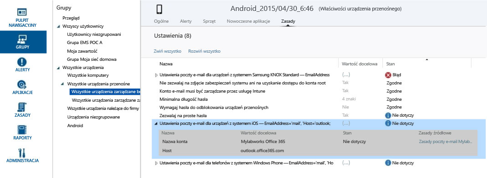

# Rozwiązywanie problemów dotyczących zasad w usłudze Microsoft Intune

Jeśli masz problemy z wdrażaniem zasad i zarządzaniem nimi za pomocą usługi Intune, zacznij tutaj. Ten temat zawiera omówienie i rozwiązania niektórych typowych problemów, które mogą wystąpić.

## Czy zasady zostały zastosowane do urządzenia?
**Problem:** nie jest jasne, czy konkretne zasady są stosowane do urządzenia, lub urządzenie zachowuje się sprzecznie z zasadami.

Sprawdź informacje o zasadach dostępne dla każdego urządzenia, aby zrozumieć, w jaki sposób zasady wpływają na konkretne urządzenie.

W konsoli administracyjnej usługi Intune każde urządzenie ma kartę zasad w obszarze **Właściwości urządzenia**. W przypadku braku tej karty urządzenie może nadal znajdować się w trakcie rejestrowania lub zasady mogą nie mieć do niego zastosowania. Wszystkie zasady mają parametry **Wartość zamierzona** i **Stan**. Wartość zamierzona to wartość, która miała być osiągnięta w momencie przypisywania zasad. Stanem jest to, co faktycznie się uzyskuje, gdy weźmie się pod uwagę wszystkie zasady dotyczące urządzenia, a także ograniczenia i wymagania sprzętowe oraz system operacyjny. Dostępne są następujące stany:

-   **Zgodne**: urządzenie odebrało zasady i zgłasza usłudze, że działa zgodnie z ich ustawieniem.

-   **Nie dotyczy**: ustawienie zasad nie ma zastosowania. Na przykład ustawienia poczty e-mail dla urządzeń z systemem iOS nie będą miały zastosowania do urządzenia z systemem Android.

-   **Oczekujące**: zasady zostały wysłane do urządzenia, ale nie zgłosiło ono stanu usłudze. Na przykład szyfrowanie w systemie Android wymaga od użytkownika końcowego włączenia szyfrowania, w związku z czym może być oczekujące.

Na poniższym zrzucie ekranu przedstawiono dwa proste przykłady:

-   Ustawienie **Zezwalaj na proste hasła** ma wartość **Tak**, jak pokazano w kolumnie **Wartość zamierzona**, ale jego ustawienie **Stan** ma wartość **Nie dotyczy**. Dzieje się tak, gdyż proste hasła nie są obsługiwane w przypadku urządzeń z systemem Android.

-   Podobnie rozwinięty element zasad **Ustawienia poczty e-mail dla urządzeń z systemem iOS** nie ma zastosowania do tego urządzenia, ponieważ jest to urządzenie z systemem Android.

> [!NOTE]
> Należy pamiętać, że jeśli dwie zasady z różnymi poziomami ograniczeń dotyczą tego samego urządzenia lub użytkownika, w praktyce zostaną zastosowane zasady bardziej restrykcyjne.

## Błędy związane z zasadami usługi Microsoft Intune w pliku policyplatform.log
W przypadku urządzeń z systemem Windows niezarządzanych przez usługę MDM błędy zasad w pliku policyplatform.log mogą wynikać z innych niż domyślne ustawień w Kontroli konta użytkownika systemu Windows na urządzeniu. Niektóre inne niż domyślne ustawienia funkcji Kontroli konta użytkownika mogą wpływać na instalacje klienta usługi Microsoft Intune i wykonywanie zasad.

### Aby rozwiązać problemy z Kontrolą konta użytkownika

1.  Wycofaj komputer w sposób opisany w temacie [Wycofywanie urządzeń z zarządzania usługi Microsoft Intune](/intune/deploy-use/retire-devices-from-microsoft-intune-management).

2.  Zaczekaj 20 minut na usunięcie oprogramowania klienckiego.

    > [!NOTE]
    > Nie należy próbować usuwać klienta z poziomu opcji Programy i funkcje.

3.  W menu start wpisz wartość **Kontrola konta użytkownika**, aby otworzyć ustawienia Kontroli konta użytkownika.

4.  Przesuń suwak powiadomień na ustawienie domyślne.

## Alert: zapisywanie reguł dostępu do programu Exchange nie powiodło się
**Problem**: w konsoli administracyjnej odebrano alert **Zapisywanie reguł dostępu w programie Exchange nie powiodło się**  .

Jeśli zasady utworzono w obszarze roboczym Zasady lokalnej instalacji programu Exchange w konsoli administracyjnej, ale używana jest usługa Office 365, skonfigurowane ustawienia zasad nie są wymuszane przez usługę Intune. Zanotuj źródło zasad wymienione w alercie.  W obszarze roboczym Zasady lokalnej instalacji programu Exchange usuń starsze reguły, ponieważ są to globalne reguły programu Exchange, które nie mają znaczenia dla usługi Office 365. Następnie utwórz nowe zasady dla usługi Office 365.

## BŁĄD: Nie można uzyskać wartości z komputera, 0x80041013
Ten błąd może występować, jeśli godzina w systemie lokalnym różni się o pięć minut lub więcej. Jeśli godzina na komputerze lokalnym nie jest zsynchronizowana, zabezpieczone transakcje zakończą się niepowodzeniem ze względu na nieprawidłowe sygnatury czasowe.

Aby rozwiązać ten problem, ustaw czas w systemie lokalnym jak najbardziej zbliżony do czasu z Internetu lub czasu ustawionego na kontrolerach domeny w sieci.

## Nie można zmienić zasad zabezpieczeń dla różnych urządzeń MDM
Urządzenia z systemem Windows Phone i Windows RT nie zezwalają na obniżenie bezpieczeństwa zasad zabezpieczeń ustawionych wcześniej za pośrednictwem usługi MDM lub EAS. Na przykład po ustawieniu dla zasady **Minimalna liczba znaków hasła** wartości 8 nastąpiła próba jej zmniejszenia do 4. Bardziej restrykcyjne zasady zostały już zastosowane do urządzenia.

W zależności od platformy urządzenia jeśli chcesz zmienić zasady na wartość mniej bezpieczną, może być konieczne zresetowanie zasad zabezpieczeń.
Na przykład w systemie Windows RT na pulpicie szybko przesuń palcem z prawej strony, aby otworzyć pasek **Panele funkcji** i wybierz pozycję **Ustawienia** &gt; **Panel sterowania**.  Wybierz aplet **Konta użytkowników** .
W menu nawigacji po lewej stronie u dołu ekranu znajduje się link **Resetuj zasady zabezpieczeń** . Wybierz go, a następnie wybierz przycisk **Resetuj zasady** .
W przypadku innych urządzeń MDM, takich jak urządzenia z systemem Android, Windows Phone 8.1 lub nowszym i iOS, może być konieczne wycofanie i ponownie zarejestrowanie w usłudze, aby można było zastosować mniej restrykcyjne zasady.

## Nie można utworzyć zasad lub zarejestrować klientów, jeśli nazwa firmy zawiera znaki specjalne.
**Problem:** Nie można utworzyć zasad lub zarejestrować klientów.

**Rozwiązanie:** W [centrum administracyjnym usługi Office 365](https://portal.office.com/) usuń znaki specjalne z nazwy firmy i zapisz informacje o firmie.

### Następne kroki
Jeśli te informacje dotyczące rozwiązywania problemów nie pomogły, skontaktuj się z pomocą techniczną firmy Microsoft zgodnie z opisem w temacie [How to get support for Microsoft Intune](how-to-get-support-for-microsoft-intune.md) (Jak uzyskać pomoc techniczną dotyczącą usługi Microsoft Intune).

<!--HONumber=Aug16_HO4-->

