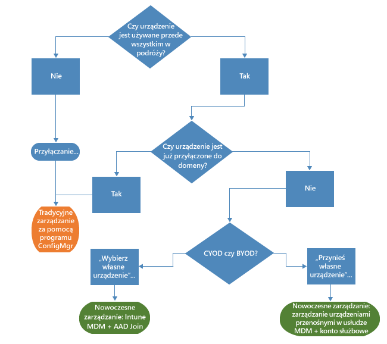

# Ścieżka do nowoczesnego zarządzania ekosystemem urządzeń z systemem Windows przy użyciu usługi Microsoft Intune

Tendencja do korzystania z urządzeń osobistych w pracy oraz wypełniania obowiązków zawodowych poza biurem skutkują zmianą metod zarządzania urządzeniami przez organizacje. Określone działy niektórych organizacji mogą wymagać szczegółowej kontroli nad urządzeniami, inne organizacje wdrażają natomiast lżejsze metody zarządzania oparte na scenariuszach, które zwiększają możliwości współczesnych pracowników.

System Windows 10 kontynuuje tradycję systemu Windows w zakresie dostarczania organizacjom systemu operacyjnego zapewniającego najlepsze możliwości zarządzania. System Windows zapewnia obsługę zaawansowanych metod zarządzania i zabezpieczeń za pomocą takich technologii, jak zasady grup, usługa Active Directory i program System Center Configuration Manager. Ponadto umożliwia on korzystanie z prostych, nowoczesnych metod zarządzania, w których na pierwszym miejscu stawiana jest mobilność i dostęp do chmury, za pomocą rozwiązań do zarządzania urządzeniami opartych na chmurze, takich jak pakiet Microsoft Enterprise Mobility Suite (EMS). Uzupełnieniem przyszłych innowacyjnych technologii systemu Windows dostarczanych w ramach modelu „system Windows jako usługa” są szybkie usługi chmurowe, takie jak Microsoft Intune, Azure Active Directory, Azure Rights Management, Office 365 i Sklep Windows dla firm.

Organizacje działające w branży IT mają większą elastyczność dzięki możliwościom korzystania z innowacji i ograniczania kosztów. Dokument ten zawiera wskazówki dotyczące strategii wdrażania systemu Windows 10 i zarządzania nim. Pozwala on także zapoznać się ze strategią firmy Microsoft dotyczącą narzędzi do zarządzania urządzeniami. Rozważając podstawowe zasady zarządzania i sposób ich stosowania do poszczególnych urządzeń, należy wziąć pod uwagę cztery następujące etapy cyklu życia urządzenia:

## Wdrażanie i aprowizacja

W przeciwieństwie do wdrażania tradycyjnych systemów operacyjnych, które wymaga złożonych działań informatycznych, nowoczesne zarządzanie urządzeniami udostępnia „gotowe do użycia metody zarządzania”. Dział informatyczny chce łatwo przekształcać nowe urządzenia w urządzenia w pełni skonfigurowane i oferujące pełne możliwości zarządzania bez ich odtwarzania z obrazów.  Dynamiczne inicjowanie obsługi jest łatwiejsze niż kiedykolwiek wcześniej. Umożliwiają to usługi zarządzania urządzeniami oparte na chmurze, takie jak Microsoft Intune. Można ponadto tworzyć autonomiczne pakiety inicjowania obsługi za pomocą narzędzia Windows Imaging and Configuration Designer (ICD). Firma Microsoft oczywiście nadal obsługuje również tradycyjne metody tworzenia obrazów, dzięki czemu organizacje mogą wdrażać obrazy niestandardowe za pomocą programu System Center Configuration Manager.

## Tożsamość i uwierzytelnianie

System Windows 10 i usługi, takie jak Azure Active Directory, otwierają nowe możliwości dla opartego na chmurze zarządzania tożsamościami i uwierzytelnianiem. Dzięki scenariuszom „Przynieś własne urządzenie” (BYOD, Bring Your Own Device) i „Wybierz własne urządzenie” (CYOD, Choose Your Own Device) przedsiębiorstwa mogą przemodelować metody uzyskiwania dostępu przez użytkowników do firmowych zasobów i aplikacji. Ogólnie rzecz biorąc, zarządzanie użytkownikami i urządzeniami można podzielić na dwie następujące kategorie:

- Firmowe (CYOD) lub osobiste (BYOD) urządzenia używane przez użytkowników urządzeń przenośnych dla aplikacji SaaS, takich jak usługa Office 365.

  System Windows 10 umożliwia pracownikom samodzielnie inicjowanie obsługi urządzeń. Na urządzeniach firmowych można łatwo skonfigurować dostęp firmowy za pomocą funkcji Azure AD Join. Podobnie, nowe, uproszczone środowisko BYOD pozwala użytkownikom dodawać konta służbowe do systemu Windows i uzyskiwać dostęp do zasobów służbowych na urządzeniach osobistych. Połączenie funkcji Azure AD Join i automatycznej rejestracji za pomocą usługi zarządzania urządzeniami przenośnymi usługi Intune umożliwia zainicjowanie zarządzania urządzeniami na poziomie korporacyjnym w [jednym prostym kroku](https://blogs.technet.microsoft.com/ad/2015/08/14/windows-10-azure-ad-and-microsoft-intune-automatic-mdm-enrollment-powered-by-the-cloud/) — wszystko to z poziomu chmury. Funkcja Azure AD Join jest również dobrym rozwiązaniem dla pracowników tymczasowych, partnerów lub innych pracowników na niepełnym etacie. Te konta mogą być oddzielone od lokalnej domeny usługi AD, ale mimo to uzyskiwać dostęp do potrzebnych zasobów firmowych.
- Przyłączone do domeny komputery i tablety korzystające z tradycyjnych aplikacji i zasobów, które wymagają uwierzytelniania lub uzyskują dostęp do poufnych lub tajnych zasobów lokalnych

  Urządzenia z systemem Windows 10 przyłączone do lokalnej domeny usługi Active Directory są automatycznie rejestrowane za pomocą usługi Azure AD, dzięki czemu użytkownicy mogą korzystać z dodatkowych zalet środowiska systemu Windows 10, takich jak logowanie jednokrotne do chmury i dostęp do zasobów lokalnych z dowolnego miejsca, mobilny dostęp firmowy do ustawień, usługa Microsoft Passport for Work i funkcja Windows Hello. Komputery i tablety przyłączone do domeny powinny nadal być zarządzane za pomocą klienta programu System Center Configuration Manager lub zasad grupy.

Przejrzyj role w swojej organizacji. Zidentyfikuj użytkowników lub urządzania wymagające przyłączenia do domeny i rozważ przełączenie pozostałych użytkowników do usługi Azure AD. Więcej możesz przeczytać w [tym artykule](https://azure.microsoft.com/en-us/documentation/articles/active-directory-azureadjoin-windows10-devices/) opisującym, jak system Windows 10 i usługa Azure AD optymalizują dostęp do zasobów służbowych w przypadku różnych urządzeń i scenariuszy.

Poniżej przedstawiono przykładowe ogólne drzewko decyzyjne. Oczywiście w niektórych przypadkach pojawią się wyjątki.

## Ustawienia i konfiguracja

O wymaganiach dotyczących konfiguracji mogą decydować wymagany poziom zarządzania, zarządzane urządzenia i dane oraz wymagania branżowe. Pracownicy często niepokoją się surowymi zasadami stosowanymi przez dział informatyczny do ich urządzeń osobistych, ale mimo to chcą mieć dostęp do firmowej poczty e-mail i dokumentów. System Windows 10 udostępnia spójny zestaw konfiguracji dla różnych komputerów, tabletów i telefonów w ramach wspólnej warstwy MDM. Metoda MDM wymaga ustawień spełniających zamiary administratora bez udostępniania każdego możliwego ustawienia. W przeciwieństwie do niej zasady grupy udostępniają szczegółowe ustawienia, które są indywidualnie kontrolowane przez administratora. Jedną z zalet metody MDM jest umożliwienie administratorom zapewniania szerszej prywatności, zabezpieczeń i ustawień zarządzania aplikacjami przy użyciu lżejszych i wydajniejszych narzędzi. Dzięki temu metoda MDM jest najlepszym wyborem dla urządzeń, które są stale używane w podróży.

Wiele organizacji musi nadal zarządzać komputerami przyłączonymi do domeny na poziomie szczegółowym, na przykład korzystając z 1500 konfigurowalnych ustawień zasad grup programu Internet Explorer lub bardzo szczegółowych reguł Zapory systemu Windows. W tych przypadkach najlepszym wyborem w zakresie metod zarządzania nadal są zasady grup i program System Center Configuration Manager. Zasady grup są najlepszym sposobem szczegółowego konfigurowania przyłączonych do domeny komputerów i tabletów z systemem Windows, które są połączone z siecią firmową przy użyciu narzędzi opartych na systemie Windows. Firma Microsoft nadal dodaje ustawienia zasad grup wraz z każdą nową wersją systemu Windows. W przypadku szczegółowej konfiguracji z zaawansowanym wdrażaniem oprogramowania, aktualizacjami systemu Windows i wdrażaniem systemów operacyjnych polecanym rozwiązaniem pozostaje program Configuration Manager.

## Aktualizowanie urządzeń z systemem Windows

Dzięki modelowi System Windows jako usługa organizacje z branży IT nie muszą już przeprowadzać złożonych procesów tworzenia obrazów („wyczyść i załaduj”) wraz z każdą nową wersją systemu Windows. Niezależnie od używanej opcji — Current Branch (CB) lub Current Branch for Business (CBB) — urządzenia otrzymują najnowsze aktualizacje dotyczące funkcji i działania systemu w ramach prostych — często automatycznych — procesów wdrażania poprawek. Metoda MDM z usługą Intune udostępnia narzędzia do stosowania aktualizacji systemu Windows na komputerach klienckich w przedsiębiorstwie. Program Configuration Manager umożliwia korzystanie z zaawansowanych funkcji zarządzania i monitorowania tych aktualizacji, w tym okna obsługi i automatyczne reguły wdrażania.

## Podsumowanie

Myśląc o ścieżce do nowoczesnego zarządzania urządzeniami w organizacji, należy rozważyć kroki, które można podjąć, aby rozpocząć ten proces.

1. **Istnieją inwestycje, których można dokonać już dziś.** Jakie składniki tradycyjnego zarządzania urządzeniami muszą zostać utrzymane i jakie obszary można zmodernizować? Niezależnie od tego, czy celem jest zminimalizowanie procesów tworzenia obrazów niestandardowych czy dokonanie ponownej oceny zarządzania ustawieniami lub uwierzytelniania i zgodności, korzyści mogą być natychmiastowe.

2. **Należy ocenić poszczególne przypadki użytkowania w danym środowisku.** Czy istnieją grupy urządzeń, które mogą odnieść korzyści z lżejszego, uproszczonego zarządzania? Na przykład urządzenia BYOD są naturalnymi kandydatami do objęcia zarządzaniem opartym na chmurze. Użytkownicy lub urządzenia korzystające z danych objętych bardziej szczegółowymi regulacjami mogą wymagać lokalnej domeny usługi AD na potrzeby uwierzytelniania. Program Configuration Manager i pakiet EMS zapewniają elastyczność etapowej implementacji nowoczesnych scenariuszy zarządzania, umożliwiając stosowanie ustawień do poszczególnych urządzeń w sposób najlepiej odpowiadający określonym potrzebom biznesowym. Wybór należy do Ciebie.

## Co dalej

- **Oceń potrzeby w zakresie zarządzania w danym środowisku.** Jedno rozwiązanie może nie być dopasowane do wszystkich potrzeb. Zależy to od charakteru pracowników, ich mobilności oraz używanych urządzeń i danych, do których uzyskują oni dostęp.
- **Uwzględnij określone wymagania.** System Windows 10, program Configuration Manager i pakiet Enterprise Mobility Suite zapewniają elastyczne możliwości obsługi procesów tworzenia obrazów, uwierzytelniania, ustawień, a także narzędzia do zarządzania, które można dopasować do dowolnego scenariusza.
- **Podziel proces na niewielkie etapy.** Przeniesienie się do nowoczesnego zarządzania urządzeniami nie musi się odbyć natychmiast.
- **Zoptymalizuj istniejące inwestycje.** W drodze z tradycyjnego lokalnego zarządzania do nowoczesnego zarządzania opartego na chmurze wykorzystaj elastyczną, hybrydową architekturę programu Configuration Manager i usługi Intune. Wprowadzając dodatkowe funkcje w modelu zarządzania tożsamościami opartym na chmurze/MDM, firma Microsoft stara się udostępnić przejrzystą ścieżkę z tradycyjnych do nowoczesnych metod zarządzania.

<!--HONumber=Oct16_HO4-->

