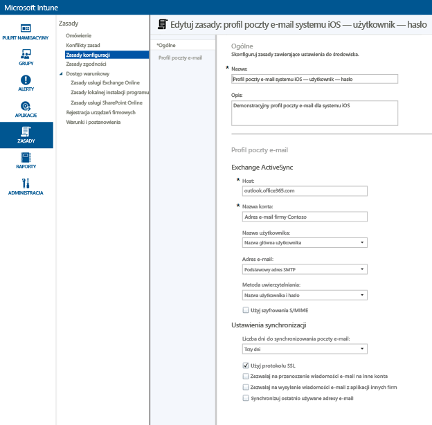
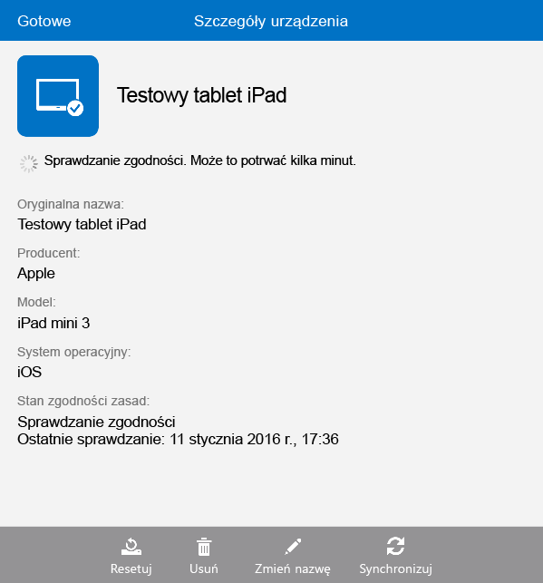

# Konfiguracja dostępu do poczty e-mail dla urządzeń z systemem iOS w usłudze Microsoft Intune
Gdy urządzenia zostaną zarejestrowane w usłudze Intune, można je skonfigurować tak, aby ich użytkownicy mieli dostęp do firmowej poczty e-mail. Jednym ze sposobów realizacji tego celu jest utworzenie i wdrożenie **profilu poczty e-mail** dla konkretnych urządzeń. Profile poczty e-mail są pewnego rodzaju zasadami usługi Intune, które konfigurują i łączą urządzenie użytkownika z firmową usługą poczty e-mail.
Korzystanie z profilu poczty e-mail sprawia, że dostęp do poczty e-mail jest automatyczny dla zarejestrowanych urządzeń, co eliminuje potrzebę ręcznego konfigurowania urządzenia. Profil poczty e-mail gwarantuje również, że wszyscy użytkownicy końcowi konfigurują dostęp w taki sam sposób i z użyciem tych samych ustawień podstawowych.

## Cele tego przewodnika

- Utworzenie i wdrożenie profilu poczty e-mail dla urządzeń z systemem iOS
- Sprawdzenie, czy pomyślnie zastosowano zasady profilu poczty e-mail

## Co jest potrzebne przed rozpoczęciem korzystania z tego przewodnika

- Serwer programu Exchange — lokalny albo hostowany na platformie Azure w ramach subskrypcji pakietu Office/E3.
- Nazwa hosta firmowego serwera programu Exchange. Jest to w pełni kwalifikowana nazwa domeny (FQDN), na przykład **contosodemo55.onmicrosoft.com**.
- Grupa użytkowników, dla której zostanie wdrożony profil poczty e-mail. Jeśli ukończono pracę z przewodnikiem [Rozpoczynanie pracy z wersją próbną usługi Microsoft Intune i wdrażanie zasad dotyczących numeru PIN w systemie iOS](start-a-microsoft-intune-trial-and-deploy-ios-pin-policy.md), możesz użyć utworzonej dla niego grupy użytkowników **GroupDemo**.
- Zarejestrowane urządzenia z systemem iOS, na których profil zostanie wdrożony. I ponownie — jeśli ukończono przewodnik [Rozpoczynanie pracy z wersją próbną usługi Microsoft Intune i wdrażanie zasad dotyczących numeru PIN w systemie iOS](start-a-microsoft-intune-trial-and-deploy-ios-pin-policy.md), oznacza to, że pewne urządzenia z systemem iOS zostały już zarejestrowane.

## Kroki tworzenia i wdrażania profilu poczty e-mail dla urządzeń z systemem iOS

Na potrzeby niniejszego przewodnika użyjemy hostowanego serwera programu Exchange, który jest dostępny z subskrypcją wersji próbnej.
1. W konsoli usługi Intune kliknij pozycję **Zasady**, a następnie kliknij pozycję **Dodaj zasady**.

2. W oknie dialogowym **Tworzenie nowych zasad** rozwiń pozycję **iOS**, wybierz pozycję **Profil poczty e-mail**, a następnie kliknij pozycję **Utwórz zasady**.  

3. Na stronie tworzenia zasad podaj nazwę zasad, na przykład **Profil poczty e-mail dla systemu iOS — użytkownik-hasło**, a następnie wprowadź opis. Jeśli istnieje wiele profilów poczty e-mail dla różnych typów urządzeń i różnych metod uwierzytelniania, nazwę można wykorzystać, aby określić przeznaczenie profilu.
4. Wprowadź nazwę hosta programu Exchange. Ponieważ w tym przewodniku używamy serwera programu Exchange hostowanego na platformie Azure, jako nazwę hosta wprowadzimy **outlook.office365.com**

5. Wprowadź nazwę konta, która będzie wyświetlana dla użytkowników urządzenia jako pomoc w identyfikacji usługi poczty e-mail, na przykład **Poczta e-mail firmy Contoso**.
6. Ponieważ aktualnie używamy nazwy użytkownika i hasła w celu uwierzytelnienia użytkownika na potrzeby usługi Exchange, dlatego pozostaw ustawienia nazwy użytkownika i hasła bez zmian.
7. Dostosuj ustawienia synchronizacji zgodnie z wymaganiami. Obecnie możesz użyć wartości domyślnych, chyba że jest ustawienie, które chcesz zmienić.  
8. Kliknij pozycję **Zapisz zasady**.
9. Zostanie wyświetlone okno dialogowe z pytaniem, czy chcesz wdrożyć zasady teraz. Kliknij przycisk **Tak**.

10. W wyświetlonym oknie wybierz grupę użytkowników, w której chcesz wdrożyć profil poczty e-mail, kliknij pozycję **Dodaj**, a następnie przycisk **OK**.  
  
Po minucie lub dwóch od kliknięcia przycisku **OK** rozpocznie się przesyłanie zasad do zarejestrowanych urządzeń.

## Kroki weryfikacji, czy profil został pomyślnie zastosowany

Aby sprawdzić, czy profil został zastosowany, potrzebujesz dostępu do jednego z urządzeń, na których wdrożono profil poczty e-mail.
1. Na urządzeniu z systemem iOS otwórz aplikację do obsługi poczty.
Aplikacja wyświetli monit z prośbą o podanie nazwy użytkownika i hasła jego konta e-mail.  

2. Wprowadź nazwę użytkownika i hasło konta e-mail programu Exchange, a następnie wybierz przycisk **OK**.
 Aplikacja obsługi poczty otworzy konto programu Exchange i rozpocznie się synchronizowanie poczty e-mail do urządzenia.

3. Sprawdź ustawienia konta w aplikacji poczty, aby upewnić się, że nazwa konta jest taka sama jak wprowadzona w profilu poczty e-mail (na przykład **Poczta e-mail firmy Contoso**), a ustawienia synchronizacji zostały skonfigurowane prawidłowo.

  
  Jeśli uważasz, że profil poczty e-mail nie został automatycznie zastosowany na urządzeniu, możesz ręcznie zastosować zasady, używając na nim aplikacji Portal firmy.
1. Otwórz aplikację Portal firmy.
2. Naciśnij pozycję **Moje urządzenia**.
3. Wybierz nazwę urządzenia.

4. Naciśnij kolejno pozycje **Synchronizacja** > **Sprawdź zgodność**.
 Po kilku chwilach profil poczty e-mail zostanie zastosowany na urządzeniu. Następnie należy wykonać kroki weryfikacji, aby sprawdzić, czy profil został pomyślnie zastosowany.

## Zobacz też
[Przewodnik dotyczący oceny usługi Intune](get-started-with-a-30-day-trial-of-microsoft-intune.md)

<!--HONumber=Jul16_HO4-->

