---
# required metadata

title: Rozpoczynanie pracy z wersją próbną usługi Microsoft Intune i wdrażanie zasad dotyczących numeru PIN w systemie iOS | Microsoft Intune
description:
keywords:
author: Staciebarker
manager: jeffgilb
ms.date: 04/28/2016
ms.topic: article
ms.prod:
ms.service: microsoft-intune
ms.technology:
ms.assetid: 06cb9a73-0f17-44b3-b334-86c98020316e

# optional metadata

#ROBOTS:
#audience:
#ms.devlang:
ms.reviewer: jeffgilb
ms.suite: ems
#ms.tgt_pltfrm:
#ms.custom:

---

# Rozpoczynanie pracy z wersją próbną usługi Microsoft Intune i wdrażanie zasad dotyczących numeru PIN w systemie iOS
Te szczegółowe instrukcje pomogą Ci skonfigurować wersję próbną usługi Intune i zasady dotyczące numeru PIN dla urządzeń z systemem iOS. Listę innych typowych zadań dotyczących oceny w usłudze Intune do wypróbowania można znaleźć w temacie [Typowe zadania oceny usługi Microsoft Intune](common-microsoft-intune-evaluation-tasks.md)..

## Przeglądanie wymagań wstępnych dotyczących tego zadania

-   Komputer z systemem Windows i programem Internet Explorer — do wykonywania zadań administracyjnych

-   Urządzenie z systemem iOS 7.1 lub nowszym na potrzeby weryfikowania zasad testowania użytkowników

-   Telefon do uwierzytelniania osoby podczas tworzenia konta wersji próbnej

## Tworzenie bezpłatnego konta wersji próbnej usługi Intune
> [!NOTE]
> Jeśli masz już subskrypcję usługi Intune, pomiń tę sekcję i przejdź do następnej.

1.  Na komputerze z systemem Windows kliknij prawym przyciskiem myszy program **Internet Explorer** (IE) i wybierz pozycję **Przeglądanie InPrivate**..

    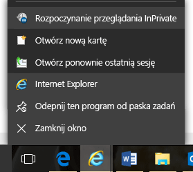

2.  Przejdź do [portalu tworzenia konta usługi Intune](https://portal.office.com/Signup/Signup.aspx?OfferId=40BE278A-DFD1-470a-9EF7-9F2596EA7FF9&dl=INTUNE_A&ali=1), podaj wymagane informacje i kliknij przycisk **Dalej**..

    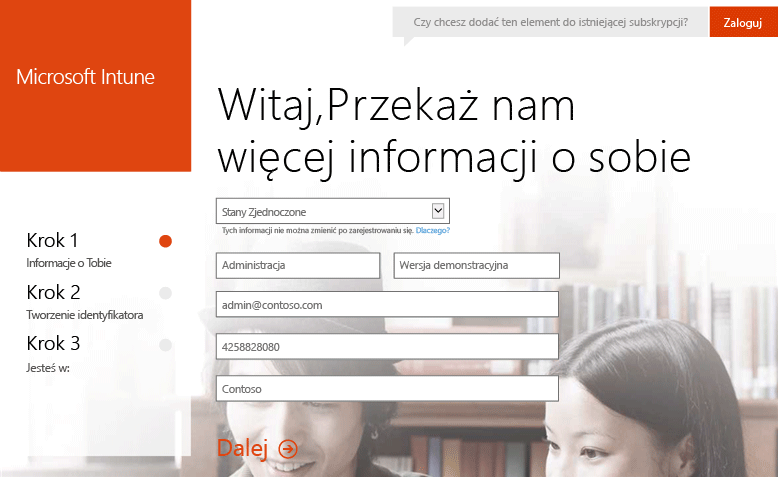

3.  Wprowadź identyfikator użytkownika i hasło do konta administratora, a następnie kliknij przycisk **Dalej**. Ten identyfikator będzie używany podczas logowania do portalu Intune w celu wykonania zadań administracyjnych.

    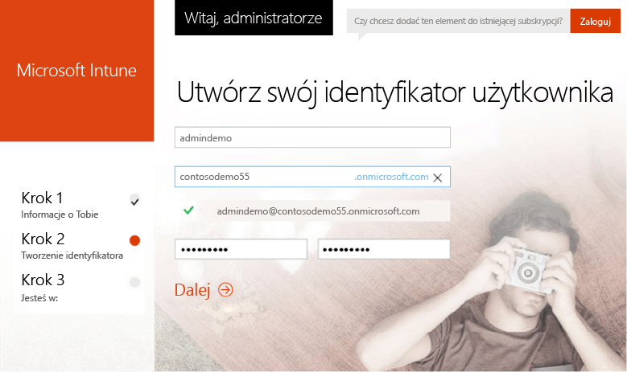

4.  Wprowadź numer telefonu komórkowego, a następnie kliknij pozycję **Wyślij do mnie SMS-a**, aby zweryfikować swój numer.

    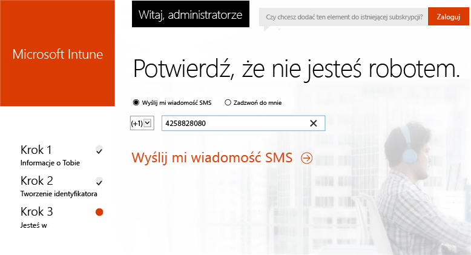

5.  Zapisz informacje wyświetlone na ekranie, a następnie kliknij pozycję oznaczającą, że **wszystko jest gotowe**..

    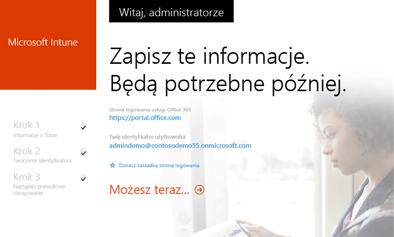

## Tworzenie użytkownika testowego

1.  Na komputerze z systemem Windows kliknij przycisk **Start**, aby przejść do strony zarządzania użytkownikami.

    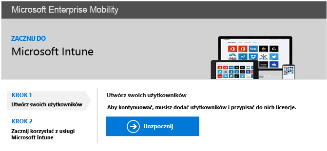

2.  Kliknij przycisk **+**, aby dodać użytkownika.

    

3.  Na stronie **Tworzenie nowego konta użytkownika**:

    1.  Podaj informacje o użytkowniku testowym.

    2.  Wybierz opcję **Wpisz hasło**.

    3.  Usuń zaznaczenie pola wyboru **Nakłoń tę osobę do zmiany hasła przy następnym logowaniu**.

    4.  Kliknij przycisk **Utwórz**..

    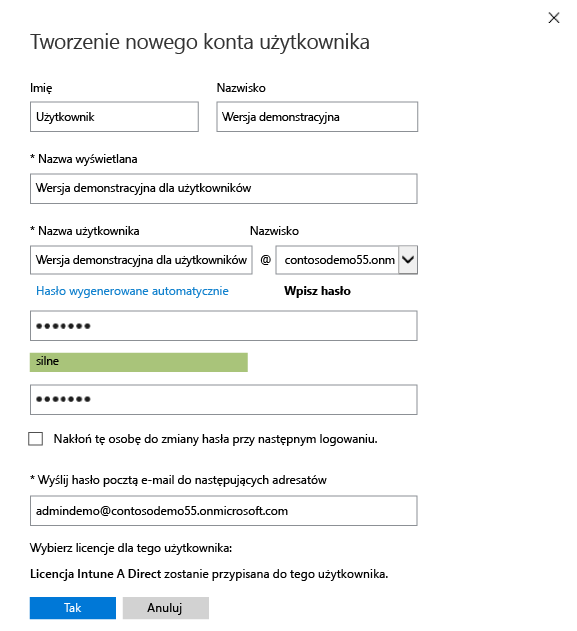

4.  Na stronie potwierdzenia utworzenia użytkownika kliknij przycisk **Zamknij**..

    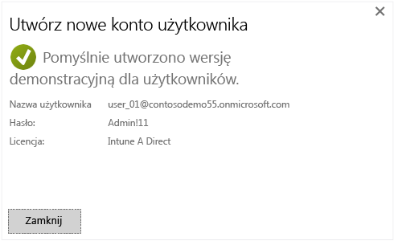

5.  Kliknij przycisk **Odśwież**, aby wyświetlić dane utworzonego użytkownika.

    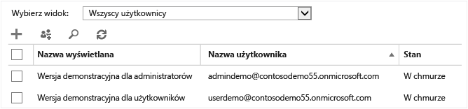

## Konfigurowanie zasad dotyczących numeru PIN systemu iOS dla użytkownika testowego

1.  Na komputerze z systemem Windows ustaw urząd zarządzania urządzeniami przenośnymi na usługę Intune:

    1.  Przejdź do [konsoli zarządzania usługą Intune](http://manage.microsoft.com/), zaloguj się przy użyciu konta administratora i kliknij pozycję **Rozpocznij zarządzanie urządzeniami przenośnymi**. Zostanie otwarta strona urzędu zarządzania urządzeniami przenośnymi.

        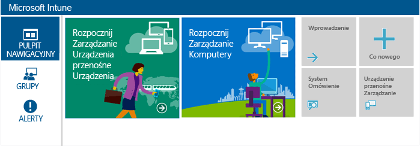

    2.  Kliknij link **Ustaw urząd zarządzania urządzeniami przenośnymi**.

        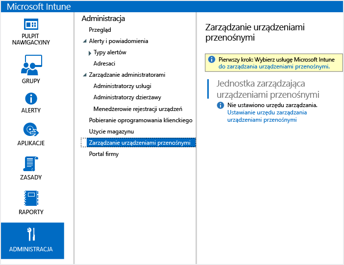

2.  Włączanie rejestracji urządzeń z systemem iOS. Ten proces powoduje ustawienie zaufanego certyfikatu między usługą Apple Push Notification Service (APNs) i subskrypcją usługi Intune.

    1.  Kliknij pozycję **Włącz platformę systemów iOS i Mac OS X**..

        

    2.  Kliknij pozycję **Pobierz żądanie certyfikatu APNs**..

        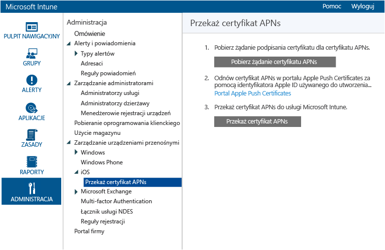

    3.  Określ nazwę pliku i lokalizację żądania podpisania certyfikatu (CSR, Certificate Signing Request), a następnie kliknij przycisk **Zapisz**. Ten plik zawiera klucz publiczny odpowiadający kluczowi prywatnemu przechowywanemu w ramach subskrypcji usługi Intune.

        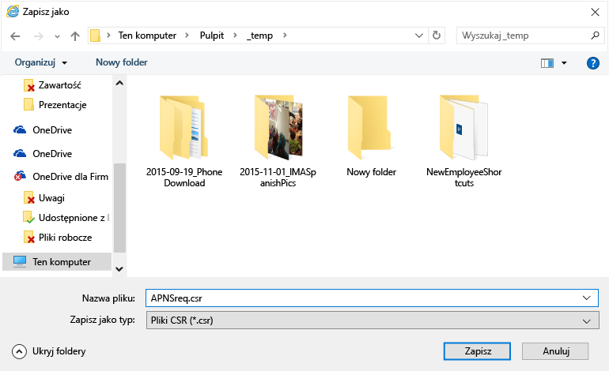

    4.  Kliknij **portal certyfikatów Apple Push**, aby utworzyć nową kartę.

        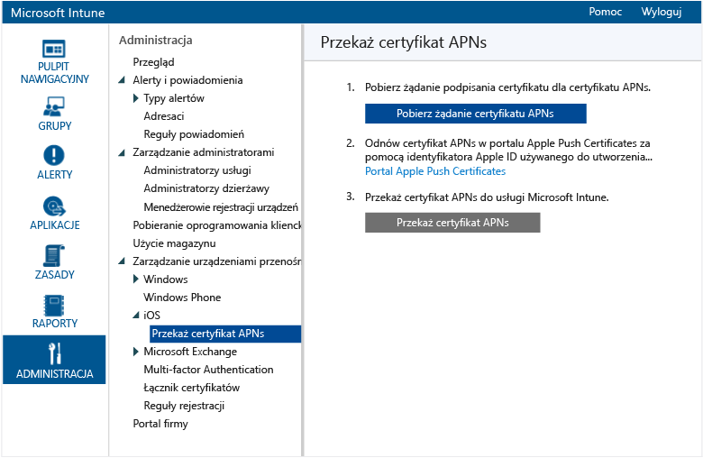

    5.  Wprowadź identyfikator Apple ID i hasło, a następnie kliknij pozycję **Zaloguj się**. Ten identyfikator może być używany na urządzeniu z systemem iOS w celu pobrania aplikacji ze sklepu iOS App Store.

        

    6.  Kliknij pozycję **Utwórz certyfikat**..

        

    7.  Przeczytaj warunki użytkowania produktów firmy Apple, zaznacz pole wyboru, a następnie kliknij pozycję **Akceptuj**..

        

    8.  Kliknij pozycję **Przeglądaj**..

        

    9. Wybierz zapisany wcześniej plik CSR, a następnie kliknij pozycję **Otwórz**..

        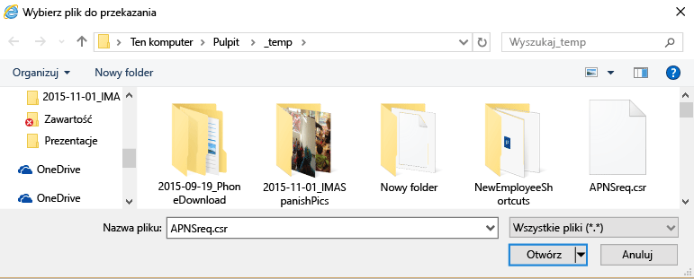

    10. Kliknij przycisk **Przekaż**.

        

    11. Gdy zostanie wyświetlony monit o pobranie pliku JSON, kliknij pozycję **Zapisz jako**..

        

    12. Określ lokalizację pliku JSON, a następnie kliknij pozycję **Zapisz**..

        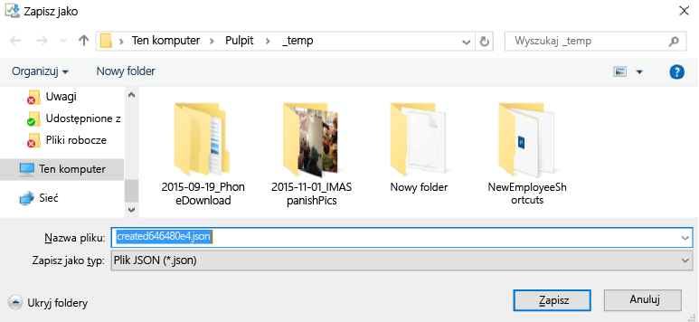

        Jeśli po kilku sekundach nie nastąpi automatyczne przekierowanie ze strony, kliknij pozycję **Anuluj**..

        

    13. Aby pobrać nowo utworzony plik certyfikatu, kliknij pozycję **Pobierz**..

        

    14. Gdy zostanie wyświetlony monit o pobranie pliku PEM, kliknij pozycję **Zapisz jako**..

        

    15. Określ lokalizację pliku PEM, a następnie kliknij pozycję **Zapisz**..

        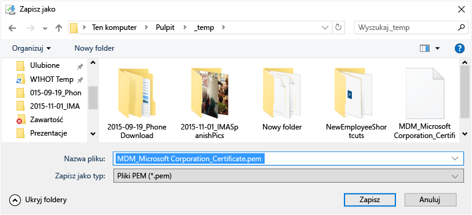

    16. Wróć do karty konsoli zarządzania usługą Intune, a następnie kliknij pozycję **Prześlij certyfikat APNs**..

        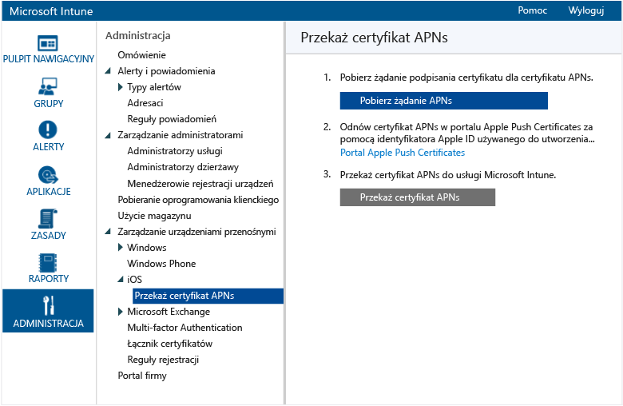

    17. Wprowadź identyfikator Apple ID, a następnie kliknij pozycję **Przeglądaj**..

        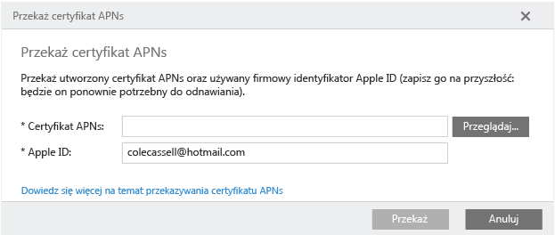

    18. Wybierz zapisany plik PEM, a następnie kliknij pozycję **Otwórz**..

        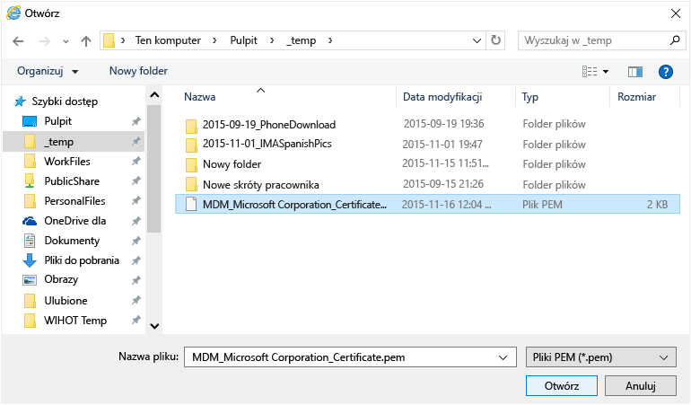

    19. Kliknij pozycję **Przekaż**..

        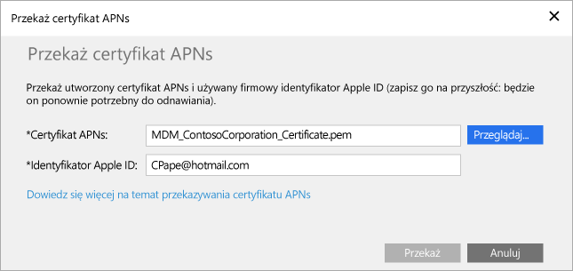

        Certyfikat usługi APNs został skonfigurowany.

        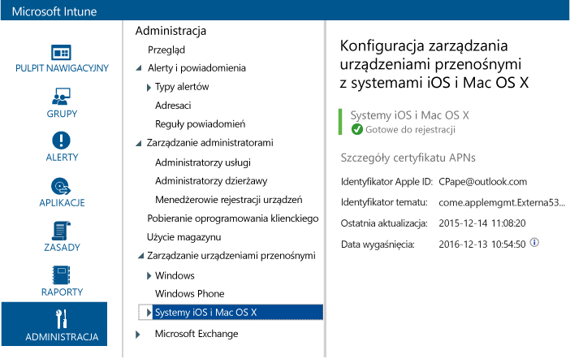

3.  Tworzenie testowej grupy użytkowników do użycia z zasadami:

    1.  W lewym okienku kliknij pozycję **Grupy**..

        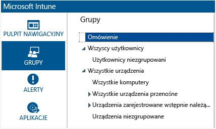

    2.  Kliknij pozycję **Utwórz grupę** po prawej stronie..

        

    3.  Podaj nazwę grupy, wybierz grupę **Wszyscy użytkownicy** jako nadrzędną, a następnie kliknij przycisk **Dalej**..

        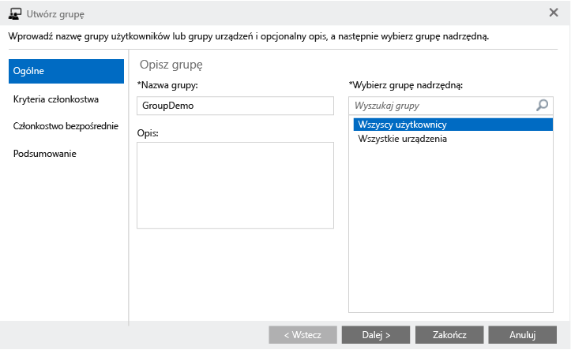

    4.  W polu **Uruchom członkostwo grupy w** wybierz pozycję **Wszyscy użytkownicy w grupie nadrzędnej** i kliknij przycisk **Zakończ**..

        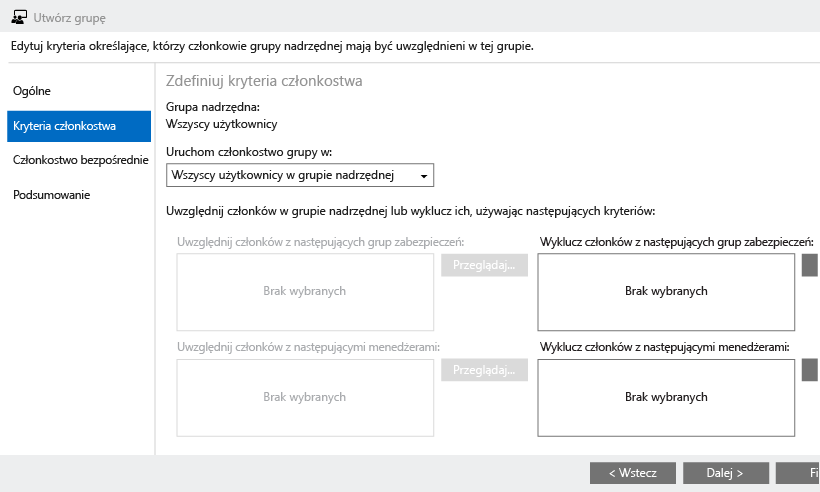

4.  Tworzenie zasad numeru PIN w systemie iOS i stosowanie ich w testowej grupie użytkowników:

    1.  W lewym okienku kliknij pozycję **Zasady**..

        

    2.  Kliknij pozycję **Dodaj zasady** po prawej stronie..

        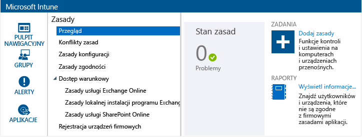

    3.  Rozwiń węzeł systemu iOS, wybierz wiersz **Konfiguracja ogólna**, a następnie kliknij pozycję **Utwórz zasady**..

        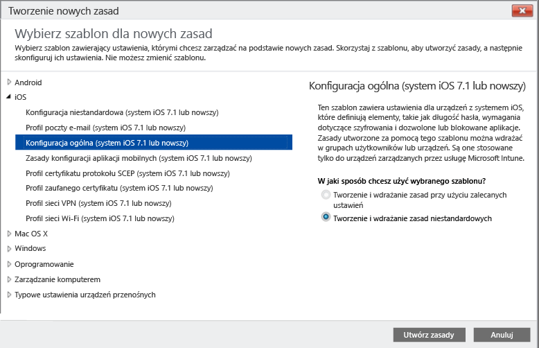

    4.  Wpisz nazwę zasad, włącz opcję **Wymagaj hasła do odblokowania urządzeń przenośnych** i ustaw wartość **Minimalna długość hasła** na **4**..

        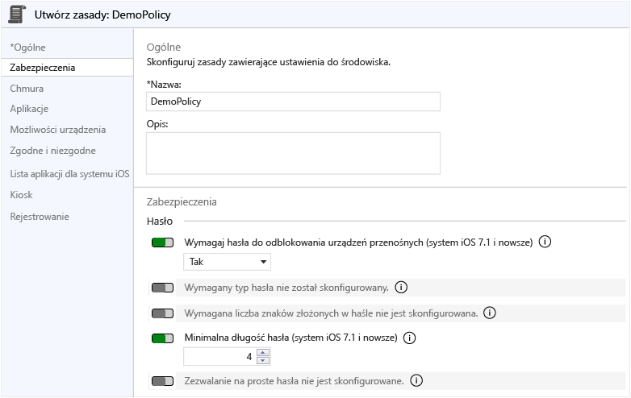

    5.  Kliknij przycisk **Tak**, aby wdrożyć zasady.

        

    6.  Kliknij utworzoną wcześniej grupę użytkowników, kliknij przycisk **Dodaj**, a następnie kliknij przycisk **OK**..

        

        Utworzono zasady numeru PIN w systemie iOS związane z testową grupą użytkowników.

        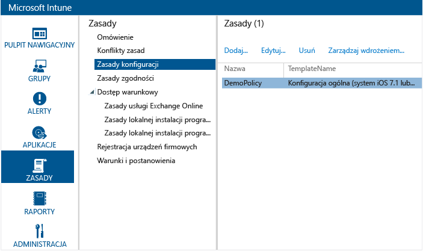

## Sprawdzanie, czy zasady są wymuszane na urządzeniu z systemem iOS

1.  Na urządzeniu iPad uruchom sklep iOS App Store, zainstaluj bezpłatną aplikację **Portal firmy usługi Microsoft Intune** i otwórz ją.

    

2.  Wprowadź nazwę konta i hasło użytkownika testowego, a następnie naciśnij pozycję **Zaloguj się**..

    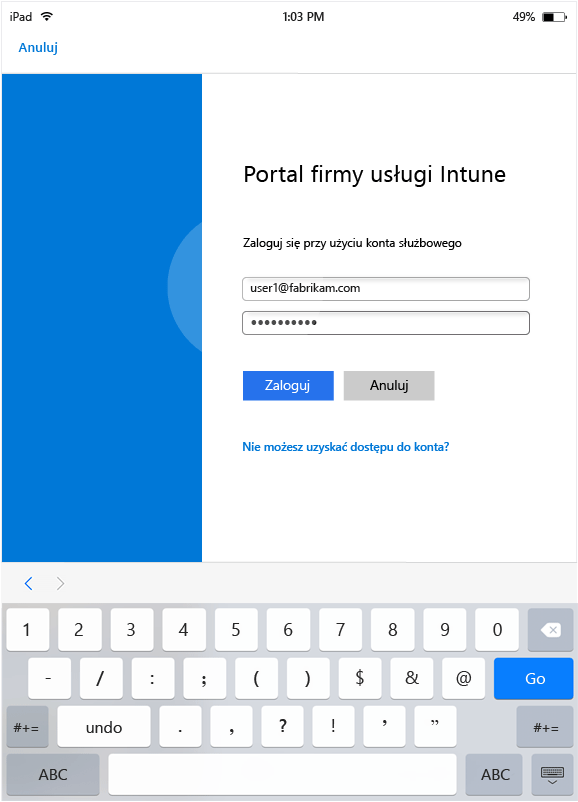

3.  Naciśnij pozycję **Zarejestruj**, aby rozpocząć rejestrowanie urządzenia w usłudze Intune.

    

4.  Na ekranie **Instalowanie profilu** naciśnij pozycję **Zainstaluj**..

    

5.  W oknie dialogowym **Instalowanie profilu** naciśnij pozycję **Zainstaluj**..

    

6.  Na ekranie **Ostrzeżenie** naciśnij pozycję **Zainstaluj**..

    

7.  W oknie dialogowym **Zdalne zarządzanie** naciśnij pozycję **Ufaj**..

    

8.  Po zakończeniu instalowania profilu zarządzania naciśnij pozycję **Gotowe**. Rejestracja została zakończona.

    

9. Po zakończeniu rejestracji naciśnij przycisk **OK**, a następnie zamknij aplikację Portal firmy.

    

10. Po wyświetleniu monitu o skonfigurowanie kodu dostępu naciśnij pozycję **Kontynuuj**..

    

11. Wprowadź kod dostępu, naciśnij pozycję **Kontynuuj**, wprowadź ponownie kod dostępu i naciśnij pozycję **Zapisz**..

    

12. Naciśnij przycisk zasilania, aby zablokować urządzenie iPad, przesuń, aby je odblokować, i zobaczysz, że teraz musisz wprowadzić kod dostępu w celu odblokowania urządzenia.

### Zobacz także
[Przewodnik dotyczący oceny usługi Intune](get-started-with-a-30-day-trial-of-microsoft-intune.md)

<!--HONumber=May16_HO1-->

