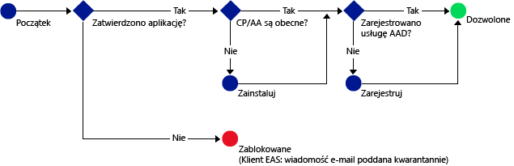

# Zezwalanie na dostęp do usług Office 365 wyłącznie aplikacjom mobilnym obsługującym zasady zarządzania aplikacjami mobilnymi usługi Intune
[Zasady zarządzania aplikacjami mobilnymi usługi Intune](protect-apps-and-data-with-microsoft-intune.md) pomagają chronić dane firmy na urządzeniach zarejestrowanych na potrzeby zarządzania przez usługę Intune. Możesz również korzystać z zasad zarządzania aplikacjami mobilnymi na **urządzeniach należących do pracowników, które nie zostały zarejestrowane na potrzeby zarządzania przez usługę Intune**.  W takim przypadku, nawet jeśli nie zarządzasz danym urządzeniem, musisz upewnić się, że dane i zasoby firmy zostały odpowiednio zabezpieczone. Przy użyciu dostępu warunkowego do zarządzania aplikacjami mobilnymi możesz utworzyć zasady, które zezwalają na dostęp do usług O365, takich jak usługa Exchange Online, tylko tym aplikacjom mobilnym, które obsługują zasady zarządzania aplikacjami mobilnymi usługi Intune.

Na przykład zezwalając na dostęp do usługi Exchange Online wyłącznie **aplikacji Microsoft Outlook**, możesz **blokować wbudowane aplikacje poczty e-mail w systemach iOS i Android**, które nie zapewniają ochrony danych pochodzącej z zasad zarządzania aplikacjami mobilnymi usługi Intune, aby nie mogły odbierać wiadomości z usługi **Exchange Online**.

Poniższy diagram ilustruje przepływ używany przez zasady dostępu warunkowego do zarządzania aplikacjami mobilnymi, umożliwiający określenie, kiedy należy zezwolić na dostęp lub zablokować go: .

Opis skrótów używanych na diagramach:
* **CP**: aplikacja Portal firmy
* **AA**: aplikacja Azure Authenticator
* **AAD**: usługa Azure Active Directory
* **EAS**: aplikacja Exchange Active Sync

## Wymagania wstępne
**Przed** skonfigurowaniem zasad dostępu warunkowego do zarządzania aplikacjami mobilnymi musisz mieć **subskrypcję pakietu Enterprise Mobility + Security lub usługi Azure Active Directory w warstwie Premium**, a użytkownicy muszą mieć licencję usług EMS lub Azure AD. Aby uzyskać więcej szczegółowych informacji, zobacz [Cennik pakietu Enterprise Mobility](https://www.microsoft.com/en-us/cloud-platform/enterprise-mobility-pricing) lub [Cennik usługi Azure Active Directory](https://azure.microsoft.com/en-us/pricing/details/active-directory/).

## Obsługiwane aplikacje
**Exchange Online**: **Microsoft Outlook** dla systemów Android i iOS.

Aby dowiedzieć się więcej o środowisku użytkownika korzystającego z aplikacji, która zawiera zasady dostępu warunkowego do zarządzania aplikacjami mobilnymi, zobacz [Oczekiwany przebieg korzystania z aplikacji z dostępem warunkowym do zarządzania aplikacjami mobilnymi](use-apps-with-mam-ca.md).

## Następne kroki
[Tworzenie zasad usługi Exchange Online dla aplikacji z obsługą zarządzania aplikacjami mobilnymi](mam-ca-for-exchange-online.md)

[Blokowanie aplikacji, które nie obsługują nowoczesnego uwierzytelniania](block-apps-with-no-modern-authentication.md)

### Zobacz także

[Ochrona danych aplikacji za pomocą zasad zarządzania aplikacjami mobilnymi](protect-app-data-using-mobile-app-management-policies-with-microsoft-intune.md)

<!--HONumber=Dec16_HO2-->

