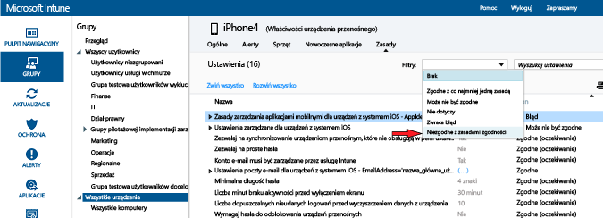

# Wdrażanie i monitorowanie zasad zgodności urządzenia w usłudze Microsoft Intune

[!INCLUDE[classic-portal](../includes/classic-portal.md)]

## Wdrażanie zasad zgodności
Wdróż [utworzone](create-a-device-compliance-policy-in-microsoft-intune.md) zasady zgodności w co najmniej jednej grupie użytkowników w Twojej organizacji. Gdy zasady zgodności są wdrażane dla użytkownika, sprawdzana jest zgodność urządzeń użytkownika.

1.  W obszarze roboczym **Zasady** wybierz zasady do wdrożenia, a następnie wybierz pozycję **Zarządzaj wdrożeniem**.

2.  W oknie dialogowym **Zarządzanie wdrażaniem** wybierz co najmniej jedną grupę, w której chcesz wdrożyć zasady, a następnie wybierz pozycję **Dodaj** > **OK**.
 Użyj utworzonych i zsynchronizowanych z usługą Intune grup usługi Active Directory lub utwórz te grupy ręcznie w konsoli usługi Intune. Aby dowiedzieć się więcej na temat wdrażania zasad, zobacz [Wdrażanie zasad konfiguracji](manage-settings-and-features-on-your-devices-with-microsoft-intune-policies.md).

Podsumowanie stanu oraz alerty na stronie **Przegląd** obszaru roboczego **Zasady** umożliwiają identyfikowanie problemów z zasadami, które wymagają uwagi. Ponadto w obszarze roboczym **Pulpit nawigacyjny** jest wyświetlane podsumowanie stanu.

> [!IMPORTANT]
> Jeśli zasady zgodności nie zostaną wdrożone i włączysz zasady dostępu warunkowego do programu Exchange, wszystkie urządzenia docelowe będą miały dostęp.

## Monitorowanie zasad zgodności

#### Aby wyświetlić urządzenia, które nie są zgodne z zasadami zgodności

1.  W [konsoli administracyjnej usługi Microsoft Intune](https://manage.microsoft.com) wybierz kolejno pozycje **Grupy** > **Wszystkie urządzenia**.

2.  Kliknij dwukrotnie nazwę urządzenia na liście urządzeń.

3.  Wybierz kartę **Zasady**, aby wyświetlić listę zasad dla tego urządzenia.

4.  Z listy rozwijanej **Filtry** wybierz pozycję **Niezgodne z zasadami zgodności**.

#### Aby wyświetlić raporty dotyczące zaświadczania o kondycji

1.  W [konsoli administracyjnej usługi Microsoft Intune](https://manage.microsoft.com) wybierz opcję **Raporty**.

2.  Na stronie **Raport zaświadczania o kondycji — Utwórz nowy raport** można wyświetlić raport z wszystkimi danymi związanymi z zaświadczaniem o kondycji systemu Windows 10 zebranymi przez usługę Intune. Można również utworzyć raport z podzbiorem danych za pomocą filtrów. Filtry mogą być związane z typem urządzenia, systemem operacyjnym lub podzbiorem punktów danych.

## Jak są rozwiązywane konflikty zasad usługi Intune
Konflikty zasad mogą wystąpić, gdy na urządzeniu stosuje się wiele zasad usługi Intune. Jeśli ustawienia zasad nakładają się na siebie, usługa Intune rozwiązuje konflikty, używając następujących reguł:

-   Jeżeli sprzeczne ustawienia pochodzą z zasad konfiguracji usługi Intune i zasad zgodności, ustawienia w zasadach zgodności mają pierwszeństwo względem ustawień w zasadach konfiguracji. Dzieje się tak nawet wtedy, gdy ustawienia w zasadach konfiguracji są bardziej bezpieczne.

-   Jeśli wdrożono wiele zasad zgodności, usługa Intune użyje najbezpieczniejszych z nich.

## Następne kroki
Aby dowiedzieć się, jak stosować zasady zgodności wraz z zasadami dostępu warunkowego w celu kontrolowania dostępu do usług w organizacji, zobacz [Ograniczanie dostępu do poczty e-mail i usług O365](restrict-access-to-email-and-o365-services-with-microsoft-intune.md).

### Zobacz też
[Wprowadzenie do zasad zgodności urządzeń w usłudze Intune](introduction-to-device-compliance-policies-in-microsoft-intune.md)

<!--HONumber=Dec16_HO2-->

