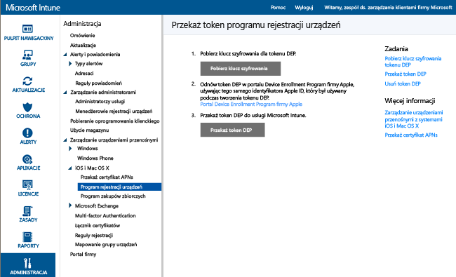
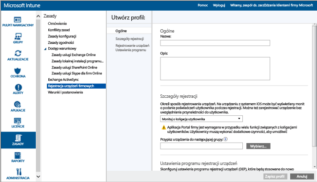

# Rejestrowanie firmowych urządzeń z systemem iOS przy użyciu Device Enrollment Program

[!INCLUDE[classic-portal](../includes/classic-portal.md)]

Usługa Microsoft Intune może wdrożyć profil rejestracji, który będzie bezprzewodowo rejestrować urządzenia z systemem iOS zakupione w ramach programu Device Enrollment Program (DEP). Pakiet rejestracyjny może obejmować opcje Asystenta ustawień dla urządzenia.

>[!NOTE]
>Tej metody rejestracji nie można używać z metodą korzystającą z [menedżera rejestracji urządzeń](enroll-corporate-owned-devices-with-the-device-enrollment-manager-in-microsoft-intune.md).

## Wymagania wstępne dotyczące rejestracji urządzeń z systemem iOS za pośrednictwem funkcji zarządzania w programie DEP firmy Apple

- [Zainstalowany certyfikat APNs](set-up-ios-and-mac-management-with-microsoft-intune.md)

- Organizacja musi dołączyć do programu DEP firmy Apple i pobrać urządzenia za pośrednictwem tego programu. Szczegóły tego procesu są dostępne pod adresem:  [https://deploy.apple.com](https://deploy.apple.com). Zalety programu obejmują funkcje bezobsługowego konfigurowania urządzeń bez konieczności podłączania poszczególnych urządzeń do komputera przy użyciu kabla USB.

- Aby zarejestrować firmowe urządzenia z systemem iOS w programie DEP, należy uzyskać token programu DEP od firmy Apple. Token umożliwia usłudze Intune synchronizację informacji dotyczących urządzeń uczestniczących w programie DEP należących do firmy. Umożliwia on również usłudze Intune przekazywanie profilów rejestracji do firmy Apple i przypisywanie urządzeń do tych profilów.

## Procedura rejestracji urządzeń z systemem iOS za pośrednictwem funkcji zarządzania w programie DEP firmy Apple

Poniżej przedstawiono procedurę rejestracji urządzeń z systemem iOS w „dniu 0” za pomocą funkcji zarządzania w programie DEP firmy Apple. W miarę dodawania i usuwania urządzeń z organizacji prawdopodobnie będziesz powtarzać niektóre z tych kroków, takie jak dodawanie lub usuwanie numerów seryjnych, zgodnie z poniższym opisem.

### Pobieranie klucza szyfrowania

1. Jako użytkownik administracyjny otwórz [konsolę administracyjną usługi Microsoft Intune](http://manage.microsoft.com), kliknij pozycję **Administracja** &gt; **Zarządzanie urządzeniami przenośnymi** &gt; **iOS** &gt; **Device Enrollment Program**, a następnie wybierz pozycję **Pobierz klucz szyfrowania**. 

2. Zapisz lokalnie plik klucza szyfrowania (PEM) Plik PEM jest używany na potrzeby żądania certyfikatu relacji zaufania z portalu programu Device Enrollment Program firmy Apple.

### Pobieranie tokenu programu Device Enrollment Program

1. Przejdź do [portalu Device Enrollment Program](https://deploy.apple.com) (https://deploy.apple.com) i zaloguj się przy użyciu identyfikatora Apple ID swojej firmy. Tego identyfikatora firmy Apple należy używać w przyszłości do odnawiania tokenu programu DEP.

2.  W portalu Device Enrollment Program wybierz pozycje **Device Enrollment Program** &gt; **Manage Servers** (Zarządzanie serwerami), a następnie wybierz pozycję **Add MDM Server** (Dodaj serwer MDM).

3.  Wprowadź nazwę serwera w polu **MDM Server Name** (Nazwa serwera MDM), a następnie wybierz przycisk **Next**(Dalej). Nazwa serwera służy użytkownikowi do identyfikowania serwera MDM. Nie jest to nazwa ani adres URL serwera usługi Microsoft Intune.

4.  Zostanie otwarte okno dialogowe **Add &lt;nazwa_serwera&gt;** (Dodawanie serwera <nazwa_serwera>). Kliknij pozycję **Choose File…** (Wybierz plik...) w celu przekazania pliku PEM, a następnie kliknij przycisk **Next** (Dalej).

5.  W oknie dialogowym **Add&lt; <nazwa_serwera>&gt;** (Dodawanie serwera <nazwa_serwera>) zostanie wyświetlony link **Your Server Token** (Token serwera). Pobierz plik tokenu serwera (p7m) na komputer, a następnie wybierz pozycję **Done**(Gotowe).

   Ten plik certyfikatu (p7m) służy do ustanawiania relacji zaufania między serwerami usługi Intune i programu Device Enrollment Program firmy Apple.

### Dodawanie tokenu programu DEP do usługi Intune

1. W [konsoli administracyjnej usługi Microsoft Intune](http://manage.microsoft.com) wybierz pozycję **Administracja** &gt; **Zarządzanie urządzeniami przenośnymi** &gt; **iOS** &gt; **Device Enrollment Program**.

2. Wybierz pozycję **Przekaż token DEP**. **Przejdź** do pliku certyfikatu (p7m), wprowadź swój identyfikator **Apple ID** i wybierz pozycję **Przekaż**.

### Dodawanie zasad rejestracji urządzeń firmowych

1. W [konsoli administracyjnej usługi Microsoft Intune](http://manage.microsoft.com) wybierz pozycję **Zasady** &gt; **Rejestracja urządzeń firmowych**, a następnie wybierz pozycję **Dodaj**.

2. Podaj **ogólne** informacje, takie jak **Nazwa** i **Opis**, oraz określ, czy urządzenia przypisane do tego profilu pozostają w koligacji z użytkownikiem, czy też należą do grupy:

   - **Monituj o koligację użytkownika** — podczas początkowej konfiguracji należy określić przynależność urządzenia do użytkownika przed udzieleniem zezwolenia na dostęp tego urządzenia do danych firmowych i poczty e-mail jako ten użytkownik. **Koligację użytkownika** należy skonfigurować dla urządzeń zarządzanych w programie DEP, które należą do użytkowników i muszą korzystać z portalu firmy (tj. w celu instalowania aplikacji). Uwierzytelnianie wieloskładnikowe (MFA) nie działa podczas rejestracji urządzeń za pomocą programu DEP, gdy jest używana koligacja użytkownika. Po zarejestrowaniu tych urządzeń uwierzytelnianie wieloskładnikowe działa zgodnie z oczekiwaniami.

   > [!NOTE]
   > Program DEP z koligacją użytkownika wymaga nazwy użytkownika protokołu WS-Trust 1.3/mieszanego punktu końcowego, aby móc żądać tokenu użytkownika.

   - **Brak koligacji użytkownika:** urządzenie nie zostało powiązane z użytkownikiem. Tego typu przynależności należy użyć w przypadku urządzeń wykonujących zadania bez uzyskiwania dostępu do danych użytkowników lokalnych. Aplikacje wymagające koligacji użytkownika, w tym aplikacja Portal firmy użyta do zainstalowania aplikacji biznesowych, nie będą działać.

   Możesz także **przypisać urządzenia do następującej grupy**. Kliknij pozycję **Wybierz...**, aby wybrać grupę.

   > [!Important]
   > Przypisania grupy są przenoszone z usługi Intune do usługi Azure Active Directory. Kiedy dane konto usługi Intune otrzyma odpowiednią aktualizację, opcja **Przypisz urządzenia do następującej grupy** nie będzie widoczna. [Dowiedz się więcej](/intune/deploy-use/ios-device-enrollment-program-in-microsoft-intune#changes-to-intune-group-assignments).

3. Włącz opcję **Skonfiguruj ustawienia programu rejestracji urządzeń dla tych zasad** w celu zapewnienia obsługi programu DEP.

      

   Dla urządzeń zarządzanych w programie DEP dostępne są następujące ustawienia:

   - **Dział** — wyświetlane, gdy użytkownicy nacisną pozycję **Informacje o konfiguracji** podczas aktywacji
   - **Numer telefonu pomocy technicznej** — wyświetlane, gdy użytkownik kliknie przycisk **Potrzebna pomoc** podczas aktywacji
   - **Tryb przygotowania** — stan ustawiany podczas aktywacji bez możliwości jego zmiany bez zresetowania urządzenia do ustawień fabrycznych:
       - **Nienadzorowane** — ograniczone możliwości zarządzania
       - **Nadzorowane** — włącza więcej opcji zarządzania i domyślnie wyłącza blokadę aktywacji
   - **Zablokuj profil rejestracji dla urządzenia** — stan ustawiany podczas aktywacji bez możliwości jego zmiany bez zresetowania urządzenia do ustawień fabrycznych
       - **Wyłącz** — umożliwia usunięcie profilu zarządzania z poziomu menu **Ustawienia**
       - **Włącz** — (wymaga ustawienia **Tryb przygotowania** = **Nadzorowane**) — wyłącza opcję menu Ustawienia systemu iOS w celu usunięcia profilu zarządzania
   - **Opcje Asystenta ustawień** — te opcjonalne ustawienia mogą być później konfigurowane z poziomu menu **Ustawienia** systemu iOS.
        - **Kod dostępu** — wyświetla monit o podanie kodu dostępu podczas aktywacji. Zawsze należy wymagać kodu dostępu, chyba że urządzenie zostanie zabezpieczone lub dostęp do niego będzie kontrolowany w inny sposób (tj. tryb kiosku, który ogranicza możliwość użycia urządzenia do jednej aplikacji)
       - **Usługi lokalizacji** — jeśli to ustawienie zostało włączone, Asystent ustawień wyświetla monit dotyczący usługi podczas aktywacji
       - **Przywracanie** — jeśli to ustawienie zostało włączone, Asystent ustawień wyświetla monit o kopię zapasową w programie iCloud podczas aktywacji
       - **Apple ID** — jeśli to ustawienie zostało włączone, system iOS wyświetla monit o podanie identyfikatora Apple ID, gdy usługa Intune będzie podejmowała próbę zainstalowania aplikacji bez tego identyfikatora. Identyfikator Apple ID jest wymagany do pobierania aplikacji ze sklepu iOS App Store, w tym aplikacji zainstalowanych przez usługę Intune.
       - **Warunki i postanowienia** — jeśli to ustawienie zostało włączone, Asystent ustawień monituje użytkowników o zaakceptowanie warunków i postanowień firmy Apple podczas aktywacji
       - **Touch ID** — jeśli to ustawienie zostało włączone, Asystent ustawień wyświetla monit dotyczący tej usługi podczas aktywacji
       - **Apple Pay** — jeśli to ustawienie zostało włączone, Asystent ustawień wyświetla monit dotyczący tej usługi podczas aktywacji
       - **Zoom** — jeśli to ustawienie zostało włączone, Asystent ustawień wyświetla monit dotyczący tej usługi podczas aktywacji
       - **Siri** — jeśli to ustawienie zostało włączone, Asystent ustawień wyświetla monit dotyczący tej usługi podczas aktywacji
       - **Wyślij dane diagnostyczne do firmy Apple** — jeśli to ustawienie zostało włączone, Asystent ustawień wyświetla monit dotyczący tej usługi podczas aktywacji
   -  **Zezwalaj na dodatkowe zarządzanie przy użyciu programu Apple Configurator** —ustawienie wartości **Nie zezwalaj** zapobiega synchronizowaniu plików za pomocą programu iTunes lub zarządzaniu przy użyciu programu Apple Configurator. Zalecane jest ustawienie na wartość **Nie zezwalaj**, wyeksportowanie dalszej konfiguracji z programu Apple Configurator, a następnie wdrożenie jako niestandardowego profilu konfiguracji systemu iOS za pomocą usługi Intune, a nie używanie tego ustawienia w celu zezwolenia na ręczne wdrożenie z użyciem lub bez użycia certyfikatu.
       - **Nie zezwalaj** — uniemożliwia urządzeniu komunikację za pomocą połączenia USB (wyłącza parowanie)
       - **Zezwalaj** — umożliwia urządzeniu komunikację za pomocą połączenia USB z dowolnym komputerem PC lub Mac
       - **Wymagaj certyfikatu** — umożliwia parowanie z komputerem Mac przy użyciu certyfikatu zaimportowanego do profilu rejestracji

### Przypisywanie profilu do urządzeń

1. W [konsoli administracyjnej usługi Microsoft Intune](http://manage.microsoft.com) przejdź do pozycji **Zasady** &gt; **Rejestracja urządzeń firmowych**, a następnie wybierz pozycję **Przypisz**.

2. Wybierz urządzenia, do których chcesz przypisać utworzony profil. Można wybrać pozycję **Wszystkie urządzenia** lub wybrać określone urządzenia, a następnie wybrać pozycję **Dodaj**.

> [!Important]
> Obecnie usługa Intune umożliwia wyznaczenie „domyślnego profilu rejestracji urządzeń”, co oznacza, że nowe numery seryjne są automatycznie przypisywane do tego profilu domyślnego podczas synchronizowania nowych numerów seryjnych z usługą Apple DEP. Jeśli dzierżawa zostanie wkrótce poddana migracji do nowej witryny Azure Portal, nie będzie już można ustawić profilu domyślnego i zapewnić automatycznego przypisywania numerów seryjnych do tego profilu. Zamiast tego należy samodzielnie przypisać numery seryjne do konkretnego profilu. [Dowiedz się więcej](https://docs.microsoft.com/intune-azure/enroll-devices/enroll-ios-devices-using-device-enrollment-program)

### Przypisywanie urządzeń programu DEP do zarządzania

1. Przejdź do [portalu Device Enrollment Program](https://deploy.apple.com) (https://deploy.apple.com) i zaloguj się przy użyciu identyfikatora Apple ID swojej firmy.

2. Wybierz kolejno pozycje **Deployment Program** (Program wdrażania) &gt; **Device Enrollment Program** (Program rejestracji urządzeń) &gt; **Manage Devices** (Zarządzanie urządzeniami).

3. Określ sposób **wyboru urządzeń**, podaj informacje o urządzeniach i określ szczegóły według numeru seryjnego (**Serial Number**) urządzenia, numeru zamówienia (**Order Number**) lub przekaż plik CSV (**Upload CSV File**).

4. Wybierz pozycję **Assign to Server** (Przypisz do serwera), wybierz nazwę serwera &lt;nazwa_serwera&gt; określoną dla usługi Microsoft Intune, a następnie kliknij przycisk **OK**.

### Synchronizowanie urządzeń zarządzanych w programie DEP

Ten krok umożliwia synchronizację urządzeń z usługą Apple DEP i wyświetlenie tych urządzeń w konsoli usługi Intune.

1. Jako użytkownik administracyjny otwórz [konsolę administracyjną usługi Microsoft Intune](http://manage.microsoft.com), przejdź do pozycji **Administracja** &gt; **Zarządzanie urządzeniami przenośnymi** &gt; **iOS** &gt; **Device Enrollment Program**, a następnie wybierz pozycję **Synchronizuj teraz**. Żądanie synchronizacji zostanie wysłane do firmy Apple.

2. Aby wyświetlić urządzenia zarządzane przez program DEP po synchronizacji, w [konsoli administracyjnej usługi Microsoft Intune](http://manage.microsoft.com) wybierz pozycję **Grupy** &gt; **Wszystkie urządzenia** &gt; **Wstępnie zarejestrowane urządzenia należące do firmy** &gt; **Według numeru seryjnego systemu iOS**. W obszarze roboczym **Według numeru seryjnego systemu iOS** dla zarządzanych urządzeń wyświetlany jest **stan** „Nie nawiązano komunikacji”, dopóki urządzenie nie zostanie włączone i Asystent ustawień nie zostanie uruchomiony w celu zarejestrowania urządzenia.

   Aby spełnić warunki ruchu programu DEP firmy Apple, usługa Intune nakłada następujące ograniczenia:

   - Pełną synchronizację programu DEP można uruchamiać nie częściej niż co siedem dni. Podczas pełnej synchronizacji usługa Intune odświeża każdy numer seryjny Apple przypisany do usługi Intune, niezależnie od tego, czy numer seryjny był już wcześniej synchronizowany. W przypadku próby przeprowadzenia pełnej synchronizacji przed upływem siedmiu dni od poprzedniej pełnej synchronizacji usługa Intune odświeża tylko numery seryjne, które jeszcze nie zostały przypisane do usługi Intune.

   - Każde żądanie synchronizacji ma przydzielone 10 minut na zakończenie. W tym czasie lub do momentu zakończenia żądania powodzeniem przycisk **synchronizacji** jest wyłączony.

### Przekazywanie urządzeń użytkownikom

Urządzenia firmowe mogą zostać teraz przekazane użytkownikom. Po włączeniu urządzenia z systemem iOS zostanie ono zarejestrowane na potrzeby zarządzania przez usługę Intune.

## Zmiany przypisań grup usługi Intune

Od grudnia 2016 roku zarządzanie grupami urządzeń zostanie przeniesione do usługi Azure Active Directory. Po przejściu do grup usługi Azure Active Directory przypisanie do grupy nie będzie wyświetlane w opcjach profilu rejestracji w firmie. Ponieważ ta zmiana będzie wprowadzana przez szereg miesięcy, może nie być widoczna od razu. Po przejściu do nowego portalu dynamiczne przypisania grup urządzeń będzie można definiować na podstawie nazw profili rejestracji w firmie. W przypadku każdej grupy urządzeń w usłudze Intune, które są wstępnie przypisane przy użyciu profilu Rejestracja urządzeń firmowych, w usłudze AAD zostanie utworzona odpowiednia dynamiczna grupa urządzeń przy użyciu nazwy profilu Rejestracja urządzeń firmowych podczas migracji do grup urządzeń w usłudze Azure Active Directory. Ten proces zapewnia, że urządzenia przypisane do grupy urządzeń zostaną automatycznie zarejestrowane w grupie z wdrożonymi zasadami i aplikacjami. [Dowiedz się więcej o grupach usługi Azure Active Directory](https://azure.microsoft.com/documentation/articles/active-directory-accessmanagement-manage-groups/)

### Zobacz także
[Wymagania wstępne dotyczące rejestrowania urządzeń](prerequisites-for-enrollment.md)

<!--HONumber=Feb17_HO3-->

