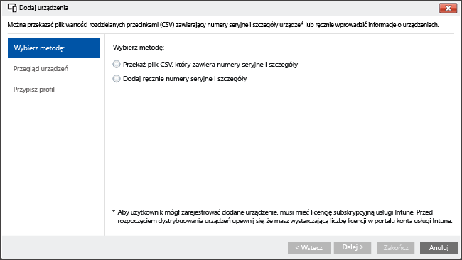

# <a name="enroll-ios-devices-with-apple-configurator-by-using-setup-assistant"></a>Rejestracja urządzeń z systemem iOS za pomocą narzędzia Apple Configurator przy użyciu Asystenta ustawień

[!INCLUDE[classic-portal](../includes/classic-portal.md)]

Usługa Intune obsługuje rejestrowanie firmowych urządzeń z systemem iOS przy użyciu narzędzia [Apple Configurator](http://go.microsoft.com/fwlink/?LinkId=518017) działającego na komputerze Mac. Ten proces przywraca ustawienia fabryczne urządzenia i przygotowuje je do uruchomienia Asystenta ustawień, instalując zasady firmy dla nowego użytkownika urządzenia.

>[!NOTE]
>Tej metody rejestracji nie można używać z metodą korzystającą z [menedżera rejestracji urządzeń](enroll-corporate-owned-devices-with-the-device-enrollment-manager-in-microsoft-intune.md).

Za pomocą narzędzia Apple Configurator można przywrócić ustawienia fabryczne na urządzeniu z systemem iOS i przygotować je do konfiguracji dla nowego użytkownika urządzenia. Ta metoda wymaga podłączenia urządzenia z systemem iOS do komputera Mac przy użyciu połączenia USB w celu skonfigurowania rejestracji firmowej. Przyjęto założenie, że używany jest program Apple Configurator 2.0. Większość scenariuszy wymaga, aby zasady zastosowane w urządzeniu z systemem iOS uwzględniały **koligację użytkownika**, co umożliwia korzystanie z aplikacji Portal firmy usługi Intune.

## <a name="prerequisites-for-enrolling-ios-devices-by-using-apple-configurator-with-setup-assistant"></a>Wymagania wstępne dotyczące rejestracji urządzeń z systemem iOS za pomocą narzędzia Apple Configurator i Asystenta ustawień

- [Zainstalowany certyfikat APNs](set-up-ios-and-mac-management-with-microsoft-intune.md)

- Fizyczny dostęp do urządzeń z systemem iOS &mdash; urządzenia muszą zostać zresetowane do ustawień fabrycznych bez ochrony hasłem

- Numery seryjne urządzenia &mdash; zobacz [W jaki sposób uzyskać numer seryjny systemu iOS](https://support.apple.com/en-us/HT204308)

- Kable połączenia USB

- Komputer Mac z programem [Apple Configurator 2.0](https://itunes.apple.com/us/app/apple-configurator-2/id1037126344?mt=12)


## <a name="steps-to-enroll-ios-devices-by-using-apple-configurator-with-setup-assistant"></a>Procedura rejestracji urządzeń z systemem iOS za pomocą narzędzia Apple Configurator i Asystenta ustawień

Poniżej przedstawiono procedurę rejestracji urządzeń z systemem iOS w „dniu 0” za pomocą narzędzia Apple Configurator i Asystenta ustawień. W miarę dodawania i usuwania urządzeń z organizacji prawdopodobnie będziesz powtarzać niektóre z tych kroków, takie jak dodawanie lub usuwanie numerów seryjnych, zgodnie z poniższym opisem.

### <a name="create-mobile-device-groups-optional"></a>Tworzenie grup urządzeń przenośnych (opcjonalnie)

Jeśli w firmie są wymagane grupy urządzeń przenośnych w celu ułatwienia zarządzania urządzeniami, można opcjonalnie utworzyć te grupy. Aby dowiedzieć się więcej, zobacz [Używanie grup do zarządzania użytkownikami i urządzeniami w usłudze Microsoft Intune](use-groups-to-manage-users-and-devices-with-microsoft-intune.md).

### <a name="create-a-profile-for-devices"></a>Tworzenie profilów dla urządzeń

Profil rejestracji urządzeń określa ustawienia stosowane do grupy urządzeń.

1. W [konsoli administracyjnej usługi Microsoft Intune](http://manage.microsoft.com) wybierz pozycję **Zasady** &gt; **Rejestracja urządzeń firmowych**, a następnie wybierz pozycję **Dodaj**.

  

2. Wprowadź szczegóły profilów urządzeń:

   -   **Nazwa** &mdash; nazwa profilu rejestracji urządzeń (niewidoczna dla użytkowników).

   -   **Opis** &mdash; opis profilu rejestracji urządzeń (niewidoczny dla użytkowników).

   -   **Szczegóły rejestracji** &mdash; określa sposób rejestracji urządzeń.

       -   **Monituj o koligację użytkownika** &mdash; podczas początkowej konfiguracji należy określić przynależność urządzenia do użytkownika, a następnie zezwolić na dostęp tego urządzenia do danych firmowych i poczty e-mail. **Koligację użytkownika** należy skonfigurować dla urządzeń zarządzanych w programie DEP, które należą do użytkowników i muszą korzystać z portalu firmy na potrzeby usług takich jak instalowania aplikacji.

       -   **Brak koligacji użytkownika** &mdash; urządzenie nie zostało powiązane z użytkownikiem. Tego typu przynależności należy użyć w przypadku urządzeń wykonujących zadania bez uzyskiwania dostępu do danych użytkowników lokalnych. Aplikacje wymagające koligacji użytkownika (w tym aplikacja Portal firmy używana do instalowania aplikacji biznesowych) nie będą działać.

   -   **Wstępne przypisanie do grupy urządzeń** &mdash; wszystkie urządzenia, dla których ten profil zostanie wdrożony, będą początkowo należeć do tej grupy. Po rejestracji można ponownie przypisać urządzenia.

   > [!Important]
   > Przypisania grupy są przenoszone z usługi Intune do usługi Azure Active Directory. Kiedy dane konto usługi Intune otrzyma odpowiednią aktualizację, opcja **Przypisz urządzenia do następującej grupy** nie będzie widoczna. [Dowiedz się więcej](/intune/deploy-use/ios-device-enrollment-program-in-microsoft-intune#changes-to-intune-group-assignments).

   -  **Device Enrollment Program** &mdash; program Device Enrollment Program (DEP) firmy Apple nie może być używany z rejestracją z wykorzystaniem Asystenta ustawień. Upewnij się, że przełącznik jest **wyłączony**.

3.  Wybierz pozycję **Zapisz profil**, aby dodać profil.

### <a name="add-ios-devices-to-enroll-with-setup-assistant"></a>Dodawanie urządzenia z systemem iOS do rejestracji przy użyciu Asystenta ustawień

1. W [konsoli administracyjnej usługi Microsoft Intune](http://manage.microsoft.com) przejdź do pozycji **Grupy** &gt; **Wszystkie urządzenia** &gt; **Wszystkie urządzenia należące do firmy** &gt; **Wszystkie urządzenia**, a następnie wybierz polecenie **Dodaj urządzenia**. 

   Urządzenia można dodać na dwa sposoby:

   

   -  **Przekaż plik CSV zawierający numery seryjne** &mdash; utwórz listę wartości oddzielanych przecinkami (plik CSV) w dwóch kolumnach bez nagłówka ograniczoną do 5000 urządzeń lub 5 MB na plik csv.

    |||
    |-|-|
    |&lt;Numer seryjny 1&gt;|&lt;Szczegóły urządzenia 1&gt;|
    |&lt;Numer seryjny&2;&gt;|&lt;Szczegóły urządzenia 2&gt;|

  Ten plik csv wyświetlony w edytorze tekstu wygląda następująco:

    ```
    0000000,PO 1234
    111111111,PO 1234
    ```

  -  **Ręcznie dodaj szczegóły urządzeń** &mdash; wprowadź numery seryjne i wszelkie uwagi dotyczące maksymalnie 15 urządzeń.

  W okienku **Przegląd urządzeń** możesz potwierdzić numery seryjne. Możesz również zdecydować, czy zastąpić wartość pola **Szczegóły** dla ponownie importowanych numerów seryjnych. Aby zachować bieżące szczegóły, odznacz pole **Zastąp**. 

> [!NOTE] 
> W istniejącej konsoli administratora usługi Intune administratorzy mogą akceptować szczegóły z przekazanego pliku CSV i zastępować istniejące dane poszczególnych numerów seryjnych. W nowej wersji witryny Azure Portal będzie tylko można zastąpić szczegóły wszystkich numerów seryjnych lub zignorować nowe szczegóły wszystkich numerów seryjnych.

  > [!NOTE]
  > Jeśli w przyszłości konieczne okaże się usunięcie urządzeń należących do firmy z zakresu zarządzania usługi Intune, być może trzeba będzie usunąć numer seryjny urządzenia z usługi Intune w grupie urządzeń **Według numeru seryjnego systemu iOS** w obszarze **Urządzenia zarejestrowane wstępnie należące do firmy**, aby wyłączyć rejestrację urządzenia. Jeśli usługa Intune przeprowadza procedurę odzyskiwania po awarii w przedziale czasowym zbliżonym do momentu usuwania numerów seryjnych, należy sprawdzić, czy w tej grupie znajdują się wyłącznie numery seryjne aktywnych urządzeń.

2. Wybierz pozycję **Next** (Dalej).

3. Wybierz urządzenia przeznaczone do zarejestrowania. Nie można zaimportować numerów seryjnych, które są już zarejestrowane lub zostały zarejestrowane w inny sposób. Wybierz pozycję **Dalej**, aby kontynuować.

### <a name="assign-a-profile"></a>Przypisywanie profilu

Z listy dostępnych profilów wybierz profil, który ma zostać przypisany do dodanych urządzeń, sprawdź informacje w obszarze **Szczegóły profilu rejestracji**, a następnie wybierz polecenie **Zakończ**. Ręcznie dodane urządzenia można przypisać do dowolnego profilu rejestracji.

> [!Important]
> Obecnie usługa Intune umożliwia wyznaczenie „domyślnego profilu rejestracji urządzeń”, co oznacza, że nowe numery seryjne są automatycznie przypisywane do tego profilu domyślnego podczas synchronizowania nowych numerów seryjnych z usługą Apple DEP. Jeśli dzierżawa zostanie wkrótce poddana migracji do nowej witryny Azure Portal, nie będzie już można ustawić profilu domyślnego i zapewnić automatycznego przypisywania numerów seryjnych do tego profilu. Zamiast tego należy samodzielnie przypisać numery seryjne do profilu. [Dowiedz się więcej](https://docs.microsoft.com/intune-azure/enroll-devices/enroll-ios-devices-using-device-enrollment-program)

### <a name="export-a-profile-to-deploy-to-ios-devices"></a>Eksportowanie profilu do wdrożenia na urządzeniach z systemem iOS

1. W [konsoli administracyjnej usługi Microsoft Intune](http://manage.microsoft.com) przejdź do pozycji **Zasady** &gt; **Rejestracja urządzeń firmowych** i wybierz profil urządzeń, który ma być wdrażany na urządzeniach przenośnych. 

2. Na pasku zadań kliknij przycisk **Eksportuj**. Skopiuj i zapisz adres w polu **Adres URL profilu**. Możesz przekazać go później przy użyciu narzędzia Apple Configurator, aby określić profil usługi Intune używany przez urządzenia z systemem iOS.

  Aby umożliwić obsługę programu Apple Configurator 2, należy edytować adres URL profilu 2.0. Aby to zrobić, zastąp poniższy kod:
    ```
    https://manage.microsoft.com/EnrollmentServer/Discovery.svc/iOS/ESProxy?id=
    ```
    tym kodem:

    ```
    https://appleconfigurator2.manage.microsoft.com/MDMServiceConfig?id=
    ```

   Możesz przekazać ten adres URL profilu do programu Apple DEP za pomocą narzędzia Apple Configurator, aby zdefiniować profil usługi Intune używany przez urządzenia z systemem iOS, używając poniższej procedury.


### <a name="prepare-the-device-with-apple-configurator"></a>Przygotowywanie urządzenia przy użyciu programu Apple Configurator

Urządzenia z systemem iOS są podłączane do komputera Mac i rejestrowane w usłudze zarządzania urządzeniami przenośnymi.

1.  Na komputerze Mac otwórz narzędzie **Apple Configurator 2**. Na pasku menu wybierz pozycję **Apple Configurator 2**, a następnie wybierz pozycję **Preferences** (Preferencje).

   > [!WARNING]
   > Podczas procesu rejestracji urządzenia zostaną zresetowane do konfiguracji fabrycznych. Jako najlepsze rozwiązanie zalecane jest zresetowanie urządzenia i włączenie go. Zalecane jest również, aby podczas podłączania na urządzeniach był wyświetlany ekran **powitalny**.

2. W okienku preferencji wybierz pozycję **Servers** (Serwery), a następnie wybierz symbol „+”, aby uruchomić kreatora serwera MDM. Wybierz pozycję **Next** (Dalej).

3. Wprowadź **nazwę** i **adres URL rejestracji** dla serwera MDM z kroku 6 procesu rejestrowania urządzeń z systemem iOS przy użyciu Asystenta ustawień w usłudze Microsoft Intune. W polu adresu URL rejestracji wprowadź adres URL profilu rejestracji wyeksportowany z usługi Intune. Wybierz pozycję **Next** (Dalej).  

   Możesz bezpiecznie zignorować ostrzeżenie informujące, że adres URL serwera nie został zweryfikowany. Aby kontynuować, wybieraj pozycję **Next** (Dalej), aż do ukończenia pracy kreatora.

4.  Podłącz urządzenia przenośne z systemem iOS do komputera Mac przy użyciu adaptera USB.

    > [!WARNING]
    > Podczas procesu rejestracji urządzenia zostaną zresetowane do konfiguracji fabrycznych. Jako najlepsze rozwiązanie zalecane jest zresetowanie urządzenia i włączenie go. Podczas uruchamiania Asystenta ustawień na urządzeniach powinien być wyświetlany ekran **powitalny**.

5.  Wybierz pozycję **Prepare**(Przygotuj). W okienku Prepare iOS Device (Przygotowywanie urządzenia z systemem iOS) wybierz pozycję **Manual** (Ręcznie), a następnie wybierz pozycję **Next** (Dalej).

6. W okienku Enroll in MDM Server (Rejestrowanie na serwerze MDM) wybierz nazwę utworzonego serwera, a następnie wybierz pozycję **Next** (Dalej).

7. W okienku Supervise Devices (Nadzorowanie urządzeń) wybierz poziom nadzoru, a następnie wybierz pozycję **Next** (Dalej).

8. W okienku Create an Organization (Tworzenie organizacji) wybierz pozycję **Organization** (Organizacja) lub utwórz nową organizację, a następnie wybierz pozycję **Next** (Dalej).

9. W okienku Configure iOS Setup Assistant (Konfigurowanie Asystenta ustawień systemu iOS) wybierz czynności, które mają zostać wyświetlone użytkownikowi, a następnie wybierz pozycję **Prepare** (Przygotuj). Jeśli zostanie wyświetlony monit, uwierzytelnij się w celu zaktualizowania ustawień zaufania.  

10. Po zakończeniu przygotowywania urządzenia z systemem iOS odłącz kabel USB.  

### <a name="distribute-devices"></a>Dystrybuowanie urządzeń

Urządzenia są teraz gotowe do rejestracji w firmie. 

Wyłącz urządzenia i przekaż je użytkownikom. Po włączeniu urządzeń przez użytkowników zostanie uruchomiony Asystent ustawień.


### <a name="see-also"></a>Zobacz także
[Wymagania wstępne dotyczące rejestrowania urządzeń](prerequisites-for-enrollment.md)


<!--HONumber=Feb17_HO2-->


