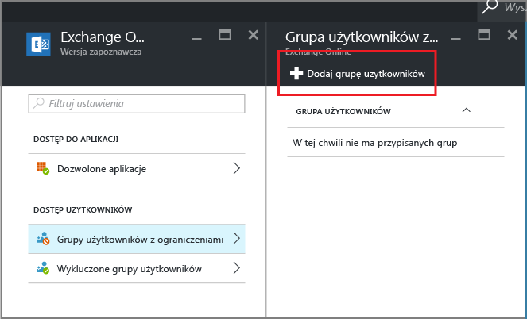

# Tworzenie dostępu warunkowego do usługi Exchange Online, aby zezwolić tylko na aplikacje obsługiwane przez MAM

[!INCLUDE[classic-portal](../includes/classic-portal.md)]

Ten temat zawiera szczegółowe instrukcje dotyczące sposobu konfigurowania dostępu warunkowego dla usługi Exchange Online w celu zezwolenia tylko na aplikacje mobilne obsługujące zasady ochrony aplikacji usługi Intune.

## Tworzenie zasad dotyczących usługi Exchange Online
1.  Zaloguj się do [portalu Azure](https://portal.azure.com) zawierającego funkcję dostępu do aplikacji. Jeśli jesteś nowym użytkownikiem portalu Azure, zapoznaj się z tematem [Witryna Azure Portal dla zasad ochrony aplikacji](azure-portal-for-microsoft-intune-mam-policies.md).

2.  Wybierz opcję **Więcej usług**, a następnie wpisz „Intune”.

3.  Wybierz opcję **Ochrona aplikacji w usłudze Intune**.

4.  W bloku **Zarządzanie aplikacjami mobilnymi w usłudze Intune** wybierz pozycję **Wszystkie ustawienia**.

5.  W sekcji **Dostęp warunkowy** wybierz pozycję **Exchange Online**.

    

6. W bloku **Dozwolone aplikacje** wybierz opcję **Zezwalaj na aplikacje obsługujące zasady aplikacji usługi Intune**, aby zezwolić na dostęp do usługi Exchange Online tylko aplikacjom obsługiwanym przez zasady ochrony aplikacji usługi Intune. Po wybraniu tej opcji zostanie wyświetlona lista obsługiwanych aplikacji.

    >[!NOTE]
    >Wszyscy klienci poczty programu Exchange Active Sync, w tym wbudowani klienci poczty w systemie iOS i Android łączący się z usługą Exchange Online, nie będą mogli wysyłać ani odbierać wiadomości e-mail. Użytkownicy zamiast tego otrzymają jedną wiadomość e-mail informującą ich o konieczności użycia aplikacji poczty programu Outlook.

7. Aby zastosować tę zasadę do użytkowników, otwórz blok **Grupy użytkowników z ograniczeniami** i wybierz polecenie **Dodaj grupę użytkowników**. Wybierz przynajmniej jedną grupę użytkowników, która powinna pobrać tę zasadę.

    

8. Możesz postanowić, aby niektórych użytkowników w wybranej w poprzednim kroku grupie użytkowników nie dotyczyły te zasady. W takich przypadkach dodaj grupę użytkowników do listy wykluczonych grup użytkowników. W bloku **Exchange Online** wybierz pozycję **Wykluczone grupy użytkowników**. Wybierz pozycję **Dodaj grupę użytkowników**, aby otworzyć listę grup użytkowników. Wybierz grupy, które mają być wykluczone z tych zasad.  

## Modyfikowanie istniejącej zasady
### Dodawanie lub usuwanie grup użytkowników

Aby **usunąć grupę użytkowników** z listy **Grupy użytkowników z ograniczeniami**, otwórz blok **Grupy użytkowników z ograniczeniami**, zaznacz grupę użytkowników, którą chcesz usunąć, a następnie kliknij **wielokropek (...)**, aby wyświetlić opcję **Usuń**. Wybierz pozycję **Usuń**, aby usunąć grupę użytkowników z listy. Za pomocą tej samej procedury możesz usunąć grupę użytkowników z listy **Wykluczone grupy użytkowników**.

## Następne kroki
[Blokowanie aplikacji, które nie obsługują nowoczesnego uwierzytelniania](block-apps-with-no-modern-authentication.md)
### Zobacz także
[Ochrona danych aplikacji za pomocą zasad ochrony aplikacji](protect-app-data-using-mobile-app-management-policies-with-microsoft-intune.md)

<!--HONumber=Feb17_HO2-->

