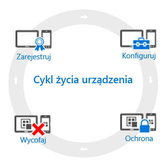

# Przegląd cyklu życia zarządzania urządzeniami przenośnymi

[!INCLUDE[classic-portal](../includes/classic-portal.md)]

Wszystkie urządzenia, którymi zarządzasz, mają tak zwany *cykl życia*. Usługa Intune pomaga zarządzać tym cyklem życia od rejestracji przez konfigurację i ochronę aż po wycofanie urządzenia, gdy nie jest już potrzebne:

## Zarejestruj
Współczesne strategie zarządzania urządzeniami przenośnymi muszą uwzględniać różne telefony, tablety i komputery (z systemami iOS, Android, Windows i Mac OS X). Aby móc zarządzać urządzeniem, co często zdarza się w przypadku urządzeń będących własnością firmy, pierwszym krokiem jest [skonfigurowanie rejestracji urządzenia](enroll-devices-in-microsoft-intune.md). Komputerami z systemem Windows można też zarządzać przez zarejestrowanie ich w usłudze Intune (zarządzanie urządzeniami przenośnymi, MDM) lub [zainstalowanie oprogramowania klienckiego usługi Intune](manage-windows-pcs-with-microsoft-intune.md).

## Konfiguracja
Zarejestrowanie urządzeń jest tylko pierwszym krokiem. Aby móc korzystać z oferty usługi Intune i zapewnić, że urządzenia są bezpieczne i zgodne ze standardami firmy, można wybierać z szerokiej gamy zasad. Pozwalają one na skonfigurowanie niemal każdego aspektu działania zarządzanych urządzeń. Dotyczy to na przykład tego, czy użytkownicy powinni mieć hasła na urządzeniach, na których znajdują się dane firmowe. Można tego wymagać. Czy masz firmową sieć Wi-Fi? Możesz ją skonfigurować automatycznie. Poniżej przedstawiono typy dostępnych opcji konfiguracji:

- [**Zasady konfiguracji**](manage-settings-and-features-on-your-devices-with-microsoft-intune-policies.md). Zasady te pozwalają skonfigurować funkcje i możliwości urządzeń, którymi zarządzasz. Można na przykład wymagać używania hasła na telefonach z systemem Windows Phone lub uniemożliwić korzystanie z aparatu na urządzeniach iPhone.
- [**Zasady dostępu do zasobów firmy**](enable-access-to-company-resources-with-microsoft-intune.md). Jeśli umożliwisz użytkownikom dostęp do ich pracy na ich osobistych urządzeniach, może stać się to źródłem trudności. Na przykład jak zapewnić, aby wszystkie urządzenia, które wymagają dostępu do firmowej poczty e-mail, były skonfigurowane prawidłowo? Jak zapewnić użytkownikom dostęp do sieci firmowej za pomocą połączenia sieci VPN bez znajomości złożonych ustawień? Usługa Intune może pomóc zmniejszyć to obciążenie poprzez automatyczne konfigurowanie urządzeń, którymi zarządzasz, w sposób umożliwiający im dostęp do wspólnych zasobów firmy.
- [**Zasady zarządzania komputerem z systemem Windows (przy użyciu oprogramowania klienckiego usługi Intune)**](common-windows-pc-management-tasks-with-the-microsoft-intune-computer-client.md). Rejestrowanie komputerów z systemem Windows za pomocą usługi Intune daje najwięcej możliwości zarządzania urządzeniami, jednak usługa Intune w dalszym ciągu obsługuje zarządzanie komputerami z systemem Windows przy użyciu oprogramowania klienckiego usługi Intune. Jeśli potrzebujesz informacji na temat niektórych zadań, które można wykonywać z użyciem komputerów, zacznij tutaj.

## Ochrona
We współczesnym świecie IT ochrona urządzeń przed nieautoryzowanym dostępem jest jednym z najważniejszych zadań, jakie będziesz wykonywać. Usługa Intune — obok elementów w kroku **Konfiguracja** cyklu życia urządzenia — zapewnia dodatkowe możliwości ochrony zarządzanych urządzeń przed nieautoryzowanym dostępem lub złośliwymi atakami:
- [**Uwierzytelnianie wieloskładnikowe**](protect-windows-devices-with-multi-factor-authentication.md). Dodanie dodatkowej warstwy uwierzytelniania do logowania użytkowników może sprawić, że urządzenia będą jeszcze bardziej bezpieczne. Urządzenia z systemami Windows, Windows Phone i Windows Mobile zapewniają uwierzytelnianie wieloskładnikowe, które wymaga drugiego poziomu uwierzytelniania, takiego jak rozmowa telefoniczna lub wiadomości SMS, zanim użytkownicy będą mogli uzyskać dostęp.
- [**Ustawienia usługi Microsoft Passport**](control-microsoft-passport-settings-on-devices-with-microsoft-intune.md). Microsoft Passport stanowi alternatywną metodę logowania jednokrotnego pozwalającą użytkownikom na korzystanie z *gestu*, takiego jak odcisk palca, lub z funkcji Windows Hello w celu logowania się bez użycia hasła.
- [**Zasady ochrony komputerów z systemem Windows (przy użyciu oprogramowania klienckiego usługi Intune)**](policies-to-protect-windows-pcs-in-microsoft-intune.md). W przypadku zarządzania komputerami z systemem Windows przy użyciu oprogramowania klienckiego usługi Intune dostępne są zasady umożliwiające kontrolowanie ustawień programu Endpoint Protection, kontrolowanie aktualizacji oprogramowania i zapory systemu Windows na komputerach, którymi zarządzasz.

## Wycofaj
Gdy dojdzie do utraty lub kradzieży urządzenia, zajdzie potrzeba jego wymiany lub użytkownik przejdzie na inne stanowisko, zazwyczaj jest to czas na [wycofanie lub wyczyszczenie](use-remote-wipe-to-help-protect-data-using-microsoft-intune.md) urządzenia. Istnieją różne sposoby, które umożliwiają realizację tego zadania — w tym zresetowanie urządzenia, usunięcie go z zarządzania i wyczyszczenie danych firmowych na nim.

<!--HONumber=Dec16_HO5-->

