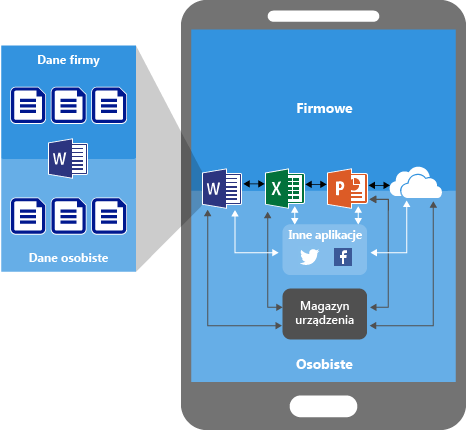
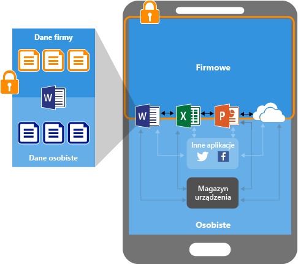
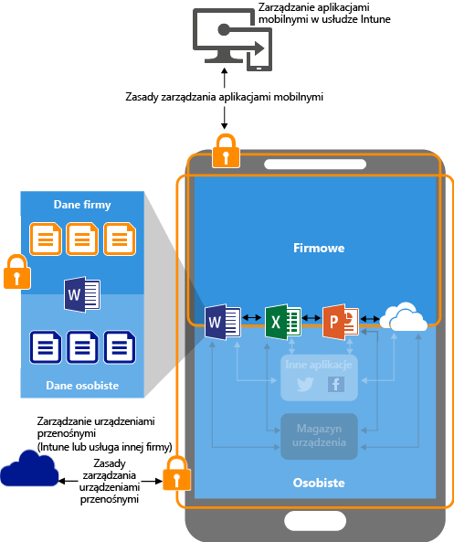
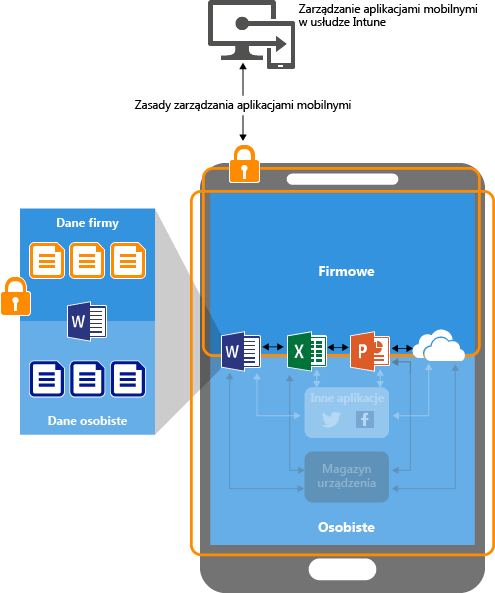

# Ochrona danych aplikacji przy użyciu zasad zarządzania aplikacjami mobilnymi w usłudze Microsoft Intune

[!INCLUDE[classic-portal](../includes/classic-portal.md)]

## Jak możesz chronić dane aplikacji
Pracownicy używają urządzeń przenośnych zarówno do celów służbowych, jak i prywatnych. Umożliwiając pracownikom wydajną pracę, warto jednocześnie zapobiegać nieumyślnej lub umyślnej utracie danych.  Dobrze też mieć możliwość ochrony danych firmowych, do których pracownicy uzyskują dostęp za pomocą urządzeń, którymi nie zarządzamy.

Aby lepiej chronić dane firmy, możesz skorzystać z zasad zarządzania aplikacjami mobilnymi (MAM, mobile application management) w usłudze Intune. Ponieważ zasady MAM w usłudze Intune są **niezależne od wszelkich rozwiązań do zarządzania urządzeniami przenośnymi (MDM, mobile device management)**, możesz użyć ich do ochrony danych firmy bez względu na to, czy urządzenia zostały zarejestrowane w rozwiązaniach do zarządzania urządzeniami. Wdrażając **zasady na poziomie aplikacji**, można ograniczyć dostęp do zasobów firmy i objęcia danych kontrolą działu IT.

Zasady MAM można skonfigurować dla aplikacji uruchomionej na urządzeniach, które są:

-   **Zarejestrowane w usłudze Microsoft Intune:** urządzenia w tej kategorii są przeważnie urządzeniami należącymi do firmy.

-   **Zarejestrowane w rozwiązaniu do zarządzania urządzeniami przenośnymi (MDM) innej firmy:** urządzenia w tej kategorii są przeważnie urządzeniami należącymi do firmy.

  > [!NOTE]
  > Nie zaleca się stosowania zasad MAM w połączeniu z rozwiązaniami do zarządzania aplikacjami mobilnymi lub rozwiązań z bezpiecznym kontenerem innych firm.

-   **Niezarejestrowane w żadnym rozwiązaniu do zarządzania urządzeniami przenośnymi:** urządzenia w tej kategorii są zazwyczaj urządzeniami należącymi do pracowników, które nie są zarządzane lub nie zostały zarejestrowane w usłudze Intune ani innych rozwiązaniach MDM.

> [!IMPORTANT]
> Możesz tworzyć zasady zarządzania aplikacjami mobilnymi dla aplikacji mobilnych pakietu Office łączących się z usługami Office 365. Zasady MAM nie są obsługiwane w przypadku aplikacji łączących się z lokalnymi usługami Exchange, Skype dla firm lub SharePoint.

## Zalety stosowania zasad MAM

-   **Pomagają chronić dane firmy na poziomie aplikacji.** Ponieważ zarządzanie aplikacjami mobilnymi nie wymaga zarządzania urządzeniami, dane firmy można chronić zarówno na urządzeniach zarządzanych, jak i niezarządzanych. Zarządzanie skupia się na tożsamości użytkownika, co eliminuje konieczność zarządzania urządzeniem.

-   **Zasady nie mają wpływu na produktywność użytkownika i nie są stosowane podczas korzystania z aplikacji w kontekście prywatnym.** Zasady są stosowane wyłącznie w kontekście służbowym, co daje możliwość ochrony danych firmowych bez ingerowania w dane prywatne.

Stosowanie rozwiązań MDM jednocześnie z zasadami MAM jest możliwe i daje dodatkowe korzyści. Firmy mogą równocześnie korzystać z zasad MAM z rozwiązaniem MDM lub bez niego. Na przykład pracownik może korzystać z telefonu otrzymanego od firmy oraz z prywatnego tabletu. W takiej sytuacji telefon firmowy jest zarejestrowany w rozwiązaniu MDM i chroniony przez zasady MAM, natomiast urządzenie prywatne jest chronione tylko przez zasady MAM.

- **Rozwiązanie MDM zapewnia ochronę urządzenia.** Możesz na przykład zastosować zabezpieczenie dostępu do urządzenia numerem PIN lub wdrożyć na urządzeniu aplikacje zarządzane. Możesz również wdrażać aplikacje na urządzeniach za pośrednictwem rozwiązania MDM, aby mieć lepszą kontrolę nad zarządzaniem aplikacjami.

- **Zasady MAM zapewniają ochronę warstwy aplikacji.** Na przykład możesz mieć zasadę, która wymaga zastosowania numeru PIN w celu otwarcia aplikacji w kontekście służbowym, chroni dane przed udostępnieniem innym aplikacjom i uniemożliwia zapisywanie firmowych danych aplikacji w prywatnej lokalizacji magazynu.

## Urządzenia, które obsługują zasady MAM
Zasady MAM są obecnie obsługiwane w następujących systemach operacyjnych:
-   System iOS 8.1 lub nowszy
-   System Android 4 lub nowszy

>[!NOTE]
>Urządzenia z systemem Windows nie są obsługiwane w rozwiązaniu do zarządzania aplikacjami mobilnymi bez scenariusza rejestracji. Jednak podczas rejestrowania urządzeń z systemem Windows 10 w usłudze Intune możesz użyć rozwiązania Windows Information Protection, które oferuje podobne funkcje. Aby uzyskać szczegółowe informacje, zobacz [Protect your enterprise data using Windows Information Protection](https://technet.microsoft.com/itpro/windows/keep-secure/protect-enterprise-data-using-wip) (Chronienie danych przedsiębiorstwa przy użyciu rozwiązania Windows Information Protection).

##  Jak zasady MAM chronią dane aplikacji

###  Aplikacje bez zasad MAM

Jeśli korzystasz z aplikacji bez ograniczeń, dane firmowe i prywatne mogą ulec wymieszaniu. Dane firmowe mogą więc trafić na przykład do magazynu osobistego lub zostać przesłane do aplikacji pozostających poza Twoją kontrolą, co może grozić utratą danych. Strzałki na rysunku oznaczają nieograniczone przemieszczanie się danych między aplikacjami (firmowymi i prywatnymi) oraz do lokalizacji magazynu.

### Ochrona danych za pomocą zasad MAM

Zasady MAM umożliwiają zapobieganie zapisywaniu danych firmy w lokalnym magazynie urządzenia i ograniczanie ruchu danych do innych aplikacji, które nie są chronione przy użyciu zasad MAM. Ustawienia zasad MAM to:
- Zasady przenoszenia danych, takie jak **Nie zezwalaj na używanie polecenia Zapisz jako** i **Ogranicz wycinanie, kopiowanie i wklejanie**.
- Ustawienia zasad dostępu, takie jak **Wymagaj prostego numeru PIN w celu udzielenia dostępu** i **Blokuj uruchamianie aplikacji zarządzanych na urządzeniach ze zdjętymi zabezpieczeniami systemu lub odblokowanym dostępem do konta administratora**.

### Ochrona danych za pomocą zasad MAM na urządzeniach zarządzanych przez rozwiązanie MDM

**Dla urządzeń przenośnych zarejestrowanych w rozwiązaniu MDM**: na powyższym diagramie przedstawiono warstwy ochrony oferowane łącznie przez rozwiązanie do zarządzania urządzeniami przenośnymi i zasady MAM.

Rozwiązanie MDM:

-   Rejestruje urządzenie.

-   Wdraża aplikacje na urządzeniu.

-   Na bieżąco zapewnia zgodność urządzenia i zarządzanie nim.

**Zasady MAM zapewniają korzyści, ponieważ:**

-   Wspomagają ochronę danych firmy przed wyciekiem do aplikacji i usług dla konsumentów.

-   Stosują ograniczenia (zapisz jako, schowek, numer PIN itp.) do aplikacji mobilnych.

-   Wymazują dane firmowe z aplikacji, nie usuwając tych aplikacji z urządzenia.

### Ochrona danych za pomocą zasad MAM dla urządzeń bez rejestracji

Kolejny rysunek przedstawia sposób działania zasad ochrony danych na poziomie aplikacji bez rozwiązania MDM.

W przypadku urządzeń BYOD, które nie są zarejestrowane w żadnym rozwiązaniu MDM, zasady MAM mogą pomóc w ochronie danych firmowych na poziomie aplikacji.

Należy jednak wziąć pod uwagę następujące ograniczenia:

-   Na urządzeniach nie można wdrażać aplikacji. Użytkownik musi uzyskać aplikacje ze sklepu.

-   Na urządzeniach nie można dostarczać profili certyfikatów.

-   Na urządzeniach nie można wprowadzać ustawień firmowych sieci Wi-Fi i VPN.

## Wiele tożsamości

Aplikacje, które obsługują wiele tożsamości, umożliwiają używanie różnych kont (służbowych i osobistych) do uzyskiwania dostępu do tych samych aplikacji, podczas gdy zasady MAM są stosowane tylko, gdy aplikacje są używane w kontekście służbowym.  

Jeśli na przykład użytkownik uruchamia aplikację OneDrive przy użyciu konta służbowego, nie może przenieść plików do lokalizacji magazynu osobistego. Jeśli jednak użytkownik korzysta z usługi OneDrive przy użyciu konta osobistego, może bez ograniczeń kopiować i przenosić dane z usługi OneDrive w wersji do użytku osobistego.  

Wszystkie aplikacje mobilne pakietu Office obsługują dostęp dla wielu tożsamości.

##  Następne kroki
- [Przygotowanie się do skonfigurowania zasad zarządzania aplikacjami mobilnymi](get-ready-to-configure-mobile-app-management-policies-with-microsoft-intune.md)

- [Tworzenie i wdrażanie zasad zarządzania aplikacjami mobilnymi przy użyciu usługi Microsoft Intune](create-and-deploy-mobile-app-management-policies-with-microsoft-intune.md)

<!--HONumber=Jan17_HO4-->

