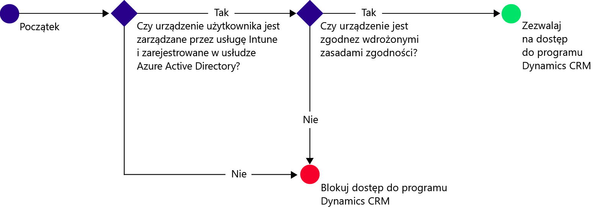
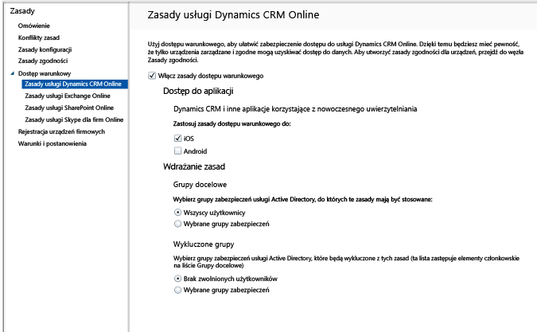

# Ochrona dostępu do usługi Dynamics CRM Online przy użyciu usługi Intune

[!INCLUDE[classic-portal](../includes/classic-portal.md)]

Dostęp do usługi Microsoft Dynamics CRM Online na urządzeniach z systemem iOS i Android można kontrolować przy użyciu dostępu warunkowego usługi Microsoft Intune.  Dostęp warunkowy usługi Intune ma dwa składniki:
* [Zasady zgodności urządzenia](introduction-to-device-compliance-policies-in-microsoft-intune.md), które urządzenie musi spełniać, aby można je było uważać za zgodne.
* [Zasady dostępu warunkowego](restrict-access-to-email-and-o365-services-with-microsoft-intune.md), w ramach których określane są warunki, które urządzenie musi spełniać w celu uzyskania dostępu do usługi.

Aby dowiedzieć się więcej o sposobie działania dostępu warunkowego, przeczytaj artykuł [Ochrona dostępu do poczty e-mail, usług O365 i innych usług](restrict-access-to-email-and-o365-services-with-microsoft-intune.md).

> [!IMPORTANT]
> Aby wdrożyć dostęp warunkowy, musisz mieć subskrypcje usług Intune i Azure Active Directory w wersji Premium, a użytkownicy muszą mieć licencje obu produktów. **Subskrypcja pakietu Enterprise Mobility + Security (EMS)** obejmuje zarówno subskrypcję usługi Intune, jak i subskrypcję usługi Azure Active Directory — wersja Premium. Aby uzyskać więcej szczegółowych informacji, zobacz [Cennik pakietu Enterprise Mobility](https://www.microsoft.com/en-us/cloud-platform/enterprise-mobility-pricing). Jeśli nie masz subskrypcji pakietu EMS, możesz uzyskać subskrypcję usługi Azure Active Directory — wersja Premium. Zobacz [Cennik usługi Azure Active Directory](https://azure.microsoft.com/en-us/pricing/details/active-directory/).

Jeśli wybrany użytkownik próbuje użyć aplikacji Dynamics CRM na swoim urządzeniu, sprawdzane są następujące kwestie:

Urządzenie, dla którego wymagany jest dostęp do usługi Dynamics CRM Online, musi:
* Być urządzeniem z systemem **Android** lub **iOS**.
* Być **zarejestrowane** w usłudze Intune.
* Być **zgodne** z wdrożonymi zasadami zgodności usługi Intune.

Stan urządzenia jest przechowywany w usłudze Azure Active Directory, która na podstawie wybranych warunków przydziela prawo dostępu lub je blokuje.

Jeśli warunek nie jest spełniony, użytkownik zobaczy podczas logowania jeden z następujących komunikatów:
* Jeśli urządzenie nie zostało zarejestrowane w usłudze Intune lub Azure Active Directory, zostanie wyświetlony komunikat z instrukcjami dotyczącymi sposobu instalowania aplikacji portalu firmy i rejestrowania.
* Jeśli urządzenie nie jest zgodne, zostanie wyświetlony komunikat kierujący użytkownika do witryny internetowej portalu firmy usługi Microsoft Intune lub aplikacji Portal firmy, gdzie można znaleźć informacje o problemie i sposobie jego rozwiązania.

## Konfigurowanie dostępu warunkowego dla usługi Dynamics CRM Online  
### Krok 1. Konfigurowanie grup zabezpieczeń usługi Active Directory

Przed rozpoczęciem skonfiguruj grupy zabezpieczeń usługi Azure Active Directory dla zasad dostępu warunkowego. Możesz skonfigurować te grupy w **centrum administracyjnym usługi Office 365**. Te grupy są używane do objęcia użytkowników zasadami lub wykluczenia ich z zasad. Jeśli zasady obejmują użytkownika, każde używane przez niego urządzenie musi być zgodne, aby mógł uzyskać dostęp do zasobów.

Można określić dwa typy grup używane dla zasad usługi Dynamics CRM:
* **Grupy docelowe**. Zawiera grupy użytkowników, których dotyczą zasady.
* **Wykluczone grupy**. Zawiera grupy użytkowników, którzy są wykluczeni z zasad.

Jeśli użytkownik należy do obu grup, będzie wykluczony z zasad.

### Krok 2. Konfigurowanie i wdrażanie zasad zgodności
[Utwórz](create-a-device-compliance-policy-in-microsoft-intune.md) zasady zgodności i [wdróż](deploy-and-monitor-a-device-compliance-policy-in-microsoft-intune.md) je na wszystkich urządzeniach, które będą objęte zasadami. To wszystkie urządzenia, które są używane przez użytkowników z grup docelowych.

> [!NOTE]
> Podczas gdy zasady zgodności są wdrażane w grupach usługi Intune, zasady dostępu warunkowego są stosowane dla grup zabezpieczeń usługi Azure Active Directory.

> [!IMPORTANT]
> Jeśli zasady zgodności nie zostały wdrożone, urządzenia będą traktowane jako zgodne.

Gdy wszystko będzie gotowe, przejdź do kroku 3.
### Krok 3. Konfigurowanie zasad usługi Dynamics CRM
Skonfiguruj zasady wymagające, aby tylko urządzenia zarządzane i zgodne miały dostęp do usługi Dynamics CRM. Te zasady będą przechowywane w usłudze Azure Active Directory.

1.  W konsoli administracyjnej usługi Intune wybierz pozycje **Zasady > Dostęp warunkowy > Zasady usługi Dynamics CRM Online**.

  

2.  Wybierz pozycję **Włącz zasady dostępu warunkowego**.
3.  W obszarze **Dostęp do aplikacji** możesz wybrać platformy, do których zostaną zastosowane zasady dostępu warunkowego:
  * **iOS**
  * **Android**
4.  W obszarze **Grupy docelowe** wybierz pozycję **Modyfikuj**, aby wybrać grupy zabezpieczeń usługi Azure Active Directory, do których zostaną zastosowane zasady. Możesz objąć zasadami wszystkich użytkowników lub ich wybrane grupy.
5.  W obszarze **Wykluczone grupy** możesz wybrać pozycję **Modyfikuj**, jeśli chcesz, aby zasady nie były stosowane dla wskazanych grup zabezpieczeń usługi Azure Active Directory.
6.  Gdy wszystko będzie gotowe, wybierz pozycję **Zapisz**.

Dostęp warunkowy dla usługi Dynamics CRM został skonfigurowany. Nie musisz wdrażać zasad dostępu warunkowego; są one aktywne natychmiast.
##  Monitorowanie zgodności i zasad dostępu warunkowego

W obszarze roboczym **Grupy** można przeglądać informacje o stanie warunkowego dostępu do urządzeń.

Wybierz dowolną grupę urządzeń przenośnych, a następnie na karcie **Urządzenia** wybierz jeden z następujących **filtrów**:
* **Urządzenia, które nie są zarejestrowane w usłudze AAD**. Te urządzenia są blokowane w usłudze Dynamics CRM.
* **Urządzenia, które nie są zgodne**. Te urządzenia są blokowane w usłudze Dynamics CRM.
* **Urządzenia, które są zarejestrowane w usłudze AAD i są zgodne**. Te urządzenia mogą uzyskać dostęp do usługi Dynamics CRM.

##  Następne kroki
* [Ochrona dostępu do usługi Exchange Online](restrict-access-to-exchange-online-with-microsoft-intune.md)

* [Ochrona dostępu do lokalnej instalacji programu Exchange](restrict-access-to-exchange-onpremises-with-microsoft-intune.md)
* [Ochrona dostępu do usługi SharePoint Online](restrict-access-to-sharepoint-online-with-microsoft-intune.md)

* [Ochrona dostępu do usługi Skype dla firm Online](restrict-access-to-skype-for-business-online-with-microsoft-intune.md)

<!--HONumber=Jan17_HO4-->

