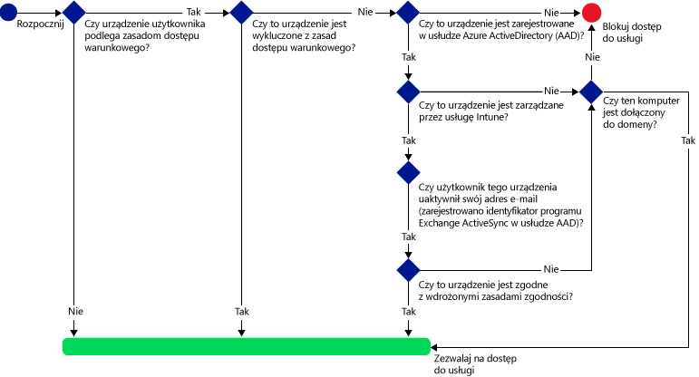
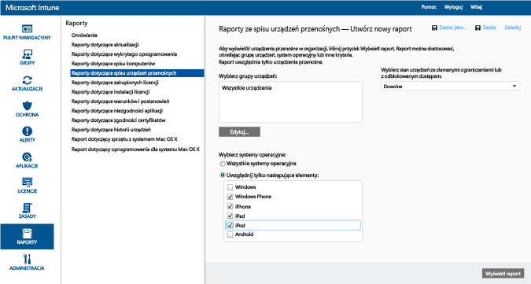
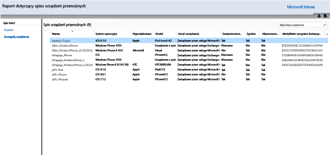
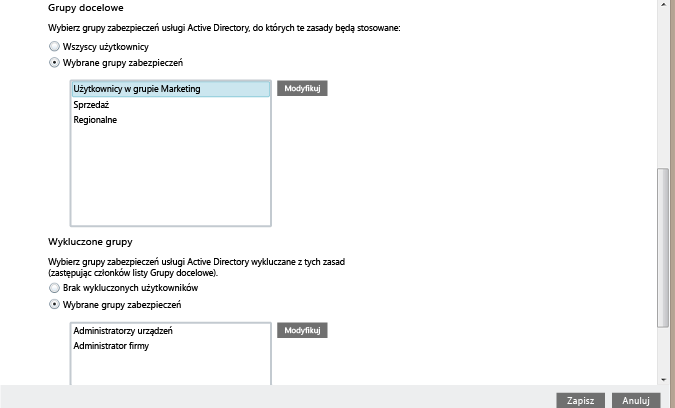
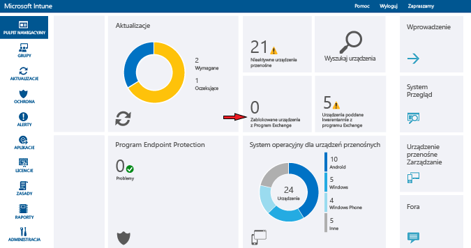

# Ochrona dostępu do poczty e-mail za pośrednictwem usługi Exchange Online i nowej usługi Exchange Online w wersji dedykowanej przy użyciu usługi Intune

[!INCLUDE[classic-portal](../includes/classic-portal.md)]

Za pomocą usługi Microsoft Intune można skonfigurować dostęp warunkowy dla usługi Exchange Online lub usługi Exchange Online w wersji dedykowanej. Aby dowiedzieć się więcej o sposobie działania dostępu warunkowego, przeczytaj artykuł [Ochrona dostępu do poczty e-mail, usług O365 i innych usług](restrict-access-to-email-and-o365-services-with-microsoft-intune.md).

> [!NOTE]
>Jeśli masz środowisko usługi Exchange Online w wersji dedykowanej i chcesz sprawdzić, czy zawiera ono nową, czy starszą konfigurację, skontaktuj się z menedżerem ds. klientów.

## Przed rozpoczęciem

Aby skonfigurować dostęp warunkowy, trzeba:

-   Mieć **subskrypcję usługi Office 365 obejmującą usługę Exchange Online (na przykład E3)**, a użytkownicy muszą mieć licencję na usługę Exchange Online.

- Posiadanie **subskrypcji pakietu Enterprise Mobility + Security (EMS)** lub **subskrypcji usługi Azure Active Directory (Azure AD) Premium** oraz posiadanie licencji użytkowników na usługi EMS lub Azure AD. Aby uzyskać więcej szczegółowych informacji, zobacz [Cennik pakietu Enterprise Mobility](https://www.microsoft.com/en-us/cloud-platform/enterprise-mobility-pricing) lub [Cennik usługi Azure Active Directory](https://azure.microsoft.com/en-us/pricing/details/active-directory/).

-  Rozważyć skonfigurowanie opcjonalnego **łącznika Service To Service Connector usługi Intune**, który łączy usługę [!INCLUDE[wit_nextref](../includes/wit_nextref_md.md)] z usługą Exchange Online i ułatwia zarządzanie informacjami o urządzeniu za pośrednictwem konsoli usługi [!INCLUDE[wit_nextref](../includes/wit_nextref_md.md)]. Łącznik nie musi być używany do stosowania zasad zgodności lub dostępu warunkowego, ale jest wymagany do uruchamiania raportów umożliwiających ocenę wpływu dostępu warunkowego.
    -  Dowiedz się więcej o [łączniku Service to Service Connector usługi Intune](intune-service-to-service-exchange-connector.md).

   > [!NOTE]
   > Nie należy konfigurować łącznika Service To Service Connector usługi Intune, jeśli zamierzasz używać dostępu warunkowego zarówno dla usługi Exchange Online, jak i dla lokalnego programu Exchange.

### Wymagania dotyczące zgodności urządzeń

Aby po skonfigurowaniu zasad dostępu warunkowego i skierowaniu ich do użytkownika mógł on połączyć się ze swoją pocztą e-mail, jego **urządzenie** musi:

-   Zostać **zarejestrowane** na komputerze przyłączonym do domeny lub w usłudze [!INCLUDE[wit_nextref](../includes/wit_nextref_md.md)].

-  **Zostać zarejestrowane w usłudze Azure Active Directory**. Dzieje się to automatycznie podczas rejestrowania urządzenia w usłudze [!INCLUDE[wit_nextref](../includes/wit_nextref_md.md)]. Ponadto identyfikator klienta programu Exchange ActiveSync musi być zarejestrowany w usłudze Azure Active Directory.

  Usługa rejestracji urządzeń w usłudze Azure Active Directory zostanie aktywowana automatycznie dla klientów usług Intune i Office 365. Klienci, którzy już wdrożyli usługę rejestracji urządzeń w usługach AD FS, nie będą widzieć zarejestrowanych urządzeń w lokalnej usłudze Active Directory.

-   **Być zgodne** ze wszystkimi zasadami zgodności usługi [!INCLUDE[wit_nextref](../includes/wit_nextref_md.md)], które są wdrożone na tym urządzeniu lub podłączone do domeny lokalnej.

### Niezgodne urządzenie

Jeśli warunek dostępu nie zostanie spełniony, urządzenie zostanie natychmiast poddane kwarantannie, a użytkownik otrzyma wiadomość e-mail i zobaczy przy próbie zalogowania się jedno z następujących powiadomień:

- Jeśli urządzenie nie zostało zarejestrowane w usłudze [!INCLUDE[wit_nextref](../includes/wit_nextref_md.md)] lub Azure Active Directory, zostanie wyświetlony komunikat z instrukcjami dotyczącymi sposobu instalowania aplikacji Portal firmy, rejestrowania urządzenia i aktywowania poczty e-mail. Ten proces powoduje również skojarzenie identyfikatora programu Exchange ActiveSync urządzenia z rekordem w usłudze Azure Active Directory.

-   Jeśli urządzenie nie zostało ocenione jako zgodne z regułami zasad zgodności, użytkownik zostanie skierowany do witryny sieci Web Portal firmy lub do aplikacji Portal firmy usługi [!INCLUDE[wit_nextref](../includes/wit_nextref_md.md)], gdzie można znaleźć informacje o problemie i sposobie jego rozwiązania.

### Jak działa dostęp warunkowy w przypadku usługi Exchange Online

Na następującym diagramie przedstawiono przepływ używany przez zasady dostępu warunkowego dla usługi Exchange Online.

## Obsługa urządzeń przenośnych
Możliwa jest ochrona dostępu do poczty e-mail za pośrednictwem usługi Exchange Online z poziomu programu **Outlook** i innych **aplikacji używających nowoczesnego uwierzytelniania**. Obsługiwane są następujące funkcje:

- System Android 4.0 lub nowszy, system Samsung Knox Standard 4.0 lub nowszy i program Android for Work
- System iOS 8.0 i nowsze

[!INCLUDE[wit_nextref](../includes/afw_rollout_disclaimer.md)]

**Nowoczesne uwierzytelnianie** umożliwia logowanie do klientów pakietu Microsoft Office oparte na bibliotece Active Directory Authentication Library (ADAL).

-   Uwierzytelnianie oparte na bibliotece ADAL umożliwia klientom pakietu Office korzystanie z uwierzytelniania za pomocą przeglądarki (nazywanego też uwierzytelnianiem pasywnym). W celu uwierzytelnienia użytkownik jest kierowany do strony sieci Web logowania.
-   Ta nowa metoda logowania zapewnia większe bezpieczeństwo dzięki zastosowaniu **uwierzytelniania wieloskładnikowego** i **uwierzytelniania opartego na certyfikatach**. Aby uzyskać bardziej szczegółowe informacje, zobacz [Jak działa nowoczesne uwierzytelnianie](https://support.office.com/en-US/article/How-modern-authentication-works-for-Office-2013-and-Office-2016-client-apps-e4c45989-4b1a-462e-a81b-2a13191cf517). Możesz skonfigurować reguły oświadczeń ADFS, aby zablokować starsze protokoły uwierzytelniania. Szczegółowe instrukcje zostały przedstawione w punkcie [Scenariusz 3: Całkowite blokowanie dostępu do usługi O365 z wyjątkiem aplikacji opartych na przeglądarce](https://technet.microsoft.com/library/dn592182.aspx).

Można chronić dostęp do usługi **Outlook Web Access (OWA)** w usłudze Exchange Online, gdy użytkownik uzyskuje do niej dostęp za pomocą przeglądarki na urządzeniach z systemem **iOS** i **Android**. Dostęp może być dozwolony tylko za pośrednictwem obsługiwanych przeglądarek na zgodnych urządzeniach:

* Safari (iOS)
* Chrome (Android)
* Intune Managed Browser (iOS, Android 5.0 i nowsze)

   > [!IMPORTANT]
   > **Nieobsługiwane przeglądarki są blokowane**.

**Aplikacja OWA dla systemów iOS i Android może zostać zmodyfikowana, aby nie korzystała z nowoczesnego uwierzytelniania, i nie jest obsługiwana. Dostęp z poziomu aplikacji OWA musi zostać zablokowany za pomocą reguł oświadczeń usług ADFS.**

Dostęp do poczty e-mail programu Exchange z poziomu wbudowanego **klienta poczty e-mail programu Exchange ActiveSync** można chronić na następujących platformach:

- System Android 4.0 lub nowszy, system Samsung Knox Standard 4.0 lub nowszy

- System iOS 8.0 i nowsze

- System Windows Phone 8.1 lub nowszy

## Obsługa komputerów

Dostęp warunkowy można skonfigurować dla komputerów z aplikacjami klasycznymi pakietu Office, aby uzyskiwać dostęp do usług **Exchange Online** i **SharePoint Online** na komputerach spełniających następujące wymagania:

-   Na komputerze musi działać system Windows 7.0, Windows 8.1 lub Windows 10.

  >[!NOTE]
  > Aby korzystać z dostępu warunkowego na komputerach z systemem Windows 10, trzeba na nich zainstalować Rocznicową aktualizację systemu Windows 10.

  Komputer musi zostać przyłączony do domeny lub być zgodny z regułami zasad zgodności.

  W celu zapewnienia zgodności komputer musi zostać zarejestrowany w usłudze [!INCLUDE[wit_nextref](../includes/wit_nextref_md.md)] i być zgodny z zasadami.

  W przypadku komputerów przyłączonych do domeny należy skonfigurować dostęp warunkowy do [automatycznego rejestrowania urządzenia](https://azure.microsoft.com/documentation/articles/active-directory-conditional-access-automatic-device-registration/) w usłudze Azure Active Directory.

  >[!NOTE]
    >Dostęp warunkowy nie jest obsługiwany na komputerach z uruchomionym oprogramowaniem klienckim usługi Intune.

-   [Należy włączyć nowoczesne uwierzytelnianie w usłudze Office 365](https://support.office.com/en-US/article/Using-Office-365-modern-authentication-with-Office-clients-776c0036-66fd-41cb-8928-5495c0f9168a) i zainstalować wszystkie najnowsze aktualizacje pakietu Office.

    Nowoczesne uwierzytelnianie umożliwia logowanie do klientów pakietu Office 2013/systemu Windows oparte na bibliotece Active Directory Authentication Library (ADAL). Zapewnia to większe bezpieczeństwo dzięki zastosowaniu **uwierzytelniania wieloskładnikowego** i **uwierzytelniania opartego na certyfikatach**.

-   Reguły oświadczeń ADFS są skonfigurowane tak, aby zablokować starsze protokoły uwierzytelniania. Szczegółowe instrukcje zostały przedstawione w punkcie [Scenariusz 3: Całkowite blokowanie dostępu do usługi O365 z wyjątkiem aplikacji opartych na przeglądarce](https://technet.microsoft.com/library/dn592182.aspx).

## Konfigurowanie zasad dostępu warunkowego
### Krok 1. Konfigurowanie i wdrażanie zasad zgodności
Upewnij się, że zasada zgodności zostanie [utworzona](create-a-device-compliance-policy-in-microsoft-intune.md) i [wdrożona](deploy-and-monitor-a-device-compliance-policy-in-microsoft-intune.md) dla grup użytkowników, które otrzymają również zasady dostępu warunkowego.

> [!IMPORTANT]
> Jeśli zasady zgodności nie zostały wdrożone, urządzenia będą uznawane za zgodne i będą miały dostęp do programu Exchange.

### Krok 2. Ocena wpływu zasad dostępu warunkowego
Możliwe jest użycie **raportów ze spisu urządzeń przenośnych** w celu zidentyfikowania urządzeń, które mogą mieć zablokowany dostęp do programu Exchange po skonfigurowaniu zasad dostępu warunkowego.

W tym celu należy skonfigurować połączenie między usługą [!INCLUDE[wit_nextref](../includes/wit_nextref_md.md)] i programem Exchange za pomocą [łącznika Service To Service Connector usługi Microsoft Intune](intune-service-to-service-exchange-connector.md).
1.  Przejdź do pozycji **Raporty** > **Raporty ze spisu urządzeń przenośnych**.

2.  W parametrach raportu wybierz grupę usługi [!INCLUDE[wit_nextref](../includes/wit_nextref_md.md)], która ma zostać oceniona, a następnie, w razie potrzeby, platformy urządzeń, których mają dotyczyć zasady.
3.  Po wybraniu kryteriów spełniających potrzeby organizacji wybierz pozycję **Wyświetl raport**.
Podgląd raportów zostanie otwarty w nowym oknie.

Po uruchomieniu raportu sprawdź następujące cztery kolumny w celu określenia, czy użytkownik będzie zablokowany:

-   **Kanał zarządzania** — wskazuje, czy urządzenie jest zarządzane przez usługę Intune, program Exchange ActiveSync, czy jednocześnie przez usługę i program.

-   **Zarejestrowane w usłudze AAD** — wskazuje, czy urządzenie jest zarejestrowane w usłudze Azure Active Directory (tzn. dołączone do obszaru roboczego).

-   **Zgodne** — wskazuje, czy urządzenie jest zgodne ze wszystkimi wdrożonymi zasadami zgodności.

-   **Identyfikator programu Exchange ActiveSync** — urządzenia z systemami iOS i Android muszą mieć identyfikator programu Exchange ActiveSync skojarzony z rekordem rejestracji urządzenia w usłudze Azure Active Directory. Ma to miejsce, gdy użytkownik wybierze link **Uaktywnij pocztę e-mail** w wiadomości e-mail z kwarantanny.

    > [!NOTE]
    > Urządzenia z systemem Windows Phone zawsze wyświetlają wartość w tej kolumnie.

Urządzenia, które należą do grupy docelowej, nie mają dostępu do programu Exchange, chyba że wartości w kolumnach są zgodne z wartościami w poniższej tabeli:

--------------------------
|Kanał zarządzania|Rejestracja w usłudze AAD|Zgodny|Identyfikator programu Exchange ActiveSync|Wynikowa akcja|
|----------------------|------------------|-------------|--------------------------|--------------------|
|**Zarządzane przez usługę Microsoft Intune i program Exchange ActiveSync**|Tak|Tak|Wartość jest wyświetlana|Dostęp do poczty e-mail jest dozwolony|
|Dowolna inna wartość|Nie|Nie|Żadna wartość nie jest wyświetlana|Dostęp do poczty e-mail jest zablokowany|
----------------------
Możesz wyeksportować zawartość raportu i użyć kolumny **Adres e-mail**, aby poinformować użytkowników o tym, że będą blokowani.

### Krok 3. Konfigurowanie grup użytkowników pod kątem zasad dostępu warunkowego
Zasady dostępu warunkowego są przeznaczone dla innej grupy użytkowników zabezpieczeń usługi Azure Active Directory. Możliwe jest również wykluczenie niektórych grup użytkowników z zasad dostępu warunkowego. Jeśli zasady obejmują użytkownika, każde używane przez niego urządzenie musi być zgodne, aby mógł uzyskać dostęp do poczty e-mail.

Możesz skonfigurować te grupy w **centrum administracyjnym usługi Office 365**lub w **portalu konta usługi Intune**.

Możesz określić dwa typy grup dla każdej zasady:

-   **Grupy docelowe** — grupy użytkowników, których dotyczą zasady.

-   **Wykluczone grupy** — grupy użytkowników, które są wykluczone z zasad (opcjonalnie).

Jeśli użytkownik należy do obu grup, będzie wykluczony z zasad.

Oceniane są tylko grupy objęte zasadami dostępu warunkowego.

### Krok 4. Konfigurowanie zasad dostępu warunkowego

>[!NOTE]
> Zasady dostępu warunkowego można też utworzyć za pomocą konsoli zarządzania usługi Azure AD. Konsola zarządzania usługi Azure AD umożliwia tworzenie zasad dostępu warunkowego urządzeń w usłudze Intune (nazywanych w usłudze Azure AD **zasadami dostępu warunkowego opartymi na urządzeniach**) oraz innych zasad dostępu warunkowego, takich jak uwierzytelnianie wieloskładnikowe.

>Można także ustawić zasady dostępu warunkowego dla aplikacji korporacyjnych innych firm obsługiwanych przez usługę Azure AD, np. Salesforce i Box. Aby uzyskać więcej informacji, zobacz [Jak ustawić oparte na urządzeniach zasady dostępu warunkowego usługi Azure Active Directory w celu kontrolowania dostępu do aplikacji połączonych z usługą Azure Active Directory](https://azure.microsoft.com/en-us/documentation/articles/active-directory-conditional-access-policy-connected-applications/).

1.  W [konsoli administracyjnej usługi Microsoft Intune](https://manage.microsoft.com) wybierz pozycję **Zasady** > **Dostęp warunkowy** > **Zasady usługi Exchange Online**.

2.  Na stronie **Zasady usługi Exchange Online** wybierz pozycję **Włącz zasady dostępu warunkowego dla usługi Exchange Online**.

    > [!NOTE]
    > Jeśli zasady zgodności nie zostały wdrożone, urządzenia są traktowane jako zgodne.
    >
    > Bez względu na stan zgodności wszyscy użytkownicy, którzy są objęci zasadami, muszą zarejestrować swoje urządzenia w usłudze [!INCLUDE[wit_nextref](../includes/wit_nextref_md.md)].

3.  W obszarze **Dostęp do aplikacji** w przypadku aplikacji używających nowoczesnego uwierzytelniania użytkownik ma dwa sposoby wyboru platform, których mają dotyczyć zasady. Obsługiwane platformy to Android, iOS, Windows i Windows Phone.

    -   **Wszystkie platformy**

        W przypadku wybrania tego ustawienia wszystkie urządzenia, za pomocą których jest uzyskiwany dostęp do usługi **Exchange Online**, muszą być zarejestrowane w usłudze Intune i zgodne z zasadami. Każda aplikacja kliencka korzystająca z **nowoczesnego uwierzytelniania** będzie podlegała zasadom dostępu warunkowego. Jeśli dana platforma nie jest aktualnie obsługiwana w usłudze Intune, dostęp do usługi **Exchange Online** jest blokowany.

        Wybranie opcji **Wszystkie platformy** oznacza, że usługa Azure Active Directory będzie stosować te zasady do wszystkich żądań uwierzytelniania zgłoszonych przez aplikację klienta, niezależnie od platformy. W przypadku wszystkich platform jest wymagana rejestracja w usłudze Intune oraz zgodność, istnieją jednak wyjątki:
        *    Urządzenia z systemem Windows, które są objęte wymogiem rejestracji i zgodności, przyłączone do domeny przy użyciu lokalnej usługi Active Directory lub spełniające oba te wymogi.
        * Nieobsługiwane platformy takie jak system Mac OS. Jednak aplikacje korzystające z nowoczesnego uwierzytelniania i pochodzące z tych platform nadal są zablokowane.

    -   **Określone platformy**

         Zasady dostępu warunkowego są stosowane do wszystkich aplikacji klienckich korzystających z **nowoczesnego uwierzytelniania** na określonych platformach urządzeń.

4. W obszarze **Outlook Web Access (OWA)** można zezwolić na dostęp do usługi Exchange Online tylko za pośrednictwem obsługiwanych przeglądarek: Safari (iOS) i Chrome (Android). Dostęp z innych przeglądarek będzie zablokowany. Ograniczenia platformy wybrane dla dostępu aplikacji dla programu Outlook mają zastosowanie również w tym miejscu.

  Na urządzeniach z systemem **Android** użytkownicy muszą włączyć dostęp za pomocą przeglądarki. W tym celu użytkownik musi włączyć opcję **Włącz dostęp za pomocą przeglądarki** na zarejestrowanym urządzeniu w następujący sposób:
  1.    Otworzyć **aplikację Portal firmy**.
  2.    Przejść do strony **Ustawienia** za pomocą przycisku oznaczonego wielokropkiem (…) lub przycisku menu urządzenia.
  3.    Nacisnąć przycisk **Włącz dostęp za pomocą przeglądarki**.
  4.    W przeglądarce Chrome wylogować się z usługi Office 365 i ponownie uruchomić przeglądarkę Chrome.

  Na platformach **iOS** i **Android** w celu zidentyfikowania urządzenia używanego do uzyskania dostępu do usługi usługa Azure Active Directory wystawi certyfikat TLS (Transport Layer Security) dla urządzenia. Urządzenie wyświetli użytkownikowi certyfikat wraz z monitem o wybranie certyfikatu, jak przedstawiono na zrzutach ekranu poniżej. Użytkownik musi wybrać ten certyfikat przed kontynuowaniem pracy z przeglądarką.

  **iOS**

  

  **Android**

  

5.  W obszarze **Aplikacje programu Exchange ActiveSync** można zablokować niezgodnym urządzeniom dostęp do usługi Exchange Online. Można również wybrać, czy dostęp do poczty e-mail ma być blokowany, czy nie, gdy na urządzeniu nie działa obsługiwana platforma. Obsługiwane platformy to Android, iOS, Windows i Windows Phone.

 Aplikacje programu Exchange Active Sync na urządzeniach z programem **Android for Work**:
 -  Na urządzeniach z programem Android for Work są obsługiwane tylko aplikacje **Gmail** i **Nine Work** w **profilu służbowym**. Aby dostęp warunkowy działał na urządzeniach z programem Android for Work, należy wdrożyć profil poczty e-mail dla aplikacji Gmail lub Nine Work, a także wdrożyć go jako **wymaganą** instalację.

6.  W obszarze **Grupy docelowe** wybierz grupy zabezpieczeń użytkowników usługi Active Directory, których dotyczą te zasady. Można wybrać objęcie wszystkich użytkowników lub wybranej listy grup użytkowników.

    > [!NOTE]
    > W przypadku użytkowników należących do **grup docelowych** zasady usługi Intune powodują zastąpienie reguł i zasad programu Exchange.
    >
    > Program Exchange wymusza reguły zezwalania, blokowania i kwarantanny programu Exchange oraz zasady programu Exchange tylko w następujących sytuacjach:
    >
    > -   Użytkownik nie ma licencji na usługę Intune.
    > -   Użytkownik ma licencję na usługę Intune, ale nie należy do żadnej grupy zabezpieczeń użytej w zasadach dostępu warunkowego.

6.  W obszarze **Grupy docelowe**wybierz grupy zabezpieczeń użytkowników usługi Active Directory wykluczane z tych zasad. Jeśli użytkownik należy zarówno do grupy objętej zasadami, jak i do grupy wykluczonej z zasad, jest wykluczony z zasad.

7.  Po zakończeniu tych czynności wybierz pozycję **Zapisz**.

-   Nie musisz wdrażać zasad dostępu warunkowego, ponieważ zostają one natychmiast zastosowane.

-   Gdy użytkownik utworzy konto e-mail, urządzenie zostanie od razu zablokowane.

-   Jeśli zablokowany użytkownik zarejestruje urządzenia w usłudze [!INCLUDE[wit_nextref](../includes/wit_nextref_md.md)] i rozwiąże wszystkie problemy z niezgodnością, dostęp do poczty e-mail zostanie odblokowany w ciągu dwóch minut.

-   Jeśli użytkownik wyrejestruje swoje urządzenie, poczta e-mail zostanie zablokowana po około sześciu godzinach.

Aby wyświetlić niektóre **przykładowe scenariusze dotyczące sposobu konfigurowania zasad dostępu warunkowego w celu ochrony dostępu urządzeń**, zobacz [Przykładowe scenariusze ochrony dostępu do poczty e-mail](restrict-email-access-example-scenarios.md).

## Monitorowanie zgodności i zasad dostępu warunkowego

#### Wyświetlanie urządzeń z zablokowanym dostępem do programu Exchange

Na pulpicie nawigacyjnym usługi [!INCLUDE[wit_nextref](../includes/wit_nextref_md.md)] wybierz kafelek **Urządzenia z zablokowanym dostępem do programu Exchange**, aby wyświetlić liczbę zablokowanych urządzeń i linki do szczegółowych informacji.

## Następne kroki
- [Ochrona dostępu do usługi SharePoint Online](restrict-access-to-sharepoint-online-with-microsoft-intune.md)

- [Ochrona dostępu do usługi Skype dla firm Online](restrict-access-to-skype-for-business-online-with-microsoft-intune.md)

