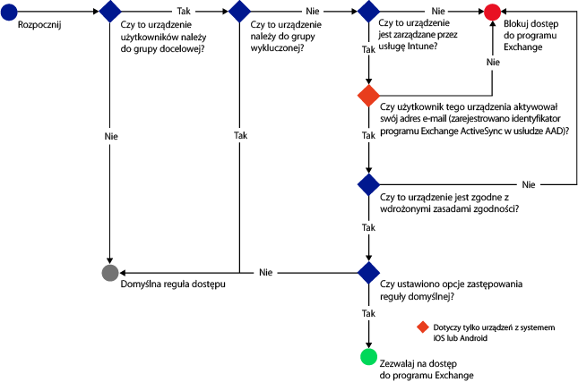
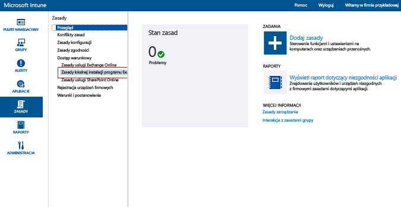

# Ograniczanie dostępu poczty e-mail do lokalnego programu Exchange i starszej wersji usługi Exchange Online w wersji dedykowanej przy użyciu usługi Intune

Jeśli masz środowisko usługi Exchange Online w wersji dedykowanej i chcesz sprawdzić, czy zawiera ono nową, czy starą konfigurację, skontaktuj się z menedżerem konta.

Aby kontrolować dostęp poczty e-mail do lokalnego programu Exchange lub do starszej wersji środowiska usługi Exchange Online w wersji dedykowanej, skonfiguruj dostęp warunkowy do lokalnego programu Exchange w usłudze Intune.
Aby dowiedzieć się więcej o sposobie działania dostępu warunkowego, przeczytaj artykuł [Ograniczanie dostępu do poczty e-mail i usług O365]( restrict-access-to-email-and-o365-services-with-microsoft-intune.md).

**Przed** skonfigurowaniem dostępu warunkowego zweryfikuj następujące kwestie:

-   Program Exchange musi być w wersji **Exchange 2010 lub nowszej**. Macierz serwerów dostępu klienta (CAS) serwera programu Exchange jest obsługiwana.

-   Należy użyć **łącznika lokalnego programu Exchange**, który łączy usługę [!INCLUDE[wit_nextref](../includes/wit_nextref_md.md)] z lokalnym programem Microsoft Exchange. Dzięki temu możliwe jest zarządzanie urządzeniami za pośrednictwem konsoli usługi [!INCLUDE[wit_nextref](../includes/wit_nextref_md.md)]. Aby uzyskać dodatkowe informacje dotyczące łącznika, zobacz artykuł dotyczący [łącznika lokalnego programu Exchange w usłudze Intune](intune-on-premises-exchange-connector.md).

    -   Łącznik lokalnego programu Exchange dostępny w konsoli usługi Intune jest przeznaczony dla Twojej dzierżawy usługi Intune i nie może być używany z innymi dzierżawami. Ponadto upewnij się, że łącznik programu Exchange dla Twojej dzierżawy został zainstalowany **tylko na jednym komputerze**.

        Ten łącznik powinien zostać pobrany z poziomu konsoli administracyjnej usługi Intune.  Przewodnik dotyczący sposobu konfigurowania łącznika lokalnego programu Exchange znajduje się w temacie [Konfigurowanie łącznika On-Premises Connector programu Exchange dla lokalnego lub hostowanego programu Exchange](intune-on-premises-exchange-connector.md).

    -   Łącznik można zainstalować na dowolnym komputerze, jeśli komputer ten jest w stanie komunikować się z programem Exchange Server.

    -   Łącznik obsługuje **środowisko serwera CAS programu Exchange**. Z technicznego punktu widzenia można bezpośrednio zainstalować łącznik na serwerze CAS programu Exchange, ale nie jest to zalecane, ponieważ spowoduje to zwiększenie obciążenia serwera.
    Podczas konfigurowania łącznika należy ustawić go tak, aby komunikował się z jednym z serwerów CAS programu Exchange.

-   Program **Exchange ActiveSync** należy skonfigurować przy użyciu uwierzytelniania opartego na certyfikatach lub wpisu poświadczeń użytkownika.

Aby po skonfigurowaniu zasad dostępu warunkowego i skierowaniu ich do użytkownika mógł on połączyć się ze swoją pocztą e-mail, jego **urządzenie** musi:

-  Zostać **zarejestrowane** w usłudze [!INCLUDE[wit_nextref](../includes/wit_nextref_md.md)] lub na komputerze przyłączonym do domeny.

-  **Zostać zarejestrowane w usłudze Azure Active Directory**. Ponadto identyfikator klienta programu Exchange ActiveSync musi być zarejestrowany w usłudze Azure Active Directory.

  Usługa AAD DRS zostanie automatycznie uaktywniona dla klientów usług Intune i Office 365. Klienci, którzy już wdrożyli usługę rejestrowania urządzeń usług AD FS, nie będą widzieć zarejestrowanych urządzeń w lokalnej usłudze Active Directory. **Nie dotyczy to komputerów z systemem Windows i urządzeń z systemem Windows Phone**.

-   Być **zgodne** ze wszystkimi zasadami zgodności usługi [!INCLUDE[wit_nextref](../includes/wit_nextref_md.md)] wdrożonymi na tym urządzeniu.

Na poniższym diagramie przedstawiono przepływ używany przez zasady dostępu warunkowego dla lokalnego programu Exchange na potrzeby oceniania, czy urządzenia mają mieć do niego dostęp, czy dostęp ma być blokowany.

 Jeśli zasady dostępu warunkowego nie zostaną spełnione, podczas logowania użytkownik zobaczy jeden z następujących komunikatów:

- Jeśli urządzenie nie zostało zarejestrowane w usłudze [!INCLUDE[wit_nextref](../includes/wit_nextref_md.md)] lub Azure Active Directory, zostanie wyświetlony komunikat z instrukcjami dotyczącymi sposobu instalowania aplikacji Portal firmy, rejestrowania urządzenia i aktywowania poczty e-mail. Ten proces powoduje również skojarzenie identyfikatora programu Exchange ActiveSync urządzenia z rekordem urządzenia w usłudze Azure Active Directory.

-   Jeśli urządzenie nie jest zgodne, zostanie wyświetlony komunikat kierujący użytkownika do witryny internetowej Portal firmy lub aplikacji Portal firmy usługi [!INCLUDE[wit_nextref](../includes/wit_nextref_md.md)], gdzie można znaleźć informacje o problemie i sposobie jego rozwiązania.

## Obsługa urządzeń przenośnych
-   System Windows Phone 8.1 lub nowszy

-   Natywna aplikacja poczty e-mail w systemie iOS

-   Klienci poczty korzystający z protokołu EAS (np. Gmail w systemie Android 4 lub nowszym).
- Klienci poczty korzystający z protokołu EAS **Urządzenia z programem Android for Work:** na urządzeniach z programem Android for Work są obsługiwane tylko aplikacje **Gmail** i **Nine Work** w **profilu służbowym**. Aby dostęp warunkowy współdziałał z programem Android for Work, należy wdrożyć profil poczty e-mail dla aplikacji Gmail lub Nine Work, a także wdrożyć te aplikacje jako wymaganą instalację. 

[!INCLUDE[wit_nextref](../includes/afw_rollout_disclaimer.md)]

> [!NOTE]
> Aplikacja Microsoft Outlook dla systemów Android i iOS nie jest obsługiwana.

## Obsługa komputerów

Aplikacja **do obsługi poczty** w systemie Windows 8.1 lub nowszym (w przypadku zarejestrowania w usłudze [!INCLUDE[wit_nextref](../includes/wit_nextref_md.md)])

##  Konfigurowanie zasad dostępu warunkowego

1.  W [konsoli administracyjnej usługi Microsoft Intune](https://manage.microsoft.com) wybierz pozycję **Zasady** > **Dostęp warunkowy** > **Zasady lokalnej instalacji programu Exchange**.

2.  Skonfiguruj zasady za pomocą wymaganych ustawień: 

  - **Zablokuj dostęp aplikacjom poczty e-mail do lokalnego programu Exchange, jeśli urządzenie jest niezgodne lub nie jest zarejestrowane w usłudze Microsoft Intune:** po wybraniu tej opcji urządzenia, które nie są zarządzane przez usługę [!INCLUDE[wit_nextref](../includes/wit_nextref_md.md)] lub nie są zgodne z zasadami zgodności, nie będą miały dostępu do usług programu Exchange.

  - **Przesłanianie reguły domyślnej — zawsze zezwalaj zarejestrowanym i zgodnym urządzeniom na dostęp do programu Exchange:** po zaznaczeniu tej opcji urządzenia zarejestrowane w usłudze Intune i zgodne z zasadami zgodności będą mogły uzyskać dostęp do programu Exchange.  
  Ta reguła przesłania **Regułę domyślną**, co oznacza, że nawet jeśli wartość **Reguły domyślnej** zostanie ustawiona na kwarantannę lub blokowanie dostępu, urządzenia zarejestrowane i zgodne nadal będą mogły uzyskać dostęp do programu Exchange.

  - **Grupy docelowe:** wybierz grupy użytkowników usługi [!INCLUDE[wit_nextref](../includes/wit_nextref_md.md)], którzy muszą zarejestrować urządzenie w usłudze [!INCLUDE[wit_nextref](../includes/wit_nextref_md.md)], aby uzyskać dostęp do programu Exchange.

  - **Wykluczone grupy:** wybierz grupy użytkowników usługi [!INCLUDE[wit_nextref](../includes/wit_nextref_md.md)], którzy są wykluczeni z zasad dostępu warunkowego. Użytkownicy znajdujący się na liście zostaną wykluczeni nawet wtedy, gdy znajdują się również na liście **Grupy docelowe**.

  - **Wyjątki dla platform:** wybierz polecenie **Dodaj regułę**, aby skonfigurować regułę definiującą poziomy dostępu dla określonych rodzin i modeli urządzeń przenośnych. Ponieważ te urządzenia mogą być dowolnego typu, możesz także skonfigurować typy urządzeń, które nie są obsługiwane przez usługę [!INCLUDE[wit_nextref](../includes/wit_nextref_md.md)].

  - **Domyślna reguła:** dla urządzeń nie objętych żadnymi innymi regułami możesz wybrać, czy mają mieć dostęp do programu Exchange, czy mają być zablokowane lub czy mają zostać umieszczone w kwarantannie. W przypadku ustawienia reguły zezwalającej na dostęp urządzeń, które są zarejestrowane i zgodne, dostęp do poczty e-mail będzie udzielany automatycznie dla urządzeń z systemem iOS, Windows i Samsung KNOX. Użytkownik końcowy nie musi przechodzić przez żaden proces, aby uzyskać dostęp do swojej poczty e-mail.  Na urządzeniach, które nie korzystają z systemu KNOX, użytkownicy końcowi otrzymają wiadomość e-mail z kwarantanny zawierającą przewodnik krok po kroku w celu sprawdzenia rejestracji i zgodności zanim uzyskają dostęp do poczty e-mail. Jeśli ustawisz regułę blokującą dostęp lub poddającą go kwarantannie, wszystkie urządzenia będą miały blokowany dostęp do programu Exchange, niezależnie od tego, czy są już zarejestrowane w usłudze Intune, czy nie. Aby zapobiec wpływowi tej reguły na urządzenia zarejestrowane i zgodne, zaznacz opcję **Przesłonięcie reguły domyślnej**.
>[!TIP]
>Jeśli chcesz najpierw blokować dostęp wszystkich urządzeń przed udzieleniem im dostępu do poczty e-mail, wybierz regułę Blokowanie dostępu lub Kwarantanna. Reguła domyślna będzie stosowana dla wszystkich typów urządzeń, dlatego dotyczy także typów urządzeń skonfigurowanych jako wyjątki dla platform i nieobsługiwanych przez usługę [!INCLUDE[wit_nextref](../includes/wit_nextref_md.md)].

  - **Powiadomienie użytkownika:** oprócz powiadomienia e-mail wysyłanego z programu Exchange usługa Intune wysyła wiadomość e-mail, która zawiera kroki procedury odblokowania urządzenia. Możesz zmienić domyślną wiadomość zgodnie z własnymi potrzebami. Ponieważ powiadomienie e-mail usługi Intune z instrukcjami odblokowywania jest dostarczane do skrzynki pocztowej programu Exchange użytkownika, to w przypadku, gdy urządzenie użytkownika zostanie zablokowane przed odebraniem wiadomości e-mail, możliwe jest użycie niezablokowanego urządzenia lub innej metody, aby uzyskać dostęp do programu Exchange i wyświetlić wiadomość. Jest to szczególnie istotne, kiedy **Reguła domyślna** jest ustawiona na blokowanie lub kwarantannę.  W takim przypadku użytkownik końcowy będzie musiał przejść do swojego sklepu z aplikacjami, pobrać aplikację Portal firmy od firmy Microsoft i zarejestrować swoje urządzenie. Dotyczy to urządzeń z systemami iOS, Windows i Samsung KNOX.  W przypadku urządzeń, które nie korzystają z systemu Samsung KNOX, konieczne jest wysłanie wiadomości e-mail z kwarantanny na alternatywne konto poczty e-mail użytkownika, którą następnie użytkownik końcowy musi skopiować na zablokowane urządzenie, aby ukończyć proces rejestracji i zgodności.
  > [!NOTE]
  > Aby program Exchange mógł wysłać powiadomienie e-mail, należy określić konto, które będzie używane do wysyłania powiadomień e-mail.
  >
  > Aby uzyskać szczegółowe informacje, zobacz temat [Konfigurowanie łącznika On-Premises Connector dla lokalnego lub hostowanego programu Exchange](intune-on-premises-exchange-connector.md).

3.  Gdy wszystko będzie gotowe, wybierz pozycję **Zapisz**.

-   Nie musisz wdrażać zasad dostępu warunkowego; są one aktywne natychmiast.

-   Po skonfigurowaniu przez użytkownika profilu programu Exchange ActiveSync zablokowanie urządzenia może potrwać od 1 do 3 godzin (jeśli nie jest zarządzane przez usługę [!INCLUDE[wit_nextref](../includes/wit_nextref_md.md)]).

-   Jeśli następnie zablokowany użytkownik zarejestruje urządzenie w usłudze [!INCLUDE[wit_nextref](../includes/wit_nextref_md.md)] (lub rozwiąże problemy z niezgodnością), dostęp do poczty e-mail zostanie odblokowany w ciągu 2 minut.

-   Jeśli użytkownik wyrejestruje urządzenie z usługi [!INCLUDE[wit_nextref](../includes/wit_nextref_md.md)], zablokowanie urządzenia może potrwać od 1 do 3 godzin.

**Aby wyświetlić niektóre przykładowe scenariusze dotyczące sposobu konfigurowania zasad dostępu warunkowego w celu ograniczenia dostępu urządzeń, zobacz [przykładowe scenariusze ograniczania dostępu do poczty e-mail](restrict-email-access-example-scenarios.md).**

## Następne kroki
[Ograniczanie dostępu do usługi SharePoint Online](restrict-access-to-sharepoint-online-with-microsoft-intune.md)

[Ograniczanie dostępu do usługi Skype dla firm Online](restrict-access-to-skype-for-business-online-with-microsoft-intune.md)

<!--HONumber=Nov16_HO1-->

