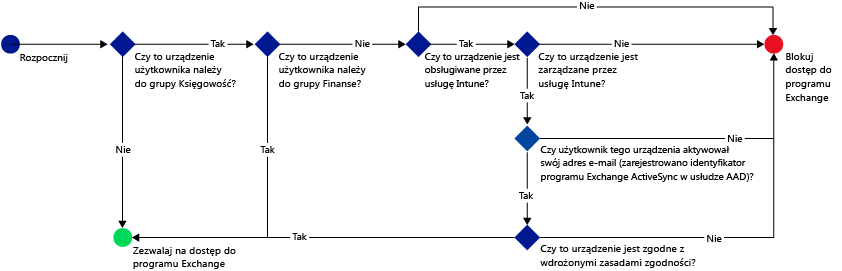
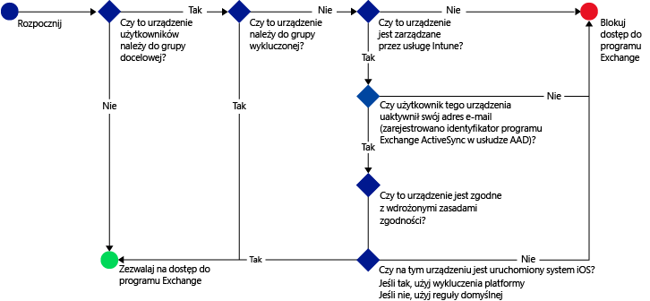
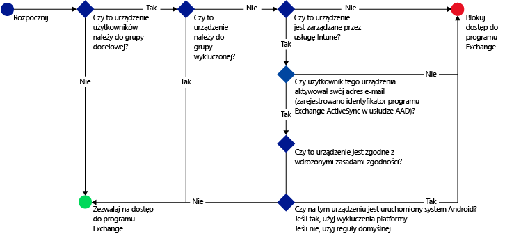

# Ograniczanie dostępu do poczty e-mail przy użyciu usługi Microsoft Intune: przykładowe scenariusze

## Scenariusz 1. Blokowanie użytkownikom możliwości używania niezgodnych urządzeń do uzyskiwania dostępu do usługi Exchange Online
### Wymagania dotyczące scenariusza
- Dostęp do usługi Exchange Online musi być zablokowany dla wszystkich użytkowników w grupie zabezpieczeń **Księgowość** usługi Azure Active Directory, jeśli ich urządzenia są niezgodne z wdrożonymi zasadami zgodności.
- Jeśli w tej grupie znajduje się jakikolwiek użytkownik, którego urządzenia nie są obsługiwane przez usługę [!INCLUDE[wit_nextref](../includes/wit_nextref_md.md)], dostęp z tych urządzeń do usługi Exchange Online musi być zablokowany.
- Wszyscy użytkownicy w grupie zabezpieczeń **Finanse** usługi Azure Active Directory muszą być wykluczeni z zasad, nawet jeśli należą również do grupy zabezpieczeń **Księgowość**.

W tym celu należy skonfigurować zasady dostępu warunkowego dla usługi Exchange Online z następującymi ustawieniami:

- Wybierz pozycję **Włącz zasady dostępu warunkowego**.

- Wybierz platformy, dla których ma być dozwolony dostęp za pomocą aplikacji używających nowoczesnego uwierzytelniania.
- W przypadku aplikacji Exchange ActiveSync wybierz pozycje **Zablokuj niezgodne urządzenia na platformach obsługiwanych przez usługę Microsoft Intune** i **Zablokuj wszystkie inne urządzenia na platformach nieobsługiwanych przez usługę Microsoft Intune**.
-   W sekcji **Grupa docelowa** w obszarze **Wybrane grupy zabezpieczeń** wybierz grupę użytkowników **Księgowość**.

-   W sekcji **Wykluczona grupa** w obszarze **Wybrane grupy zabezpieczeń** wybierz grupę użytkowników **Finanse**.

Następujący przepływ w tym scenariuszu służy do określania, które urządzenia mogą uzyskiwać dostęp do usługi Exchange Online:

## Scenariusz 2. Wszystkie urządzenia z systemem iOS, które uzyskują dostęp do lokalnego programu Exchange, muszą być zarządzane przy użyciu usługi Intune
### Wymagania dotyczące scenariusza
- Dostęp do lokalnego programu Exchange powinny mieć tylko urządzenia z systemem iOS.
- Urządzenia muszą być również zarejestrowane w usłudze Intune i spełniać reguły zasad zgodności zanim będzie można ich użyć do uzyskania dostępu do programu Exchange.

W tym celu należy skonfigurować następujące zasady dostępu warunkowego dla lokalnego programu Exchange z następującymi ustawieniami:

-   Wybierz opcję **Zablokuj dostęp aplikacjom poczty e-mail do lokalnego programu Exchange, jeśli urządzenie jest niezgodne lub nie jest zarejestrowane w usłudze Microsoft Intune**. Wybór tej opcji powoduje włączenie zasad dostępu warunkowego, które wymagają, aby wszystkie urządzenia były zarejestrowane w usłudze Microsoft Intune i spełniały reguły zasad zgodności zanim będą mogły uzyskać dostęp do programu Exchange.

-   Aby użyć zaawansowanych ustawień programu Exchange Active Sync, utwórz:

  -   Wyjątek dla platformy umożliwiający urządzeniom z systemem iOS dostęp do programu Exchange.   

  -   Domyślną regułę określającą, że jeśli urządzenie nie jest objęte regułą wyjątku platformy, to jego dostęp do programu Exchange powinien zostać zablokowany. Ta reguła zapewnia, że urządzenia z systemami innymi niż iOS będą miały zablokowany dostęp do programu Exchange.

Następujący przepływ służy do określania, które urządzenia mogą uzyskiwać dostęp do programu Exchange:

## Scenariusz 3. Żadne urządzenia z systemem Android nie mogą uzyskiwać dostępu do lokalnego programu Exchange
### Wymagania dotyczące scenariusza
- Wszystkie urządzenia z systemem Android powinny mieć zablokowany dostęp do programu Exchange.
- Wszystkie inne obsługiwane urządzenia mogą uzyskiwać dostęp do programu Exchange, o ile są zarządzane przy użyciu usługi [!INCLUDE[wit_nextref](../includes/wit_nextref_md.md)].

W tym celu należy skonfigurować zasady dostępu warunkowego dla lokalnego programu Exchange z następującymi ustawieniami:

-   Wybierz opcję **Zablokuj dostęp aplikacjom poczty e-mail do lokalnego programu Exchange, jeśli urządzenie jest niezgodne lub nie jest zarejestrowane w usłudze Microsoft Intune**. Wybór tej opcji oznacza, że wymagane jest, aby wszystkie urządzenia były zarejestrowane w usłudze Intune i spełniały reguły zasad zgodności.

- Aby użyć zaawansowanych ustawień programu Exchange Active Sync, utwórz:
  -   Wyjątek dla platformy blokujący dostęp urządzeń z systemem Android do programu Exchange. Ta reguła zapewnia, że urządzenia z systemem Android nie mogą być używane do uzyskiwania dostępu do programu Exchange.

  -   Domyślną regułę określającą, że jeśli urządzenie nie jest objęte innymi regułami, to powinno mieć dostęp do programu Exchange. Ta zasada domyślna zapewnia, że urządzenia z systemem innym niż Android, ale obsługiwane przez usługę Microsoft Intune, mogą być używane do uzyskiwania dostępu do programu Exchange. Takie urządzenia muszą być jednak zarejestrowane w usłudze Intune i spełniać reguły zasad zgodności.

Następujący przepływ służy do określania, które urządzenia mogą uzyskiwać dostęp do programu Exchange:

<!--HONumber=Dec16_HO2-->

