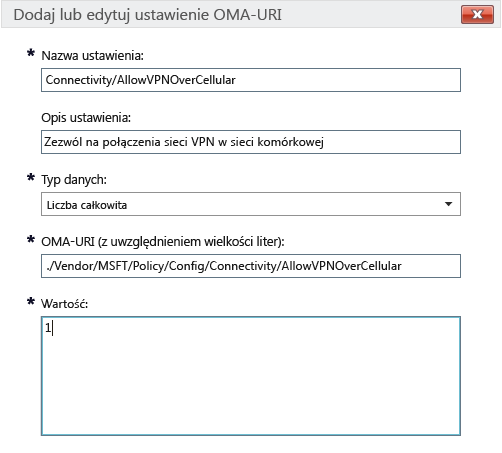

# Ustawienia zasad usługi Intune dla urządzeń z systemem Windows 10 w usłudze Microsoft Intune

[!INCLUDE[classic-portal](../includes/classic-portal.md)]

Ten temat zawiera informacje ułatwiające zrozumienie ustawień zasad usługi Intune, których można użyć do zarządzania urządzeniami z systemem Windows 10. Zapoznaj się z tym tematem obok procedury w sekcji [Zarządzanie ustawieniami i funkcjami na urządzeniach przy użyciu zasad usługi Microsoft Intune](manage-settings-and-features-on-your-devices-with-microsoft-intune-policies.md), aby skonfigurować niestandardowe i wbudowane ustawienia dla zarejestrowanych urządzeń z systemem Windows 10 Desktop i Windows 10 Mobile. Tych zasad nie można używać w przypadku komputerów z [oprogramowaniem klienckim usługi Intune](/intune/get-started/windows-pc-management-capabilities-in-microsoft-intune).

Można wybrać spośród dwóch typów zasad:

- **Zasady niestandardowe**: **zasady niestandardowe ** usługi Microsoft Intune dla systemów Windows 10 i Windows 10 Mobile umożliwiają wdrożenie ustawień OMA-URI (Open Mobile Alliance Uniform Resource Identifier), których można użyć do sterowania funkcjami na urządzeniach. System Windows 10 udostępnia wiele ustawień za pomocą [dostawcy usługi konfiguracji zasad](https://technet.microsoft.com/itpro/windows/manage/how-it-pros-can-use-configuration-service-providers).
- **Ogólne zasady konfiguracji**: użyj tego typu zasad, aby wybrać ustawienia z wbudowanej listy dostarczonej z usługą Microsoft Intune.

## Ustawienia zasad niestandardowych

Podaj następujące ustawienia w przypadku zasad niestandardowych.

### Ogólne

Wprowadź nazwę i opcjonalny opis zasad, aby ułatwić ich identyfikację w konsoli usługi Intune.

### Ustawienia OMA-URI

Dla każdego ustawienia OMA-URI, które chcesz dodać, wprowadź następujące informacje. Skorzystaj z [informacji o ustawieniach identyfikatorów URI dla systemu Windows 10](/intune/deploy-use/windows-10-policy-settings-in-microsoft-intune#Windows-10-URI-settings) w tym temacie, aby dowiedzieć się więcej o ustawieniach, których możesz użyć:

- **Nazwa ustawienia**: wprowadź unikatową nazwę dla ustawienia OMA-URI, aby ułatwić jego identyfikację na liście ustawień.
- **Opis ustawienia**: opcjonalnie wprowadź opis ustawienia.
- **Typ danych**: wybierz jeden z następujących typów danych:
    - **Ciąg**
    - **Ciąg (XML)**
    - **Data i godzina**
    - **Liczba całkowita**
    - **Liczba zmiennoprzecinkowa**
    - **Wartość logiczna**
- **OMA-URI (z uwzględnieniem wielkości liter)**: określ identyfikator OMA-URI, dla którego chcesz podać ustawienie.
- **Wartość**: określ wartość, która będzie kojarzona z określonym wcześniej identyfikatorem OMA-URI.

### Przykład
Na poniższym zrzucie ekranu ustawienie **Connectivity/AllowVPNOverCellular** jest włączone. Pozwala to urządzeniu z systemem Windows 10 na otwarcie połączenia sieci VPN w sieci komórkowej.

> 

## Ustawienia identyfikatorów URI systemu Windows 10
Ta sekcja zawiera informacje o ustawieniach OMA-URI, które można skonfigurować za pomocą **zasad niestandardowych systemu Windows 10**.

### Zasady

|Nazwa zasad i identyfikator URI|Szczegóły|
|---------------|------------|-----------|
|**Zezwalaj na automatyczne aktualizacje** ./Vendor/MSFT/Policy/Config/Update/AllowAutoUpdate|(tylko wersja Desktop) **Typ danych:** liczba całkowita **Wartości:** **0** - **5** (domyślnie: **1**)|
|**Planowany dzień instalacji** ./Vendor/MSFT/Policy/Config/Update/ScheduledInstallDay|(tylko wersja Mobile) **Typ danych:** liczba całkowita **Wartości:** **0** — codziennie (ustawienie domyślne) **1** — niedziela **2** — poniedziałek **3** — wtorek **4** — środa **5** — czwartek **6** — piątek **7** — sobota|
|**Planowana godzina instalacji** ./Vendor/MSFT/Policy/Config/Update/ScheduledInstallTime|(wersje Desktop i Mobile) **Typ danych:** liczba całkowita **Wartości:**  **0**–**23** godz. (**0** oznacza północ) (domyślnie: **3**)|
|**DeviceLock/AllowIdleReturnWithoutPassword** ./Vendor/MSFT/Policy/Config/DeviceLock/AllowIdleReturnWithoutPassword|(tylko wersja Mobile) **Typ danych:** liczba całkowita **Wartości:** **0** — użytkownik nie może ustawić czasomierza okresu karencji hasła, a wartość jest ustawiana jako „za każdym razem” **1** — użytkownik może ustawić czasomierz okresu karencji hasła (ustawienie domyślne)|
|**WiFi/AllowWiFi** ./Vendor/MSFT/Policy/Config/WiFi/AllowWiFi|(tylko wersja Mobile) **Typ danych:** liczba całkowita **Wartości:** **0** — nie zezwalaj na **używanie połączenia Wi-Fi** **1** — zezwalaj na **używanie połączenia Wi-Fi** (ustawienie domyślne)|
|**WiFi/AllowInternetSharing** ./Vendor/MSFT/Policy/Config/WiFi/AllowInternetSharing|(wersje Desktop i Mobile) **Typ danych:** liczba całkowita **Wartości: ** **0** — nie zezwalaj na udostępnianie Internetu   **1** — zezwalaj na udostępnianie Internetu (ustawienie domyślne)|
|**WiFi/AllowAutoConnectToWiFiSenseHotspots** ./Vendor/MSFT/Policy/Config/WiFi/AllowAutoConnectToWiFiSenseHotspots|(wersje Desktop i Mobile) **Typ danych:** liczba całkowita **Wartości: ** **0** — niedozwolone  **1** — dozwolone (wartość domyślna)|
|**WiFi/AllowManualWiFiConfiguration** ./Vendor/MSFT/Policy/Config/WiFi/AllowManualWiFiConfiguration|(tylko wersja Mobile) **Typ danych:** liczba całkowita **Wartości:** **0** — zezwalaj tylko na połączenia Wi-Fi, które można skonfigurować za pomocą zarządzania urządzeniami przenośnymi. **1** — dozwolone jest dodawanie nowych identyfikatorów SSID sieci poza identyfikatorami SSID, które zostały już utworzone za pomocą zarządzania urządzeniami przenośnymi (ustawienie domyślne)|
|**System/AllowLocation** ./Vendor/MSFT/Policy/Config/System/AllowLocation|(wersje Desktop i Mobile) **Typ danych:** liczba całkowita **Wartości: ** **0** — niedozwolone  **1** — dozwolone (wartość domyślna)|
|**System/AllowTelemetry** ./Vendor/MSFT/Policy/Config/System/AllowTelemetry|(wersje Desktop i Mobile) **Typ danych:** liczba całkowita **Wartości:** **0** — niedozwolone (ustawienie tylko dla wersji Enterprise) **1** — ograniczone **2** — pełne (ustawienie domyślne) **3** — pełne i informacje diagnostyczne|
|**System/AllowExperimentation** ./Vendor/MSFT/Policy/Config/System/AllowExperimentation|(wersje Desktop i Mobile) **Typ danych:** liczba całkowita **Wartości:** **0** — niedozwolone **1** — tylko ustawienia (ustawienie domyślne) **2** — ustawienia i eksperymenty|
|**Security/AntiTheftMode** ./Vendor/MSFT/Policy/Config/Security/AntiTheftMode|(tylko wersja Mobile) **Typ danych:** liczba całkowita **Wartości:** **0** — nie zezwalaj na tryb antykradzieżowy **1** — preferencja użytkownika (ustawienie domyślne)|
|**Connectivity/AllowUSBConnection** ./Vendor/MSFT/Policy/Config/Connectivity/AllowUSBConnection|(tylko wersja Mobile) **Typ danych:** liczba całkowita **Wartości ** **0** — niedozwolone  **1** — dozwolone (wartość domyślna)|
|**System/AllowUserToResetPhone** ./Vendor/MSFT/Policy/Config/System/AllowUserToResetPhone|(tylko wersja Mobile) **Typ danych:** liczba całkowita **Wartości: ** **0** — niedozwolone **1** — dozwolone (wartość domyślna)|
|**Connectivity/AllowCellularDataRoaming** ./Vendor/MSFT/Policy/Config/Connectivity/AllowCellularDataRoaming|(wersje Desktop i Mobile) **Typ danych:** liczba całkowita **Wartości: ** **0** — niedozwolone  **1** — dozwolone (wartość domyślna)|
|**Connectivity/AllowVPNOverCellular** ./Vendor/MSFT/Policy/Config/Connectivity/AllowVPNOverCellular|(wersje Desktop i Mobile) **Typ danych:** liczba całkowita **Wartości:** **0** — używanie sieci VPN z połączeniem komórkowym jest niedozwolone **1** — sieć VPN może używać dowolnego połączenia, w tym komórkowego (ustawienie domyślne)|
|**Connectivity/AllowVPNRoamingOverCellular** ./Vendor/MSFT/Policy/Config/Connectivity/AllowVPNRoamingOverCellular|(tylko wersja Mobile) **Typ danych:** liczba całkowita **Wartości: ** **0** — niedozwolone  **1** — dozwolone (wartość domyślna)|
|**Connectivity/AllowVPNRoamingOverCellular** ./Vendor/MSFT/Policy/Config/Connectivity/AllowVPNRoamingOverCellular|(tylko wersja Mobile) **Typ danych:** liczba całkowita **Wartości: ** **0** — niedozwolone  **1** — dozwolone (wartość domyślna)|
|**Connectivity/AllowBluetooth** ./Vendor/MSFT/Policy/Config/Connectivity/AllowBluetooth|(wersje Desktop i Mobile) **Typ danych:** liczba całkowita **Wartości:** **0** — nie zezwalaj użytkownikowi na włączanie funkcji Bluetooth. **1** — zastrzeżone. Użytkownik może włączać i konfigurować funkcję Bluetooth (nieobsługiwane w przypadku protokołu EAS oraz systemów Windows Phone 8.1 dla rozwiązania MDM, Windows 10 Desktop i Windows 10 Mobile). **2** — dozwolone. Użytkownik może włączać i konfigurować funkcję Bluetooth (ustawienie domyślne).|
|**Experience/AllowScreenCapture** ./Vendor/MSFT/Policy/Config/Experience/AllowScreenCapture|(tylko wersja Mobile) **Typ danych:** liczba całkowita **Wartości: ** **0** — niedozwolone  **1** — dozwolone (wartość domyślna)|
|**Experience/AllowTaskSwitcher** ./Vendor/MSFT/Policy/Config/Experience/AllowTaskSwitcher|(tylko wersja Mobile) **Typ danych:** liczba całkowita **Wartości: ** **0** — niedozwolone  **1** — dozwolone (wartość domyślna)|
|**Experience/AllowVoiceRecording** ./Vendor/MSFT/Policy/Config/Experience/AllowVoiceRecording|(tylko wersja Mobile) **Typ danych:** liczba całkowita **Wartości: ** **0** — niedozwolone  **1** — dozwolone (wartość domyślna)|
|**Experience/AllowSyncMySettings** ./Vendor/MSFT/Policy/Config/Experience/AllowSyncMySettings|(tylko wersja Mobile) **Typ danych:** liczba całkowita **Wartości: ** **0** — nie zezwalaj na roaming  **1** — zezwalaj na roaming (ustawienie domyślne)|
|**Experience/AllowManualMDMUnenrollment** ./Vendor/MSFT/Policy/Config/Experience/AllowManualMDMUnenrollment|(wersje Desktop i Mobile) **Typ danych:** liczba całkowita **Wartości: ** **0** — niedozwolone  **1** — dozwolone (wartość domyślna)|
|**Accounts/AllowMicrosoftAccountConnection** ./Vendor/MSFT/Policy/Config/Accounts/AllowMicrosoftAccountConnection|(wersje Desktop i Mobile) **Typ danych:** liczba całkowita **Wartości:**  **0** — niedozwolone  **1** — dozwolone (wartość domyślna)|
|**Accounts/AllowAddingNonMicrosoftAccountsManually** ./Vendor/MSFT/Policy/Config/Accounts/AllowAddingNonMicrosoftAccountsManually|(wersje Desktop i Mobile) **Typ danych:** liczba całkowita **Wartości:**  **0** — niedozwolone  **1** — dozwolone (wartość domyślna)|
|**Security/AllowManualRootCertificateInstallation** ./Vendor/MSFT/Policy/Config/Security/AllowManualRootCertificateInstallation|(tylko wersja Mobile) **Typ danych:** liczba całkowita **Wartości: ** **0** — niedozwolone  **1** — dozwolone (wartość domyślna)|
|**Security/AllowAddProvisioningPackages** ./Vendor/MSFT/Policy/Config/Security/AllowAddProvisioningPackages|(wersje Desktop i Mobile) **Typ danych:** liczba całkowita **Wartości: ** **0** — niedozwolone  **1** — dozwolone (wartość domyślna)|
|**Search/DisableBackoff** ./Vendor/MSFT/Policy/Config/Search/DisableBackoff|(wersje Desktop i Mobile) **Typ danych:** liczba całkowita **Wartości:**  **0** (ustawienie domyślne)  **1**|
|**Search/PreventRemoteQueries** ./Vendor/MSFT/Policy/Config/Search/PreventRemoteQueries|(wersje Desktop i Mobile) **Typ danych:** liczba całkowita **Wartości:**  **0**  **1** (ustawienie domyślne)|
|**Search/AllowUsingDiacritics** ./Vendor/MSFT/Policy/Config/Search/AllowUsingDiacritics|(wersje Desktop i Mobile) **Typ danych:** liczba całkowita **Wartości:**  **0** (ustawienie domyślne)  **1**|
|**Search/AlwaysUseAutoLangDetection** ./Vendor/MSFT/Policy/Config/Search/AlwaysUseAutoLangDetection|(wersje Desktop i Mobile) **Typ danych:** liczba całkowita **Wartości:**  **0** (ustawienie domyślne)  **1**|
|**Search/DisableRemovableDriveIndexing** ./Vendor/MSFT/Policy/Config/Search/DisableRemovableDriveIndexing|(wersje Desktop i Mobile) **Typ danych:** liczba całkowita **Wartości: ** **0** (ustawienie domyślne)  **1**|
|**Search/PreventIndexingLowDiskSpaceMB** ./Vendor/MSFT/Policy/Config/Search/PreventIndexingLowDiskSpaceMB|(wersje Desktop i Mobile) **Typ danych:** liczba całkowita **Wartości:**  **0**  **1** (ustawienie domyślne)|
|**Search/AllowIndexingEncryptedStoresOrItems** ./Vendor/MSFT/Policy/Config/Search/AllowIndexingEncryptedStoresOrItems|(wersje Desktop i Mobile) **Typ danych:** liczba całkowita **Wartości:**  **0** (ustawienie domyślne)  **1**|
|**Security/AllowRemoveProvisioningPackage** ./Vendor/MSFT/Policy/Config/Security/AllowRemoveProvisioningPackage|(wersje Desktop i Mobile) **Typ danych:** liczba całkowita **Wartości: ** **0** — niedozwolone  **1** — dozwolone (wartość domyślna)|
|**Security/RequireProvisioningPackageSignature** ./Vendor/MSFT/Policy/Config/Security/RequireProvisioningPackageSignature|(wersje Desktop i Mobile) **Typ danych:** liczba całkowita **Wartości: ** **0** (ustawienie domyślne)  **1**|
|**AboveLock/AllowActionCenterNotifications** ./Vendor/MSFT/Policy/Config/AboveLock/AllowActionCenterNotifications|(wersje Desktop i Mobile) **Typ danych:** liczba całkowita **Wartości: ** **0** — niedozwolone  **1** — dozwolone (wartość domyślna)|
|**TextInput/AllowIMENetworkAccess** ./Vendor/MSFT/Policy/Config/TextInput/AllowIMENetworkAccess|(tylko wersja Desktop) **Typ danych:** liczba całkowita **Wartości:** **0** — nie zezwalaj. Otwarty słownik rozszerzony jest wyłączony. Użytkownik nie może: — dodać nowego otwartego słownika rozszerzonego, — dodać nowego pliku konfiguracji integracji wyszukiwania, — używać funkcji kandydata z chmury, — wysłać zastrzeżonego słowa użytkownika. **1** — zezwalaj Otwarty słownik rozszerzony może być dodany i używany domyślnie. Domyślnie można również używać funkcji integracji wyszukiwania. Użytkownik może: — używać funkcji kandydata z chmury,|
|**TextInput/AllowIMELogging** ./Vendor/MSFT/Policy/Config/TextInput/AllowIMELogging|(tylko wersja Desktop) **Typ danych:** liczba całkowita **Wartości:** **0** — rejestrowanie błędów konwersji jest wyłączone **1** — rejestrowanie błędów konwersji jest włączone (ustawienie domyślne)|
|**TextInput/AllowJapaneseNonPublishingStandardGlyph** ./Vendor/MSFT/Policy/Config/TextInput/AllowJapaneseNonPublishingStandardGlyph|(tylko wersja Desktop) **Typ danych:** liczba całkowita **Wartości: ** **0** — niedozwolone  **1** — dozwolone (wartość domyślna)|
|**TextInput/AllowJapaneseIVSCharacters** ./Vendor/MSFT/Policy/Config/TextInput/AllowJapaneseIVSCharacters|(tylko wersja Desktop) **Typ danych:** liczba całkowita **Wartości: ** **0** — niedozwolone  **1** — dozwolone (wartość domyślna)|
|**TextInput/AllowJapaneseUserDictionary** ./Vendor/MSFT/Policy/Config/TextInput/AllowJapaneseUserDictionary|(tylko wersja Desktop) **Typ danych:** liczba całkowita **Wartości: ** **0** — niedozwolone  **1** — dozwolone (wartość domyślna)|
|**TextInput/AllowJapaneseIMESurrogatePairCharacters** ./Vendor/MSFT/Policy/Config/TextInput/AllowJapaneseIMESurrogatePairCharacters|(tylko wersja Desktop) **Typ danych:** liczba całkowita **Wartości: ** **0** — niedozwolone  **1** — dozwolone (wartość domyślna)|
|**TextInput/ExcludeJapaneseIMEExceptShiftJIS** ./Vendor/MSFT/Policy/Config/TextInput/ExcludeJapaneseIMEExceptShiftJIS|(tylko wersja Desktop) **Typ danych:** liczba całkowita **Wartości:** **0** — żadne znaki nie są filtrowane (ustawienie domyślne) **1** — wszystkie znaki oprócz znaków Shift JIS są filtrowane|
|**TextInput/ExcludeJapaneseIMEExceptJIS0208** ./Vendor/MSFT/Policy/Config/TextInput/ExcludeJapaneseIMEExceptJIS0208|(tylko wersja Desktop) **Typ danych:** liczba całkowita **Wartości:** **0** — żadne znaki nie są filtrowane (ustawienie domyślne) **1** — wszystkie znaki oprócz znaków JIS0208 są filtrowane|
|**TextInput/ExcludeJapaneseIMEExceptJIS0208andEUDC** ./Vendor/MSFT/Policy/Config/TextInput/ExcludeJapaneseIMEExceptJIS0208andEUDC|(tylko wersja Desktop) **Typ danych:** liczba całkowita **Wartości:** **0** — żadne znaki nie są filtrowane (ustawienie domyślne) **1** — wszystkie znaki oprócz znaków JIS0208 lub EUDC są filtrowane|
|**TextInput/AllowInputPanel** ./Vendor/MSFT/Policy/Config/TextInput/AllowInputPanel|(tylko wersja Desktop) **Typ danych:** liczba całkowita **Wartości: ** **0** — niedozwolone  **1** — dozwolone (wartość domyślna)|
|**Bluetooth/AllowDiscoverableMode** ./Vendor/MSFT/Policy/Config/Bluetooth/AllowDiscoverableMode|(wersje Desktop i Mobile) **Typ danych:** liczba całkowita **Wartości: ** **0** — niedozwolone  **1** — dozwolone (wartość domyślna)|
|**Bluetooth/AllowAdvertising** ./Vendor/MSFT/Policy/Config/Bluetooth/AllowAdvertising|(wersje Desktop i Mobile) **Typ danych:** liczba całkowita **Wartości: ** **0** — niedozwolone  **1** — dozwolone (wartość domyślna)|
|**Settings/AllowDataSense** ./Vendor/MSFT/Policy/Config/Settings/AllowDataSense|(wersje Desktop i Mobile) **Typ danych:** liczba całkowita **Wartości: ** **0** — niedozwolone  **1** — dozwolone (wartość domyślna)|
|**Settings/AllowVPN** ./Vendor/MSFT/Policy/Config/Settings/AllowVPN|(wersje Desktop i Mobile) **Typ danych:** liczba całkowita **Wartości: ** **0** — niedozwolone  **1** — dozwolone (wartość domyślna)|
|**Settings/AllowWorkplace** ./Vendor/MSFT/Policy/Config/Settings/AllowWorkplace|(tylko wersja Desktop) **Typ danych:** liczba całkowita **Wartości ** **0** — niedozwolone  **1** — dozwolone (wartość domyślna)|
|**Settings/AllowDateTime** ./Vendor/MSFT/Policy/Config/Settings/AllowDateTime|(wersje Desktop i Mobile) **Typ danych:** liczba całkowita **Wartości ** **0** — niedozwolone  **1** — dozwolone (wartość domyślna)|
|**Settings/AllowLanguage** ./Vendor/MSFT/Policy/Config/Settings/AllowLanguage|(tylko wersja Desktop) **Typ danych:** liczba całkowita **Wartości: ** **0** — niedozwolone  **1** — dozwolone (wartość domyślna)|
|**Settings/AllowRegion** ./Vendor/MSFT/Policy/Config/Settings/AllowRegion|(tylko wersja Desktop) **Typ danych:** liczba całkowita **Wartości: ** **0** — niedozwolone  **1** — dozwolone (wartość domyślna)|
|**Settings/AllowSignInOptions** ./Vendor/MSFT/Policy/Config/Settings/AllowSignInOptions|(tylko wersja Desktop) **Typ danych:** liczba całkowita **Wartości: ** **0** — niedozwolone  **1** — dozwolone (wartość domyślna)|
|**Settings/AllowYourAccount** ./Vendor/MSFT/Policy/Config/Settings/AllowYourAccount|(wersje Desktop i Mobile) **Typ danych:** liczba całkowita **Wartości: ** **0** — niedozwolone  **1** — dozwolone (wartość domyślna)|
|**Settings/AllowPowerSleep** ./Vendor/MSFT/Policy/Config/Settings/AllowPowerSleep|(tylko wersja Desktop) **Typ danych:** liczba całkowita **Wartości: ** **0** — niedozwolone  **1** — dozwolone (wartość domyślna)|
|**Settings/AllowAutoPlay** ./Vendor/MSFT/Policy/Config/Settings/AllowAutoPlay|(tylko wersja Desktop) **Typ danych:** liczba całkowita **Wartości: ** **0** — niedozwolone  **1** — dozwolone (wartość domyślna)|
|**Experience/AllowCortana** ./Vendor/MSFT/Policy/Config/Experience/AllowCortana|(wersje Desktop i Mobile) **Typ danych:** liczba całkowita **Wartości: ** **0** — niedozwolone  **1** — dozwolone (wartość domyślna)|
|**Search/SafeSearchPermissions** ./Vendor/MSFT/Policy/Config/Search/SafeSearchPermissions|(tylko wersja Mobile) **Typ danych:** liczba całkowita **Wartości:** **0** — ścisłe, najwyższy poziom filtrowania pod kątem blokowania treści dla dorosłych **1** — umiarkowane, średni poziom filtrowania pod kątem blokowania treści dla dorosłych (prawidłowe wyniki wyszukiwania nie będą filtrowane) (ustawienie domyślne)|
|**Experience/AllowCopyPaste** ./Vendor/MSFT/Policy/Config/Experience/AllowCopyPaste|(tylko wersja Desktop) **Typ danych:** liczba całkowita **Wartości: ** **0** — niedozwolone  **1** — dozwolone (wartość domyślna)|
|**Wymuś początkowy rozmiar** ./Vendor/MSFT/Policy/Config/Start/ForceStartSize|(tylko wersja Mobile) **Typ danych:** liczba całkowita **Wartości:** **0** — zezwalaj na zmianę rozmiaru przez użytkownika (ustawienie domyślne) **1** — wymuś niepełny ekran **2** — wymuś pełny ekran|
|**Update/RequireDeferUpgrade** ./Vendor/MSFT/Policy/Config/Update/RequireDeferUpgrade|(wersje Desktop i Mobile) **Typ danych:** liczba całkowita **Wartości:** **0** — nie odraczaj uaktualnienia (pozostań w wersji Current Branch) (ustawienie domyślne) **1** — zezwalaj na odraczanie aktualizacji i uaktualnień (urządzenie pozostaje zgodne z regułami wersji Current Branch dla firm) Aby uzyskać szczegółowe informacje, zobacz: [Wprowadzenie do obsługi systemu Windows 10](https://technet.microsoft.com/library/mt598226.aspx) [Planowanie wdrożenia systemu Windows 10](https://technet.microsoft.com/library/mt574241.aspx)|
|**Update/DeferUpdatePeriod** ./Vendor/MSFT/Policy/Config/Update/DeferUpdatePeriod|(wersje Desktop i Mobile) **Opis:** zasady umożliwiające odroczenie aktualizacji oprogramowania na maksymalnie cztery tygodnie **Typ danych:** liczba całkowita **Wartości:**  **0** — zastosuj aktualizacje od razu (ustawienie domyślne) **1**-**4** — liczba tygodni, przez które mają być odroczone aktualizacje oprogramowania Aby uzyskać szczegółowe informacje, zobacz: [Wprowadzenie do obsługi systemu Windows 10](https://technet.microsoft.com/library/mt598226.aspx) [Planowanie wdrożenia systemu Windows 10](https://technet.microsoft.com/library/mt574241.aspx)|
|**Update/DeferUpgradePeriod** ./Vendor/MSFT/Policy/Config/Update/DeferUpgradePeriod|(wersje Desktop i Mobile) **Opis:** zasady umożliwiające odroczenie uaktualnień funkcji na maksymalnie osiem miesięcy **Typ danych:** liczba całkowita **Wartości:** **0** — zastosuj aktualizacje od razu (ustawienie domyślne) **1**-**8** — liczba miesięcy, przez które mają być odroczone uaktualnienia funkcji Aby uzyskać szczegółowe informacje, zobacz: [Wprowadzenie do obsługi systemu Windows 10](https://technet.microsoft.com/library/mt598226.aspx) [Planowanie wdrożenia systemu Windows 10](https://technet.microsoft.com/library/mt574241.aspx)|
|**Update/PauseDeferrals** ./Vendor/MSFT/Policy/Config/Update/PauseDeferrals|(wersje Desktop i Mobile) **Opis:** zezwala na zatrzymanie otrzymywania aktualizacji i uaktualnień przez urządzenie na okres pięciu tygodni. **Typ danych:** liczba całkowita **Wartości:** **0** — zastosuj aktualizacje od razu (ustawienie domyślne) **1** — wstrzymaj aktualizacje i uaktualnienia (wygasa po pięciu tygodniach)|

### Usługa Windows Defender

|Nazwa zasad i identyfikator URI|Szczegóły|
|---------------|-----------|
|**AllowRealtimeMonitoring** ./Vendor/MSFT/Policy/Config/Defender/AllowRealtimeMonitoring|(tylko wersja Desktop) **Typ danych:** liczba całkowita **Wartości: ** **0** — niedozwolone  **1** — dozwolone (wartość domyślna)|
|**AllowBehaviorMonitoring** ./Vendor/MSFT/Policy/Config/Defender/AllowBehaviorMonitoring|(tylko wersja Desktop) **Typ danych:** liczba całkowita **Wartości: ** **0** — niedozwolone  **1** — dozwolone (wartość domyślna)|
|**AllowIntrusionPreventionSystem** ./Vendor/MSFT/Policy/Config/Defender/AllowIntrusionPreventionSystem|(tylko wersja Desktop) **Typ danych:** liczba całkowita **Wartości: ** **0** — niedozwolone  **1** — dozwolone (wartość domyślna)|
|**AllowIOAVProtection** ./Vendor/MSFT/Policy/Config/Defender/AllowIOAVProtection|(tylko wersja Desktop) **Typ danych:** liczba całkowita **Wartości:**  **0** — niedozwolone  **1** — dozwolone (wartość domyślna)|
|**AllowScriptScanning** ./Vendor/MSFT/Policy/Config/Defender/AllowScriptScanning|(tylko wersja Desktop) **Typ danych:** liczba całkowita **Wartości: ** **0** — niedozwolone  **1** — dozwolone (wartość domyślna)|
|**AllowOnAccessProtection** ./Vendor/MSFT/Policy/Config/Defender/AllowOnAccessProtection|(tylko wersja Desktop) **Typ danych:** liczba całkowita **Wartości: ** **0** — niedozwolone  **1** — dozwolone (wartość domyślna)|
|**RealTimeScanDirection** ./Vendor/MSFT/Policy/Config/Defender/RealTimeScanDirection|(tylko wersja Desktop) **Typ danych:** liczba całkowita **Wartości:** **0** — monitoruj wszystkie pliki (wartość domyślna) **1** — monitoruj pliki przychodzące **2** — monitoruj pliki wychodzące|
|**DaysToRetainCleanedMalware** ./Vendor/MSFT/Policy/Config/Defender/DaysToRetainCleanedMalware|(tylko wersja Desktop) **Typ danych:** liczba całkowita **Wartości:** **0** - **90** — reprezentuje czas zachowywania złośliwego oprogramowania **0** — elementy w folderze kwarantanny będą przechowywane w nieskończoność i nie będą usuwane automatycznie (ustawienie domyślne)|
|**AllowUserUIAccess** ./Vendor/MSFT/Policy/Config/Defender/AllowUserUIAccess|(tylko wersja Desktop) **Typ danych:** liczba całkowita **Wartości: ** **0** — niedozwolone  **1** — dozwolone (wartość domyślna)|
|**ScanParameter** ./Vendor/MSFT/Policy/Config/Defender/ScanParameter|(tylko wersja Desktop) **Typ danych:** liczba całkowita **Wartości:** **1** — szybkie skanowanie (ustawienie domyślne) **2** — pełne skanowanie|
|**ScheduleScanDay** ./Vendor/MSFT/Policy/Config/Defender/ScheduleScanDay|(tylko wersja Desktop) **Typ danych:** liczba całkowita **Wartości:** **0** — codziennie (ustawienie domyślne) **1** — poniedziałek **2** — wtorek **3** — środa **4** — czwartek **5** — piątek **6** — sobota **7** — niedziela **8** — brak zaplanowanego skanowania|
|**ScheduleScanTime** ./Vendor/MSFT/Policy/Config/Defender/ScheduleScanTime|(tylko wersja Desktop) **Typ danych:** liczba całkowita **Wartości:** **0** — 0:00 **60** — 1:00 **120** — 2:00 (ustawienie domyślne) **180** — 3:00 **240** — 4:00 **300** — 5:00 **360** — 6:00 **420** — 7:00 **480** — 8:00 **540** — 9:00 **600** — 10:00 **660** — 11:00 **720** — 12:00 **780** — 13:00 **840** — 14:00 **900** — 15:00 **960** — 16:00 **1020** — 17:00 **1080** — 18:00 **1140** — 19:00 **1200** — 20:00 **1260** — 21:00 **1320** — 22:00 **1381** — okno obsługi|
|**ScheduleQuickScanTime** ./Vendor/MSFT/Policy/Config/Defender/ScheduleQuickScanTime|(tylko wersja Desktop) **Typ danych:** liczba całkowita **Wartości:** **0** — 0:00 **60** — 1:00 **120** — 2:00 (ustawienie domyślne) **180** — 3:00 **240** — 4:00 **300** — 5:00 **360** — 6:00 **420** — 7:00 **480** — 8:00 **540** — 9:00 **600** — 10:00 **660** — 11:00 **720** — 12:00 **780** — 13:00 **840** — 14:00 **900** — 15:00 **960** — 16:00 **1020** — 17:00 **1080** — 18:00 **1140** — 19:00 **1200** — 20:00 **1260** — 21:00 **1320** — 22:00 **1380** — 23:00|
|**AVGCPULoadFactor** ./Vendor/MSFT/Policy/Config/Defender/AVGCPULoadFactor|(tylko wersja Desktop) **Typ danych:** liczba całkowita **Wartości: ** **0** - **100** (ustawienie domyślne: **50**)|
|**AllowArchiveScanning** ./Vendor/MSFT/Policy/Config/Defender/AllowArchiveScanning|(tylko wersja Desktop) **Typ danych:** liczba całkowita **Wartości: ** **0** — niedozwolone  **1** — dozwolone (wartość domyślna)|
|**AllowEmailScanning** ./Vendor/MSFT/Policy/Config/Defender/AllowEmailScanning|(tylko wersja Desktop) **Typ danych:** liczba całkowita **Wartości: ** **0** — niedozwolone (ustawienie domyślne)  **1** — dozwolone|
|**AllowFullScanRemovableDriveScanning** ./Vendor/MSFT/Policy/Config/Defender/AllowFullScanRemovableDriveScanning|(tylko wersja Desktop) **Typ danych:** liczba całkowita **Wartości: ** **0** — niedozwolone (ustawienie domyślne)  **1** — dozwolone|
|**AllowFullScanOnMappedNetworkDrives** ./Vendor/MSFT/Policy/Config/Defender/AllowFullScanOnMappedNetworkDrives|(tylko wersja Desktop) **Typ danych:** liczba całkowita **Wartości: ** **0** — niedozwolone  **1** — dozwolone (wartość domyślna)|
|**AllowScanningNetworkFiles** ./Vendor/MSFT/Policy/Config/Defender/AllowScanningNetworkFiles|(tylko wersja Desktop) **Typ danych:** liczba całkowita **Wartości: ** **0** — niedozwolone  **1** — dozwolone (ustawienie domyślne) — jeśli dozwolone, jest również uruchamiane przy włączonej ochronie czasu rzeczywistego|
|**SignatureUpdateInterval** ./Vendor/MSFT/Policy/Config/Defender/SignatureUpdateInterval|(tylko wersja Desktop) **Typ danych:** liczba całkowita **Wartości:** **0** — bez sprawdzania podpisów co określony czas **1** — sprawdzaj sygnatury co godzinę **2** — sprawdzaj co dwie godziny  **24** — sprawdzaj codziennie **8** — sprawdzaj co osiem godzin (ustawienie domyślne)|
|**AllowCloudProtection** ./Vendor/MSFT/Policy/Config/Defender/AllowCloudProtection|(tylko wersja Desktop) **Typ danych:** liczba całkowita **Wartości: ** **0** — niedozwolone  **1** — dozwolone (wartość domyślna)|
|**SubmitSamplesConsent** ./Vendor/MSFT/Policy/Config/Defender/SubmitSamplesConsent|(tylko wersja Desktop) **Typ danych:** liczba całkowita **Wartości:** **0** — zawsze pytaj (ustawienie domyślne) **1** — automatycznie wyślij bezpieczne próbki **2** — nigdy nie wysyłaj **3** — wyślij wszystkie próbki automatycznie|
|**ExcludedExtensions** ./Vendor/MSFT/Policy/Config/Defender/ExcludedExtensions|(tylko wersja Desktop) **Typ danych:** ciąg **Wartości:** *&lt;Lista rozszerzeń rozdzielonych średnikami&gt;* Na przykład: **obj;lib** **Ustawienie domyślne —** brak wykluczonych rozszerzeń|
|**ExcludedPaths** ./Vendor/MSFT/Policy/Config/Defender/ExcludedPaths|(tylko wersja Desktop) **Typ danych:** ciąg **Wartości:** *&lt;Lista ścieżek rozdzielonych średnikami&gt;* Przykład: **c:\test;c:\test1.exe** **Ustawienie domyślne —** brak wykluczonych ścieżek|
|**ExcludedProcesses** ./Vendor/MSFT/Policy/Config/Defender/ExcludedProcesses|(tylko wersja Desktop) **Typ danych:** ciąg **Wartości:** *&lt;Lista ścieżek rozdzielonych średnikami&gt;* Przykład: **c:\test.exe;c:\test1.exe** **Ustawienie domyślne —** brak wykluczonych procesów|

### Przeglądarka Edge

|Nazwa zasad i identyfikator URI|Szczegóły|
|---------------|------------|-----------|
|**Zezwalaj na przeglądarkę** ./Vendor/MSFT/Policy/Config/Browser/AllowBrowser|(tylko wersja Mobile) **Typ danych:** liczba całkowita **Wartości: ** **0** — przeglądanie wyłączone  **1** — przeglądanie włączone (ustawienie domyślne)|
|**AllowSearchSuggestionsinAddressBar** ./Vendor/MSFT/Policy/Config/Browser/AllowSearchSuggestionsinAddressBar|(wersje Desktop i Mobile) **Typ danych:** liczba całkowita **Wartości: ** **0** — nie pokazuj sugestii  **1** — pokazuj sugestie (ustawienie domyślne)|
|**SendIntranetTraffictoInternetExplorer** ./Vendor/MSFT/Policy/Config/Browser/SendIntranetTraffictoInternetExplorer|(tylko wersja Desktop) **Typ danych:** liczba całkowita **Wartości:** **0** — wyłączone (otwieraj witryny intranetowe w przeglądarce Microsoft Edge — ustawienie domyślne) **1**: włączone (otwieraj witryny intranetowe w programie Internet Explorer)|
|**Zezwalaj na żądania Nie śledź** ./Vendor/MSFT/Policy/Config/Browser/AllowDoNotTrack|(wersje Desktop i Mobile) **Typ danych:** liczba całkowita **Wartości: ** **0** — wyłączone (bez wysyłania żądań „Nie śledź” — ustawienie domyślne)  **1** — włączone (wysyłaj żądania „Nie śledź”)|
|**Skonfiguruj funkcję SmartScreen** ./Vendor/MSFT/Policy/Config/Browser/AllowSmartScreen|(wersje Desktop i Mobile) **Typ danych:** liczba całkowita **Wartości: ** **0** — nie zezwalaj  **1** — zezwalaj (ustawienie domyślne)|
|**Zezwalaj na wyskakujące okienka** ./Vendor/MSFT/Policy/Config/Browser/AllowPopups|(tylko wersja Desktop) **Typ danych:** liczba całkowita **Wartości: ** **0** — blokuj wyskakujące okienka (ustawienie domyślne)  **1** — zezwalaj na wyskakujące okienka|
|**Zezwalaj na pliki cookie** ./Vendor/MSFT/Policy/Config/Browser/AllowCookies|(wersje Desktop i Mobile) **Typ danych:** liczba całkowita **Wartości:** **0** — zezwalaj na pliki cookie z wszystkich witryn sieci Web (wartość domyślna) **1** — blokuj tylko pliki cookie innych firm **2** — blokuj wszystkie pliki cookie|
|**Zezwalaj na zapisywanie haseł** ./Vendor/MSFT/Policy/Config/Browser/AllowPasswordManager|(wersje Desktop i Mobile) **Typ danych:** liczba całkowita **Wartości:** **0** — menedżer haseł jest wyłączony  **1** — menedżer haseł jest włączony (ustawienie domyślne)|
|**Zezwalaj na automatyczne uzupełnianie** ./Vendor/MSFT/Policy/Config/Browser/AllowAutofill|(tylko wersja Desktop) **Typ danych:** liczba całkowita **Wartości**:  **0** — wyłączone (ustawienie domyślne)  **1** — włączone|
|**Skonfiguruj listę witryn przedsiębiorstwa** ./Vendor/MSFT/Policy/Config/Browser/EnterpriseModeSiteList|(tylko wersja Desktop) **Typ danych:** ciąg **Wartości:** **0** — nie skonfigurowano **1** — użyj listy witryn trybu przedsiębiorstwa programu IE, jeśli skonfigurowano (ustawienie domyślne) **2** — określ lokalizację listy witryn przedsiębiorstwa|

## Ustawienia ogólnych zasad konfiguracji

**Ogólne zasady konfiguracji** usługi Microsoft Intune dla systemu Windows 10 umożliwiają konfigurowanie wbudowanych ustawień dla zarejestrowanych urządzeń z systemem Windows 10 Desktop lub Windows 10 Mobile.

### Hasło

|Nazwa ustawienia|Informacje dodatkowe (jeśli są wymagane)|
|----------------|----------------------|
|**Wymagaj hasła w celu odblokowania urządzeń**|-|
|**Wymagany typ hasła**|Określa, czy hasło musi być wyłącznie numeryczne lub alfanumeryczne|
|**Wymagany typ hasła** - **Minimalna liczba zestawów znaków**| Określa, ile zestawów znaków musi być uwzględnionych w haśle (małe litery, wielkie litery, cyfry i symbole)|
|**Minimalna długość hasła**|Dotyczy tylko systemu Windows 10 Mobile|
|**Liczba dopuszczalnych nieudanych logowań przed wyczyszczeniem danych z urządzenia**.|W przypadku urządzeń z systemem Windows 10: jeśli na urządzeniu jest włączona funkcja BitLocker, zostanie ono przełączone do trybu odzyskiwania funkcji BitLocker po określonej liczbie nieudanych prób logowania. Jeśli na urządzeniu nie jest włączona funkcja BitLocker, to ustawienie nie będzie miało zastosowania. Na urządzeniach z systemem Windows 10 Mobile: po określonej liczbie niepowodzeń logowania urządzenie zostanie wyczyszczone.|
|**Czas braku aktywności (w minutach) przed wyłączeniem ekranu**|Określa czas bezczynności urządzenia, po upływie którego ekran jest blokowany|
|**Dni do wygaśnięcia hasła**|Określa czas, po jakim hasło urządzenia musi zostać zmienione|
|**Pamiętaj historię haseł**|Określa, czy należy ograniczyć użytkownikowi możliwość tworzenia poprzednio używanych haseł|
|**Pamiętaj historię haseł** - **Zapobiegaj ponownemu używaniu poprzednich haseł**|Określa liczbę poprzednich haseł, które są zapamiętywane przez urządzenie|
|**Wymagaj hasła po przywróceniu urządzenia ze stanu bezczynności**|Określa, czy użytkownik musi wprowadzić hasło, aby odblokować urządzenie (tylko system Windows 10 Mobile)|

### Szyfrowanie

|Nazwa ustawienia|Informacje dodatkowe (jeśli są wymagane)|
|----------------|----------------------|
|**Wymagaj szyfrowania na urządzeniu przenośnym**|Włącza szyfrowanie na urządzeniach docelowych (Tylko Windows 10 Mobile)|

### System

|Nazwa ustawienia|Informacje dodatkowe (jeśli są wymagane)|
|----------------|----------------------|
|**Zezwalaj na przechwytywanie ekranu**|Umożliwia użytkownikowi przechwytywanie ekranu urządzenia w formie obrazu (tylko system Windows 10 Mobile)|
|**Zezwalaj na ręczne wyrejestrowanie**|Umożliwia użytkownikowi ręczne usunięcie z urządzenia konta w miejscu pracy|
|**Zezwalaj na ręczną instalację certyfikatu głównego**|Dotyczy systemu Windows 10 Mobile|
|**Zezwalaj na wysyłanie danych diagnostycznych i danych dotyczących użycia do firmy Microsoft**|Możliwe wartości:  **Brak** — żadne dane nie są wysyłane do firmy Microsoft **Podstawowe** — ograniczone informacje są wysyłane do firmy Microsoft **Rozszerzone** — rozszerzone dane diagnostyczne są wysyłane do firmy Microsoft **Pełne (zalecane)** — urządzenie wysyła te same dane, które są wysyłane w przypadku opcji **Rozszerzone**, oraz dodatkowe dane dotyczące stanu urządzenia|

### Konto i synchronizacja

|Nazwa ustawienia|Informacje dodatkowe (jeśli są wymagane)|
|----------------|----------------------|---------------------|
|**Zezwalaj na konto Microsoft**|Zezwala użytkownikowi na skojarzenie konta Microsoft z urządzeniem|
|**Zezwalaj na ręczne dodawanie kont innych niż konta Microsoft**|Zezwala użytkownikowi na dodanie na urządzeniu kont e-mail, które nie są skojarzone z kontem Microsoft|
|**Zezwalaj na synchronizację ustawień kont Microsoft**|Zezwala na synchronizację ustawień urządzenia i aplikacji, które są skojarzone z kontem Microsoft, między urządzeniami|

### Microsoft Edge

|Nazwa ustawienia|Informacje dodatkowe (jeśli są wymagane)|
|----------------|----------------------|
|**Zezwalaj na używanie przeglądarki sieci Web**|Zezwala na korzystanie z przeglądarki Microsoft Edge na urządzeniu (Tylko Windows 10 Mobile)|
|**Zezwalaj na sugestie dotyczące wyszukiwania na pasku adresu**|Umożliwia wyszukiwarce sugerowanie witryn podczas wpisywania fraz do wyszukania|
|**Zezwalaj na wysyłanie ruchu intranetowego do programu Internet Explorer**|Zezwala użytkownikom na otwieranie intranetowych witryn sieci Web w programie Internet Explorer (Tylko Windows 10 Desktop)|
|**Zezwalaj na żądania Nie śledź**|Konfiguruje przeglądarkę Microsoft Edge, aby wysyłała nagłówki „Nie śledź” do witryn sieci Web odwiedzanych przez użytkowników|
|**Włącz filtr SmartScreen**||
|**Zezwalaj na wykonywanie aktywnych skryptów**|Zezwala na uruchamianie skryptów, takich jak skrypty JavaScript, w przeglądarce Edge|
|**Zezwalaj na wyskakujące okienka**|Dotyczy tylko systemu Windows 10 Desktop|
|**Zezwalaj na pliki cookie**||
|**Zezwalaj na automatyczne uzupełnianie**|Umożliwia użytkownikom zmianę ustawień autouzupełniania w przeglądarce (Tylko Windows 10 Desktop)|
|**Zezwalaj na działanie menedżera haseł**|Włącza lub wyłącza funkcję menedżera haseł przeglądarki Microsoft Edge|
|**Lokalizacja listy witryn trybu przedsiębiorstwa**|Określa lokalizację listy witryn, które będą otwierane w trybie przedsiębiorstwa. Użytkownicy nie mogą edytować tej listy. (Tylko Windows 10 Desktop)|

### Aplikacje

|Nazwa ustawienia|Informacje dodatkowe (jeśli są wymagane)|
|----------------|----------------------|---------------------|
|**Zezwalaj na korzystanie ze sklepu z aplikacjami**|Dotyczy tylko systemu Windows 10 Mobile|

### Komórkowe

|Nazwa ustawienia|Informacje dodatkowe (jeśli są wymagane)|
|----------------|----------------------|---------------------|
|**Zezwala na roaming danych**|Umożliwia roaming między sieciami przy dostępie do danych|
|**Zezwalaj na połączenia VPN przez sieć komórkową**|Określa, czy urządzenie może uzyskiwać dostęp do połączeń sieci VPN w przypadku połączenia z siecią komórkową|
|**Zezwalaj na roaming połączeń VPN przez sieć komórkową**|Określa, czy urządzenie może uzyskiwać dostęp do połączeń sieci VPN w przypadku roamingu w sieci komórkowej|

### Sprzęt

|Nazwa ustawienia|Informacje dodatkowe (jeśli są wymagane)|
|----------------|----------------------|
|**Zezwalaj na używanie aparatu**|-|
|**Zezwalaj na używanie magazynu wymiennego**|Określa, czy z urządzeniem można używać zewnętrznych urządzeń pamięci masowej, na przykład kart SD|
|**Zezwalaj na połączenia Wi-Fi**|Dotyczy tylko systemu Windows 10 Mobile|
|**Zezwalaj na udostępnianie Internetu**|Zezwala na udostępnianie połączenia internetowego na urządzeniu|
|**Zezwalaj na ręczną konfigurację sieci Wi-Fi**|Określa, czy użytkownik może konfigurować własne połączenia sieci Wi-Fi, czy używać tylko połączeń skonfigurowanych przez profil sieci Wi-Fi (Tylko Windows 10 Mobile)|
|**Zezwalaj na automatyczne łączenie z bezpłatnymi punktami hotspot Wi-Fi**|Umożliwia urządzeniu automatyczne łączenie się z bezpłatnymi hotspotami Wi-Fi oraz automatyczne akceptowanie wszelkich warunków i postanowień związanych z połączeniem|
|**Zezwalaj na używanie funkcji geolokalizacji**|Określa, czy urządzenie może używać informacji z usług lokalizacyjnych|
|**Zezwalaj na komunikację NFC**|Zezwala urządzeniu na korzystanie z funkcji Near Field Communications|
|**Zezwalaj na połączenia Bluetooth**|-|
|**Zezwalaj na tryb wykrywania urządzeń Bluetooth**|Umożliwia wykrycie urządzenia przez inne urządzenia Bluetooth|
|**Zezwalaj na reklamy przez sieć Bluetooth**|Umożliwia urządzeniom odbieranie reklam przez sieć Bluetooth|
|**Zezwalaj na resetowanie telefonu**|Określa, czy użytkownik może resetować urządzenie do ustawień fabrycznych|
|**Zezwalaj na połączenie USB**|Określa, czy urządzenia mają dostęp do zewnętrznych urządzeń pamięci masowej przez połączenie USB|
|**Zezwalaj na tryb antykradzieżowy**|Pozwala określić, czy jest włączony tryb antykradzieżowy systemu Windows|

### Funkcje

|Nazwa ustawienia|Informacje dodatkowe (jeśli są wymagane)|
|----------------|----------------------|---------------------|
|**Zezwalaj na kopiowanie i wklejanie**|Dotyczy tylko systemu Windows 10 Mobile|
|**Zezwalaj na nagrywanie głosu**|Dotyczy tylko systemu Windows 10 Mobile|
|**Zezwalaj na funkcję Cortana**|Włącza lub wyłącza asystenta głosowego Cortana|
|**Zezwalaj na powiadomienia w Centrum akcji**|Włącza lub wyłącza powiadomienia centrum akcji na ekranie blokady urządzenia (Tylko Windows 10 Mobile)|

### Usługa Windows Defender

Wszystkie ustawienia dotyczą wyłącznie systemu Windows 10 Desktop.

|Nazwa ustawienia|Informacje dodatkowe (jeśli są wymagane)|
|----------------|----------------------|---------------------|
|**Zezwalaj na monitorowanie w czasie rzeczywistym**|Włącza skanowanie w czasie rzeczywistym w poszukiwaniu złośliwego oprogramowania, programów szpiegujących i innego niepożądanego oprogramowania|
|**Zezwalaj na monitorowanie zachowania**|Umożliwia usłudze Defender sprawdzanie określonych wzorców podejrzanej aktywności na urządzeniach|
|**Włącz system inspekcji sieci**|System inspekcji sieci (NIS, Network Inspection System) ułatwia ochronę urządzenia przed atakami sieciowymi wykorzystującymi luki w zabezpieczeniach, używając sygnatur znanych luk w zabezpieczeniach z centrum programu Microsoft Endpoint Protection, co pomaga wykrywać i blokować złośliwy ruch|
|**Skanuj wszystkie pobrane pliki**|Określa, czy usługa Defender skanuje wszystkie pliki pobierane z Internetu|
|**Zezwalaj na skanowanie skryptów**|Umożliwia usłudze Defender skanowanie skryptów używanych przez program Internet Explorer|
|**Monitoruj działania plików i programów**|Zezwala usłudze Defender na monitorowanie działania plików i programów na urządzeniach|
|**Liczba dni śledzenia wykrytego złośliwego oprogramowania**|Umożliwia usłudze Defender kontynuowanie śledzenia wykrytego złośliwego oprogramowania przez podaną liczbę dni, co pozwala ręcznie sprawdzać urządzenia, które wcześniej zostały zainfekowane. Jeśli liczba dni zostanie ustawiona na **0**, złośliwe oprogramowanie pozostanie w folderze kwarantanny i nie będzie automatycznie usuwane. |
|**Zezwalaj na dostęp do interfejsu użytkownika klienta**|Określa, czy interfejs użytkownika programu Windows Defender jest ukryty dla użytkowników. Jeśli to ustawienie zostanie zmienione, zmiany zostaną wprowadzone po następnym ponownym uruchomieniu komputera użytkownika.|
|**Zaplanuj codzienne szybkie skanowanie**|Umożliwia zaplanowanie szybkiego skanowania, które będzie odbywać się codziennie o wybranej porze|
|**Zaplanuj skanowanie systemu**|Umożliwia zaplanowanie pełnego lub szybkiego skanowania systemu wykonywanego regularnie w wybranym dniu o wybranej godzinie|
|**Ogranicz użycie procesora CPU podczas skanowania**|Pozwala ograniczyć moc procesora CPU, jakiej mogą używać procesy skanowania (od **1** do **100**).|
|**Skanuj pliki archiwum**|Zezwala usłudze Defender na skanowanie plików archiwów, na przykład plików zip i cab.|
|**Skanuj wiadomości e-mail**|Zezwala usłudze Defender na skanowanie wiadomości e-mail podczas ich dostarczania do urządzenia|
|**Skanuj dyski wymienne**|Umożliwia usłudze Defender skanowanie dysków wymiennych, na przykład dysków USB|
|**Skanuj zamapowane dyski sieciowe**|Umożliwia usłudze Defender skanowanie plików na zamapowanym dysku sieciowym. Jeśli pliki na dysku są plikami tylko do odczytu, usługa Defender nie będzie mogła usunąć z nich wykrytego złośliwego oprogramowania.|
|**Skanuj pliki otwierane z udostępnionych folderów sieciowych**|Umożliwia usłudze Defender skanowanie plików na udostępnionych dyskach sieciowych (np. dyskach z dostępem za pośrednictwem ścieżki UNC). Jeśli pliki na dysku są plikami tylko do odczytu, usługa Defender nie będzie mogła usunąć z nich wykrytego złośliwego oprogramowania.|
|**Interwał aktualizacji sygnatur**|Określa interwał, z jakim usługa Defender sprawdza dostępność nowych plików sygnatur.|
|**Zezwalaj na ochronę w chmurze**|Zezwala usłudze Microsoft Active Protection na odbieranie informacji o działaniu złośliwego oprogramowania z zarządzanych urządzeń lub blokuje tę możliwość. Te informacje służą ulepszaniu usługi w przyszłości.|
|**Pytaj użytkowników o przesyłane próbki**|Określa, czy do firmy Microsoft są automatycznie wysyłane pliki, które mogą wymagać dalszej analizy ze strony firmy Microsoft w celu określenia, czy są złośliwe|
|**Wykrywanie potencjalnie niechcianych aplikacji**|Chroni zarejestrowane urządzenia stacjonarne z systemem Windows przed uruchamianiem oprogramowania sklasyfikowanego przez program Windows Defender jako potencjalnie niechciane. Można chronić komputery przed uruchamianiem tych aplikacji lub używać trybu inspekcji, aby zgłaszać zdarzenia instalowania potencjalnie niechcianych aplikacji.|
|**Pliki i foldery do wykluczenia w trakcie skanowania lub używania ochrony w czasie rzeczywistym**|Dodaje do listy wykluczeń jeden lub więcej plików i folderów, na przykład **C:\ścieżka** lub **%ProgramFiles%\ścieżka\nazwa_pliku.exe**. Te pliki i foldery nie są uwzględniane podczas skanowania w czasie rzeczywistym ani zaplanowanego skanowania.|
|**Rozszerzenia plików, które mają zostać wykluczone podczas przeprowadzania skanowania lub stosowania ochrony w czasie rzeczywistym**|Dodaj do listy wykluczeń jedno lub więcej rozszerzeń plików, na przykład **jpg** lub **txt**. Żadne pliki z tymi rozszerzeniami nie są uwzględniane podczas skanowania w czasie rzeczywistym ani zaplanowanego skanowania.|
|**Procesy, które mają zostać wykluczone podczas przeprowadzania skanowania lub stosowania ochrony w czasie rzeczywistym**|Dodaje jeden lub więcej procesów typu **exe**, **com** lub **scr** do listy wykluczeń. Te procesy nie są uwzględniane podczas skanowania w czasie rzeczywistym ani zaplanowanego skanowania.|

### Updates

|Nazwa ustawienia|Informacje dodatkowe (jeśli są wymagane)|
|----------------|---------------|
|**Zezwalaj na aktualizacje automatyczne**|Zezwala na aktualizacje automatyczne. Skonfiguruj jedno z następujących ustawień kontrolowania zachowania aktualizacji: **Powiadamiaj o pobieraniu** **Instaluj automatycznie podczas konserwacji** **Automatycznie instaluj i uruchamiaj ponownie podczas konserwacji** **Automatycznie zainstaluj i uruchom ponownie w zaplanowanym czasie**: Należy pamiętać, że jeśli ta opcja jest wybrana, możesz również skonfigurować następujące ustawienia: **Pomiń powiadamianie użytkownika końcowego** i **Zdefiniuj dzień instalacji zaplanowanych aktualizacji**. (Tylko Windows 10 Desktop)|
|**Zezwalaj na funkcje wersji wstępnej**|Umożliwia firmie Microsoft wdrażanie na urządzeniach z systemem Windows 10 ustawień i funkcji wersji wstępnej. Możesz zezwolić na instalowanie tylko ustawień lub wszystkich ustawień i funkcji wersji wstępnej.|

### Zobacz także
[Zarządzanie ustawieniami i funkcjami na urządzeniach przy użyciu zasad usługi Microsoft Intune](manage-settings-and-features-on-your-devices-with-microsoft-intune-policies.md)

<!--HONumber=Dec16_HO2-->

