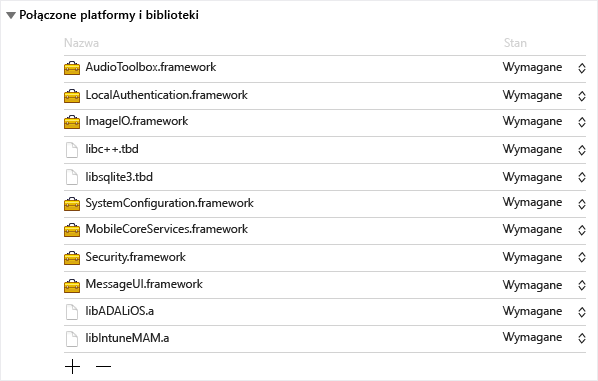
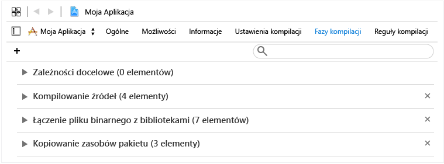
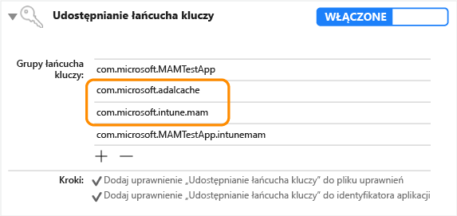

# <a name="microsoft-intune-app-sdk-for-ios-developer-guide"></a>Przewodnik dewelopera po zestawie SDK aplikacji usługi Microsoft Intune dla systemu iOS

> [!NOTE]
> Warto najpierw przeczytać artykuł [Wprowadzenie do zestawu SDK aplikacji usługi Intune](intune-app-sdk-get-started.md), w którym omówiono przygotowanie do integracji na poszczególnych obsługiwanych platformach.

Dzięki zestawowi SDK aplikacji usługi Microsoft Intune dla systemu iOS możesz wdrożyć zasady ochrony aplikacji usługi Intune, w postaci funkcji zarządzania aplikacjami mobilnymi (MAM, mobile app management), w swojej aplikacji dla systemu iOS. Aplikacja obsługująca zarządzanie aplikacjami mobilnymi to aplikacja zintegrowana z zestawem SDK aplikacji usługi Intune. Umożliwia ona administratorom IT wdrażanie zasad w aplikacji mobilnej, gdy usługa Intune aktywnie zarządza aplikacją.

## <a name="prerequisites"></a>Wymagania wstępne

* Wymagany jest komputer z systemem Mac OS X 10.8.5 lub nowszym z zainstalowanym zestawem narzędzi Xcode w wersji 5 lub nowszej.

* Należy zapoznać się z [postanowieniami licencyjnymi zestawu SDK aplikacji usługi Intune dla systemu iOS](https://github.com/msintuneappsdk/ms-intune-app-sdk-ios/blob/master/Microsoft%20License%20Terms%20Intune%20App%20SDK%20for%20iOS%20.pdf). Wydrukować i zachować kopię postanowień licencyjnych. Pobranie i rozpoczęcie używania zestawu SDK aplikacji usługi Intune dla systemu iOS oznacza akceptację tych postanowień licencyjnych.  Jeśli użytkownik nie akceptuje niniejszych postanowień, nie może używać tego oprogramowania.

## <a name="whats-in-the-sdk"></a>Zawartość zestawu SDK

Zestaw SDK aplikacji usługi Intune dla systemu iOS zawiera bibliotekę statyczną, pliki zasobów, nagłówki interfejsu API, plik plist z ustawieniami debugowania i narzędzie Configurator. W większości konfiguracji wymuszania zasad wystarczy dołączyć pliki zasobów do aplikacji mobilnych, które będą statycznie łączyć się z bibliotekami. Zaawansowane funkcje MAM usługi Intune są wymuszane za pośrednictwem interfejsów API.

W tym przewodniku omówiono użycie następujących składników zestawu SDK aplikacji usługi Intune dla systemu iOS:

* **libIntuneMAM.a**: biblioteka statyczna zestawu SDK aplikacji usługi Intune. Jeśli aplikacja nie używa rozszerzeń, należy połączyć tę bibliotekę z projektem, aby umożliwić zarządzanie aplikacją za pomocą zarządzania aplikacjami mobilnymi w usłudze Intune.

* **IntuneMAM.framework**: struktura zestawu SDK aplikacji usługi Intune. Tę strukturę należy połączyć z projektem, aby umożliwić zarządzanie aplikacją za pomocą zarządzania aplikacjami mobilnymi w usłudze Intune. Jeśli aplikacja używa rozszerzeń, można użyć tej struktury zamiast biblioteki statycznej, aby projekt nie tworzył wielu kopii biblioteki statycznej.

* **IntuneMAMResources.bundle**: pakiet zawierający zasoby, na których bazuje zestaw SDK.

* **Nagłówki**: udostępnia interfejsy API zestawu SDK aplikacji usługi Intune. Jeśli korzystasz z interfejsu API, musisz uwzględnić plik nagłówka zawierający interfejs API. Następujące pliki nagłówków obejmują wywołania funkcji API wymagane do włączenia funkcji zestawu SDK aplikacji usługi Intune:

    * IntuneMAMAsyncResult.h
    * IntuneMAMDataProtectionInfo.h
    * IntuneMAMDataProtectionManager.h
    * IntuneMAMFileProtectionInfo.h
    * IntuneMAMFileProtectionManager.h
    * IntuneMAMPolicyDelegate.h
    * IntuneMAMLogger.h


## <a name="how-the-intune-app-sdk-works"></a>Jak działa zestaw SDK aplikacji usługi Intune

Zestaw SDK aplikacji usługi Intune dla systemu iOS opracowano po to, aby umożliwić dodawanie funkcji zarządzania do aplikacji systemu iOS przy minimalnych zmianach w kodzie. Im mniej zmian w kodzie, tym krótszy czas wprowadzenia na rynek, ale bez wpływu na spójność i stabilność aplikacji mobilnej.

Aplikacja musi być połączona z biblioteką statyczną i zawierać pakiet zasobów. Plik MAMDebugSettings.plist jest opcjonalny. Może on być uwzględniony w pakiecie w celu symulowania stosowania zasad MAM w odniesieniu do aplikacji bez konieczności wdrażania aplikacji za pomocą usługi Microsoft Intune. Ponadto w kompilacjach do debugowania możesz stosować zasady w pliku MAMDebugSettings.plist, przesyłając plik do katalogu dokumentów aplikacji za pomocą funkcji udostępniania plików programu iTunes.

## <a name="build-the-sdk-into-your-mobile-app"></a>Kompilowanie aplikacji mobilnej przy użyciu zestawu SDK

Aby włączyć zestaw SDK aplikacji usługi Intune, wykonaj następujące kroki:

1. **Opcja 1**: połącz z biblioteką `libIntuneMAM.a`. Przeciągnij bibliotekę `libIntuneMAM.a` na listę **Linked Frameworks and Libraries** (Połączone struktury i biblioteki) obiektu docelowego projektu.
    

    > [!NOTE]
    > Jeśli zamierzasz opublikować aplikację w sklepie App Store, użyj wersji biblioteki `libIntuneMAM.a`, która została skompilowana dla wersji wydanej, a nie wersji do debugowania. Wersja wydana będzie znajdować się w folderze **release** (wydanie). Wersja do debugowania generuje szczegółowe dane wyjściowe, co ułatwia rozwiązywanie problemów z zestawem SDK aplikacji usługi Intune.

    **Opcja 2**: połącz strukturę `IntuneMAM.framework` z projektem. Przeciągnij strukturę `IntuneMAM.framework` na listę **Linked Frameworks and Libraries** (Połączone struktury i biblioteki) obiektu docelowego projektu.

    > [!NOTE]
    > W przypadku używania struktury należy ręcznie usunąć architektury symulatora z uniwersalnej struktury przed przesłaniem aplikacji do sklepu App Store. Zobacz sekcję „Przesyłanie aplikacji do sklepu App Store”.

2. Dodaj następujące struktury systemu iOS do projektu:
    * MessageUI.framework
    * Security.framework
    * MobileCoreServices.framework
    * SystemConfiguration.framework
    * libsqlite3.dylib
    * libc++.dylib
    * ImageIO.framework
    * LocalAuthentication.framework
    * AudioToolbox.framework

    > [!NOTE]
    > Jeśli aplikacja jest przeznaczona dla systemu iOS 7, ustaw wartość „Optional” (Opcjonalne) atrybutu `Status` (Stan) struktury `LocalAuthentication.framework`. Jeśli wartość atrybutu `Status` (Stan) nie jest ustawiona, próba uruchomienia aplikacji w systemie iOS 7 zakończy się niepowodzeniem.
    >
    > Ponadto w środowisku Xcode 7 zastąpiono rozszerzenia nazw `.dylib` rozszerzeniami `.tbd`.

3. Dodaj pakiet zasobów `IntuneMAMResources.bundle` do projektu, przeciągając pakiet zasobów w obszarze **Copy Bundle Resources** (Kopiuj pakiety zasobów) w sekcji **Build Phases** (Fazy kompilacji).


4. Dodaj składnik `-force_load {PATH_TO_LIB}/libIntuneMAM.a` do jednej z następujących pozycji, zastępując element `{PATH_TO_LIB}` lokalizacją zestawu SDK aplikacji usługi Intune:
    * Ustawienie konfiguracji kompilacji `OTHER_LDFLAGS` projektu
    * Pozycja **Other Linker Flags** (Inne flagi konsolidatora) w interfejsie użytkownika<br>

    > [!NOTE]
    > Aby ustalić wartość elementu `PATH_TO_LIB`, wybierz plik `libIntuneMAM.a`, a następnie wybierz polecenie **Get Info** (Pobierz informacje) z menu **File** (Plik). Skopiuj i wklej informacje z pola **Where** (Gdzie; ścieżka) z sekcji **General** (Ogólne) okna **Info** (Informacje).

5. Jeśli w pliku Info.plist Twojej aplikacji mobilnej zdefiniowano główny plik nib lub storyboard, usuń pole **Main Storyboard** lub **Main Nib**. Dodaj usunięte uprzednio wartości storyboard lub nib w nowym słowniku o nazwie IntuneMAMSettings z następującymi nazwami kluczy zgodnie z wymaganiami:
    * MainStoryboardFile
    * MainStoryboardFile~ipad
    * MainNibFile
    * MainNibFile~ipad

    > [!NOTE]
    > Jeśli w pliku Info.plist Twojej aplikacji mobilnej nie zdefiniowano głównego pliku nib lub storyboard, te ustawienia nie są wymagane.

    Możesz przeglądać plik Info.plist w formacie nieprzetworzonym (aby zobaczyć nazwy kluczy), klikając prawym przyciskiem myszy w dowolnym miejscu w treści dokumentu i zmieniając typ widoku na **Show Raw Keys/Values** (Pokaż nieprzetworzone klucze/wartości).

6. Włącz udostępnianie łańcucha kluczy (jeśli nie zostało jeszcze włączone), wybierając pozycję **Capabilities** (Możliwości) w każdym obiekcie docelowym projektu i włączając przełącznik **Keychain Sharing** (Udostępnianie łańcucha kluczy). Udostępnianie łańcucha kluczy jest wymagane do przejścia do następnego kroku.

    > [!NOTE]
    > Twój profil aprowizacji musi obsługiwać nowe wartości udostępniania łańcucha kluczy. Grupy dostępu łańcucha kluczy powinny obsługiwać symbol wieloznaczny. Możesz to sprawdzić, otwierając plik mobileprovision w edytorze tekstów, wyszukując frazę **keychain-access-groups** i sprawdzając, czy używany jest symbol wieloznaczny. Na przykład:     ```xml
    <key>keychain-access-groups</key>
    <array>
    <string>YOURBUNDLESEEDID.*</string>
    </array>
    ```

7. Po włączeniu udostępniania łańcucha kluczy wykonaj następujące kroki, aby utworzyć oddzielną grupę dostępu, w której będą przechowywane dane zestawu SDK aplikacji usługi Intune. Grupę dostępu łańcucha kluczy możesz utworzyć za pomocą interfejsu użytkownika lub pliku uprawnień.

    Jeśli używasz interfejsu użytkownika do utworzenia grupy dostępu łańcucha kluczy:

    a. Jeśli dla Twojej aplikacji mobilnej nie zdefiniowano żadnych grup dostępu łańcucha kluczy, dodaj identyfikator pakietu aplikacji jako pierwszą grupę.

    b. Dodaj udostępnioną grupę łańcucha kluczy `com.microsoft.intune.mam`. Zestaw SDK aplikacji usługi Intune używa tej grupy dostępu do przechowywania danych.

    c. Dodaj grupę `com.microsoft.adalcache` do Twoich istniejących grup dostępu.

    

    Jeśli używasz pliku uprawnień do utworzenia grupy dostępu łańcucha kluczy, dołącz ciąg `$(AppIdentifierPrefix)` jako prefiks grupy dostępu łańcucha kluczy w pliku uprawnień. Na przykład:  

    * `$(AppIdentifierPrefix)com.microsoft.intune.mam`
    * `$(AppIdentifierPrefix)com.microsoft.adalcache`

    > [!NOTE]
    > Plik uprawnień to plik XML, który jest unikatowy dla Twojej aplikacji mobilnej. Służy do określania specjalnych uprawnień i możliwości w Twojej aplikacji dla systemu iOS.

8. Jeśli w pliku info.plist aplikacji zdefiniowano schematy adresów URL, dodaj kolejny schemat z sufiksem `-intunemam` dla każdego schematu URL.

9. W przypadku aplikacji mobilnych opracowywanych dla systemu iOS 9 i nowszych uwzględnij każdy protokół, przekazywany przez aplikację do procedury `UIApplication canOpenURL`, w tablicy `LSApplicationQueriesSchemes` pliku Info.plist aplikacji. Ponadto dla każdego protokołu uwzględnionego na liście dodaj nowy protokół i dołącz do jego nazwy sufiks `-intunemam`. W tabeli należy również uwzględnić pozycje `http-intunemam`, `https-intunemam`i `ms-outlook-intunemam` .

10. Jeśli w uprawnieniach aplikacji zdefiniowano grupy aplikacji, dodaj te grupy do słownika IntuneMAMSettings w kluczu `AppGroupIdentitifiers` jako tabelę ciągów.

11. Połącz swoją aplikację mobilną z biblioteką uwierzytelniania usługi Azure Directory (ADAL). Biblioteka ADAL dla języka Objective C jest [dostępna w usłudze GitHub](https://github.com/AzureAD/azure-activedirectory-library-for-objc).

    > [!NOTE]
    > Zestaw SDK aplikacji usługi Intune był testowany z kodem gałęzi brokera biblioteki ADAL w wersji z dnia 19 czerwca 2015. Upewnij się, że połączenie jest ustanawiane z najnowszą/działającą wersją biblioteki ADAL.

12. Uwzględnij pakiet zasobów `ADALiOSBundle.bundle` w projekcie, przeciągając go do obszaru **Copy Bundle Resources** (Kopiuj pakiety zasobów) w sekcji **Build Phases** (Fazy kompilacji).

13. Użyj opcji konsolidatora `-force_load PATH_TO_ADAL_LIBRARY` podczas ustanawiania połączenia z biblioteką.

    Dodaj opcję `-force_load {PATH_TO_LIB}/libADALiOS.a` do ustawienia konfiguracji kompilacji `OTHER_LDFLAGS` lub pozycji **Other Linker Flags** (Inne flagi konsolidatora) w interfejsie użytkownika. Element `PATH_TO_LIB` należy zastąpić lokalizacją plików binarnych biblioteki ADAL.

## <a name="set-up-azure-directory-authentication-library"></a>Konfigurowanie biblioteki uwierzytelniania usługi Azure Directory

Zestaw SDK aplikacji usługi Intune używa biblioteki ADAL na potrzeby scenariuszy uwierzytelniania i uruchamiania warunkowego. Używa również biblioteki ADAL do zarejestrowania tożsamości użytkownika w usłudze zarządzania aplikacjami mobilnymi dla scenariuszy zarządzania bez rejestracji urządzenia.

Zazwyczaj biblioteka ADAL wymaga od aplikacji zarejestrowania się w usłudze Azure Active Directory (Azure AD) i uzyskania unikatowego identyfikatora (identyfikatora klienta) oraz innych identyfikatorów w celu zagwarantowania bezpieczeństwa tokenów przyznanych aplikacji. Zestaw SDK aplikacji usługi Intune używa domyślnych wartości rejestracji podczas kontaktowania się z usługą Azure AD.  

Jeśli sama aplikacja używa biblioteki ADAL na potrzeby scenariusza uwierzytelniania, musi używać istniejących wartości rejestracji i przesłaniać wartości domyślne zestawu SDK aplikacji usługi Intune. Dzięki temu użytkownicy nie będą monitowani o uwierzytelnienie dwukrotnie (raz przez zestaw SDK aplikacji usługi Intune i drugi raz przez aplikację).

### <a name="adal-faqs"></a>Biblioteka ADAL — często zadawane pytania

**Z których plików binarnych biblioteki ADAL mam korzystać?**

Zestaw SDK aplikacji usługi Intune aktualnie używa gałęzi brokera [biblioteki ADAL w witrynie GitHub](https://github.com/AzureAD/azure-activedirectory-library-for-objc) w celu obsługi aplikacji, które wymagają dostępu warunkowego. (Te aplikacje są w związku z tym zależne od aplikacji Microsoft Authenticator). Zestaw SDK jest jednak nadal zgodny z główną gałęzią biblioteki ADAL. Skorzystaj z gałęzi, która jest odpowiednia dla danej aplikacji.

**Jak utworzyć połączenie z plikami binarnymi biblioteki ADAL?**

Dodaj opcję `-force_load {PATH_TO_LIB}/libADALiOS.a` do ustawienia konfiguracji kompilacji `OTHER_LDFLAGS` lub pozycji **Other Linker Flags** (Inne flagi konsolidatora) w interfejsie użytkownika. Element `PATH_TO_LIB` należy zastąpić lokalizacją plików binarnych biblioteki ADAL. Ponadto musisz skopiować pakiet ADAL do swojej aplikacji.  

Aby uzyskać więcej szczegółów, zobacz instrukcje dotyczące [biblioteki ADAL w witrynie GitHub](https://github.com/AzureAD/azure-activedirectory-library-for-objc).

**Jak udostępnić pamięć podręczną biblioteki ADAL innym aplikacjom podpisanym za pomocą tego samego profilu aprowizacji?**

Jeśli dla Twojej aplikacji nie zdefiniowano żadnych grup dostępu łańcucha kluczy, dodaj identyfikator pakietu aplikacji jako pierwszą grupę.

Włącz logowanie jednokrotne do biblioteki ADAL, dodając grupy dostępu `com.microsoft.adalcache` i `com.microsoft.workplacejoin` w uprawnieniach do łańcucha kluczy.

Jeśli ustawiasz grupę łańcucha kluczy udostępnionej pamięci podręcznej biblioteki ADAL w sposób jawny, upewnij się, że jest ona ustawiona na wartość `<app_id_prefix>.com.microsoft.adalcache`. Biblioteka ADAL ustawi tę grupę za Ciebie, chyba że ją zastąpisz. Jeśli chcesz określić niestandardową grupę łańcucha kluczy w celu zastąpienia grupy `com.microsoft.adalcache`, określ ją w pliku Info.plist w obszarze „IntuneMAMSettings” przy użyciu klucza `ADALCacheKeychainGroupOverride`.

**Jak wymusić, aby zestaw SDK aplikacji usługi Intune używał ustawień biblioteki ADAL, z których moja aplikacja już korzysta?**

Jeśli aplikacja używa już biblioteki ADAL, zobacz sekcję dotyczącą słownika IntuneMAMSettings, aby uzyskać informacje o wprowadzaniu poniższych ustawień:  

* ADALClientId
* ADALRedirectUri
* ADALRedirectScheme
* ADALCacheKeychainGroupOverride

**Jak przełączać się między środowiskiem produkcyjnym i wewnętrznym środowiskiem testowym usługi Azure AD?**

Aby określić środowisko usługi Azure AD używane na potrzeby wywołań biblioteki ADAL, możesz użyć ustawienia `AadAuthorityURI` w pliku MAMPolicies.plist. Obecnie jest ono ustawione w celu domyślnego korzystania z wstępnego środowiska produkcyjnego, chyba że to ustawienie zostanie przesłonięte.

Na potrzeby testowania wstępnego środowiska produkcyjnego można użyć przełącznika środowiska czasu kompilacji lub przełącznika środowiska uruchomieniowego.

W przypadku przełącznika środowiska czasu kompilacji adresów URL i usługi Azure AD usługi zarządzania aplikacjami mobilnymi ustaw flagę wartości logicznej `UsePPE` na wartość true w pliku MAMEnvironment.plist. (Nie ma możliwości ustawienia tej wartości w pliku Info.plist).

W przypadku przełącznika środowiska wykonawczego ustaw właściwość `com.microsoft.intune.mam.useppe` w ustawieniach domyślnych użytkownika standardowego na wartość „1”, aby użyć wstępnego środowiska produkcyjnego. Spowoduje to zastąpienie istniejącego ustawienia `com.microsoft.intune.mam.AADAuthorityEnvironment`.

**Jak przesłonić adres URL urzędu usługi Azure AD adresem URL specyficznym dla dzierżawy dostarczonym w czasie wykonywania?**

Ustaw właściwość `aadAuthorityUriOverride` w wystąpieniu klasy IntuneMAMPolicyManager.

> [!NOTE]
> Będzie to konieczne w scenariuszu zarządzania aplikacjami mobilnymi bez rejestracji urządzeń, aby umożliwić zestawowi SDK ponowne używanie tokenu odświeżania biblioteki ADAL pobranego przez aplikację.

Zestaw SDK będzie nadal używał tego adresu URL urzędu na potrzeby odświeżania zasad i wszystkich kolejnych żądań rejestracji, chyba że jego wartość zostanie wyczyszczona lub zmieniona.  Dlatego ważne jest wyczyszczenie tej wartości po wylogowaniu się użytkownika firmowego z aplikacji i zresetowanie jej podczas logowania nowego użytkownika firmowego.

**Co zrobić, jeśli moja aplikacja sama korzysta z biblioteki ADAL do uwierzytelniania?**

Jeśli aplikacja już używa biblioteki ADAL do uwierzytelniania, konieczne jest wykonanie następujących akcji:

* W słowniku IntuneMAMSettings z nazwą klucza `ADALClientId` w pliku Info.plist projektu określ identyfikator klienta, który ma być używany dla wywołań biblioteki ADAL.

* W słowniku IntuneMAMSettings z nazwą klucza `ADALRedirectUri` w pliku Info.plist projektu określ identyfikator URI przekierowania, który ma być używany dla wywołań biblioteki ADAL. Konieczne może być również określenie schematu `ADALRedirectScheme` zależnie od formatu identyfikatora URI przekierowania aplikacji.

**Co zrobić, jeśli moja aplikacja nie korzysta jeszcze z biblioteki ADAL do uwierzytelniania?**

Jeśli aplikacja nie używa biblioteki ADAL, zestaw SDK aplikacji usługi Intune udostępni wartości domyślne parametrów biblioteki ADAL i obsłuży uwierzytelnianie w usłudze Azure AD.

## <a name="register-your-app-with-the-intune-mam-service"></a>Rejestrowanie aplikacji w usłudze zarządzania aplikacjami mobilnymi usługi Intune

### <a name="use-the-apis"></a>Korzystanie z interfejsów API
Zestaw SDK aplikacji usługi Intune umożliwia teraz aplikacjom dla systemu iOS otrzymywanie zasad zarządzania aplikacjami mobilnymi z usługi Intune bez konieczności rejestracji w usłudze za pośrednictwem rozwiązania do zarządzania urządzeniami przenośnymi. Na potrzeby obsługi tej nowej funkcji zestaw SDK udostępnia nowe interfejsy API, które umożliwiają aplikacji odbieranie zasad zarządzania aplikacjami mobilnymi. Aby korzystać z nowych interfejsów API, wykonaj następujące kroki:

1. Użyj najnowszej wersji zestawu SDK aplikacji usługi Intune, która obsługuje zarządzanie aplikacjami z rejestracją urządzeń lub bez niej. Jeśli aplikacja korzystała ze starszej wersji zestawu SDK bez tej funkcji, należy zaktualizować bibliotekę zarządzania aplikacjami mobilnymi usługi Intune, a także zaktualizować folder Headers (Nagłówki) przy użyciu nagłówków z najnowszego zestawu SDK.

2. Dodaj element IntuneMAMEnrollment.h do wszystkich plików, które będą wywoływać interfejsy API.

3. Na potrzeby testowania wstępnego środowiska produkcyjnego można użyć przełącznika środowiska czasu kompilacji lub przełącznika środowiska uruchomieniowego.

    W przypadku przełącznika środowiska czasu kompilacji adresów URL i usługi Azure AD usługi zarządzania aplikacjami mobilnymi ustaw flagę wartości logicznej `UsePPE` na wartość true w pliku MAMEnvironment.plist. (Nie ma możliwości ustawienia tej wartości w pliku Info.plist).

    W przypadku przełącznika środowiska wykonawczego ustaw właściwość `com.microsoft.intune.mam.useppe` w ustawieniach domyślnych użytkownika standardowego na wartość „1”, aby użyć wstępnego środowiska produkcyjnego. Spowoduje to zastąpienie istniejącego ustawienia `com.microsoft.intune.mam.AADAuthorityEnvironment`.


### <a name="register-accounts"></a>Rejestrowanie kont

Aplikacja może odbierać zasady zarządzania aplikacjami mobilnymi z usługi Intune, jeśli jest zarejestrowana w imieniu określonego konta użytkownika. Aplikacja odpowiada za zarejestrowanie każdego nowo zalogowanego użytkownika w zestawie SDK aplikacji usługi Intune. Po uwierzytelnieniu nowego konta użytkownika aplikacja powinna wywołać metodę `registerAndEnrollAccount` znajdującą się w elemencie Headers/IntuneMAMEnrollment.h:

```objc
/**


 *  This method will add the account to the list of registered accounts.
 *  An enrollment request will immediately be started.
 *  @param identity The UPN of the account to be registered with the SDK
 */

(void)registerAndEnrollAccount:(NSString *)identity;

```
Przez wywołanie metody `registerAndEnrollAccount` zestaw SDK zarejestruje konto użytkownika i spróbuje zarejestrować aplikację w imieniu tego konta. Jeśli z jakiegokolwiek powodu rejestracja nie powiedzie się, zestaw SDK automatycznie ponowi próbę rejestracji po upływie 24 godzin. Dla celów debugowania aplikacja może odbierać powiadomienia, za pośrednictwem delegata, o wynikach żądań rejestracji.

Po wywołaniu tego interfejsu API aplikacja może kontynuować normalne działanie. Jeśli rejestracja powiedzie się, zestaw SDK powiadomi użytkownika, że wymagane jest ponowne uruchomienie aplikacji. Wtedy użytkownik może natychmiast ponownie uruchomić aplikację.

### <a name="deregister-accounts"></a>Wyrejestrowywanie kont

Przed wylogowaniem użytkownika z aplikacji aplikacja powinna wyrejestrować użytkownika z zestawu SDK. Dzięki temu:

1. Nie będą już podejmowane ponowne próby rejestracji dla tego konta użytkownika.

2. Jeśli użytkownik pomyślnie zarejestrował aplikację, użytkownik i aplikacja zostaną wyrejestrowani z usługi zarządzania aplikacjami mobilnymi usługi Intune, a zasady zarządzania aplikacjami mobilnymi zostaną usunięte.

3. Jeśli aplikacja zainicjuje selektywne czyszczenie danych (opcjonalnie), wszelkie dane służbowe zostaną usunięte.

Zanim użytkownik zostanie wylogowany, aplikacja powinna wywołać następujący interfejs API znajdujący się w elemencie Headers/IntuneMAMEnrollment.h:

```objc
/*
 *  This method will remove the provided account from the list of
 *  registered accounts.  Once removed, if the account has enrolled
 *  the application, the account will be un-enrolled.
 *  @note In the case where an un-enroll is required, this method will block
 *  until the Intune MAM AAD token is acquired, then return.  This method must be called before  
 *  the user is removed from the application (so that required AAD tokens are not purged
 *  before this method is called).
 *  @param identity The UPN of the account to be removed.
 *  @param doWipe   If YES, a selective wipe if the account is un-enrolled
 */

(void)deRegisterAndUnenrollAccount:(NSString *)identity withWipe:(BOOL)doWipe;
```

Ta metoda musi być wywoływana przed usunięciem tokenów usługi Azure AD konta użytkownika. Zestaw SDK potrzebuje tokenu aplikacji użytkownika, aby wysyłać określone żądania do usługi zarządzania aplikacjami mobilnymi w usłudze Intune w imieniu użytkownika.

Jeśli aplikacja samodzielnie usunie dane służbowe użytkownika, flagę `doWipe` można ustawić na wartość false. W przeciwnym razie aplikacja może zainicjować selektywne czyszczenie za pomocą zestawu SDK. Spowoduje to wywołanie delegata selektywnego czyszczenia aplikacji.

```objc
[[IntuneMAMEnrollmentManager instance] deRegisterAndUnenrollAccount:@”user@foo.com” withWipe:YES];
```

## <a name="enroll-without-prior-sign-in"></a>Rejestrowanie bez wcześniejszego zalogowania

Aplikacja, która nie loguje użytkownika za pomocą usługi Azure Active Directory, może nadal otrzymywać zasady zarządzania aplikacjami mobilnymi z usługi Intune, wywołując interfejs API, aby zestaw SDK obsłużył to uwierzytelnianie. Tej techniki należy używać w aplikacjach, jeśli nie uwierzytelniły one użytkownika w usłudze Azure AD, ale muszą pobierać zasady zarządzania aplikacjami mobilnymi w celu ochrony danych. Taka sytuacja może mieć miejsce na przykład wtedy, gdy na potrzeby logowania do aplikacji jest używana inna usługa uwierzytelniania lub gdy aplikacja w ogóle nie obsługuje logowania. W tym celu aplikacja powinna wywołać metodę `loginAndEnrollAccount` znajdującą się w elemencie Headers/IntuneMAMEnrollment.h:

```objc
/**
 *  Creates an enrollment request which is started immediately.
 *  If no token can be retrieved for the identity, the user will be prompted
 *  to enter their credentials, after which enrollment will be retried.
 *  @param identity The UPN of the account to be logged in and enrolled.
 */
 (void)loginAndEnrollAccount: (NSString *)identity;

```

W przypadku wywołania tej metody zestaw SDK będzie monitował użytkownika o poświadczenia, jeśli nie można znaleźć istniejącego tokenu. Następnie zestaw SDK spróbuje zarejestrować aplikację w imieniu tego konta. Metodę można wywołać z tożsamością „zero”. W tym przypadku zestaw SDK zarejestruje istniejącego użytkownika zarządzania aplikacjami mobilnymi na urządzeniu lub będzie monitować użytkownika o nazwę użytkownika, jeśli nie znajdzie istniejącego użytkownika.

W razie niepowodzenia rejestracji aplikacja powinna rozważyć wywołanie tego interfejsu API ponownie w przyszłości, w zależności od szczegółów błędu. Aplikacja może otrzymywać powiadomienia, za pośrednictwem delegata, o wynikach żądań rejestracji.

Po wywołaniu tego interfejsu API aplikacja może kontynuować normalne działanie. Jeśli rejestracja powiedzie się, zestaw SDK powiadomi użytkownika, że wymagane jest ponowne uruchomienie aplikacji.

## <a name="debug-information"></a>Informacje o debugowaniu

Aplikacja może odbierać powiadomienia debugowania dotyczące następujących żądań do usługi zarządzania aplikacjami mobilnymi usługi Intune:

 - Żądania rejestracji
 - Żądania aktualizacji zasad
 - Żądania wyrejestrowania

Powiadomienia są prezentowane za pomocą metod delegatów w elemencie Headers/IntuneMAMEnrollmentDelegate.h:

```objc
/**
 *  Called when an enrollment request operation is completed.
 * @param status status object containing debug information
 */

(void)enrollmentRequestWithStatus:(IntuneMAMEnrollmentStatus *)status;

/**
 *  Called when a MAM policy request operation is completed.
 *  @param status status object containing debug information
 */
(void)policyRequestWithStatus:(IntuneMAMEnrollmentStatus *)status;

/**
 *  Called when a un-enroll request operation is completed.
 *  @Note: when a user is un-enrolled, the user is also de-registered with the SDK
 *  @param status status object containing debug information
 */

(void)unenrollRequestWithStatus:(IntuneMAMEnrollmentStatus *)status;

```

Te metody delegatów zwracają obiekt `IntuneMAMEnrollmentStatus`, który zawiera następujące informacje:

- Tożsamość konta skojarzona z żądaniem
- Kod stanu wskazujący wynik żądania
- Ciąg błędu z opisem kodu stanu
- Obiekt `NSError`

Ten obiekt jest zdefiniowany w elemencie Headers/IntuneMAMEnrollmentStatus.h wraz z konkretnymi kodami stanu, które mogą być zwracane.

Pamiętaj, że żadna logika biznesowa aplikacji nie powinna być oparta na tych powiadomieniach. Chodzi o to, że aplikacja może wysyłać te informacje do usługi telemetrii na potrzeby debugowania lub monitorowania.


## <a name="sample-code"></a>Przykładowy kod

Poniżej przedstawiono przykładowe implementacje metod delegatów:

```objc
- (void)enrollmentRequestWithStatus:(IntuneMAMEnrollmentStatus *)status


{


    NSLog(@"enrollment result for identity %@ with status code %ld", status.identity, (unsigned long)status.statusCode);


    NSLog(@"Debug Message: %@", status.errorString);


}


- (void)policyRequestWithStatus:(IntuneMAMEnrollmentStatus *)status


{


    NSLog(@"policy check-in result for identity %@ with status code %ld", status.identity, (unsigned long)status.statusCode);


    NSLog(@"Debug Message: %@", status.errorString);


}


- (void)unenrollRequestWithStatus:(IntuneMAMEnrollmentStatus *)status


{


    NSLog(@"un-enroll result for identity %@ with status code %ld", status.identity, (unsigned long)status.statusCode);


    NSLog(@"Debug Message: %@", status.errorString);


}

```

## <a name="app-restart"></a>Ponowne uruchomienie aplikacji

Po pierwszym odebraniu zasad zarządzania aplikacjami mobilnymi aplikacja będzie musiała zostać ponownie uruchomiona, aby zastosować wymagane punkty zaczepienia. W celu powiadomienia aplikacji o konieczności wykonania ponownego uruchomienia zestaw SDK udostępnia metodę delegata w elemencie Headers/IntuneMAMPolicyDelegate.h.

```objc
 - (BOOL) restartApplication
```
Wartość zwracana przez tę metodę poinformuje zestaw SDK, czy aplikacja obsłuży wymagane ponowne uruchomienie:   

 - Jeśli zostanie zwrócona wartość true, aplikacja obsłuży ponowne uruchomienie.   
 - Jeśli zwracana jest wartość false, zestaw SDK uruchomi ponownie aplikację po powrocie tej metody. Zestaw SDK natychmiast wyświetli okno dialogowe z informacją, że użytkownik powinien ponownie uruchomić aplikację.

## <a name="implement-save-as-controls"></a>Implementowanie kontrolek Zapisz jako

Usługa Intune umożliwia administratorom IT wybieranie lokalizacji przechowywania, w których zarządzana aplikacja może zapisywać dane. Aplikacje mogą wysyłać zapytania o dozwolone lokalizacje przechowywania do zestawu SDK aplikacji usługi Intune przy użyciu interfejsu API **isSaveToAllowedForLocation**.

Przed zapisaniem zarządzanych danych w magazynie w chmurze lub lokalizacji lokalnej aplikacje muszą sprawdzić, za pomocą interfejsu API **isSaveToAllowedForLocation**, czy administrator IT zezwolił na zapisywanie danych w tym miejscu.

W przypadku korzystania z interfejsu API **isSaveToAllowedForLocation** aplikacje muszą przekazać nazwę UPN używaną dla lokalizacji przechowywania, jeśli jest ona dostępna.

### <a name="supported-save-locations"></a>Obsługiwane lokalizacje zapisywania

Interfejs API **isSaveToAllowedForLocation** zawiera stałe umożliwiające sprawdzenie, czy administrator IT zezwolił na zapisywanie danych w następujących lokalizacjach:

* IntuneMAMSaveLocationOther
* IntuneMAMSaveLocationOneDriveForBusiness
* IntuneMAMSaveLocationSharePoint
* IntuneMAMSaveLocationBox
* IntuneMAMSaveLocationDropbox
* IntuneMAMSaveLocationGoogleDrive
* IntuneMAMSaveLocationLocalDrive

Aplikacje powinny używać stałych w interfejsie API **isSaveToAllowedForLocation**, aby sprawdzać, czy można zapisywać dane w lokalizacjach uznawanych za „zarządzane”, np. w usłudze OneDrive dla Firm, lub „osobiste”. Ponadto należy używać interfejsu API w sytuacjach, w których aplikacja nie może określić, czy lokalizacja jest „zarządzana”, czy „osobista”.

Jeśli lokalizacja jest znana jako „osobista”, aplikacje powinny używać wartości **IntuneMAMSaveLocationOther**.

Stałej **IntuneMAMSaveLocationLocalDrive** należy używać, gdy aplikacja zapisuje dane w dowolnej lokalizacji na urządzeniu lokalnym.

## <a name="set-up-the-intune-app-sdk"></a>Konfigurowanie zestawu SDK aplikacji usługi Intune

Słownik IntuneMAMSettings umieszczony w pliku Info.plist aplikacji jest używany do konfigurowania zestawu SDK aplikacji usługi Intune. W poniższej tabeli uwzględniono wszystkie obsługiwane ustawienia.

Niektóre z tych ustawień mogły zostać omówione w poprzednich sekcjach, a niektóre nie dotyczą wszystkich aplikacji.

Ustawienie  | Typ  | Definicja | Wymagane?
--       |  --   |   --       |  --
ADALClientId  | String  | Identyfikator klienta usługi Azure AD aplikacji. | Wymagane, jeśli aplikacja korzysta z biblioteki ADAL.
ADALRedirectUri  | String  | Identyfikator URI przekierowania usługi Azure AD aplikacji. | Ustawienie ADALRedirectUri lub ADALRedirectScheme jest wymagane, jeśli aplikacja korzysta z biblioteki ADAL.
ADALRedirectScheme  | String  | Schemat przekierowania usługi Azure AD aplikacji. Może być używany zamiast ustawienia ADALRedirectUri, jeśli identyfikator URI przekierowania aplikacji ma format `scheme://bundle_id`. | Ustawienie ADALRedirectUri lub ADALRedirectScheme jest wymagane, jeśli aplikacja korzysta z biblioteki ADAL.
ADALLogOverrideDisabled | Boolean  | Określa, czy zestaw SDK będzie przekierowywać wszystkie dzienniki biblioteki ADAL (łącznie z ewentualnymi wywołaniami biblioteki ADAL z aplikacji) do własnego pliku dziennika. Wartość domyślna to NO (Nie). Wybierz wartość YES (Tak), jeśli aplikacja będzie ustawiać własne wywołanie zwrotne dziennika biblioteki ADAL. | Opcjonalny.
ADALCacheKeychainGroupOverride | String  | Określa grupę łańcucha kluczy do użycia dla pamięci podręcznej biblioteki ADAL zamiast „com.microsoft.adalcache”. Zauważ, że ta grupa nie zawiera prefiksu app-id. Zostanie on umieszczony jako prefiks w podanym ciągu w środowisku uruchomieniowym. | Opcjonalny.
AppGroupIdentifiers | Tablica ciągów  | Tablica grup aplikacji z sekcji uprawnień aplikacji com.apple.security.application-groups. | Wymagane, jeśli aplikacja używa grup aplikacji.
ContainingAppBundleId | String | Określa identyfikator pakietu aplikacji zawierającej rozszerzenie. | Wymagane w przypadku rozszerzeń dla systemu iOS.
DebugSettingsEnabled| Boolean | W przypadku ustawienia na wartość YES (TAK) zasady testu w pakiecie ustawień mogą być stosowane. Aplikacje *nie* powinny być dostarczane z włączonym tym ustawieniem. | Opcjonalny.
MainNibFile<br>MainNibFile~ipad  | String  | To ustawienie powinno zawierać nazwę pliku głównego nib aplikacji.  | Wymagane, jeśli w pliku Info.plist aplikacji zdefiniowano ustawienie MainNibFile.
MainStoryboardFile<br>MainStoryboardFile~ipad  | String  | To ustawienie powinno zawierać nazwę pliku głównego storyboard aplikacji. | Wymagane, jeśli w pliku Info.plist aplikacji zdefiniowano ustawienie UIMainStoryboardFile.
MAMPolicyRequired| Boolean| Określa, czy uruchamianie aplikacji będzie blokowane, jeśli aplikacja nie ma zasad zarządzania aplikacjami mobilnymi usługi Intune. Wartość domyślna to NO (Nie). | Opcjonalny.
MAMPolicyWarnAbsent | Boolean| Określa, czy użytkownik będzie ostrzegany podczas uruchamiania aplikacji, jeśli aplikacja nie ma zasad zarządzania aplikacjami mobilnymi usługi Intune. Uwaga: aplikacje nie mogą być przesyłane do sklepu, jeśli to ustawienie ma wartość YES (Tak). | Opcjonalny.
MultiIdentity | Boolean| Określa, czy aplikacja obsługuje wiele tożsamości. | Opcjonalny.
SplashIconFile <br>SplashIconFile~ipad | String  | Określa plik ikony powitalnej (uruchamiania) usługi Intune. | Opcjonalny.
SplashDuration | Liczba | Minimalny czas w sekundach, przez który ekran uruchamiania usługi Intune będzie wyświetlany podczas uruchamiania aplikacji. Wartość domyślna to 1,5. | Opcjonalny.
BackgroundColor| String| Określa kolor tła ekranu uruchamiania i ekranu numeru PIN. Akceptuje ciąg szesnastkowy RGB w postaci „#XXXXXX”, gdzie „X” może być znakiem z zakresu 0–9 lub A–F. Znak # można pominąć.   | Opcjonalny. Domyślnie jasnoszary.
ForegroundColor| String| Określa kolor pierwszego planu ekranu uruchamiania i ekranu numeru PIN, np. kolor tekstu. Akceptuje ciąg szesnastkowy RGB w postaci „#XXXXXX”, gdzie „X” może być znakiem z zakresu 0–9 lub A–F. Znak # można pominąć.  | Opcjonalny. Domyślnie czarny.
AccentColor | String| Określa kolor akcentu dla ekranu numeru PIN, na przykład kolor tekstu przycisku i kolor wyróżnienia pola. Akceptuje ciąg szesnastkowy RGB w postaci „#XXXXXX”, gdzie „X” może być znakiem z zakresu 0–9 lub A–F. Znak # można pominąć.| Opcjonalny. Domyślnie systemowy niebieski.
MAMTelemetryDisabled| Boolean| Określa, czy zestaw SDK będzie wysyłał dane telemetryczne do swojej wewnętrznej bazy danych.| Opcjonalny.
MAMTelemetryUsePPE | Boolean | Określa, czy zestaw SDK będzie wysyłał dane do wewnętrznej bazy danych wstępnego środowiska produkcyjnego. Użyj tego ustawienia podczas testowania aplikacji za pomocą zasad usługi Intune, aby dane telemetryczne testu nie mieszały się z danymi klienta. | Opcjonalny.

## <a name="telemetry"></a>Telemetria

Domyślnie zestaw SDK aplikacji usługi Intune dla systemu iOS rejestruje dane telemetryczne następujących zdarzeń użycia. Te dane są wysyłane do usługi Microsoft Intune.

* **Uruchomienie aplikacji**: w celu ułatwienia usłudze Microsoft Intune ustalenia użycia aplikacji z obsługą zarządzania aplikacjami mobilnymi zależnie od typu zarządzania (zarządzanie aplikacjami mobilnymi z zarządzaniem urządzeniami przenośnymi, zarządzanie aplikacjami mobilnymi bez rejestracji w rozwiązaniu do zarządzania urządzeniami przenośnymi itp.).
* **Wywołanie interfejsu API EnrollApplication**: w celu ułatwienia usłudze Microsoft Intune ustalenia współczynnika operacji zakończonych powodzeniem i innych metryk wydajności wywołań metody `enrollApplication` po stronie klienta.

> [!NOTE]
> Jeśli zrezygnujesz z wysyłania danych telemetrycznych zestawu SDK aplikacji usługi Intune do usługi Microsoft Intune z aplikacji mobilnej, musisz wyłączyć funkcję przechwytywania danych telemetrycznych w zestawie SDK aplikacji usługi Intune. Ustaw właściwość `MAMTelemetryDisabled` na wartość YES (Tak) w słowniku IntuneMAMSettings.

## <a name="enable-multi-identity-optional"></a>Włączanie wielu tożsamości (opcjonalnie)

Domyślnie zestaw SDK stosuje zasady do aplikacji jako całości. Wiele tożsamości to funkcja zarządzania aplikacjami mobilnymi, którą możesz włączyć, aby stosować zasady na poziomie poszczególnych tożsamości. Wymaga to pełniejszego uczestnictwa aplikacji niż inne funkcje zarządzania aplikacjami mobilnymi.

Aplikacja musi poinformować zestaw SDK aplikacji, gdy zamierza zmienić aktywną tożsamość. Zestaw SDK również powiadomi aplikację, kiedy zmiana tożsamości jest wymagana. Aktualnie obsługiwana jest tylko jedna tożsamość zarządzana. Po zarejestrowaniu urządzenia lub aplikacji przez użytkownika zestaw SDK używa tej tożsamości i uznaje ją za podstawową tożsamość zarządzaną. Inni użytkownicy w aplikacji są traktowani jako niezarządzani z nieograniczonymi ustawieniami zasad.

Należy zauważyć, że tożsamość jest definiowana po prostu jako ciąg. W tożsamościach nie jest rozróżniana wielkość liter. Żądania tożsamości wysyłane do zestawu SDK mogą nie zwracać jej z tą samą wielkością liter, której pierwotnie użyto podczas ustawiania tożsamości.

### <a name="identity-overview"></a>Przegląd tożsamości

Tożsamość jest po prostu nazwą użytkownika konta (na przykład user@contoso.com). Deweloperzy mogą ustawić tożsamość aplikacji na następujących poziomach:

* **Tożsamość procesu**: ustawia tożsamość dla całego procesu i jest używana głównie dla aplikacji z jedną tożsamością. Ta tożsamość ma wpływ na wszystkie zadania i pliki oraz interfejs użytkownika.
* **Tożsamość interfejsu użytkownika**: określa, jakie zasady są stosowane do zadań interfejsu użytkownika w głównym wątku, takich jak wytnij/kopiuj/wklej, kod PIN, uwierzytelnianie i udostępnianie danych. Tożsamość interfejsu użytkownika nie ma wpływu na zadania na plikach (np. szyfrowanie i kopie zapasowe).
* **Tożsamość wątku**: wpływa na to, jakie zasady są stosowane w bieżącym wątku. Ta tożsamość ma wpływ na wszystkie zadania i pliki oraz interfejs użytkownika.

Aplikacja odpowiada za odpowiednie ustawienie tożsamości bez względu na to, czy użytkownik jest zarządzany.

W dowolnym momencie każdy wątek ma obowiązującą tożsamość dla zadań interfejsu użytkownika i zadań na plikach. Jest to tożsamość używana do sprawdzenia, jakie zasady (jeśli w ogóle) powinny być stosowane. Jeśli tożsamość jest określona jako „brak tożsamości” lub użytkownik nie jest zarządzany, nie są stosowane żadne zasady.

### <a name="thread-queues"></a>Kolejki wątków

Aplikacje często wysyłają synchroniczne i asynchroniczne zadania do kolejek wątków. Zestaw SDK przechwytuje wywołania GCD (Grand Central Dispatch) i kojarzy bieżącą tożsamość wątku z wysłanymi zadaniami. Podczas kończenia zadań zestaw SDK tymczasowo zmienia tożsamość wątku na tożsamość skojarzoną z zadaniami, kończy zadania, a następnie przywraca oryginalną tożsamość wątku.


Ponieważ klasa `NSOperationQueue` jest zbudowana na bazie GCD, operacje `NSOperations` będą uruchamiane z tożsamością wątku podczas dodawania zadań do kolejki `NSOperationQueue`. Operacje `NSOperations` lub funkcje wysyłane bezpośrednio za pomocą GCD mają również możliwość zmiany bieżącej tożsamości wątku podczas działania. Ta tożsamość zastąpi tożsamość odziedziczoną z wysyłającego wątku.

### <a name="file-owner"></a>Właściciel pliku

Zestaw SDK śledzi tożsamości właścicieli plików lokalnych i zgodnie z tym stosuje zasady. Właściciel pliku jest ustanawiany podczas tworzenia pliku lub po otwarciu pliku w trybie obcinania. Właściciel jest ustawiany na obowiązującą tożsamość zadania na pliku dla wątku wykonującego zadanie.

Aplikacje mogą także ustawić tożsamość właściciela pliku w sposób jawny przy użyciu elementu `IntuneMAMFilePolicyManager`. Aplikacje mogą używać elementu `IntuneMAMFilePolicyManager` do pobierania właściciela pliku i ustawiania tożsamości interfejsu użytkownika przed wyświetleniem zawartości pliku.

### <a name="shared-data"></a>Dane udostępnione

Jeśli aplikacja tworzy pliki zawierające dane od użytkowników zarządzanych i niezarządzanych, odpowiada za szyfrowanie danych użytkowników zarządzanych. Dane można szyfrować przy użyciu interfejsów API `protect` i `unprotect` w elemencie `IntuneMAMDataProtectionManager`.

Metoda `protect` akceptuje tożsamość, która może być użytkownikiem zarządzanym lub niezarządzanym. Jeśli użytkownik jest zarządzany, dane będą szyfrowane. Jeśli użytkownik jest niezarządzany, do danych kodujących tożsamość zostanie dodany nagłówek, ale dane nie będą szyfrowane. Za pomocą metody `protectionInfo` możesz pobierać właściciela danych.

### <a name="share-extensions"></a>Rozszerzenia udostępniania

Jeśli aplikacja zawiera rozszerzenie udostępniania, właściciela udostępnianego elementu można pobrać przy użyciu metody `protectionInfoForItemProvider` w elemencie `IntuneMAMDataProtectionManager`. Jeśli udostępniony element jest plikiem, zestaw SDK obsłuży ustawianie właściciela pliku. Jeśli udostępniony element to dane, aplikacja jest odpowiedzialna za ustawienie właściciela pliku, gdy te dane są utrwalane w pliku, i wywołanie interfejsu API `setUIPolicyIdentity` przed wyświetleniem tych danych w interfejsie użytkownika.

### <a name="turning-on-multi-identity"></a>Włączanie wielu tożsamości

Domyślnie aplikacje są traktowane jako aplikacje mające jedną tożsamość. Zestaw SDK ustawia tożsamość procesu na zarejestrowanego użytkownika. Aby włączyć obsługę wielu tożsamości, dodaj ustawienie typu wartość logiczna o nazwie `MultiIdentity` z wartością „YES” (Tak) do słownika IntuneMAMSettings w pliku Info.plist aplikacji.

> [!NOTE]
> Po włączeniu obsługi wielu tożsamości tożsamość procesu, tożsamość interfejsu użytkownika i tożsamości wątku są ustawione na wartość zero. Aplikacja jest odpowiedzialna za ich odpowiednie ustawienie.

### <a name="switching-identities"></a>Przełączanie tożsamości

* **Przełączanie tożsamości inicjowane przez aplikację**:

    Przy uruchomieniu aplikacje z obsługą wielu tożsamości są traktowane jako uruchomione przy użyciu nieznanego, niezarządzanego konta. Interfejs użytkownika z warunkowym uruchamianiem nie zostanie uruchomiony, a w aplikacji nie będą wymuszane żadne zasady. Aplikacja odpowiada za powiadamianie zestawu SDK za każdym razem, kiedy tożsamość powinna zostać zmieniona. Zwykle dzieje się tak wtedy, gdy aplikacja ma wyświetlić dane dla określonego konta użytkownika.

    Są to na przykład sytuacje, kiedy użytkownik próbuje otworzyć dokument, skrzynkę pocztową lub kartę w notesie. Aplikacja musi powiadomić zestaw SDK, zanim plik, skrzynka pocztowa lub karta zostaną faktycznie otwarte. Robi to za pomocą interfejsu API `setUIPolicyIdentity` w obiekcie `IntuneMAMPolicyManager`. Ten interfejs API powinien być wywoływany bez względu na to, czy użytkownik jest zarządzany. Jeśli użytkownik jest zarządzany, zestaw SDK przeprowadzi kontrole warunkowego uruchamiania (np. wykrywanie zdjęcia zabezpieczeń systemu, numer PIN i uwierzytelnianie).

    Wynik przełączenia tożsamości jest zwracana do aplikacji asynchronicznie za pomocą procedury obsługi zakończenia. Aplikacja powinna odłożyć otworzenie dokumentu, skrzynki pocztowej lub karty, dopóki nie zostanie zwrócony kod wyniku wskazujący powodzenie. W przypadku niepowodzenia przełączania tożsamości aplikacja powinna anulować zadanie.

* **Przełączanie tożsamości inicjowane przez zestaw SDK**:

    Czasami zestaw SDK prosi aplikację o przełączenie do określonej tożsamości. Aplikacje z obsługą wielu tożsamości muszą implementować metodę `identitySwitchRequired` w `IntuneMAMPolicyDelegate` w celu obsługi tego żądania.

    Gdy ta metoda zostanie wywołana, jeśli aplikacja jest w stanie obsłużyć żądanie przełączenia do określonej tożsamości, powinna przekazać wartość `IntuneMAMAddIdentityResultSuccess` do procedury obsługi zakończenia. Jeśli aplikacja nie może obsłużyć przełączenia tożsamości, powinna przekazać wartość `IntuneMAMAddIdentityResultFailed` do procedury obsługi zakończenia.

    Aplikacja nie musi wywoływać metody `setUIPolicyIdentity` w odpowiedzi na to wywołanie. Jeśli zestawu SDK wymaga od aplikacji przełączenia się na konto użytkownika niezarządzanego, do wywołania metody `identitySwitchRequired` zostanie przekazany pusty ciąg.

* **Selektywne czyszczenie danych**:

    W przypadku selektywnego czyszczenia danych aplikacji zestaw SDK wywoła metodę `wipeDataForAccount` w elemencie `IntuneMAMPolicyDelegate`. Aplikacja odpowiada za usunięcie konta określonego użytkownika i wszelkich skojarzonych z nim danych. Zestaw SDK jest w stanie usunąć wszystkie pliki należące do użytkownika i zrobi to, jeśli aplikacja zwróci wartość „FALSE” z wywołania metody `wipeDataForAccount`.

    Zauważ, że ta metoda jest wywoływana z wątku w tle. Aplikacja nie powinna zwracać wartości, dopóki nie zostaną usunięte wszystkie dane użytkownika (z wyjątkiem plików, jeśli aplikacja zwraca wartość FALSE).

## <a name="debug-the-intune-app-sdk-in-xcode"></a>Debugowanie zestawu SDK aplikacji usługi Intune w środowisku Xcode

Przed ręcznym testowaniem aplikacji z obsługą zarządzania aplikacjami mobilnymi w usłudze Microsoft Intune możesz użyć pliku Settings.bundle w środowisku Xcode. Umożliwi to ustawienie zasad testowych bez konieczności ustanawiania połączenia z usługą Intune. Aby włączyć ten element:

1. Dodaj plik Settings.bundle, klikając prawym przyciskiem myszy folder najwyższego poziomu w projekcie. Wybierz polecenie **Add** > **New File** (Dodaj -> Nowy plik) z menu. Wybierz szablon **Settings Bundle** (Pakiet ustawień) w obszarze **Resources** (Zasoby), aby dodać ten szablon.

2. Tylko w przypadku kompilacji do debugowania skopiuj plik MAMDebugSettings.plist do pakietu Settings.bundle.

3. W pliku Root.plist (znajdującym się w pakiecie Settings.bundle) dodaj preferencję `Type` = `Child Pane` i `FileName` = `MAMDebugSettings`.

4. W obszarze **Settings** > **Your-App-Name** (Ustawienia -> Twoja nazwa aplikacji) włącz ustawienie **Enable Test Policies** (Włącz zasady testowe).

5. Uruchom aplikację (w środowisku Xcode lub poza nim).

6. W obszarze **Settings** > **Your-App-Name** > **Enable Test Policies** (Ustawienia -> Twoja nazwa aplikacji -> Włącz zasady testowe) włącz zasady, na przykład **PIN**.

7. Uruchom aplikację (w środowisku Xcode lub poza nim). Sprawdź, czy numer PIN działa zgodnie z oczekiwaniami.

> [!NOTE]
> Pozycja **Settings** > **Your-App-Name** > **Enable Test Policies** (Ustawienia -> Twoja nazwa aplikacji -> Włącz zasady testowe) umożliwia włączanie i zmianę ustawień.

## <a name="ios-best-practices"></a>Najlepsze rozwiązania dla systemu iOS

Opracowując aplikacje dla systemu iOS, należy stosować poniższe najlepsze rozwiązania:

* W systemie plików iOS uwzględniana jest wielkość liter. Upewnij się, że wielkość liter w nazwach plików, takich jak `libIntuneMAM.a` i `IntuneMAMResources.bundle`, jest prawidłowa.

* Jeśli środowisko Xcode nie może odnaleźć biblioteki `libIntuneMAM.a`, możesz rozwiązać ten problem, dodając ścieżkę do tej biblioteki do ścieżek wyszukiwania konsolidatora.

## <a name="faq"></a>Najczęściej zadawane pytania

**Czy wszyscy użytkownicy mojej aplikacji muszą być zarejestrowani w usłudze zarządzania aplikacjami mobilnymi (MAM)?**

Nie. W rzeczywistości tylko konta służbowe powinny być rejestrowane przy użyciu zestawu SDK aplikacji usługi Intune. Aplikacje są odpowiedzialne za określenie, czy konto jest używane w kontekście miejsca pracy lub nauki.   

**Co z użytkownikami, którzy już zalogowali się do aplikacji? Czy muszą zostać zarejestrowani?**

Aplikacja jest odpowiedzialna za rejestrowanie użytkowników po ich pomyślnym uwierzytelnieniu. Aplikacja jest również odpowiedzialna za zarejestrowanie wszelkich kont istniejących przed zaimplementowaniem w aplikacji funkcji zarządzania aplikacjami mobilnymi bez zarządzania urządzeniami przenośnymi.   

W tym celu aplikacja powinna korzystać z metody `registeredAccounts:`. Ta metoda zwraca element NSDictionary zawierający wszystkie konta zarejestrowane w usłudze zarządzania aplikacjami mobilnymi w usłudze Intune. Jeśli jakiekolwiek konta istniejące w aplikacji nie są obecne na liście, aplikacja powinna zarejestrować te konta za pomocą metody `registerAndEnrollAccount:`.

**Jak często zestaw SDK ponawia próby rejestracji?**

Zestaw SDK będzie automatycznie ponawiać próbę rejestracji dla wszystkich rejestracji wcześniej zakończonych niepowodzeniem co 24 godziny. Robi to w celu upewnienia się, że jeśli organizacja użytkownika włączyła zarządzanie aplikacjami mobilnymi po zalogowaniu się użytkownika do aplikacji, użytkownik zostanie pomyślnie zarejestrowany i otrzyma zasady.

Zestaw SDK przestanie ponawiać próby po wykryciu, że użytkownik pomyślnie zarejestrował aplikację. Dzieje się tak, ponieważ w danym momencie tylko jeden użytkownik może zarejestrować aplikację. Jeśli użytkownik zostanie wyrejestrowany, ponowne próby rozpoczną się ponownie z tym samym 24-godzinnym interwałem.

**Dlaczego użytkownik musi zostać wyrejestrowany?**

Zestaw SDK będzie okresowo wykonywał następujące akcje w tle:

 - Jeśli aplikacja nie jest jeszcze zarejestrowana, co 24 godziny będzie próbował zarejestrować wszystkie zarejestrowane konta.
 - Jeśli aplikacja jest zarejestrowana, zestaw SDK co 8 godzin będzie sprawdzał dostępność aktualizacji zasad zarządzania aplikacjami mobilnymi.

Wyrejestrowanie użytkownika powiadamia zestaw SDK, że użytkownik nie będzie już używał aplikacji i że można zatrzymać wszystkie zdarzenia okresowe dla konta tego użytkownika. Spowoduje to również wykonanie wyrejestrowania aplikacji i selektywnego czyszczenia danych, jeśli jest to konieczne.

**Czy flagę doWipe należy ustawić na wartość true w metodzie deregister?**

Ta metoda powinna być wywoływana przed wylogowaniem użytkownika z aplikacji.  Jeśli w ramach wylogowywania dane użytkownika są usuwane z aplikacji, można ustawić flagę `doWipe` na wartość false. Jednak jeśli aplikacja nie usuwa danych użytkownika, należy ustawić flagę `doWipe` na wartość true, aby zestaw SDK mógł usunąć te dane.

**Czy istnieją inne sposoby wyrejestrowania aplikacji?**

Tak, administrator IT może wysłać polecenie selektywnego czyszczenia danych do aplikacji. Spowoduje to wyrejestrowanie użytkownika i wyczyszczenie jego danych. Zestaw SDK automatycznie obsługuje ten scenariusz i wysyła powiadomienie za pośrednictwem metody delegata wyrejestrowania.

## <a name="submit-your-app-to-the-app-store"></a>Przesyłanie aplikacji do sklepu App Store

Zarówno kompilacje biblioteki statycznej, jak i struktury zestawu SDK aplikacji usługi Intune są uniwersalnymi plikami binarnymi. Oznacza to, że zawierają kod dla wszystkich architektur urządzeń i symulatorów. Firma Apple odrzuci aplikacje przesłane do sklepu App Store, jeśli zawierają one kod symulatora. Podczas kompilowania biblioteki statycznej na potrzeby kompilacji tylko dla urządzenia konsolidator automatycznie usunie kod symulatora.

1. Upewnij się, że struktura `IntuneMAM.framework` znajduje się na pulpicie.

2. Uruchom następujące polecenia:

    ```bash
    lipo ~/Desktop/IntuneMAM.framework/IntuneMAM -remove i386 -remove x86_64 -output ~/Desktop/IntuneMAM.device_only
    ```

    ```bash
    cp ~/Desktop/IntuneMAM.device_only ~/Desktop/IntuneMAM.framework/IntuneMAM
    ```
    Pierwsze polecenie usuwa architektury symulatorów z pliku DYLIB struktury. Drugie polecenie kopiuje plik DYLIB tylko dla urządzeń do katalogu struktury.


<!--HONumber=Nov16_HO4-->


