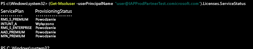

# Zarządzanie licencjami usługi Intune

[!INCLUDE[classic-portal](../includes/classic-portal.md)]

Ten temat zawiera informacje dla administratorów dotyczące sposobu przypisywania licencji usługi Intune użytkownikom w celu umożliwienia zarządzania urządzeniami.

Zanim użytkownicy będą mogli logować się i korzystać z usługi Intune lub rejestrować urządzenia w celu zarządzania nimi, należy najpierw przypisać każdemu użytkownikowi licencję na subskrypcję usługi Intune w [portalu usługi Office 365](http://go.microsoft.com/fwlink/p/?LinkId=698854).

Niektórzy użytkownicy w organizacjach korzystających z pakietu Microsoft Enterprise Mobility + Security (EMS) mogą wymagać tylko usługi Azure Active Directory — wersja Premium lub usługi Intune w pakiecie EMS. Możesz przypisać jedną usługę lub zestaw usług przy użyciu [poleceń cmdlet programu PowerShell usługi Azure Active Directory](https://msdn.microsoft.com/library/jj151815.aspx). Aby uzyskać więcej informacji, zobacz [Zarządzanie licencjami usługi Intune przy użyciu programu PowerShell](start-with-a-paid-subscription-to-microsoft-intune-step-4-posh.md).

## Przypisywanie licencji usługi Intune
Gdy konta użytkowników są synchronizowane z lokalnej usługi Active Directory lub ręcznie dodawane do subskrypcji usług w chmurze za pośrednictwem [portalu usługi Office 365](http://go.microsoft.com/fwlink/p/?LinkId=698854), licencja usługi Intune nie jest automatycznie przypisywana do nich. Zamiast tego administrator dzierżawy usługi Intune musi później edytować konto użytkownika w portalu usługi Office 365 w celu przypisania licencji do użytkownika.

Jeśli subskrypcja współużytkuje usługę Azure AD z innymi usługami w chmurze skojarzonymi z Twoją subskrypcją, masz również dostęp do użytkowników dodanych do tych usług. Ci użytkownicy nie mają licencji usługi [!INCLUDE[wit_nextref](../includes/wit_nextref_md.md)], dopóki licencja nie zostanie przypisana do każdego z nich.

> [!TIP]
> Jeśli opcja przypisywania lub odwoływania licencji usługi [!INCLUDE[wit_nextref](../includes/wit_nextref_md.md)] jest wyłączona, subskrypcja może obejmować opcje licencjonowania zbiorowego, na przykład opcje dostępne podczas korzystania z pakietu [Enterprise Mobility Suite + Security](https://www.microsoft.com/en-us/server-cloud/enterprise-mobility/overview.aspx). Informacje dotyczące przypisywania lub odwoływania licencji zawiera dokumentacja opcji licencjonowania.

## Przypisywanie licencji użytkownika usługi Intune

[Portal usługi Office 365](http://go.microsoft.com/fwlink/p/?LinkId=698854) umożliwia ręczne dodawanie użytkowników w chmurze oraz przypisywanie licencji do kont użytkowników w chmurze i kont synchronizowanych z lokalnej usługi Active Directory do usługi Azure AD.

1.  Zaloguj się do [portalu usługi Office 365](http://go.microsoft.com/fwlink/p/?LinkId=698854) przy użyciu poświadczeń administratora dzierżawy, a następnie wybierz pozycję **Osoby** > **Wszyscy użytkownicy**.

2.  Wybierz konto użytkownika, do którego chcesz przypisać licencję użytkownika usługi Intune, a następnie wybierz pozycję **Microsoft Intune** (wersja autonomiczna) lub **Enterprise Mobility Suite**.

3.  Konto użytkownika ma teraz wymagane uprawnienia do korzystania z usługi i rejestrowania urządzeń w systemie zarządzania.

> [!NOTE]
> Użytkownicy będą wyświetlani w konsoli po zarejestrowaniu urządzenia.

### Selektywne zarządzanie licencjami użytkowników pakietu EMS przy użyciu programu PowerShell
Niektórzy użytkownicy w organizacjach korzystających z pakietu Microsoft Enterprise Mobility + Security (EMS) mogą potrzebować tylko usługi Azure Active Directory — wersja Premium lub usługi Intune w pakiecie EMS. Można przypisać jedną usługę lub podzestaw usług przy użyciu [poleceń cmdlet środowiska PowerShell usługi Azure Active Directory](https://msdn.microsoft.com/library/jj151815.aspx).

Aby selektywnie przypisywać licencje użytkowników dla usług pakietu EMS, należy otworzyć program PowerShell jako administrator na komputerze, na którym zainstalowano [moduł usługi Azure Active Directory dla programu Windows PowerShell](https://msdn.microsoft.com/library/jj151815.aspx#bkmk_installmodule). Program PowerShell można zainstalować na komputerze lokalnym lub serwerze usług ADFS.

Należy utworzyć nową definicję jednostki SKU licencji, która ma zastosowanie tylko do planów żądanej usługi. Aby to zrobić, należy wyłączyć plany, które nie powinny być stosowane. Na przykład można utworzyć definicję jednostki SKU licencji, która nie powoduje przypisania licencji usługi Intune. Aby wyświetlić listę dostępnych usług, wpisz:

    (Get-MsolAccountSku | Where {$_.SkuPartNumber -eq "EMS"}).ServiceStatus

Aby wykluczyć plan usługi Intune, można uruchomić poniższe polecenie. Można użyć tej samej metody do rozszerzenia całej grupy zabezpieczeń lub skorzystać z bardziej szczegółowych filtrów.

**Przykład 1** 
Utworzenie nowego użytkownika w wierszu polecenia i przypisanie licencji pakietu EMS bez włączania składnika Intune licencji:

    Connect-MsolService

    New-MsolUser -DisplayName “Test User” -FirstName FName -LastName LName -UserPrincipalName user@<TenantName>.onmicrosoft.com –Department DName -UsageLocation US

    $CustomEMS = New-MsolLicenseOptions -AccountSkuId "<TenantName>:EMS" -DisabledPlans INTUNE_A
    Set-MsolUserLicense -UserPrincipalName user@<TenantName>.onmicrosoft.com -AddLicenses <TenantName>:EMS -LicenseOptions $CustomEMS

Weryfikacja:

    (Get-MsolUser -UserPrincipalName "user@<TenantName>.onmicrosoft.com").Licenses.ServiceStatus

**Przykład 2** 
Wyłączenie składnika Intune licencji pakietu EMS dla użytkownika, do którego przypisano już licencję:

    Connect-MsolService

    $CustomEMS = New-MsolLicenseOptions -AccountSkuId "<TenantName>:EMS" -DisabledPlans INTUNE_A
    Set-MsolUserLicense -UserPrincipalName user@<TenantName>.onmicrosoft.com -LicenseOptions $CustomEMS

Weryfikacja:

    (Get-MsolUser -UserPrincipalName "user@<TenantName>.onmicrosoft.com").Licenses.ServiceStatus

>[!div class="step-by-step"]

>[&larr; **Synchronizuj użytkowników z Intune**](.\start-with-a-paid-subscription-to-microsoft-intune-step-2.md)     [**Organizuj użytkowników i urządzenia** &rarr;](.\start-with-a-paid-subscription-to-microsoft-intune-step-5.md)  

