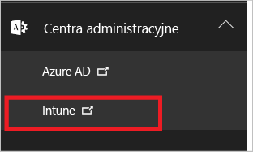
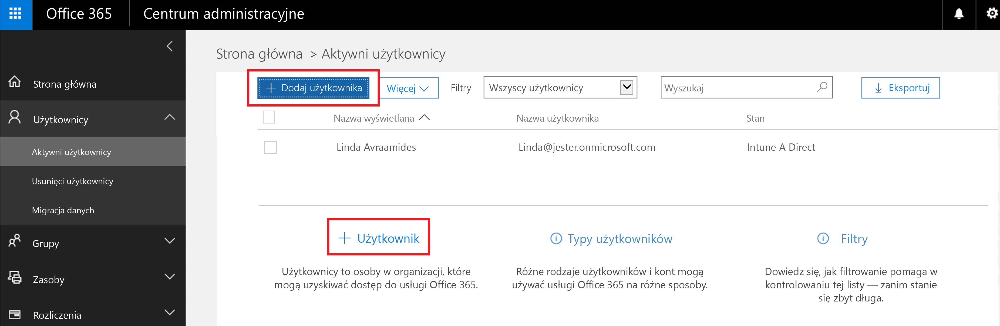
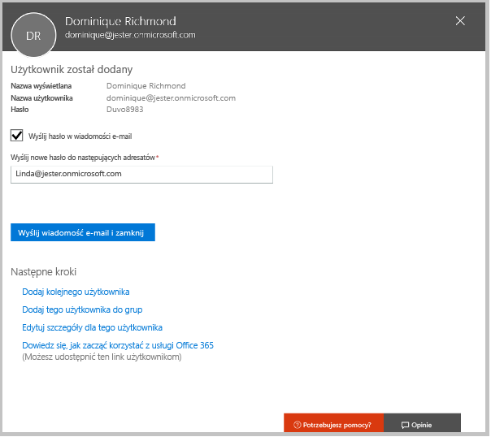
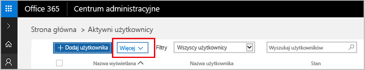

# Rejestrowanie w celu skorzystania z bezpłatnej wersji próbnej usługi Microsoft Intune
W tym artykule opisano proces rejestracji w wersji próbnej usługi Intune i przygotowania wersji próbnej do użycia przez niektórych użytkowników tak, aby można było później za pomocą skojarzonego przewodnika oceny dowiedzieć się, w jaki sposób usługa Intune zarządza urządzeniami przenośnymi. <!---or app data when devices are not enrolled in Intune.--->

## Założenia
W artykule dotyczącym rejestracji i przewodniku oceny założono, że korzystasz z wersji próbnej wyłącznie do celów oceny i po dokonaniu subskrypcji planujesz rozpocząć od czystego środowiska.

Aby ułatwić rozpoczęcie pracy z wersją próbną, skonfigurowane zostało bardzo proste środowisko, które używa tylko usług Intune. Założono, że będzie to jedyna metoda zarządzania urządzeniami (znana jako urząd zarządzania urządzeniami przenośnymi). W różnych miejscach przewodnika wskazujemy jednak bardziej rozbudowaną zawartość techniczną, pomocną w dokładniejszym zapoznaniu się z tematem.

W wersji próbnej można wykonać wszystkie czynności, które można wykonać za pomocą wersji subskrypcyjnej. Jedyną różnicą jest ograniczenie liczby kont użytkowników w wersji próbnej do 100.

## Zapisywanie się do wersji próbnej
Odwiedź stronę [Rejestracja w usłudze Intune](https://portal.office.com/Signup/Signup.aspx?OfferId=40BE278A-DFD1-470a-9EF7-9F2596EA7FF9&dl=INTUNE_A&ali=1#0%20) i wypełnij formularz rejestracji, aby zamówić subskrypcję wersji próbnej.

Jeśli masz konto służbowe i chcesz z niego skorzystać w celu uzyskania wersji próbnej usługi Intune, zamiast tego wykonaj [te instrukcje logowania](https://docs.microsoft.com/en-us/intune/get-started/start-with-a-paid-subscription-to-microsoft-intune-step-1). Jednak w tym artykule i przewodnikach oceny założono, że nie używasz takiego konta.

> [!TIP]
> Jeśli większość operacji IT i użytkowników korzysta z innych ustawień regionalnych niż Twoje, warto ustawić ustawienia regionalne dla wersji próbnej w celu sprawdzenia wydajności.

### Kwestie do rozważenia po zarejestrowaniu
Po zapisaniu się do wersji próbnej na adres e-mail podany w procesie rejestracji zostanie wysłana wiadomość e-mail zawierająca informacje o koncie. Stanowi ona potwierdzenie, że Twoja wersja próbna jest aktywna.

Po ukończeniu procesu rejestracji nastąpi przekierowanie do strony używanej do dodawania użytkowników i przypisywania im licencji przy użyciu Centrum administracyjnego usługi Office 365. Podczas następnego logowania w usłudze Intune nastąpi automatyczne przekierowanie do konsoli administracyjnej tej usługi.

## Bezpośrednie utrzymywanie Centrum administracyjnego i konsoli administracyjnej usługi Intune
Istnieją dwa portale, które będą używane dla usługi Intune: Centrum administracyjne usługi Office 365 ([portal.office.com](https://portal.office.com)) oraz konsola administracyjna usługi Intune ([manage.microsoft.com](https://manage.microsoft.com)).

Większość typowych zadań jest wykonywana w konsoli administracyjnej usługi Intune, jak przedstawiono poniżej. Jest to witryna, w której można konfigurować grupy, zasady, urządzenia i aplikacje oraz zarządzać nimi.

Jednak do dodawania użytkowników i zarządzania nimi oraz wykonywania innych czynności związanych z obsługą konta, w tym z rozliczeniami i pomocą techniczną, będziesz używać przedstawionego poniżej Centrum administracyjnego usługi Office 365.

Z Centrum administracyjnego usługi Office 365 można przejść do konsoli administracyjnej usługi Intune. Centra administracyjne znajdują się pod ostatnim elementem w lewym okienku nawigacji. Wybierz pozycję **Intune**, aby otworzyć konsolę administracyjną usługi Intune w nowej karcie.

Aby wrócić z usługi Intune do Centrum administracyjnego usługi Office 365 administratora, na stronie Przegląd grup wybierz zadanie **Dodaj użytkowników**.

## Dodawanie użytkowników
Przed opuszczeniem Centrum administracyjnego usługi Office 365 i powrotem do usługi Intune należy dodać niektórych użytkowników do konta wersji próbnej.

W Centrum administracyjnym usługi Office 365 można dodać użytkowników indywidualnie lub grupowo, przekazując plik w formacie CSV. Firma Microsoft korzysta z obu metod w procesie konfigurowania wersji próbnej. Jednak w środowisku produkcyjnym prawdopodobnie chcesz korzystać z kont użytkowników usługi Azure Active Directory. Więcej informacji o nich można znaleźć w dokumencie [Wprowadzenie — przewodnik](https://docs.microsoft.com/en-us/intune/get-started/start-with-a-paid-subscription-to-microsoft-intune-step-3) i sekcji [Następne kroki](#Next-steps) w dalszej części tego artykułu.

### Dodawanie pojedynczego użytkownika
1. Wybierz jedną z opcji dodawania użytkownika, aby otworzyć formularz służący do tworzenia użytkownika. Wymagane są tylko elementy oznaczone gwiazdką (\*).

2.  Podczas dodawania użytkownika ostatnim krokiem będzie wysłanie do niego wiadomości e-mail z jego hasłem tymczasowym usługi Intune. Na potrzeby tej oceny skorzystaj z własnego służbowego adresu e-mail, co umożliwi otrzymanie przez Ciebie informacji logowania oraz wyświetlenie wiadomości e-mail, którą otrzymają Twoi użytkownicy. Możesz następnie użyć tych tożsamości użytkownika, aby zarejestrować urządzenia testowe. 

 

3. Jeśli po utworzeniu użytkownika chcesz przypisać mu rolę administratora, możesz zmodyfikować rolę w Centrum administracyjnym usługi Office 365, wybierając nazwę użytkownika z listy użytkowników, a następnie wybierając opcję **Edytuj** w wierszu roli, aby wyświetlić listę ról użytkownika, spośród których można wybrać rolę i przypisać ją do tego użytkownika.

 

### Importowanie wielu użytkowników
1. Na liście **Więcej** znajdziesz kreatora importowania wielu użytkowników.

 

2. Aby ułatwić sobie poprawne skonfigurowanie pliku CSV, możesz pobrać plik szablonu do wypełnienia danymi użytkownika. Pobierz plik CSV zawierający nagłówki i przykładowe informacje o użytkowniku, aby zobaczyć, jaki dokładnie rodzaj danych jest niezbędny dla każdego pola.

 

3. Po utworzeniu i zapisaniu pliku CSV wybierz opcję **Przeglądaj**, aby wybrać plik. Sprawdź plik, a następnie wybierz opcję **Dalej**. Użytkownicy zostaną przekazani i dodani do listy aktywnych użytkowników.

Nadszedł czas na odwiedzenie konsoli administracyjnej usługi Intune i rozpoczęcie zarządzania użytkownikami, ich urządzeniami i aplikacjami.

> [!NOTE]
> Użytkownicy nie będą widoczni w usłudze Intune aż do chwili zarejestrowania przez nich urządzenia do zarządzania.

## Następne kroki
Scenariusz oceny: [Ocena zarządzania urządzeniami przenośnymi za pomocą usługi Microsoft Intune](mobile-device-management-trial-guide-microsoft-intune.md)

Dowiedz się więcej o korzystaniu z kont użytkowników usługi Azure Active Directory za pomocą usługi Intune:
- [Wymagania dotyczące tożsamości](https://docs.microsoft.com/en-us/active-directory/active-directory-hybrid-identity-design-considerations-overview#design-considerations-overview)
- [Wymagania dotyczące synchronizacji katalogu](https://docs.microsoft.com/en-us/active-directory/active-directory-hybrid-identity-design-considerations-directory-sync-requirements)
- [Wymagania uwierzytelniania wieloskładnikowego](https://docs.microsoft.com/en-us/active-directory/active-directory-hybrid-identity-design-considerations-multifactor-auth-requirements)

Dowiedz się więcej na temat używania [usługi Intune z programem System Center Configuration Manager](https://docs.microsoft.com/en-us/sccm/mdm/understand/hybrid-mobile-device-management)

<!--HONumber=Dec16_HO2-->

