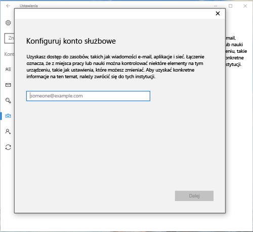
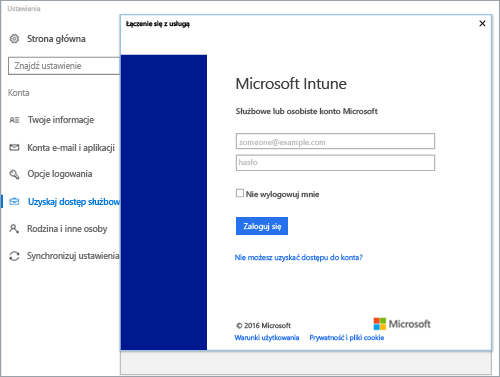
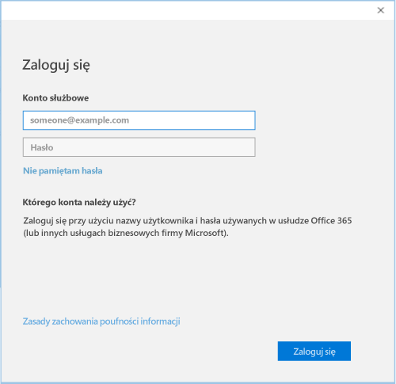

# Rejestrowanie urządzenia z systemem Windows 10 w aplikacji Intune — Portal firmy

Aplikacja Intune — Portal firmy umożliwia zarejestrowanie urządzenia z systemem Windows 10 na potrzeby zarządzania przez organizację. W tym artykule opisano sposób rejestrowania urządzeń z systemem Windows 10 w wersjach 1607 i nowszych oraz systemem Windows 10 w wersjach 1511 i starszych. Przed rozpoczęciem [sprawdź, jaką masz wersję na swoim urządzeniu](windows-enrollment-company-portal.md#find-windows-10-version-number), aby wykonać odpowiednie kroki.  

System Windows 10 jest obsługiwany na urządzeniach różnego typu, w tym na komputerach, telefonach i tabletach. Kroki rejestracji są takie same, niezależnie od używanego urządzenia. Twój ekran może jednak różnić się od ilustracji przedstawionych w tym artykule.  
 
> [!VIDEO https://www.youtube.com/embed/TKQxEckBHiE?rel=0]

## Rejestrowanie urządzenia z systemem Windows 10 w wersjach 1607 i nowszych 
Opisano tutaj kroki umożliwiające zarejestrowanie urządzenia, na którym działa system Windows 10 w wersji 1607 lub nowszej.  

1. Przejdź do pozycji **Start**. Jeśli masz urządzenie z systemem Windows 10 Mobile, przejdź do listy **Wszystkie aplikacje**.

2. Otwórz aplikację **Ustawienia**. Jeśli ta aplikacja nie jest wymieniona na liście aplikacji, przejdź do paska wyszukiwania i wpisz „ustawienia”.

3. Wybierz kolejno pozycje **Konta** > **Uzyskaj dostęp do miejsca pracy lub nauki** > **Połącz**.  

      

4. Aby przejść do strony logowania do usługi Intune w organizacji, wprowadź służbowy adres e-mail. Następnie wybierz pozycję **Dalej**.  

     

5. Zaloguj się do usługi Intune przy użyciu konta służbowego.  

      

    W końcu pojawi się komunikat informujący o tym, że firma lub szkoła rejestruje urządzenie.

6. Jeśli Twoja organizacja wymaga skonfigurowania numeru PIN dla systemu Windows Hello, zostanie wyświetlony monit o podanie kodu weryfikacyjnego. Wprowadź kod i postępuj według wskazówek na ekranie, aby utworzyć kod PIN.  

7. Na ekranie **Wszystko jest gotowe!** wybierz pozycję **Gotowe**. Urządzenie jest teraz zarejestrowane.  

8. Aby dokładnie sprawdzić połączenie, wróć do obszaru **Ustawienia** > **Konta** > **Uzyskaj dostęp do miejsca pracy lub nauki**.  Teraz Twoje konto powinno znajdować się na liście.  

      

Wciąż nie możesz uzyskać dostępu do swoich plików lub poczty służbowej albo innych danych? Dowiedz się, jak [rozwiązywać problemy z kontem](troubleshoot-your-windows-10-device-windows.md#troubleshooting-steps-to-follow-if-you-see-access-work-or-school).  

## Rejestrowanie urządzenia z systemem Windows 10 w wersjach 1511 i starszych  
Opisano tutaj kroki umożliwiające zarejestrowanie urządzenia, na którym działa system Windows 10 w wersji 1511 lub starszej.  

1. Przejdź do pozycji **Start**. Jeśli masz urządzenie z systemem Windows 10 Mobile, przejdź do listy **Wszystkie aplikacje**.

2. Otwórz aplikację **Ustawienia**. Jeśli ta aplikacja nie jest wymieniona na liście aplikacji, przejdź do paska wyszukiwania i wpisz „ustawienia”.

3. Wybierz pozycję **Konta** > **Twoje konto**.  

      

5. Wybierz pozycję **Dodaj konto służbowe**.  

      

6. Zaloguj się przy użyciu poświadczeń konta służbowego.  

      

Wciąż nie możesz uzyskać dostępu do swoich plików lub poczty służbowej albo innych danych? Dowiedz się, jak [rozwiązywać problemy związane z kontem](troubleshoot-your-windows-10-device-windows.md#troubleshooting-steps-to-follow-if-you-see-your-account) podczas rejestracji.  

## Pomoc techniczna dla administratora IT   

Jeśli jako administrator IT napotkasz problemy podczas rejestrowania urządzeń, zobacz [Troubleshooting Windows device enrollment problems in Microsoft Intune (Rozwiązywanie problemów z rejestrowaniem urządzeń z systemem Windows w usłudze Microsoft Intune)](https://support.microsoft.com/help/4469913). W tym artykule wymieniono typowe błędy, ich przyczyny i kroki prowadzące do ich usunięcia. 

## Następne kroki  
Jeśli potrzebujesz pomocy dotyczącej portalu firmy lub procesu rejestracji, skontaktuj się z zespołem pomocy technicznej IT w Twojej organizacji. Odpowiednie informacje kontaktowe znajdziesz w [witrynie internetowej Portal firmy](https://go.microsoft.com/fwlink/?linkid=2010980). Zaloguj się do witryny przy użyciu konta służbowego.  

 

