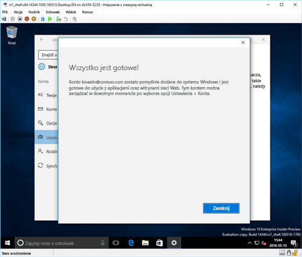

# Rejestrowanie urządzenia z systemem Windows 10 w usłudze Intune

> [!NOTE]
> System Windows 10 działa na wszystkich typach urządzeń. Niezależnie od tego, czy używasz komputera, telefonu, czy tabletu kroki, które wykonujesz, są takie same, nawet jeśli ekran wygląda nieco inaczej niż obrazy na tej stronie.

> [!VIDEO https://channel9.msdn.com/Series/IntuneEnrollment/Windows-Enrollment/player]

1. Przejdź do pozycji **Start**.

  - Jeśli używasz urządzenia z systemem **Windows 10 Desktop**, otwórz **Menu Start**.
  - Jeśli używasz urządzenia z systemem **Windows 10 Mobile**, otwórz **Ekran startowy**, a następnie przesuń do listy **Wszystkie aplikacje**.

2.  Otwórz aplikację **Ustawienia** systemu Windows, wyszukując termin „ustawienia” na pasku wyszukiwania.

3. Wybierz kolejno pozycje **Konta** > **Uzyskaj dostęp do miejsca pracy lub nauki** > **Połącz**.

    

3.  Wprowadź służbowy adres e-mail, a następnie wybierz przycisk **Dalej**.

    

4. Zaloguj się do usługi Intune przy użyciu konta służbowego.

    

    Pojawi się komunikat informujący o tym, że firma lub szkoła rejestruje urządzenie.

5. Po wyświetleniu strony **Wszystko jest gotowe!** wybierz opcję **Zamknij**. To wszystko.

  

6. Jeśli chcesz się upewnić, że połączenie jest prawidłowo skonfigurowane, wróć do obszaru **Ustawienia** i sprawdź, czy konto służbowe znajduje się na liście.

    

Jeśli powyższe kroki zostały wykonane, ale nadal nie można uzyskać dostępu do służbowego konta e-mail i plików, wykonaj czynności opisane w części [Rozwiązywanie problemów w przypadku wyświetlenia ekranu Dostęp do zasobów służbowych](troubleshoot-your-windows-10-device-windows.md#troubleshooting-steps-to-follow-if-you-see-access-work-or-school).
