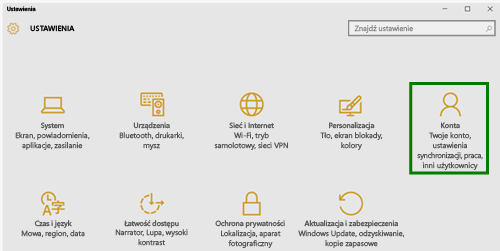

# Rejestrowanie urządzenia z systemem Windows 10 w usłudze Intune

  > [!NOTE]
  > System Windows 10 działa na wszystkich typach urządzeń. Niezależnie od tego, czy używasz komputera, telefonu, czy tabletu kroki, które wykonujesz, są takie same, nawet jeśli ekran wygląda nieco inaczej niż obrazy na tej stronie.

1. Przejdź do pozycji **Start**.

   - Jeśli używasz urządzenia z systemem **Windows 10 Desktop**, otwórz **Menu Start**.
   - Jeśli używasz urządzenia z systemem **Windows 10 Mobile**, otwórz **Ekran startowy**, a następnie przesuń do listy **Wszystkie aplikacje**.

2. Otwórz aplikację **Ustawienia** systemu Windows, wyszukując termin „ustawienia” na pasku wyszukiwania.

3. Wybierz pozycję **Konta**.

    

4. Wybierz pozycję **Twoje konto**.

    

5. Wybierz pozycję **Dodaj konto służbowe**.

    

6. Zaloguj się przy użyciu poświadczeń konta służbowego.

    

Wciąż nie możesz uzyskać dostępu do swoich plików lub poczty służbowej albo innych danych? Spróbuj pozbyć się trudności związanych z dostępem, [rozwiązując problemy z kontem](troubleshoot-your-windows-10-device-windows.md#troubleshooting-steps-to-follow-if-you-see-your-account). Jeśli to nie pomoże, skontaktuj się z działem pomocy technicznej Twojej firmy w celu uzyskania dalszej pomocy.

Aby łatwo uzyskać pomoc od działu pomocy technicznej Twojej firmy, użyj informacji kontaktowych dostępnych w aplikacji Portal firmy, która umożliwia również wyszukiwanie i pobieranie aplikacji zalecanych i wymaganych do codziennej pracy. Być może aplikacja Portal firmy jest już zainstalowana na urządzeniu. Aby szybko to sprawdzić, poszukaj nazwy __Portal firmy__ na liście __Wszystkie aplikacje__.

Jeśli lista nie zawiera aplikacji Portal firmy, wykonaj następujące kroki, aby ją zainstalować.

1. Wybierz kolejno pozycje **Start** > **Sklep**.

2. Wybierz pozycję **Wyszukaj**, a następnie wpisz **portal firmy**.

3. Na liście wyników wybierz kolejno pozycje **Portal firmy** > **Zainstaluj**.

4. Wybierz pozycję **Zainstaluj** lub **Bezpłatne**. Z Twojego punktu widzenia nie ma różnicy między tymi dwiema opcjami, a wyświetlany wariant zależy od konfiguracji aplikacji Portal firmy.
